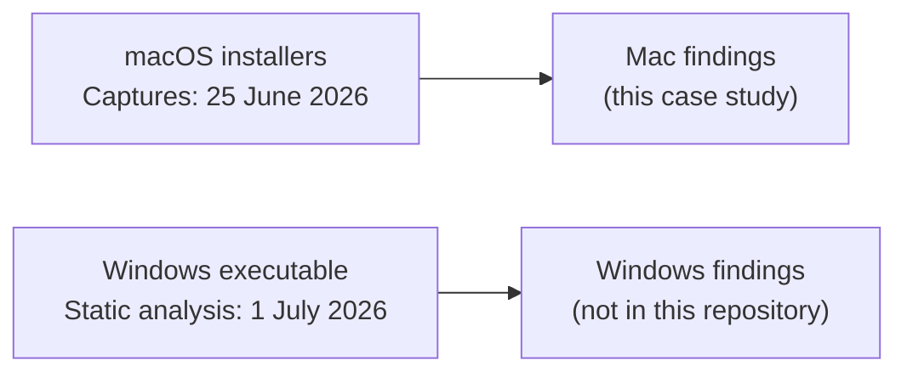

# Case study: the Omnissa Horizon Client installer on macOS

This case study covers the behavioural captures of 25 June 2026. Every claim cites a fact ID in [evidence/FACTS.md](evidence/FACTS.md). Facts from the captures cite the raw lines, mostly through redacted excerpts. Facts with an `OWN` ID are reported by the owner, not taken from the captures. Setup, Findings, Phase 2 and 3, What this means, Limits and Reproduce it follow after the owner's review of the facts.

## Summary

**The Omnissa Horizon Client 8.17.0 installer for macOS also installed a Workspace ONE stack: Deem 25.09.00.701 with an installer helper, and the Endpoint Telemetry Service 25.9.0.5699 (SET-20, SET-21, R1-19, P1-19).**

- Services: three LaunchDaemons (`com.omnissa.horizon.CDSHelper`, `com.ws1.deemd`, `com.ws1.ws1etlm`) and the privileged helper `com.omnissa.horizon.CDSHelper`, all owned by root, with `deemd` and `ws1etlm` running as root. Also two LaunchAgents, `com.ws1.deem.MacUIEvents` and `com.ws1.ws1etlmu` (R1-24, R1-28, R1-32, R1-93).
- Telemetry components and other changes: the WorkspaceONE DEX, Experience Management, AppSessionEvents and TlmTool app bundles in `/Library/Application Support/WorkspaceONE/EndpointTelemetryService/ws1etlm`, the Deem `LegacyDeem.app`, configuration under `/etc/workspaceone`, the native-messaging manifest `com.omnissa.etlm.browser.helper.json` in the Google Chrome and Microsoft Edge folders, and the line `127.0.0.1 view-localhost` in `/etc/hosts`. The data does not show what the manifest does, and it shows no collection of browsing data (R1-47, R1-46, R1-61, R1-40).
- Permissions: the code signature of `ws1etlm` carries the endpoint-security entitlement, and that of `ws1etlmu` the network-client and location entitlements (R1-139). These are signing entitlements, not access decisions. In run 1, locationd registered `ws1etlmu` as a location client and denied it access (R1-152, R1-153). In run 2, tccd denied a Full Disk Access request from `ws1etlm`, and `ws1etlm` logged ten times that it lacked that authorization (P1-112, P1-111). At 17:20:10 CEST, during the install step, System Settings set `kTCCServiceListenEvent` to allowed for the Horizon Client (P1-115). The logs record no Full Disk Access grant. This does not show that no grant happened: the owner reports one, for an app and at a time that are not confirmed. This study draws no conclusion about behaviour after a Full Disk Access grant (P2-20, OWN-03).
- Limits: one Mac on one day (SET-01, SET-10, OWN-05), filtered logs with dropped messages (SET-64, SET-65, SET-67), no packet capture in run 2 (SET-63), and no static analysis of these packages. No file hashes are recorded, the data does not show whether the run 1 package and the run 2 DMG are the same build, and it does not name the organization behind the signing team ID `S2ZMFGQM93` (SET-29, R1-77). The captures show what was installed, registered and started. They do not show what data the components collected or sent.

## Why this study

This is an independent case study, prompted by possible malware concerns. The vendor was not contacted (OWN-01).

It covers one study: two captured runs of the macOS installer on 25 June 2026. Run 1 is the install. Run 2 has three steps: install, a Full Disk Access step, and a short observation (OWN-03, OWN-07).

A separate study on 1 July 2026 analysed a Windows executable statically. Its report described that sample as appearing legitimate. It is a different sample, analysed after these captures, so it cannot establish the identity or the safety of the macOS packages here (OWN-02).

The owner gave the run 1 package file a local name (OWN-06). The name is withheld here, but the fact matters: the vendor's postinstall script read the file name and chose its default configuration because of it (R1-84).

## Static analysis of the macOS packages

None is recorded. The raw folders hold no static-analysis output for these packages. Searched for and not found:

- `codesign -dv` or `codesign --verify` output
- `spctl --assess` output
- `pkgutil --check-signature` output
- The certificate chain of the vendor signatures (Developer ID Installer or Developer ID Application, organization name)
- SHA-256 or other hashes of the `.pkg` and the `.dmg` (SET-29)
- VirusTotal or other third-party scanner reports
- A logged notarization check of the Horizon Client package, the Endpoint Telemetry package or the `.dmg`. The log filter of the captures does not select lines that name only these files, so this absence does not show that no check took place (SET-86).

The exact search commands are in [evidence/FACTS.md](evidence/FACTS.md), under "Not recorded". The signing checks that macOS logged during the captured installs are the facts with the category `[signature]`. They are not a static analysis.
