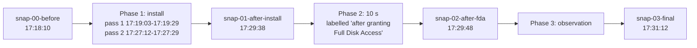

# Case study: the Omnissa Horizon Client installer on macOS

This case study covers two captured runs of the installer for Omnissa Horizon Client on 25 June 2026, on one test Mac (SET-01, SET-10, OWN-05). Each finding cites a fact ID in [evidence/FACTS.md](evidence/FACTS.md). Each fact cites raw lines, mostly through the redacted excerpts in [evidence/](evidence/). The ID prefixes name the source: SET for setup and sources, R1 for run 1, and BR for leftovers of run 1 in run 2. P1, P2 and P3 are the three phases of run 2, and OWN marks my notes, not data from the captures.

"Vendor" means names that match the Omnissa, Horizon, VMware, Workspace ONE, ws1 or Deem terms. The term does not identify an organization (R1-77). Times are CEST. I have not contacted the vendor (OWN-01).

## Summary

**The installer for Omnissa Horizon Client 8.17.0 installs a Workspace ONE stack by default, as the vendor documents (OWN-09).** The stack is Deem 25.09.00.701 with an installer helper, and the Endpoint Telemetry Service 25.9.0.5699 (SET-20, SET-21, R1-19, P1-19). This study records what the default adds, such as LaunchDaemons, LaunchAgents, a privileged helper, entitlements and a line in `/etc/hosts`. The vendor pages do not list these items (OWN-09).

- Services: the installer adds three LaunchDaemons (`com.omnissa.horizon.CDSHelper`, `com.ws1.deemd`, `com.ws1.ws1etlm`) and two LaunchAgents (`com.ws1.deem.MacUIEvents`, `com.ws1.ws1etlmu`) (R1-24, R1-28, P1-22). deemd and ws1etlm run as root in both runs (R1-93, P1-74). In run 2, the privileged helper CDSHelper logs an install of `Omnissa Horizon Client.pkg` after a connection from `horizon-client` (P1-31, P1-34, P1-35).
- Other changes: four Workspace ONE apps, the Deem `LegacyDeem.app`, configuration under `/etc/workspaceone` and the line `127.0.0.1 view-localhost` in `/etc/hosts`, in both runs (R1-46, R1-47, R1-40, P1-43, P1-39). In run 1, `cp` also copies a native-messaging manifest into the Chrome and Edge folders. The data does not establish any collection of browsing data (R1-61).
- Permissions: the signing data gives ws1etlm the endpoint-security entitlement and ws1etlmu the network-client and location entitlements (R1-139). Before any recorded grant of Full Disk Access, tccd denies this access to ws1etlm (P1-112). locationd logs 'denying' for ws1etlmu (R1-153). No log line records a grant of Full Disk Access (P2-20). I report a grant, but I cannot confirm the app or the time (OWN-03). [Permissions](#permissions) gives the details.
- [Limits](#limits): one Mac on one day (SET-01, OWN-05). Run 1 uses a package with a local name. Its install script logs 'defaulting to DEEM installer.' (R1-84). No run 2 line shows which branch the script takes (P1-120). The captures record no hash, no static analysis and no organization name for the team ID `S2ZMFGQM93` (SET-29, R1-77). They show what the installer installs, registers and starts, not whether the components collect or send data.

## Vendor documentation

On 5 October 2026, I read two vendor pages (OWN-09). The install guide [Install Omnissa Horizon Client on a Mac](https://docs.omnissa.com/HorizonClient-MacGuide-V2603/InstallHorizonClientonaMac) is version 2603, last updated on 30 July 2026. It says: "By default, the Horizon Client installer includes the DEEM agent." It also says: "From the Package Names list, clear the checkbox for `EndpointTelemetryService` to exclude the DEEM agent."

The page [Experience Management for Horizon](https://docs.omnissa.com/Intelligence/ExpMgmtHorizon), dated 29 September 2026, states that Horizon Client for macOS installs this agent by default from version 2406. Neither page lists LaunchDaemons, LaunchAgents, a privileged helper, entitlements or an `/etc/hosts` entry. In run 1, I used the command-line `installer -pkg`, which installs the default choices (OWN-10, R1-103).

## Setup

Run 1 is the install. In my notes, run 2 has three steps: install, a grant of Full Disk Access, and observation (OWN-03, OWN-07). The snapshot times define three phases for these steps (SET-14).

The run 1 capture records an arm64 processor and macOS major version 26 (SET-02, SET-06, SET-07). The test Mac is a MacBook Air with macOS 26.5.2 (OWN-04, OWN-05).

| | Run 1 | Run 2 |
| --- | --- | --- |
| Time | 12:06:15-12:08:59 CEST (SET-12, SET-16) | 17:18:10-17:31:12 CEST (SET-13, SET-16) |
| Installer | `/usr/sbin/installer` reads the `.pkg` under a local name. Its 'Current Path:' lines name `bash` and `sudo` (SET-36, SET-41, R1-103) | sandboxd twice rejects a request from Installer.app for Downloads-folder access to `Omnissa-Horizon-Client-2512-8.17.0-20187907409.dmg`. DiskImageMounter and Installer.app log from 17:18:29 and 17:19:03 (SET-24, P1-03, P1-04) |
| Snapshots | before and after, eight files each: `receipts.txt`, `launchd.txt`, `privhelpers.txt`, `launchctl.txt`, `hosts.txt`, `fs.txt` (the file listing), `processes.txt` (the process snapshot), `connections.txt` (SET-62) | four snapshots of the same eight files (SET-13, SET-63) |
| Unified log | a predicate on the `installer` process, sender paths with workspaceone or omnissa, and message text with deem or ws1etlm (SET-64) | the run 1 predicate plus message text with "Full Disk", "endpointsecurity" or "TCC" (SET-65) |
| Other captures | `installer.log`, the `fs_usage` trace, the packet capture, the DNS log (SET-62) | the DNS log, a second DNS log (`dnscap`), and `agent-connections.log` with rows for `horizon-client` at sample times mostly 10-11 s apart (SET-51, SET-52, SET-84) |

The raw snapshots come from earlier scripts that this repository does not hold. Those snapshots hold files with the same eight names as `footprint.sh` snapshots, but with a smaller scope (SET-34, SET-40). [evidence/build.sh](evidence/build.sh) runs `footprint.sh diff` over them to make the diff excerpts (SET-62, SET-63).

The snapshot times are the phase boundaries of run 2. Phase 1 has two installer passes. Pass 2 starts 0.6 s after CDSHelper logs 'Installing package' (SET-14, SET-15, P1-05, P1-34):



## Findings

### Packages

| Package ID | Version (run 1) | Run 1 | Run 2 | Facts |
| --- | --- | --- | --- | --- |
| `com.omnissa.horizon.client.mac` | 8.17.0, and 1.0.0 for the "Next" package | receipt added | receipt added | SET-20, R1-19, P1-19 |
| `com.ws1.Deem.InstallerHelper` | 25.09.00.701 | receipt added | receipt added | SET-20, R1-19, P1-19 |
| `com.ws1.Deem` | 25.09.00.701 | receipt added | receipt added | SET-21, R1-19, P1-19 |
| `com.ws1.EndpointTelemetryService` | 25.9.0.5699 | receipt added | receipt added | SET-21, R1-19, P1-14, P1-19 |
| `com.omnissa.html5videoplayer` | not recorded | no receipt, app copied | receipt added | R1-20, R1-55, P1-19, SET-27 |

- Run 2 records no PackageKit package list. Its DMG name carries 8.17.0. The package name of the Endpoint Telemetry Service carries 25.9.0.5699 (SET-26, P1-11, P1-14, P1-17).
- The run 1 install request names three packages: `Omnissa.Horizon.Client.pkg`, `Omnissa.Horizon.Client.Next.pkg` and `Deem.InstallerHelper.pkg` (SET-20). At 12:06:34 CEST, the installer logs 'JS: Path check: .../EndpointTelemetryService/ws1etlm exists: false' and 'JS: Deem.InstallerHelper enabled: true' (R1-88). Run 2 logs the same check with 'exists: false' in pass 1 and 'exists: true' in pass 2 (P1-55).
- During run 1, `/Library/Application Support/WorkspaceONE/helper/` holds the packages of Deem and the Endpoint Telemetry Service (R1-49). The postinstall of the installer helper installs Deem. Then `rm` deletes the Deem package file at 12:06:50 CEST. The postinstall then installs the Endpoint Telemetry Service. `rm` deletes that package file at 12:06:53 CEST (R1-10, R1-79, R1-50).

### Launch items and CDSHelper

| Label | Type | Program | Run 1 | Run 2 | Facts |
| --- | --- | --- | --- | --- | --- |
| `com.ws1.deemd` | LaunchDaemon | `/usr/local/bin/deemd` | added, running as root | added, running as root | R1-24, R1-27, R1-37, R1-93, P1-22, P1-37, P1-74 |
| `com.ws1.ws1etlm` | LaunchDaemon | `/usr/local/bin/ws1etlm` | added, running as root | added, running as root | R1-24, R1-27, R1-37, R1-93, P1-22, P1-37, P1-74 |
| `com.omnissa.horizon.CDSHelper` | LaunchDaemon and privileged helper | `/Library/PrivilegedHelperTools/com.omnissa.horizon.CDSHelper` | added, loaded, not in the after snapshot | added, running as root after 17:27:10 | R1-24, R1-32, R1-37, R1-93, P1-22, P1-28, P1-30, P1-37, P1-74 |
| `com.ws1.ws1etlmu` | LaunchAgent | `/usr/local/bin/ws1etlmu` | added, running as the user | plist from run 1, `ws1etlmu` logs no line in `run2/unified.log`, not in any process snapshot | R1-27, R1-28, R1-93, BR-05, P1-82, P1-83 |
| `com.ws1.deem.MacUIEvents` | LaunchAgent | `/usr/local/bin/MacUIEvents` | added, not in the after snapshot | plist from run 1, not in any process snapshot | R1-27, R1-28, R1-93, BR-05, P1-83 |

- The snapshots do not record what the plists contain (SET-34).
- In run 1, Background Task Management registers deemd and ws1etlm as legacy daemons and ws1etlmu and MacUIEvents as legacy agents, all `[enabled, allowed, not notified]` (R1-26, R1-30). In run 2, Background Task Management finds the two LaunchAgents from run 1 again, as `[enabled, disallowed, notified]`. It then logs an updated item for each, with `[enabled, disallowed, not notified]` (P1-27).
- In run 1, each of the two client postinstalls copies CDSHelper and its plist into place and runs `launchctl load`. In the second postinstall, the next line is 'Load failed: 5: Input/output error' (R1-34, R1-35).
- In run 2, at 17:27:10 CEST, CDSHelper logs a connection from `horizon-client`. It logs that the 'cds script /bin/rm' runs, but not its target (P1-31, P1-32). Its install job then logs 'isDeemInstalled = YES' for the ws1etlm folder (P1-33). It logs 'Installing package' for `Omnissa Horizon Client.pkg` in a temporary folder named `viewAutoupdate.DoU50a`. At 17:27:29 CEST, it logs 'The package is installed successfully!' (P1-34, P1-35). The captures do not record the version of that package (P1-17).
- The CDSHelper binary is 174304 bytes, dated 12:06, after run 1, and 174256 bytes, dated 17:27, after phase 1 of run 2 (P1-29).

### Processes

| Process | User | Run 1 | Run 2 | Facts |
| --- | --- | --- | --- | --- |
| `deemd` | root | logs from 12:06:52, in the after snapshot | logs from 17:19:28, in all later snapshots | R1-13, R1-93, P1-08, P1-74, P3-19 |
| `ws1etlm` | root | logs from 12:06:53, in the after snapshot | logs from 17:19:29, in all later snapshots | R1-13, R1-93, P1-08, P1-74, P3-19 |
| `ws1etlmu` | the user | logs from 12:06:53, in the after snapshot | no line in `run2/unified.log`, not in any process snapshot | R1-13, R1-93, P1-82, P1-83 |
| CDSHelper | root | not in the after snapshot | logs from 17:27:10, in all later snapshots | R1-93, P1-08, P1-74, P3-19 |
| `horizon-client` | the user (not recorded for PID 17702) | not in the after snapshot | five PIDs, the first named at 17:19:43 | R1-93, P1-47, P1-84 to P1-88, P3-18 |
| `Horizon Client Services`, `horizon-eucusbarbitrator` | the user, root | not in the after snapshot | in the final snapshot only | R1-93, P3-17, P3-18 |

- In run 1, deemd logs 13 'Starting module' lines at 12:06:53 CEST. The module names cover these events: app crash, asset, app change, resource consumer, network and app unresponsive. They also cover system update, unexpected shutdown, service, process, system crash and app hang events, plus a forwarder (R1-101). In run 2, deemd logs 7 of these lines, in a log that drops messages (P1-92, SET-67).
- deemd logs 'Installation disabled: True, Remote Deem enabled: False, ShouldHarverstData: False' at 12:06:53 CEST in run 1 and at 17:19:28 CEST in run 2 (R1-100, P1-91). In run 1, it logs 'Installation disabled: False' at 12:07:53 CEST. It then logs 17 attempts to connect to the socket `/Library/Application Support/AirWatch/Data/Socket/hubudssocket`. An error that the path does not exist follows each attempt (R1-100, R1-99).
- In the home folder of the user, ws1etlm and ws1etlmu make 8 read-only calls on 6 paths, and one open fails (R1-67). No vendor-process line in the `fs_usage` trace creates, renames, deletes, links or opens a path there for writing (R1-72). The trace attributes 36 disk-write records under the home folder to deemd. But these records name files of other processes, so the attribution is uncertain (R1-65).

### Files

| Path | What the data shows | Facts |
| --- | --- | --- |
| `/Library/Application Support/WorkspaceONE/Deem/deem/` | `LegacyDeem.app` (holds the `deemd` binary), `uninstall.sh`, `archive_logs.command` | R1-47, R1-73 |
| `/Library/Application Support/WorkspaceONE/EndpointTelemetryService/ws1etlm/` | `WorkspaceONE DEX.app` (holds `ws1etlm`), `Experience Management.app` (holds `ws1etlmu`), `AppSessionEvents.app` (holds `MacUIEvents`), `TlmTool.app`, `tlmtool`, `etlmapi.dylib`, `tlmExtensionHelper`, `config.ini`, `collectLogs.sh`, `uninstall.sh`, the browser manifest | R1-31, R1-47, R1-73 |
| `/usr/local/bin/deemd`, `ws1etlm`, `ws1etlmu` | symbolic links | R1-52 |
| `/etc/workspaceone/ws1etlm/` | `config/config.ini`, `config/install.plist`, `config/loggers.ini`, `deem/deem.ini` | R1-46, R1-59 |
| `/private/var/workspaceone/ws1etlm/` | logs, sessions and cache folders, outside the scope of the file listing | R1-60 |
| `/Library/Application Support/WorkspaceONE/Deem/deem-data/sqlite/` | `event_mapping.db`, `logs.db` | R1-63 |
| `/Library/Logs/WorkspaceONE/Deem/` | the deemd log | R1-62 |
| `/Library/Google/Chrome/NativeMessagingHosts/`, `/Library/Microsoft/Edge/NativeMessagingHosts/` | the browser manifest, which `cp` writes (in the `fs_usage` trace only) | R1-61 |
| `/etc/hosts` | new line 1: `127.0.0.1 view-localhost` | R1-40, P1-39 |
| `/Library/Application Support/Omnissa/Omnissa Horizon Client/` | `HTML5VideoPlayer.app`, and in phase 3 of run 2 a `Services` folder | R1-46, R1-55, P3-13 |
| `/Library/Preferences/.omnissa/.horizon_migration_done` | `touch` creates it after the script tests for VMware Horizon paths | R1-56 |
| `/Applications/Omnissa Horizon Client.app`, `/Applications/Omnissa Horizon Client Next.app` | the two client apps. The snapshots do not cover `/Applications` | R1-33, R1-53, P1-47 |

In run 1, the file listing gains 33 vendor paths, and these are its only changes (R1-45). In run 2, phase 1 adds the same 33 vendor paths (P1-43).

### Install scripts

- In run 1, the postinstall of the installer helper logs a Deem install and 'Removing temp DEEMD installation files.'. It then logs an install of the EndpointTelemetryService Agent and 'Removing Telemetry installation files.' (R1-79).
- At 12:06:53 CEST, after the line 'Telemetry Installer Helper postinstall script finished.', package_script_service logs the file name of the installer. For the run 1 name, it logs 'does not contain any expected product, defaulting to DEEM installer.' It then logs that it creates `install.plist`. It also logs 'Device has enabled Deem for UEM.' (R1-84, R1-85).
- At 12:06:53 CEST, package_script_service logs a `./postinstall` line that runs `/usr/bin/osascript` to show a notification. The notification has the title 'WorkspaceONE DEX', the subtitle 'Full Disk Access request' and the text 'Open System Preferences->Privacy & Security Settings and grant access.' The captures do not show whether the notification appears on screen (R1-119).
- The first client postinstall copies `/etc/hosts` to `/etc/hosts.bak`, runs `sed` to insert `127.0.0.1 view-localhost` before line 1, and removes the copy (R1-41, R1-40).
- Both client postinstalls run `openssl enc -aes-256-cbc -d` on `templates.tar.gz` with a passphrase in the command line of the script. They extract `proxyApp-template-app` (with `horizon-docker`) and `horizon-urlFilterApp` (with `horizon-urlFilter`) (R1-87). I withhold the passphrase here.
- Both postinstalls run `chown -R root:wheel` and `chmod 4755` on `Open Horizon Client Services` inside their own app bundle. Mode 4755 sets the setuid bit. The file listing does not cover `/Applications`, so the captures do not show the resulting modes (R1-86).

### Permissions

| Item | What the data shows | Facts |
| --- | --- | --- |
| Entitlements | run 1 signing data: `ws1etlm` with `com.apple.developer.endpoint-security.client`, `ws1etlmu` with `com.apple.security.network.client` and `com.apple.security.personal-information.location` | R1-139 |
| Requests for Full Disk Access | run 2: for the ws1etlm requests at 17:19:30 and 17:20:30, tccd logs 'Switching AllFiles to EndpointSecurityClient due to record in database'. It denies the second request | P1-110, P1-112 |
| Errors about Full Disk Access | run 2: from 17:19:30 to 17:28:31, before any recorded grant, ws1etlm logs 10 times that it lacks Full Disk Access to open the Endpoint Security service. It logs once a minute | P1-111 |
| Grant of Full Disk Access | run 2: no log line records a grant to a vendor identifier. I report a grant in the second step of run 2, but I cannot confirm the app or the time | P2-20, OWN-03 |
| Location | run 1: locationd registers ws1etlmu at 12:06:54 and logs 'denying' its executable. I withhold the reason | R1-152, R1-153 |
| `kTCCServiceListenEvent` | run 2: deemd sends a preflight request for it at 17:19:29, and the log has no reply. System Settings sets it to allowed for the Horizon Client at 17:20:10 | P1-108, P1-115, P2-21 |
| Developer tool | run 2: after each request from deemd, ws1etlm and the Horizon Client, tccd logs that the service 'does not allow prompting; returning denied.' | P1-108, P1-109, P3-46 |
| Other TCC services | run 2: the requests of the Horizon Client for microphone, screen capture and audio capture get 'Unknown (None)' | P1-116, P3-45 |

### Network and DNS

| Observation | Facts |
| --- | --- |
| Run 1: no vendor process has a line in either `connections.txt` | R1-105, R1-106 |
| Run 1: the ASCII dump of the packet capture shows no vendor string in any non-loopback packet, including the cleartext TLS server names. The search cannot read QUIC server names, which are encrypted | R1-115 |
| Run 1: no data ties 4 of the 14 addresses on TCP port 443 to a process. The first TLS data packet from the client to 2 of them holds an apple.com server name | R1-110, R1-111 |
| Both runs: the DNS logs record no query for a vendor name and no line for `view-localhost` | R1-114, P1-102, P1-103, R1-42 |
| Run 2: each of the 4 sampled `horizon-client` PIDs holds TCP connections to `23.40.244.164:443`, its only non-loopback endpoint (samples 17:20:29-17:31:03, with an 80 s gap). No DNS log has this address, and the captures do not record its name or operator | P1-94 to P1-96, P1-98, P1-99, P2-17, P3-39 |
| Run 2: `horizon-client` listens on a 127.0.0.1 TCP port | P1-93, P3-34 |
| Run 2: deemd, ws1etlm and CDSHelper have no line in the `connections.txt` of snap-01, snap-02 or snap-03, which list root sockets. `agent-connections.log` holds only `horizon-client` rows, and the captures do not record the filter that selects these rows | P1-100, P2-16, P3-36, SET-77, SET-84 |

### Signing checks in the logs

| Observation | Facts |
| --- | --- |
| syspolicyd names the team ID `S2ZMFGQM93` for deemd and ws1etlm in both runs, and for ws1etlmu in run 1. The data does not name the organization | R1-77, P1-53 |
| tccd logs the designated requirement of ws1etlm and ws1etlmu in run 1. It ends with `certificate leaf[subject.OU] = S2ZMFGQM93` | R1-138 |
| In run 2, tccd logs the same requirement for the Horizon Client, and a check against it ends with 'status: 0'. One team ID signs the Horizon Client and the Workspace ONE components | SET-89 |
| syspolicyd finds a stapled ticket in the Deem package in both runs | R1-75, P1-51 |
| syspolicyd logs 'GK Xprotect results' lines for the Deem package scripts, and 'GK evaluateScanResult' lines for deemd and ws1etlm in both runs and ws1etlmu in run 1. The data does not give the meaning of the values | R1-125, R1-126, P1-129, P1-130 |
| AppleSystemPolicy logs 'script, allowed' for the Deem scripts and 'exec, allowed' for LegacyDeem.app and WorkspaceONE DEX.app, in both runs | R1-78, R1-128, P1-56, P1-132 |
| taskgated-helper allows the entitlements of ws1etlm 'due to provisioning profile' in both runs, and of ws1etlmu in run 1 | R1-140, P1-147 |
| The installers log 'Trust evaluate failure: [leaf ExtendedKeyUsage] [ca1 IntermediateEKU]' without naming a certificate or file. The run 1 install completes | R1-143, P1-151, R1-05 |
| Neither unified log has a notarization or Gatekeeper line that names the Horizon Client package or the DMG. The predicate has no message term for omnissa or horizon | SET-86, SET-87, P1-154 |
| No raw line records a quarantine attribute or quarantine check for a vendor item | SET-88 |

### Installer errors

- Run 1: `installer.log` ends with 'The install was successful.' The log has no script error line (R1-05, R1-89). The Deem install logs 'Could not open ... for AOT translation' for 17 binaries of its `osx-x64` bundle, in 34 lines (R1-91).
- In pass 2 of run 2, installer PIDs 18554 and 18586 each look up two error texts (P1-68, P1-69). The texts are 'An error occurred while running scripts from the package' and 'The Installer encountered an error that caused the installation to fail.' `AGENT-NETWORK.txt` has the first error for the Deem package and for the package of the Endpoint Telemetry Service, with no time and no PID (P1-71). The link of these two lines to pass 2 is uncertain (P1-72). Installer PID 18516 looks up the success message at 17:27:29 CEST, when CDSHelper logs a successful install (P1-67, P1-35).

## Phases 2 and 3

Phase 2 is the 10 seconds between `snap-01-after-install` (17:29:38 CEST) and `snap-02-after-fda` (17:29:48 CEST). The run 2 diff file calls it 'what changed after GRANTING Full Disk Access' (SET-14, SET-15, P2-01).

- The snapshots record no change to receipts, launch items, CDSHelper, `launchctl.txt`, `/etc/hosts` or the file listing (P2-02 to P2-08). The process diff has only mdworker_shared, sleep, ps and sort lines (P2-10).
- The unified log has no line from a vendor process in the window. The only lines that name a vendor item are 8 runningboardd lines about deemd (P2-12, P2-13).
- No line in `run2/unified.log` records a grant of Full Disk Access to a vendor identifier. The whole run 2 log has 4991 dropped-message markers and selects lines by their text. So the log does not show that no grant happens (P2-20).
- I report a grant of Full Disk Access in the second step of run 2, after the install (OWN-03). I cannot confirm the app or the clock time.

Phase 3 runs from 17:29:48 to 17:31:12 CEST (SET-14).

- A new `horizon-client` process (PID 18956) appears in the log at 17:29:54 CEST (P3-22, P3-23). `Horizon Client Services` and `horizon-eucusbarbitrator` appear in the final snapshot (P3-18). The file listing gains the `Services` folder (P3-13).
- `horizon-client` holds one connection to `23.40.244.164:443` and listens on `127.0.0.1:55945` (P3-35, P3-39).
- From 17:29:54 to 17:30:01 CEST, tccd handles 15 requests from the Horizon Client. `kTCCServiceListenEvent` gets 'Allowed (System Set)'. Microphone, audio capture, screen capture and developer tool get 'Unknown (None)' (P3-43, P3-44, P3-45).
- deemd, ws1etlm and CDSHelper keep their PIDs. The unified log has no line from them in phase 3. It has 465 dropped-message markers in this window (P3-19, P3-28).
- At 17:31:04 CEST, System Settings shows the pane for Full Disk Access after a search for 'full disk'. The log ends at 17:31:12 CEST with no later tccd line (P3-48, P3-49, P3-02).

## What this means

- On the test Mac, the default install of the Horizon Client includes the Workspace ONE stack. Both runs add the same four package receipts and the same three LaunchDaemons (R1-19, P1-19, R1-24, P1-22). deemd and ws1etlm first log during the install and run as root (R1-13, P1-08, R1-93, P1-74).
- The names in the data describe telemetry. One package is the Endpoint Telemetry Service, and its installer calls itself the 'Telemetry Installer Helper'. The names of the deemd modules describe app, process, network and crash events (SET-21, R1-79, R1-101).
- The captures tie no internet connection to the telemetry components. No vendor daemon has a line in any `connections.txt` after the install (R1-106, P1-100, P2-16, P3-36). The DNS logs record no query for a vendor name (R1-114, P1-102, P1-103). The DNS logs also miss `23.40.244.164`, although `horizon-client` connects to it (P1-99). The captures cannot exclude traffic of the telemetry components, for these reasons:
  - QUIC encrypts server names (R1-115).
  - Run 2 keeps no packet capture file (SET-63).
  - The captures show daemon sockets only at the snapshot times (SET-84).
  - No data ties 4 of the run 1 addresses on TCP port 443 to a process (R1-110, R1-111).
  - The logs do not select network-library lines (R1-113, SET-65).
- Before any recorded grant of Full Disk Access, ws1etlm lacks this access (P1-111). A script line asks for this access in a notification (R1-119). locationd denies ws1etlmu as a location client (R1-153). I report a grant of Full Disk Access that the logs do not record (OWN-03, P2-20).
- The vendor documents an opt-out. In Installer.app, **Customize** lets the user clear the EndpointTelemetryService checkbox (OWN-09). This study shows what the default adds when the user keeps it. The install guide also says: "Do not use the Horizon Client uninstaller, as it may not completely remove all the DEEM components." For macOS, the vendor gives this removal command (OWN-09):

  ```bash
  sudo sh /Library/Application\ Support/WorkspaceONE/EndpointTelemetryService/ws1etlm/uninstall.sh --force
  ```

## Limits

- **One Mac, one day.** Every timestamped line in both unified logs has the date 25 June 2026. The syslog lines carry one hostname (SET-01, SET-10). The captures record only the macOS major version, 26, and no model identifier (SET-02, SET-03, SET-11).
- **Run 1 file name.** I gave the run 1 package a local name (OWN-06). package_script_service logs that this name 'does not contain any expected product'. It logs that it is 'defaulting to DEEM installer.' (R1-84). Run 1 does not show what the script does under the file name of the vendor. The captures do not record the original download name (SET-37).
- **No product check in run 2.** In run 1, the product check is `./postinstall` output in syslog packets of the packet capture (R1-84). Run 2 keeps no packet capture file, and `run2/unified.log` has no `./postinstall` line (SET-63, P1-120). The 37 syslog lines in `run2/AGENT-NETWORK.txt` do not include the check ([excerpt, lines 141-177](evidence/run2.AGENT-NETWORK.txt#L137), SET-79). Run 2 does log the line that follows the check in run 1, 'File Doesn't Exist, Will Create: .../install.plist' (P1-64). So the data does not show which branch the script takes for the DMG.
- **Run 2 not clean.** Run 2 starts with the two LaunchAgent plists from run 1 (BR-05). Background Task Management finds their items again as 'disallowed' (P1-27). I do not know the method that removed run 1 (BR-18, OWN-08). I also do not know whether a person turned off the LaunchAgents by hand as login items (OWN-08). The run 2 results for ws1etlmu and MacUIEvents come from the test Mac in this state.
- **Different install methods.** Run 1 installs the package with `/usr/sbin/installer` under `sudo` (R1-103). Run 2 uses Installer.app with a DMG (SET-24, P1-04). A difference between the runs can come from the method as well as from the file.
- **Installer choices not recorded.** Run 1 uses the command-line installer (R1-103). Its install script logs 'JS: Deem.InstallerHelper enabled: true' (R1-88). The captures do not show whether Installer.app in run 2 lists the Workspace ONE packages or lets the user deselect them (P1-04). The release notes of the vendor are not part of this study. So this study does not check whether they list these components.
- **Unrelated software.** Unrelated software is active during both runs (R1-109, P1-43).
- **Full Disk Access timing.** I report a grant in the second step of run 2, but I cannot confirm the app or the time (OWN-03). The logs record no grant (P2-20). After 17:20:04 CEST, the only System Settings lines that name Full Disk Access are at 17:31:03-17:31:04 CEST, in phase 3 (P3-48, P3-50). The last ws1etlm line in the log is an error about Full Disk Access at 17:28:31 CEST (P2-28). 111 dropped-message markers follow it before phase 2, so later ws1etlm lines can be missing (P2-30).
- **No hashes.** The captures record no hash of the run 1 package or the run 2 DMG. Both carry 8.17.0, but the data does not show that they are the same build (SET-29). Phase 1 of run 2 also holds the CDSHelper install of a package with an unrecorded version (P1-17). After that install, the CDSHelper binary is 48 bytes smaller than after run 1 (P1-29).
- **Team ID not resolved.** The data does not name the organization behind `S2ZMFGQM93` (R1-77). The same team ID signs the Horizon Client and the Workspace ONE components (SET-89). The captures hold no static check of the packages (see [Static analysis](#static-analysis-of-the-macos-packages)).
- **Filtered logs.** A predicate on process name, sender path and message text filters both logs (SET-64, SET-65). The logs hold 738 and 4991 'Messages dropped during live streaming' markers (SET-67). The predicates do not name installd, package_script_service or network subsystems (R1-102, R1-121, SET-65).
- **Partial network view.** Run 2 keeps no packet capture file, although `tcpdump` runs (SET-63, SET-43). `agent-connections.log` holds only `horizon-client` rows (SET-84). An 80 s gap in this log contains phase 2 (P2-17, P2-31). The captures do not record the `tcpdump` interface or filters (SET-42, SET-78).
- **Partial DNS view.** The DNS logs hold only port-53 queries (SET-55). mDNSResponder also holds UDP sockets to a public DNS resolver on port 443 (R1-118, SET-46, P1-104). The last `dnscap` line is at 17:29:00 CEST (SET-52, SET-53).
- **Misleading headers.** Two headers in the original analysis output do not match their content (R1-123, P1-123). They are 'TLS SNI / vendor hostnames' in `run1/NETWORK-summary.txt` and 'Telemetry-domain hits in packet capture (real egress ...)' in `run2/AGENT-NETWORK.txt`.
- **Raw-only citations.** 35 captured-data facts have no excerpt link, because their lines belong to unrelated software or are counts over whole files. The negative network findings rest on them: no vendor sockets (R1-105, P2-16), no vendor DNS query (R1-114, P1-102, P1-103), and the root-socket coverage (SET-77). The missing line for a grant of Full Disk Access (P2-20) and the dropped-message counts (SET-67) also rest on them. A reader cannot check these facts without the raw data, which I do not publish.
- **Name-based searches.** The absence checks for DNS names, packet strings, sockets and log lines search for vendor terms. One frequent pattern is `omnissa|vmware|workspaceone|airwatch|ws1|horizon|deem`. The note of each fact gives its exact pattern. These checks do not find traffic to an endpoint with a neutral name. For example, `horizon-client` connects to `23.40.244.164`, which no capture names (P1-99, R1-115).
- **Short windows.** Run 1 observes about 2 minutes after deemd and ws1etlm first log. Phase 3 of run 2 lasts 84 s. The captures show daemon sockets only at the snapshot times: once in run 1 and three times in run 2 (R1-13, SET-12, SET-14).
- **`fs_usage`.** The captures do not record the filter of the trace (SET-72). The numbers after the process names are not PIDs (R1-124). The attribution of the disk-write lines of deemd is uncertain (R1-65, R1-66). Run 2 keeps no `fs_usage` output, so the run 1 findings about file access have no check in run 2 (SET-63).
- **Snapshot scope.** The file listing covers only `/Library/Application Support` and, after the install, `/etc/workspaceone`, at most 4 path components below `/Library/Application Support` or `/etc` (SET-40, SET-70). It does not show `/Applications`, `/private/var`, `/usr/local/bin` or the browser folders (R1-53, R1-60). The `/usr/local/bin` links and the browser manifest come only from the run 1 `fs_usage` trace (R1-52, R1-61). The snapshots do not record the contents of the launchd plists (SET-34). They also do not list system extensions, configuration profiles, kernel extensions or the database of Background Task Management.
- **No Full Disk Access for the snapshots.** At the snap-01 time, 17:29:38 CEST, tccd denies Full Disk Access to the snapshot `find` (P2-25). The responsible process is PID 1978, the app that is also responsible for the install in run 1 (R1-104). At the snap-03 time, 17:31:12 CEST, the kernel denies a `find` a read of `/Library/Application Support/com.apple.TCC` (P3-02). So the file listings of run 2 can miss folders that TCC protects.
- **Withheld values.** I withhold these values: the run 1 file name (OWN-06), the `openssl` passphrase (R1-87) and the location denial reason (R1-153). Placeholders replace the username, hostname and local addresses. Public addresses show as `<ip>`, except 23.40.244.164, the remote address of the `horizon-client` connections.

## Static analysis of the macOS packages

The raw folders hold no output of a static analysis of these packages. My searches find none of these items:

- `codesign -dv` or `codesign --verify` output
- `spctl --assess` output
- `pkgutil --check-signature` output
- The certificate chain of the vendor signatures (Developer ID Installer or Developer ID Application, organization name)
- SHA-256 or other hashes of the `.pkg` and the `.dmg` (SET-29)
- VirusTotal or other third-party scanner reports
- A notarization check in the logs for the Horizon Client package, the Endpoint Telemetry Service or the `.dmg` (SET-86, P1-154)
- A quarantine attribute or quarantine check for a vendor item (SET-88)

[evidence/FACTS.md](evidence/FACTS.md) gives the exact search commands under "Not recorded". The note of SET-88 gives the quarantine search. [Signing checks in the logs](#signing-checks-in-the-logs) lists the checks that macOS logs during the installs. They are not a static analysis.

## Reproduce it

**Check a fact.** Find its ID in [evidence/FACTS.md](evidence/FACTS.md) and follow the link. Each excerpt section starts with a `# source:` line that names its raw file and filter. Line excerpts keep the raw line numbers.

For a `(count)` citation, the note of the fact gives the command. A `(raw only)` citation names raw lines that no excerpt shows. Both kinds of citation need the raw folders.

**Rebuild the excerpts.** With the raw folders and `tools/.redact-local.env` in place, run:

```bash
case-studies/omnissa-horizon-client/evidence/build.sh
tools/check_citations.py
tools/verify_redaction.sh
```

**Repeat the study.** Follow [Run a three-phase study](../../README.md#run-a-three-phase-study) with `footprint.sh`. This is the original run 2 predicate (SET-64, SET-65):

```text
process == "installer" OR senderImagePath CONTAINS[c] "workspaceone" OR senderImagePath CONTAINS[c] "omnissa"
OR composedMessage CONTAINS[c] "deem" OR composedMessage CONTAINS[c] "ws1etlm"
OR composedMessage CONTAINS[c] "Full Disk" OR composedMessage CONTAINS[c] "endpointsecurity" OR composedMessage CONTAINS[c] "TCC"
```

The process snapshots have only the columns PID, PPID, USER and COMM (SET-78). So they do not record the arguments of `tcpdump` and `fs_usage`. They show that `fs_usage`, `log` and two `tcpdump` processes run as root in both runs (SET-42, SET-43). The captures also do not record the `fs_usage` filter or the filter behind `agent-connections.log` (SET-72, SET-84). The gaps in this study suggest these changes:

1. Record the SHA-256 of the installer file before the install (SET-29).
2. Install the file under its original download name, because the postinstall checks the name (SET-37, R1-84).
3. Export the log after the run with `/usr/bin/log show --info --debug`, because the dropped-message markers point to `log show` (SET-67).
4. Keep a live log stream as a second source, because `log show` returns only the messages that macOS stores.
5. Copy `/var/log/install.log` after each run, because the unified logs have no `./postinstall` line (R1-121, P1-120).
6. Keep a packet capture file in every run (SET-63).
7. Sample the sockets of every vendor process, because `agent-connections.log` has only `horizon-client` rows (SET-84).
