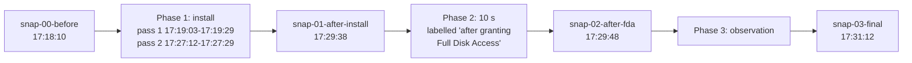

# Case study: the Omnissa Horizon Client installer on macOS

This case study covers two captured runs of the Omnissa Horizon Client installer on 25 June 2026, on one test Mac (SET-01, SET-10, OWN-05). Each finding cites a fact ID in [evidence/FACTS.md](evidence/FACTS.md), and each fact cites the raw lines, mostly through the redacted excerpts in [evidence/](evidence/). Facts with an `OWN` ID come from the owner, not from the captures. "Vendor" means names that match the Omnissa, Horizon, VMware, Workspace ONE, ws1 or Deem terms. The term does not identify an organization (R1-77). Times are CEST. The vendor was not contacted (OWN-01).

## Summary

**The Omnissa Horizon Client 8.17.0 installer for macOS also installed a Workspace ONE stack: Deem 25.09.00.701 with an installer helper, and the Endpoint Telemetry Service 25.9.0.5699 (SET-20, SET-21, R1-19, P1-19).**

- Services: three LaunchDaemons (`com.omnissa.horizon.CDSHelper`, `com.ws1.deemd`, `com.ws1.ws1etlm`) and two LaunchAgents (`com.ws1.deem.MacUIEvents`, `com.ws1.ws1etlmu`), with deemd and ws1etlm running as root in both runs (R1-24, R1-28, R1-93, P1-22, P1-74). In run 2 the privileged helper CDSHelper logged an install of `Omnissa Horizon Client.pkg` after a connection from `horizon-client` (P1-31, P1-34, P1-35).
- Other changes: four Workspace ONE app bundles, the Deem `LegacyDeem.app`, configuration under `/etc/workspaceone` and the line `127.0.0.1 view-localhost` in `/etc/hosts`, in both runs (R1-46, R1-47, R1-40, P1-43, P1-39). In run 1 a native-messaging manifest was also copied into the Chrome and Edge folders. The data does not establish any collection of browsing data (R1-61).
- Permissions: the signing data gives ws1etlm the endpoint-security entitlement and ws1etlmu the network-client and location entitlements (R1-139). In the captured logs tccd denied ws1etlm Full Disk Access, and locationd logged 'denying' for ws1etlmu (P1-112, R1-153). No log line records a Full Disk Access grant. The owner reports one, for an app and at a time that are not confirmed (P2-20, OWN-03). Details are under [Permissions](#permissions).
- Limits: one Mac on one day (SET-01, OWN-05). Run 1 used a package with a local name, and its install script logged 'defaulting to DEEM installer.'. No run 2 line shows which branch the script took (R1-84, P1-120). No hash, no static analysis and no organization name for the team ID `S2ZMFGQM93` are recorded (SET-29, R1-77). The captures show what was installed, registered and started, not whether the components collected or sent any data. All limits are under [Limits](#limits).

## Setup

Run 1 is the install. Run 2 has three phases: install, a step that the owner reports as a Full Disk Access grant, and an observation (OWN-03, OWN-07, SET-14).

The run 1 capture records an arm64 processor and macOS major version 26 (SET-02, SET-06, SET-07). The owner reports a MacBook Air with macOS 26.5.2 (OWN-04, OWN-05).

| | Run 1 | Run 2 |
| --- | --- | --- |
| Time | 12:06:15-12:08:59 CEST (SET-12, SET-16) | 17:18:10-17:31:12 CEST (SET-13, SET-16) |
| Installer | the `.pkg` under a local name, read by `/usr/sbin/installer`, whose 'Current Path:' lines name `bash` and `sudo` (SET-36, SET-41, R1-103) | sandboxd twice rejected a request from Installer for Downloads-folder access to `Omnissa-Horizon-Client-2512-8.17.0-20187907409.dmg`. DiskImageMounter and Installer.app log from 17:18:29 and 17:19:03 (SET-24, P1-03, P1-04) |
| Snapshots | before and after, eight files each: `receipts.txt`, `launchd.txt`, `privhelpers.txt`, `launchctl.txt`, `hosts.txt`, `fs.txt` (the file listing), `processes.txt` (the process snapshot), `connections.txt` (SET-62) | four snapshots of the same eight files (SET-13, SET-63) |
| Unified log | a predicate on the `installer` process, sender paths with workspaceone or omnissa, and message text with deem or ws1etlm (SET-64) | the run 1 predicate plus message text with "Full Disk", "endpointsecurity" or "TCC" (SET-65) |
| Other captures | `installer.log`, `fs_usage` trace, packet capture, DNS log (SET-62) | DNS log, a second DNS query log (`dnscap`), and `agent-connections.log` with rows for `horizon-client` at sample times mostly 10-11 s apart (SET-51, SET-52, SET-84) |

The scripts that made the raw snapshots are not in this repository. Their snapshots hold files with the same eight names as `footprint.sh` snapshots, but a smaller scope (SET-34, SET-40). [evidence/build.sh](evidence/build.sh) runs `footprint.sh diff` over them to make the diff excerpts (SET-62, SET-63).

The snapshot times are the phase boundaries of run 2. Phase 1 has two installer passes. Pass 2 started 0.6 s after CDSHelper logged 'Installing package' (SET-14, SET-15, P1-05, P1-34):



## Findings

### Packages

| Package ID | Version (run 1) | Run 1 | Run 2 | Facts |
| --- | --- | --- | --- | --- |
| `com.omnissa.horizon.client.mac` | 8.17.0, and 1.0.0 for the "Next" package | receipt added | receipt added | SET-20, R1-19, P1-19 |
| `com.ws1.Deem.InstallerHelper` | 25.09.00.701 | receipt added | receipt added | SET-20, R1-19, P1-19 |
| `com.ws1.Deem` | 25.09.00.701 | receipt added | receipt added | SET-21, R1-19, P1-19 |
| `com.ws1.EndpointTelemetryService` | 25.9.0.5699 | receipt added | receipt added | SET-21, R1-19, P1-14, P1-19 |
| `com.omnissa.html5videoplayer` | not recorded | no receipt, app copied | receipt added | R1-20, R1-55, P1-19, SET-27 |

- Run 2 records no PackageKit package list. Its DMG name carries 8.17.0 and its Endpoint Telemetry package name carries 25.9.0.5699 (SET-26, P1-11, P1-14, P1-17).
- The run 1 install request named three packages: `Omnissa.Horizon.Client.pkg`, `Omnissa.Horizon.Client.Next.pkg` and `Deem.InstallerHelper.pkg` (SET-20). At 12:06:34 CEST the installer logged 'JS: Path check: .../EndpointTelemetryService/ws1etlm exists: false' and 'JS: Deem.InstallerHelper enabled: true' (R1-88). Run 2 logged the same check with 'exists: false' in pass 1 and 'exists: true' in pass 2 (P1-55).
- During run 1, `/Library/Application Support/WorkspaceONE/helper/` held the Deem and Endpoint Telemetry packages (R1-49). The installer helper's postinstall installed Deem, and `rm` deleted that package file at 12:06:50 CEST. It then installed the Endpoint Telemetry Service, and `rm` deleted that package file at 12:06:53 CEST (R1-10, R1-79, R1-50).

### Launch items and CDSHelper

| Label | Type | Program | Run 1 | Run 2 | Facts |
| --- | --- | --- | --- | --- | --- |
| `com.ws1.deemd` | LaunchDaemon | `/usr/local/bin/deemd` | added, running as root | added, running as root | R1-24, R1-27, R1-37, R1-93, P1-22, P1-37, P1-74 |
| `com.ws1.ws1etlm` | LaunchDaemon | `/usr/local/bin/ws1etlm` | added, running as root | added, running as root | R1-24, R1-27, R1-37, R1-93, P1-22, P1-37, P1-74 |
| `com.omnissa.horizon.CDSHelper` | LaunchDaemon and privileged helper | `/Library/PrivilegedHelperTools/com.omnissa.horizon.CDSHelper` | added, loaded, not in the after snapshot | added, running as root after 17:27:10 | R1-24, R1-32, R1-37, R1-93, P1-22, P1-28, P1-30, P1-37, P1-74 |
| `com.ws1.ws1etlmu` | LaunchAgent | `/usr/local/bin/ws1etlmu` | added, running as the user | plist from run 1, no line logged by `ws1etlmu` in `run2/unified.log`, not in any process snapshot | R1-27, R1-28, R1-93, BR-05, P1-82, P1-83 |
| `com.ws1.deem.MacUIEvents` | LaunchAgent | `/usr/local/bin/MacUIEvents` | added, not in the after snapshot | plist from run 1, not in any process snapshot | R1-27, R1-28, R1-93, BR-05, P1-83 |

- The snapshots do not record what the plists contain (SET-34).
- In run 1, Background Task Management registered deemd and ws1etlm as legacy daemons and ws1etlmu and MacUIEvents as legacy agents, all `[enabled, allowed, not notified]` (R1-26, R1-30). In run 2 it found the two LaunchAgents from run 1 again, as `[enabled, disallowed, notified]`, and logged an updated item for each with `[enabled, disallowed, not notified]` (P1-27).
- Each of the two client postinstalls in run 1 copied CDSHelper and its plist into place and ran `launchctl load`. In the second one, the next line was 'Load failed: 5: Input/output error' (R1-34, R1-35).
- In run 2, at 17:27:10 CEST, CDSHelper logged a connection from `horizon-client`. It logged that the 'cds script /bin/rm' ran, without naming its target (P1-31, P1-32). Its install job then logged 'isDeemInstalled = YES' for the ws1etlm folder (P1-33). It logged 'Installing package' for `Omnissa Horizon Client.pkg` in a temporary folder named `viewAutoupdate.DoU50a`, and at 17:27:29 CEST 'The package is installed successfully!' (P1-34, P1-35). The version of that package is not recorded (P1-17).
- The CDSHelper binary was 174304 bytes, dated 12:06, after run 1, and 174256 bytes, dated 17:27, after run 2 phase 1 (P1-29).

### Processes

| Process | User | Run 1 | Run 2 | Facts |
| --- | --- | --- | --- | --- |
| `deemd` | root | logs from 12:06:52, in the after snapshot | logs from 17:19:28, in all later snapshots | R1-13, R1-93, P1-08, P1-74, P3-19 |
| `ws1etlm` | root | logs from 12:06:53, in the after snapshot | logs from 17:19:29, in all later snapshots | R1-13, R1-93, P1-08, P1-74, P3-19 |
| `ws1etlmu` | the user | logs from 12:06:53, in the after snapshot | no line in `run2/unified.log`, not in any process snapshot | R1-13, R1-93, P1-82, P1-83 |
| CDSHelper | root | not in the after snapshot | logs from 17:27:10, in all later snapshots | R1-93, P1-08, P1-74, P3-19 |
| `horizon-client` | the user (not recorded for PID 17702) | not in the after snapshot | five PIDs, the first named at 17:19:43 | R1-93, P1-47, P1-84 to P1-88, P3-18 |
| `Horizon Client Services`, `horizon-eucusbarbitrator` | the user, root | not in the after snapshot | in the final snapshot only | R1-93, P3-17, P3-18 |

- In run 1 deemd logged 13 'Starting module' lines at 12:06:53 CEST. The modules are named for app crash, asset, app change, resource consumer, network, app unresponsive, system update, unexpected shutdown, service, process, system crash and app hang events, plus a forwarder (R1-101). In run 2 it logged 7 of these lines, in a log that drops messages (P1-92, SET-67).
- deemd logged 'Installation disabled: True, Remote Deem enabled: False, ShouldHarverstData: False' at 12:06:53 CEST in run 1 and at 17:19:28 CEST in run 2 (R1-100, P1-91). In run 1 it logged 'Installation disabled: False' at 12:07:53 CEST. It then logged 17 attempts to connect to the socket `/Library/Application Support/AirWatch/Data/Socket/hubudssocket`, each followed by an error that the path does not exist (R1-100, R1-99).
- In the user's home folder, ws1etlm and ws1etlmu made 8 read-only calls on 6 paths, and one open failed (R1-67). No vendor-process line in the trace creates, renames, deletes, links or opens for writing a path there (R1-72). The trace attributes 36 disk-write records under the home folder to deemd, but they name files of other processes, so that attribution is uncertain (R1-65).

### Files

| Path | What the data shows | Facts |
| --- | --- | --- |
| `/Library/Application Support/WorkspaceONE/Deem/deem/` | `LegacyDeem.app` (holds the `deemd` binary), `uninstall.sh`, `archive_logs.command` | R1-47, R1-73 |
| `/Library/Application Support/WorkspaceONE/EndpointTelemetryService/ws1etlm/` | `WorkspaceONE DEX.app` (holds `ws1etlm`), `Experience Management.app` (holds `ws1etlmu`), `AppSessionEvents.app` (holds `MacUIEvents`), `TlmTool.app`, `etlmapi.dylib`, `tlmExtensionHelper`, `config.ini`, `collectLogs.sh`, `uninstall.sh`, the browser manifest | R1-31, R1-47, R1-73 |
| `/usr/local/bin/deemd`, `ws1etlm`, `ws1etlmu` | symbolic links | R1-52 |
| `/etc/workspaceone/ws1etlm/` | `config/config.ini`, `config/install.plist`, `config/loggers.ini`, `deem/deem.ini` | R1-46, R1-59 |
| `/private/var/workspaceone/ws1etlm/` | logs, sessions and cache folders, outside the file-listing scope | R1-60 |
| `/Library/Application Support/WorkspaceONE/Deem/deem-data/sqlite/` | `event_mapping.db`, `logs.db` | R1-63 |
| `/Library/Logs/WorkspaceONE/Deem/` | the deemd log | R1-62 |
| `/Library/Google/Chrome/NativeMessagingHosts/`, `/Library/Microsoft/Edge/NativeMessagingHosts/` | the browser manifest, written by `cp` (seen in `fs_usage` only) | R1-61 |
| `/etc/hosts` | new line 1: `127.0.0.1 view-localhost` | R1-40, P1-39 |
| `/Library/Application Support/Omnissa/Omnissa Horizon Client/` | `HTML5VideoPlayer.app`, and in run 2 phase 3 a `Services` folder | R1-46, R1-55, P3-13 |
| `/Library/Preferences/.omnissa/.horizon_migration_done` | created with `touch` after the script tested for VMware Horizon paths | R1-56 |
| `/Applications/Omnissa Horizon Client.app`, `/Applications/Omnissa Horizon Client Next.app` | the two client apps. The snapshots do not cover `/Applications` | R1-33, R1-53, P1-47 |

The file listing gained 33 vendor paths in run 1, and these were its only changes (R1-45). Run 2 phase 1 gained the same 33 vendor paths (P1-43).

### Install scripts

- In run 1, the installer helper's postinstall logged a Deem install and 'Removing temp DEEMD installation files.', then an EndpointTelemetryService Agent install and 'Removing Telemetry installation files.' (R1-79).
- At 12:06:53 CEST, after the line 'Telemetry Installer Helper postinstall script finished.', package_script_service logged the installer's file name and, for the run 1 name, 'does not contain any expected product, defaulting to DEEM installer.' It then logged that it created `install.plist`, and 'Device has enabled Deem for UEM.' (R1-84, R1-85).
- At 12:06:53 CEST package_script_service logged a `./postinstall` line that runs `/usr/bin/osascript` to display a notification titled 'WorkspaceONE DEX', subtitle 'Full Disk Access request', text 'Open System Preferences->Privacy & Security Settings and grant access.' Whether it appeared on screen is not recorded (R1-119).
- The first client postinstall copied `/etc/hosts` to `/etc/hosts.bak`, ran `sed` to insert `127.0.0.1 view-localhost` before line 1, and removed the copy (R1-41, R1-40).
- Both client postinstalls ran `openssl enc -aes-256-cbc -d` on `templates.tar.gz` with a passphrase written in the script's command line. They extracted `proxyApp-template-app` (with `horizon-docker`) and `horizon-urlFilterApp` (with `horizon-urlFilter`) (R1-87). The passphrase value is withheld here.
- Both ran `chown -R root:wheel` and `chmod 4755` (mode 4755 sets the setuid bit) on `Open Horizon Client Services` inside their own app bundle. The file listing does not cover `/Applications`, so the resulting modes are not shown (R1-86).

### Permissions

| Item | What the data shows | Facts |
| --- | --- | --- |
| Entitlements | run 1 signing data: `ws1etlm` with `com.apple.developer.endpoint-security.client`, `ws1etlmu` with `com.apple.security.network.client` and `com.apple.security.personal-information.location` | R1-139 |
| Full Disk Access | run 2: for both ws1etlm requests, at 17:19:30 and 17:20:30, tccd logged 'Switching AllFiles to EndpointSecurityClient due to record in database'. It denied the second one. From 17:19:30 to 17:28:31 ws1etlm logged 10 times, once a minute, that it lacked Full Disk Access to open the Endpoint Security service. No run 2 log line records a grant to a vendor identifier. The owner reports a grant in the second step of run 2, app and time not confirmed | P1-110, P1-112, P1-111, P2-20, OWN-03 |
| Location | run 1: locationd registered ws1etlmu at 12:06:54 and logged 'denying' its executable. The reason is withheld | R1-152, R1-153 |
| `kTCCServiceListenEvent` | run 2: deemd sent a preflight request for it at 17:19:29, with no reply in the log. System Settings set it to allowed for the Horizon Client at 17:20:10 | P1-108, P1-115, P2-21 |
| Developer tool | run 2: after each request from deemd, ws1etlm and the Horizon Client, tccd logged that the service 'does not allow prompting; returning denied.' | P1-108, P1-109, P3-46 |
| Other TCC services | run 2: the Horizon Client's requests for microphone, screen capture and audio capture got 'Unknown (None)' | P1-116, P3-45 |

### Network and DNS

| Observation | Facts |
| --- | --- |
| Run 1: no vendor process has a line in either `connections.txt` | R1-105, R1-106 |
| Run 1: the ASCII dump of the capture shows no vendor string in any non-loopback packet, including the cleartext TLS server names. The search cannot read QUIC server names, which are encrypted | R1-115 |
| Run 1: no data ties 4 of the 14 TCP 443 addresses to a process. The first client TLS data packet to 2 of them holds an apple.com host name | R1-110, R1-111 |
| Both runs: the DNS logs record no query for a vendor name and no line for `view-localhost` | R1-114, P1-102, P1-103, R1-42 |
| Run 2: each of the 4 sampled `horizon-client` PIDs held TCP connections to `23.40.244.164:443`, its only non-loopback endpoint (samples 17:20:29-17:31:03, with an 80 s gap). This address is in no DNS log, and its name and operator are not recorded | P1-94 to P1-96, P1-98, P1-99, P2-17, P3-39 |
| Run 2: `horizon-client` listened on a 127.0.0.1 TCP port | P1-93, P3-34 |
| Run 2: deemd, ws1etlm and CDSHelper have no line in the `connections.txt` of snap-01, snap-02 or snap-03, which list root sockets. `agent-connections.log` holds only `horizon-client` rows, with an unrecorded filter | P1-100, P2-16, P3-36, SET-77, SET-84 |

### Signing checks that macOS logged

| Observation | Facts |
| --- | --- |
| syspolicyd names the team ID `S2ZMFGQM93` for deemd and ws1etlm in both runs, and for ws1etlmu in run 1. The data does not name the organization | R1-77, P1-53 |
| tccd logged the designated requirement of ws1etlm and ws1etlmu in run 1. It ends with `certificate leaf[subject.OU] = S2ZMFGQM93` | R1-138 |
| syspolicyd found a stapled ticket in the Deem package in both runs | R1-75, P1-51 |
| syspolicyd logged 'GK Xprotect results' lines for the Deem package scripts, and 'GK evaluateScanResult' lines for deemd and ws1etlm in both runs and ws1etlmu in run 1. The data does not give the meaning of the values | R1-125, R1-126, P1-129, P1-130 |
| AppleSystemPolicy logged 'script, allowed' for the Deem scripts and 'exec, allowed' for LegacyDeem.app and WorkspaceONE DEX.app, in both runs | R1-78, R1-128, P1-56, P1-132 |
| taskgated-helper allowed the entitlements of ws1etlm 'due to provisioning profile' in both runs, and of ws1etlmu in run 1 | R1-140, P1-147 |
| The installers logged 'Trust evaluate failure: [leaf ExtendedKeyUsage] [ca1 IntermediateEKU]' without naming a certificate or file. The run 1 install completed | R1-143, P1-151, R1-05 |
| Neither unified log has a notarization or Gatekeeper line that names the Horizon Client package or the DMG. The predicate has no message term for omnissa or horizon | SET-86, SET-87, P1-154 |
| No raw line records a quarantine attribute or quarantine check for a vendor item | SET-88 |

### Installer errors

- Run 1: `installer.log` ends with 'The install was successful.' The log has no script error line (R1-05, R1-89). The Deem install logged 17 'Could not open ... for AOT translation' lines for its `osx-x64` bundle (R1-91).
- Run 2, pass 2: installer PIDs 18554 and 18586 each looked up the error texts 'An error occurred while running scripts from the package' and 'The Installer encountered an error that caused the installation to fail.' (P1-68, P1-69). `AGENT-NETWORK.txt` has the first error for the Deem package and for the Endpoint Telemetry package, with no time and no PID (P1-71). The link of these two lines to pass 2 is uncertain (P1-72). Installer PID 18516 looked up the success message at 17:27:29 CEST, when CDSHelper logged that the package was installed (P1-67, P1-35).

## Phases 2 and 3

Phase 2 is the 10 seconds between `snap-01-after-install` (17:29:38 CEST) and `snap-02-after-fda` (17:29:48 CEST). The run 2 diff file calls it 'what changed after GRANTING Full Disk Access' (SET-14, SET-15, P2-01).

- The snapshots record no change to receipts, launch items, CDSHelper, `launchctl.txt`, `/etc/hosts` or the file listing (P2-02 to P2-08). The process diff has only mdworker_shared, sleep, ps and sort lines (P2-10).
- The captured log has no line from a vendor process in the window. The only lines that name a vendor item are 8 runningboardd lines about deemd (P2-12, P2-13).
- No line in `run2/unified.log` records a Full Disk Access grant to a vendor identifier. The whole run 2 log has 4991 dropped-message markers and selects lines by their text, so this does not show that no grant happened (P2-20).
- The owner reports granting Full Disk Access in the second step of run 2, after the install, for an app and at a time that are not confirmed (OWN-03).

Phase 3 runs from 17:29:48 to 17:31:12 CEST (SET-14).

- A new `horizon-client` process (PID 18956) appears in the log at 17:29:54 CEST (P3-22, P3-23). `Horizon Client Services` and `horizon-eucusbarbitrator` appear in the final snapshot, and the file listing gained the `Services` folder (P3-18, P3-13).
- `horizon-client` held one connection to `23.40.244.164:443` and listened on `127.0.0.1:55945` (P3-35, P3-39).
- From 17:29:54 to 17:30:01 CEST tccd handled 15 requests from the Horizon Client: `kTCCServiceListenEvent` got 'Allowed (System Set)', and microphone, audio capture, screen capture and developer tool got 'Unknown (None)' (P3-43, P3-44, P3-45).
- deemd, ws1etlm and CDSHelper kept their PIDs. The captured log has no line from them in phase 3, and it has 465 dropped-message markers in this window (P3-19, P3-28).
- At 17:31:04 CEST System Settings showed the Full Disk Access pane after a search for 'full disk'. The log ends at 17:31:12 CEST with no later tccd line (P3-48, P3-49, P3-02).

## What this means

- On this Mac, installing the Horizon Client also installed the Workspace ONE stack. Both runs added the same four package receipts and the same three LaunchDaemons, and deemd and ws1etlm first logged during the install and ran as root (R1-19, P1-19, R1-24, P1-22, R1-13, P1-08, R1-93, P1-74).
- The names in the data describe telemetry. One package is the Endpoint Telemetry Service, its installer calls itself the 'Telemetry Installer Helper', and deemd's modules are named for app, process, network and crash events (SET-21, R1-79, R1-101).
- The captures tie no internet connection to the telemetry components: no vendor daemon has a line in any `connections.txt` after the install, and the DNS logs record no query for a vendor name (R1-106, P1-100, P2-16, P3-36, R1-114, P1-102, P1-103). The captures cannot exclude such traffic. QUIC server names are encrypted, run 2 kept no packet capture file, daemon sockets were seen only at snapshot times, 4 run 1 TCP 443 addresses are not tied to a process, and the logs do not select network-library lines (R1-115, SET-63, SET-84, R1-110, R1-111, R1-113, SET-65). The DNS logs also miss `23.40.244.164`, which `horizon-client` did connect to (P1-99).
- ws1etlm lacked Full Disk Access in the captured window, and a script line requested it in a notification (P1-111, R1-119). locationd denied ws1etlmu as a location client (R1-153). The owner reports a Full Disk Access grant that the logs do not record (OWN-03, P2-20).

## Limits

- **One Mac, one day.** Every timestamped line in both unified logs is dated 25 June 2026, and the syslog lines carry one host name (SET-01, SET-10). The captures record only the macOS major version, 26, and no model identifier (SET-02, SET-03, SET-11).
- **Run 1 file name.** The run 1 package had a local name. package_script_service logged that this name 'does not contain any expected product' and that it was 'defaulting to DEEM installer.' (R1-84, OWN-06). Run 1 does not show what the script does under the vendor's file name. The original download name is not recorded (SET-37).
- **No product check in run 2.** In run 1 the product check is `./postinstall` output in syslog packets of the packet capture (R1-84). Run 2 kept no packet capture file (SET-63), and `run2/unified.log` has no `./postinstall` line (P1-120). The 37 syslog lines in `run2/AGENT-NETWORK.txt` do not include the check ([excerpt, lines 141-177](evidence/run2.AGENT-NETWORK.txt#L137), SET-79). Run 2 did log the line that followed the check in run 1, 'File Doesn't Exist, Will Create: .../install.plist' (P1-64). So the data does not show which branch the script took for the DMG.
- **Run 2 not clean.** Run 2 started with the two run 1 LaunchAgent plists, and Background Task Management found their items again as 'disallowed' (BR-05, P1-27). How run 1 was removed, and whether the LaunchAgents were turned off by hand as login items, is not known (BR-18, OWN-08). The run 2 results for ws1etlmu and MacUIEvents come from a Mac in this state.
- **Different install methods.** Run 1 ran the package with `/usr/sbin/installer` under `sudo`, and run 2 used Installer.app with a DMG (R1-103, SET-24, P1-04). A difference between the runs can come from the method as well as from the file.
- **Installer choices not recorded.** Run 1 used the command-line `installer`, and its install script logged 'JS: Deem.InstallerHelper enabled: true' (R1-103, R1-88). Whether Installer.app in run 2 showed the Workspace ONE packages or let the user deselect them is not recorded (P1-04). The vendor's release notes are not part of this study, so whether they list these components is not checked here.
- **The test Mac was in daily use.** Unrelated software ran during both runs (R1-109, P1-43).
- **Full Disk Access timing.** The owner reports a grant in the second step of run 2. The logs record none, and the app and time are not confirmed (OWN-03, P2-20). After 17:20:04 CEST, the only System Settings lines that name Full Disk Access are at 17:31:03-17:31:04 CEST, in phase 3 (P3-48, P3-50). The last recorded ws1etlm line is a Full Disk Access error at 17:28:31 CEST, and 111 dropped-message markers follow it before phase 2, so later ws1etlm lines may be missing (P2-28, P2-30).
- **No hashes.** No hash of the run 1 package or the run 2 DMG is recorded. Both carry 8.17.0, but the data does not show that they are the same build (SET-29). Run 2 phase 1 also holds the CDSHelper install of a package whose version is not recorded, and after it the CDSHelper binary is 48 bytes smaller than after run 1 (P1-17, P1-29).
- **Team ID not resolved.** The data does not name the organization behind `S2ZMFGQM93` (R1-77). No static check of the packages is recorded (see [Static analysis](#static-analysis-of-the-macos-packages)).
- **Filtered logs.** Both logs were filtered with a predicate on process name, sender path and message text, and they hold 738 and 4991 'Messages dropped during live streaming' markers (SET-64, SET-65, SET-67). The predicates do not name installd, package_script_service or network subsystems (R1-102, R1-121, SET-65).
- **Partial network view.** Run 2 kept no packet capture file, although `tcpdump` ran (SET-63, SET-43). `agent-connections.log` holds only `horizon-client` rows, and an 80 s gap in it contains phase 2 (SET-84, P2-17, P2-31). The DNS logs hold only port-53 queries, while mDNSResponder also held UDP sockets to a public DNS resolver on port 443 (SET-55, R1-118, SET-46, P1-104). The last `dnscap` line is at 17:29:00 CEST (SET-52, SET-53). The `tcpdump` interface and filters are not recorded (SET-42, SET-78). Two headers in the original analysis output do not match their content: 'TLS SNI / vendor hostnames' in `run1/NETWORK-summary.txt` and 'Telemetry-domain hits in packet capture (real egress ...)' in `run2/AGENT-NETWORK.txt` (R1-123, P1-123).
- **Raw-only citations.** 35 captured-data facts have no excerpt link, because their lines belong to unrelated software or are counts over whole files. The negative network findings rest on them: no vendor sockets (R1-105, P2-16), no vendor DNS query (R1-114, P1-102, P1-103), and the root-socket coverage (SET-77). So do the missing Full Disk Access grant line (P2-20) and the dropped-message counts (SET-67). A reader cannot check these facts without the raw data, which is not published.
- **Name-based searches.** The absence checks for DNS names, packet strings, sockets and log lines search for vendor terms. Traffic to an endpoint with a neutral name is not found by them: `horizon-client` connected to `23.40.244.164`, which no capture names (P1-99, R1-115).
- **Short windows.** Run 1 observed about 2 minutes after deemd and ws1etlm first logged, and run 2 phase 3 lasted 84 s. Daemon sockets were seen only at the snapshot times: once in run 1 and three times in run 2 (R1-13, SET-12, SET-14).
- **`fs_usage`.** The filter that produced the trace is not recorded (SET-72). The numbers after the process names are not PIDs (R1-124). The attribution of deemd's disk-write lines is uncertain (R1-65, R1-66). Run 2 kept no `fs_usage` output, so the run 1 file-access findings have no run 2 check (SET-63).
- **Snapshot scope.** The file listing covers only `/Library/Application Support` and, after the install, `/etc/workspaceone`, at most 4 path components below `/Library/Application Support` or `/etc` (SET-40, SET-70). It does not show `/Applications`, `/private/var`, `/usr/local/bin` or the browser folders (R1-53, R1-60). The `/usr/local/bin` links and the browser manifest come only from the run 1 `fs_usage` trace (R1-52, R1-61). The snapshots do not record the contents of the launchd plists (SET-34). The app that ran the study's commands (PID 1978 in both runs, R1-104, P2-25) had no Full Disk Access when the run 2 snapshots were taken: tccd denied the snapshot `find` at 17:29:38 CEST, and the kernel denied it a read of `/Library/Application Support/com.apple.TCC` at 17:31:12 CEST (P2-25, P3-02). So the run 2 file listings can miss folders that TCC protects. The snapshots do not list system extensions, configuration profiles, the Background Task Management database or kernel extensions.
- **Withheld values.** These values are withheld: the run 1 file name (OWN-06), the `openssl` passphrase (R1-87) and the location denial reason (R1-153). The location reason is withheld at the owner's request. The username, host name and local addresses show as placeholders. Public addresses show as `<ip>`, except 23.40.244.164, the remote address of the `horizon-client` connections.

## Static analysis of the macOS packages

None is recorded. The raw folders hold no static-analysis output for these packages. Searched for and not found:

- `codesign -dv` or `codesign --verify` output
- `spctl --assess` output
- `pkgutil --check-signature` output
- The certificate chain of the vendor signatures (Developer ID Installer or Developer ID Application, organization name)
- SHA-256 or other hashes of the `.pkg` and the `.dmg` (SET-29)
- VirusTotal or other third-party scanner reports
- A logged notarization check of the Horizon Client package, the Endpoint Telemetry package or the `.dmg` (SET-86, P1-154)
- A quarantine attribute or quarantine check for a vendor item (SET-88)

The exact search commands are in [evidence/FACTS.md](evidence/FACTS.md), under "Not recorded", and the quarantine search is in the note of SET-88. The checks that macOS logged during the installs are under [Signing checks that macOS logged](#signing-checks-that-macos-logged). They are not a static analysis.

## Reproduce it

**Check a fact.** Find its ID in [evidence/FACTS.md](evidence/FACTS.md) and follow the link. Each excerpt section starts with a `# source:` line that names its raw file and filter. Line excerpts keep the raw line numbers. For `(count)` citations the fact's note gives the command. `(raw only)` citations name raw lines that no excerpt shows. Both need the raw folders.

**Rebuild the excerpts.** With the raw folders and `tools/.redact-local.env` in place, run:

```bash
case-studies/omnissa-horizon-client/evidence/build.sh
tools/check_citations.py
tools/verify_redaction.sh
```

**Repeat the study.** Follow [Run a three-phase study](../../README.md#run-a-three-phase-study) with `footprint.sh`. The original run 2 predicate was (SET-64, SET-65):

```text
process == "installer" OR senderImagePath CONTAINS[c] "workspaceone" OR senderImagePath CONTAINS[c] "omnissa"
OR composedMessage CONTAINS[c] "deem" OR composedMessage CONTAINS[c] "ws1etlm"
OR composedMessage CONTAINS[c] "Full Disk" OR composedMessage CONTAINS[c] "endpointsecurity" OR composedMessage CONTAINS[c] "TCC"
```

The process snapshots have only the columns PID, PPID, USER and COMM (SET-78), so they do not record the arguments of `tcpdump` and `fs_usage`. They show that `fs_usage`, `log` and two `tcpdump` processes ran as root in both runs (SET-42, SET-43). The `fs_usage` filter and the filter of the script that wrote `agent-connections.log` are not recorded either (SET-72, SET-84). The gaps in this study suggest five changes:

1. Install the file under its original download name, and record its SHA-256 first (SET-37, SET-29). The postinstall checks the file name (R1-84).
2. Export the log after the run with `/usr/bin/log show --info --debug`, and keep a live stream as a second source. The dropped-message markers point to `log show` (SET-67), but `log show` returns only the messages that macOS stored.
3. Copy `/var/log/install.log` after each run. Run 1's script output came from syslog packets in the packet capture (R1-84). Neither `run1/unified.log` nor `run2/unified.log` has a `./postinstall` line (R1-121, P1-120).
4. Keep a packet capture file in every run (SET-63).
5. Sample the sockets of every vendor process. `agent-connections.log` has only `horizon-client` rows, and its filter is not recorded (SET-84).
