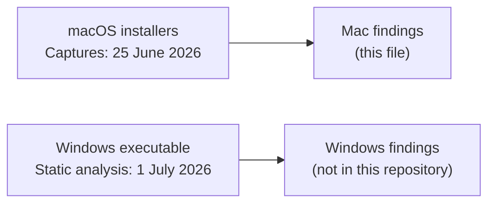

# Evidence: Omnissa Horizon Client installer

Status: extracted and verified line by line. Not interpreted. A case study write-up may use only facts from this file.

## Scope

This file covers one study: behavioural captures of the Omnissa Horizon Client installer on macOS, in two runs on 25 June 2026. Every fact with a `SET`, `R1`, `BR`, `P1`, `P2` or `P3` ID cites captured data.

A separate study on 1 July 2026 was a static analysis of a Windows executable. It analysed a different sample, on a later date. Its result cannot establish the identity or the safety of the macOS packages captured here, and it is not evidence in this file (OWN-02).

Statements that come from the owner and not from the captured data have `OWN` IDs and are in "Owner-reported information" at the end. Where the data bears on such a statement, the item says what the data shows.

Each captured-data line is one observation, with the raw lines that show it. Six extraction passes, one per topic, pulled the facts from the raw data. A separate verifier per topic re-read every cited line. A completeness check compared the list with the study questions. A last pass merged duplicates and was verified the same way.

## How to read this file

- **IDs.** `OWN` = owner-reported (last section). `SET` = sources, setup and timeline. `R1` = run 1 (install only). `BR` = state carried from run 1 into run 2. `P1`, `P2`, `P3` = run 2 phase 1 (install), phase 2 and phase 3 (observation). The heading in run2/PHASE-DIFFS.txt labels phase 2 "after granting Full Disk Access" (SET-15). The captured logs record no Full Disk Access grant (P2-20). That does not show that no grant happened. The owner reports a Full Disk Access grant in the second step of run 2, after the install, at a clock time that is not confirmed (OWN-03). IDs are stable labels: a fact keeps its ID when it is grouped under a different heading.
- **[category]** names the artefact type. **uncertain** marks a fact the data cannot fully prove. Its note says why.
- **Evidence** cites the redacted excerpts in this folder. `[run2.unified-log.txt:43326-43328](...)` means lines 43326-43328 of the raw file, as they appear in that excerpt. The link opens the excerpt at the first cited line. Excerpts keep the raw line numbers, and each excerpt starts with a `# source:` line that names its raw file and filter. In snapshot excerpts, `#receipts`, `#launchd` and so on name the section. `(raw only)` marks lines that no excerpt shows. These are absence checks over non-vendor lines, DNS records of unrelated names and directory rows, which the redaction drops on purpose. `(count over ...)` marks a count. The note gives the command, and the linked counts excerpt repeats it. `run1/capture.pcap#dump` means the output of `tcpdump -nn -A -r run1/capture.pcap 2>/dev/null`.
- `[N unrelated lines removed]` in an excerpt marks lines that `tools/redact.py` dropped. Paths and bundle IDs of other software show as `<unrelated>`. `build.sh` rebuilds every excerpt from the raw data.
- **Placeholders.** `<user>` = username. `<host>` = hostname. `<lan-ip>` = private address. `<ip>` = a public address that is not a vendor endpoint. `<user-tmp>` = per-user temporary folder. `<removed>` = an ID removed by the redaction (UUID, UDID, serial-like token, MAC or email address). `<dir>/<local-pkg>` = folder and file name of the run 1 package copy. The owner gave the file this local name (OWN-06). The name is withheld. `pass:<withheld>` = a passphrase in a vendor script. `<reason withheld>` and `<withheld>` in locationd lines = a device setting of the test Mac, withheld at the owner's request. Other public IP addresses and all unrelated software on the host are left out.
- **Times** are local time on the test Mac, CEST (UTC+02:00).

| Alias | Raw folder (not in this repository) | Content |
| --- | --- | --- |
| `run1` | `pkg-analysis-20260625-120612/` | Run 1, install only, 12:06-12:09 CEST: snapshots, `installer.log`, filtered `log show`, `fs_usage` trace, packet capture, DNS log |
| `run2` | `manual-analysis-20260625-171808/` | Run 2, three phases, 17:18-17:31 CEST: four snapshots, phase diffs, filtered `log show`, `lsof` samples of the client every 10 s, DNS log |
| `dnscap` | `dns-capture/dns-20260625-171714.log` | Host-wide DNS query log for run 2 |

The phase descriptions in this table are the owner's (OWN-07). The times and the file lists come from the data (SET-12, SET-13, SET-63).

## Captures (25 June 2026)

### Run 1

#### Run 1: sources and timeline

- **SET-02** [environment] The run 1 capture records the macOS major version 26. At 12:06:53 CEST package_script_service[7462] logs './postinstall: evaluating /usr/bin/sw_vers -productVersion | /usr/bin/cut -d '.' -f 1' and then './postinstall: detected macOS version: 26'. Evidence: [`run1-install.pcap-syslog.txt:8112,8122`](run1-install.pcap-syslog.txt#L311).
- **SET-06** [environment] In the run 1 capture, the Deem postinstall of installer[7541] logs './postinstall: CPU_TYPE arm64' at 12:06:49 CEST. Evidence: [`run1-install.pcap-syslog.txt:6415`](run1-install.pcap-syslog.txt#L153).
- **SET-07** [environment] In the run 1 capture, the Horizon Client postinstall trace of package_script_service[7462] logs './postinstall: ++ uname -m' and then './postinstall: + arch=arm64' at 12:06:46 CEST. This pair of lines appears twice. Evidence: [`run1-install.pcap-syslog.txt:3857,3863,5069,5075`](run1-install.pcap-syslog.txt#L85).
- **SET-09** [environment] At 12:06:34 CEST an installer thread (installer.87919) makes an fsgetpath call on /System/Volumes/Preboot/Cryptexes/OS/System/Library/dyld/dyld_shared_cache_arm64e. Evidence: [`run1-install.fs_usage.txt:44`](run1-install.fs_usage.txt#L5).
- **SET-12** [timing] Run 1 snapshot files have these modification times: all 8 files in snapshot-before 12:06:15 CEST. In snapshot-after, connections.txt and fs.txt 12:08:59 CEST and the other 6 files 12:08:58 CEST. The snapshot-before folder has 12:06:15 CEST and the snapshot-after folder 12:08:59 CEST. The run 1 folder name contains the time 120612 (12:06:12). Evidence: `run1/snapshot-before` (count), `run1/snapshot-after` (count), `run1` (count). Note: stat -f '%N %Sm' -t '%H:%M:%S %z' run1/snapshot-* run1/snapshot-*/* (offset +0200 on every file and folder)
- **SET-17** [timing] Run 1 output files have these modification times: installer.log 12:06:58, capture.pcap 12:08:58, dns.log, DIFF-report.txt and unified.log 12:08:59, NETWORK-summary.txt 12:09:00 and fs_usage.filtered.log 12:09:21 CEST. Evidence: `run1` (count). Note: stat -f '%N %Sm' -t '%Y-%m-%d %H:%M:%S %z' run1/* (offset +0200 on every file)
- **SET-19** [version] run1/installer.log line 1 reads 'installer: Package name is Omnissa Horizon Client' and line 2 reads 'installer: Installing at base path /'. Evidence: [`run1-install.installer-log.txt:1-2`](run1-install.installer-log.txt#L2).
- **SET-20** [version] In the run 1 capture, installd[6352] logs 'PackageKit: request=PKInstallRequest <3 packages, destination=/>' at 12:06:35 CEST. Its package list names com.omnissa.horizon.client.mac version=8.17.0 (#Omnissa.Horizon.Client.pkg), com.omnissa.horizon.client.mac version=1.0.0 (#Omnissa.Horizon.Client.Next.pkg) and com.ws1.Deem.InstallerHelper version=25.09.00.701 (#Deem.InstallerHelper.pkg), all inside <local-pkg>. Evidence: [`run1-install.pcap-syslog.txt:2174,2180-2184`](run1-install.pcap-syslog.txt#L21).
- **SET-21** [version] In the run 1 capture, installer[7541] lists com.ws1.Deem version=25.09.00.701 from WorkspaceONE.Deem.Service.universal.pkg#Deem.pkg at 12:06:48 CEST. installer[7563] lists com.ws1.EndpointTelemetryService version=25.9.0.5699 from WorkspaceONE.EndpointTelemetryService-universal-25.9.0.5699.pkg#EndpointTelemetryService.pkg at 12:06:51 CEST. Evidence: [`run1-install.pcap-syslog.txt:6122-6123,7285-7286`](run1-install.pcap-syslog.txt#L141).
- **SET-23** [version] No line in run1/unified.log, run1/fs_usage.filtered.log, run1/DIFF-report.txt, run1/NETWORK-summary.txt, run1/installer.log or the run 1 capture dump contains '20187907409', '2512-8' or 'Horizon-Client-'. Evidence: `run1/unified.log` (count), [`run1-install.fs_usage-counts.txt`](run1-install.fs_usage-counts.txt) (count over `run1/fs_usage.filtered.log`), `run1/DIFF-report.txt` (count), `run1/NETWORK-summary.txt` (count), `run1/installer.log` (count), [`run1-install.pcap-counts.txt`](run1-install.pcap-counts.txt) (count over `run1/capture.pcap`). Note: grep -c -E '20187907409|2512-8' run1/unified.log run1/fs_usage.filtered.log run1/DIFF-report.txt run1/NETWORK-summary.txt run1/installer.log <capture dump> -> 0 each. grep -c -F 'Horizon-Client-' on the same six files -> 0 each.
- **SET-32** [receipt] In the run 1 capture, 'PackageKit: Writing receipt for' lines name com.ws1.Deem (installer[7541], 12:06:49 CEST), com.ws1.EndpointTelemetryService (installer[7563], 12:06:51 CEST), com.omnissa.horizon.client.mac twice and com.ws1.Deem.InstallerHelper (installd[6352], 12:06:54 CEST). Evidence: [`run1-install.pcap-syslog.txt:6451,7628,8240,8246,8252`](run1-install.pcap-syslog.txt#L159).
- **SET-33** [receipt] No PackageKit package list and no 'Writing receipt for' line in the run 1 capture names com.omnissa.html5videoplayer. run1/snapshot-after/receipts.txt lines 29-32 also do not list it. Evidence: [`run1-install.pcap-counts.txt`](run1-install.pcap-counts.txt) (count over `run1/capture.pcap`), [`run1-install.snapshot-after.txt#receipts:29-32`](run1-install.snapshot-after.txt#L3). Note: tcpdump -nn -A -r run1/capture.pcap 2>/dev/null | grep -c 'com.omnissa.html5' -> 0
- **SET-36** [path] In run 1, processes named installer read the package at /Users/<user>/Downloads/<dir>/<local-pkg>. fs_usage also records it as /Users/<user>/Downloads/<dir>/analysis/../<local-pkg>. All 86 lines in run1/fs_usage.filtered.log that name this file are from installer threads, from 12:06:34 CEST (stat64 and open, lines 524 and 536) to 12:06:58 CEST (open, lines 273341 and 273357). Evidence: [`run1-install.fs_usage.txt:524,536,573,273341,273357`](run1-install.fs_usage.txt#L7), [`run1-install.fs_usage-counts.txt`](run1-install.fs_usage-counts.txt) (count over `run1/fs_usage.filtered.log`). Note: grep -c '<local-pkg>' run1/fs_usage.filtered.log -> 86. grep '<local-pkg>' run1/fs_usage.filtered.log | awk '{print $NF}' | sed 's/\..*//' | sort | uniq -c -> 86 installer.
- **SET-37** [path] The original download name of the run 1 package is not recorded. Evidence: [`run1-install.fs_usage.txt:524`](run1-install.fs_usage.txt#L7), [`run1-install.installer-log.txt:1-2`](run1-install.installer-log.txt#L2).
- **SET-38** [path] run1/fs_usage.filtered.log contains no '.dmg' string. No volume name directly under /Volumes/ in it contains Omnissa, Horizon, VMware, WS1 or Deem. Evidence: [`run1-install.fs_usage-counts.txt`](run1-install.fs_usage-counts.txt) (count over `run1/fs_usage.filtered.log`). Note: grep -c -i '\.dmg' run1/fs_usage.filtered.log -> 0. grep -o -E '(^|[ \]])/Volumes/[^/ ]*' run1/fs_usage.filtered.log | sort | uniq -c -> 3 volume names, none with a vendor name.
- **SET-41** [process] In run1/unified.log the installer process PID 7459 logs its main bundle as </usr/sbin> at 12:06:34 CEST. Evidence: [`run1-install.unified-log.txt:5`](run1-install.unified-log.txt#L5).
- **SET-42** [process] In run 1 snapshot-before, root runs /usr/bin/fs_usage (PID 7421), /usr/bin/log (7422) and /usr/sbin/tcpdump (7423 and 7424). Their parent is bash 7410, which sudo 7409 started under sudo 7401. snapshot-after lists the same four tool processes. Evidence: `run1/snapshot-before/processes.txt:489,495-496,500-503` (raw only), `run1/snapshot-after/processes.txt:485-488` (raw only).
- **SET-50** [dns] run1/dns.log holds 20 records (10 queries, 10 responses) from 12:06:55 CEST to 12:07:27 CEST. All are UDP port 53 traffic between <lan-ip> (the Mac) and two <lan-ip> resolvers. Line 21 is empty. Evidence: `run1/dns.log:1-21` (raw only), `run1/dns.log` (count). Note: grep -c -E '\.53: [0-9]+\+' run1/dns.log -> 10. grep -c -E '\.53 > ' run1/dns.log -> 10.
- **SET-55** [dns] run1/NETWORK-summary.txt lines 1-5 list 4 names under the heading 'DNS queries the agent made'. These are the same 4 distinct names as in run1/dns.log. run1/dns.log is tcpdump output for port 53 and has no process field. Evidence: [`run1-install.NETWORK-summary.txt:1`](run1-install.NETWORK-summary.txt#L2), `run1/NETWORK-summary.txt:2-5` (raw only), `run1/dns.log:1-20` (raw only).
- **SET-56** [pcap] run1/capture.pcap holds 9947 packets. The first packet is at 12:06:13 CEST and the last packet is at 12:08:58 CEST. The file is in pcapng format. Evidence: [`run1-install.pcap-counts.txt`](run1-install.pcap-counts.txt) (count over `run1/capture.pcap`). Note: tcpdump -nn -r run1/capture.pcap 2>/dev/null | wc -l -> 9947. tcpdump -nn -tttt -r run1/capture.pcap 2>/dev/null | sed -n '1p;$p' -> 2026-06-25 12:06:13.101295 and 2026-06-25 12:08:58.931960. file run1/capture.pcap -> pcapng capture file - version 1.0.
- **SET-57** [pcap] run1/capture.pcap holds exactly 20 UDP port 53 packets, no TCP port 53 packet and no port 853 packet. Evidence: [`run1-install.pcap-counts.txt`](run1-install.pcap-counts.txt) (count over `run1/capture.pcap`). Note: tcpdump -nn -r run1/capture.pcap '<filter>' 2>/dev/null | wc -l with filter 'udp port 53' -> 20, 'tcp port 53' -> 0, 'port 853' -> 0
- **SET-58** [pcap] run1/capture.pcap holds 1432 UDP packets from 127.0.0.1:52385 to 127.0.0.1:32376, from 12:06:34 to 12:06:58 CEST. Each packet carries one syslog line. In both run 1 snapshots, UDP port 52385 is held by syslogd (PID 364, root, /usr/sbin/syslogd). Each payload starts with a syslog priority tag from <114> to <119>, then a date, the host name and a sender name. The senders are package_script_service (928 packets), installer (406), installd (92), install_monitor (4) and softwareupdated (2). Evidence: [`run1-install.pcap-counts.txt`](run1-install.pcap-counts.txt) (count over `run1/capture.pcap`), `run1/snapshot-before/connections.txt:52` (raw only), `run1/snapshot-after/connections.txt:59` (raw only), `run1/snapshot-before/processes.txt:19` (raw only), `run1/snapshot-after/processes.txt:19` (raw only). Note: tcpdump -nn -r run1/capture.pcap 'udp and dst port 32376' 2>/dev/null | wc -l -> 1432 (first 12:06:34.934575, last 12:06:58.832746). grep -n 52385 run1/snapshot-*/connections.txt -> one syslogd line in each file. tcpdump -nn -A -r run1/capture.pcap 2>/dev/null | grep -a -o -E '<1[0-9][0-9]>Jun 25 [0-9:]+ [^ ]+ [A-Za-z_]+' -> 1432 headers. Tags (grep -o '<1[0-9][0-9]>' | sort | uniq -c): <114> 12, <115> 34, <116> 4, <117> 122, <118> 1220, <119> 40. Senders: awk '{print $NF}' | sort | uniq -c.
- **SET-59** [pcap] The 1432 syslog packets in run1/capture.pcap hold 605 distinct lines. 496 lines are present 2 times, 107 lines 4 times and 2 lines 6 times. Evidence: [`run1-install.pcap-counts.txt`](run1-install.pcap-counts.txt) (count over `run1/capture.pcap`). Note: tcpdump -nn -A -r run1/capture.pcap 'udp and dst port 32376' 2>/dev/null | grep -a -o '<1[0-9][0-9]>Jun 25.*' | awk '{c[$0]++} END {for (k in c) n[c[k]]++; for (x in n) print x, n[x]}' -> 2 496, 4 107, 6 2
- **SET-60** [pcap] From 12:06:34 to 12:06:58 CEST run1/capture.pcap holds 106 packets 'ICMP 127.0.0.1 udp port 32376 unreachable'. Evidence: [`run1-install.pcap-counts.txt`](run1-install.pcap-counts.txt) (count over `run1/capture.pcap`). Note: tcpdump -nn -r run1/capture.pcap 'icmp and host 127.0.0.1' 2>/dev/null | grep -c 'udp port 32376 unreachable' -> 106 (first 12:06:34.934632, last 12:06:58.827637)
- **SET-62** [source-quirk] The run 1 folder holds capture.pcap, DIFF-report.txt, dns.log, fs_usage.filtered.log, installer.log, NETWORK-summary.txt, unified.log and the folders snapshot-before and snapshot-after. Each snapshot folder holds connections.txt, fs.txt, hosts.txt, launchctl.txt, launchd.txt, privhelpers.txt, processes.txt and receipts.txt. Evidence: `run1` (count). Note: ls -la run1 run1/snapshot-before run1/snapshot-after
- **SET-64** [source-quirk] Line 1 of run1/unified.log gives the log predicate: process == "installer" OR senderImagePath CONTAINS[c] "workspaceone" OR senderImagePath CONTAINS[c] "omnissa" OR composedMessage CONTAINS[c] "deem" OR composedMessage CONTAINS[c] "ws1etlm". Evidence: [`run1-install.unified-log.txt:1`](run1-install.unified-log.txt#L2).
- **SET-68** [source-quirk] run1/unified.log and run1/installer.log contain none of the strings 'CPU_TYPE', 'Running DEEMD installation script', 'detected macOS version', 'view-localhost' or 'Telemetry Installer Helper', which the run 1 capture syslog lines contain. The run 1 predicate includes process == "installer". Evidence: `run1/unified.log` (count), `run1/installer.log` (count), [`run1-install.unified-log.txt:1`](run1-install.unified-log.txt#L2), [`run1-install.pcap-counts.txt`](run1-install.pcap-counts.txt) (count over `run1/capture.pcap`). Note: grep -c -F '<string>' run1/unified.log run1/installer.log <capture dump> -> 0, 0 and 2 or 6 for each of the 5 strings
- **SET-69** [source-quirk] run1/installer.log has 81 lines. No line contains a digit, so the file has no timestamps and no version strings. Evidence: [`run1-install.installer-log.txt:1-81`](run1-install.installer-log.txt#L2), `run1/installer.log` (count). Note: wc -l < run1/installer.log -> 81. grep -c -E '[0-9]' run1/installer.log -> 0.
- **SET-71** [source-quirk] run1/fs_usage.filtered.log has 278043 lines in fs_usage format: time, syscall, path, elapsed time and process.thread. Line 1 is at 12:06:15 CEST ('12:06:15.119109 fstatat64 [-2]//Library/PrivilegedHelperTools 0.000002 ls.87696'). Line 278043 is a deemd line at 12:08:58 CEST. The fs_usage lines carry no time zone. The first installer line is at 12:06:34 in run1/fs_usage.filtered.log (line 25) and in run1/unified.log (line 3, offset +0200). Evidence: [`run1-install.fs_usage.txt:1,25,278043`](run1-install.fs_usage.txt#L2), [`run1-install.unified-log.txt:3`](run1-install.unified-log.txt#L4), [`run1-install.fs_usage-counts.txt`](run1-install.fs_usage-counts.txt) (count over `run1/fs_usage.filtered.log`). Note: awk 'END{print NR}' run1/fs_usage.filtered.log -> 278043. head -1 and tail -1 for the times. tail -1 run1/fs_usage.filtered.log | awk '{print $1, $NF}' -> 12:08:58.564864 deemd.89982.
- **SET-72** [source-quirk] run1/fs_usage.filtered.log does not record which filter produced it. Evidence: [`run1-install.fs_usage.txt:1`](run1-install.fs_usage.txt#L2).
- **SET-73** [source-quirk] In run1/fs_usage.filtered.log the number after the process name is not the ps PID. processes.txt lists deemd as PID 7560. fs_usage shows deemd with 37 different numeric suffixes (most lines: deemd.88525). A FIFO that deemd creates is named clr-debug-pipe-7560-1782382009-in. Evidence: [`run1-install.fs_usage.txt:187325`](run1-install.fs_usage.txt#L151), [`run1-install.snapshot-after.txt#processes:497`](run1-install.snapshot-after.txt#L90), [`run1-install.fs_usage-counts.txt`](run1-install.fs_usage-counts.txt) (count over `run1/fs_usage.filtered.log`). Note: awk '{print $NF}' run1/fs_usage.filtered.log | grep -E '^deemd\.[0-9]+$' | sort -u | wc -l -> 37
- **SET-74** [source-quirk] fs_usage cuts some long paths at the front. Line 47847 shows a path that starts with 'erSandboxes/.PKInstallSandboxManager/'. For deemd, 10 WrData lines have front-cut paths: 9 with no leading slash and 1 that starts with '/folders/' (line 190129). Such lines cannot be grouped by path prefix. Evidence: [`run1-install.fs_usage.txt:47847,190060-190061,190101,190103-190104,190106,190128-190129,190155-190156`](run1-install.fs_usage.txt#L11).
- **SET-75** [source-quirk] run1/fs_usage.filtered.log has 6556 PAGE_IN_FILE lines. They show an address (A=0x...) and no path. Evidence: [`run1-install.fs_usage.txt:50`](run1-install.fs_usage.txt#L6), [`run1-install.fs_usage-counts.txt`](run1-install.fs_usage-counts.txt) (count over `run1/fs_usage.filtered.log`). Note: grep -c PAGE_IN_FILE run1/fs_usage.filtered.log -> 6556. grep PAGE_IN_FILE run1/fs_usage.filtered.log | grep -c '/' -> 0.

#### Run 1: install (12:06-12:09 CEST)

- **R1-01** [environment] At 12:06:51 CEST nehelper handles an 'apps installed' notification for deemd. It creates a path rule for signing identifier deemd with 'denyMulticast = YES' and 'denyAll = NO'. nehelper names the policy source com.apple.preferences.networkprivacy-<removed>. nesessionmanager then adds deny policy ID 2363 for deemd. Evidence: [`run1-install.unified-log.txt:4121-4139,4152,4158-4160`](run1-install.unified-log.txt#L87).
- **R1-02** [environment] At 12:06:52 CEST nehelper creates path rules for the signing identifiers com.ws1.deem.ws1etlmu, com.ws1.deem.MacUIEvents, com.ws1.deem.ws1etlm and com.ws1.deem.tlmtool. Each rule has 'denyMulticast = YES' and 'denyAll = NO'. At 12:06:53 CEST nesessionmanager logs 'Deny Policy IDs added' with an empty list for each of the four. Evidence: [`run1-install.unified-log.txt:5260-5299`](run1-install.unified-log.txt#L173), [`run1-install.unified-log.txt:5505-5506,5513-5514,5521-5522,5529-5530`](run1-install.unified-log.txt#L215).
- **R1-03** [timing] The run 1 install starts at 12:06:34 CEST. The first fs_usage line from an installer thread is at 12:06:34.605379 CEST. The first unified.log line is from installer pid 7459 at 12:06:34.750614 CEST. Evidence: [`run1-install.fs_usage.txt:25`](run1-install.fs_usage.txt#L4), [`run1-install.unified-log.txt:3`](run1-install.unified-log.txt#L4).
- **R1-04** [timing] The run 1 install ends at 12:06:58 CEST. installer pid 7459 logs the top-level InstallSuccessMessage at 12:06:58 CEST. Its last lines are at 12:06:58.830946 to 12:06:58.831033 CEST, with 'Exiting exit handler'. The last fs_usage installer line is an exit at 12:06:58.836692 CEST. Evidence: [`run1-install.unified-log.txt:9254,9262-9264`](run1-install.unified-log.txt#L313), [`run1-install.fs_usage.txt:273433`](run1-install.fs_usage.txt#L397).
- **R1-05** [timing] run1/installer.log ends with 'installer: The software was successfully installed......' and 'installer: The install was successful.'. The file has no timestamps. Its mtime is 12:06:58 CEST. Evidence: [`run1-install.installer-log.txt:80-81`](run1-install.installer-log.txt#L81), `run1/installer.log` (count). Note: stat -f '%Sm' -t '%Y-%m-%d %H:%M:%S' run1/installer.log -> 2026-06-25 12:06:58
- **R1-06** [timing] run1/installer.log lists the progress stages in this order: 'Preparing for installation' (line 3), 'Preparing the disk', 'Preparing Omnissa Horizon Client', 'Waiting for other installations to complete', 'Configuring the installation' (line 7), 'Writing files' (12 lines, 10-32), 'Running package scripts' (24 lines, 34-64), 'Validating packages' (65-66), 'Registering updated applications' (68-73), 'Running installer actions' (75) and 'Finishing the Installation' (77). Evidence: [`run1-install.installer-log.txt:3-77`](run1-install.installer-log.txt#L4).
- **R1-07** [timing] In the run 1 capture, installd[6352] logs 'PackageKit: ----- Begin install -----' at 12:06:35 CEST, 'PackageKit: ----- End install -----' at 12:06:54 CEST and 'PackageKit: 19.0s elapsed install time'. installer[7459] logs the summary lines 'install 23.44 seconds' and '-total- 23.45 seconds' at 12:06:58 CEST. The nested Deem install (installer[7541]) logs '1.4s elapsed install time' at 12:06:49 CEST and '-total- 2.27 seconds' at 12:06:50 CEST. The nested EndpointTelemetryService install (installer[7563]) logs '0.9s elapsed install time' at 12:06:52 CEST and '-total- 2.26 seconds' at 12:06:53 CEST. Evidence: [`run1-install.pcap-syslog.txt:2168,6595,6962,7682,7988,8426,8432,9362,9368`](run1-install.pcap-syslog.txt#L20).
- **R1-08** [timing] installer pid 7459 resolves the string 'Running package scripts…' for key PKInstallPackageRunPostinstallScriptState first at 12:06:42 CEST and last at 12:06:53 CEST. These are CFBundle string lookups (com.apple.CFBundle:strings), not screen captures. The nested installers 7541 and 7563 run inside this window. Evidence: [`run1-install.unified-log.txt:1063,5977`](run1-install.unified-log.txt#L15).
- **R1-09** [timing] run1/unified.log has one installer pass. It has three installer PIDs: 7459 (1595 lines, 12:06:34 to 12:06:58 CEST), 7541 (584 lines, 12:06:47 to 12:06:50 CEST) and 7563 (726 lines, 12:06:50 to 12:06:53 CEST). The lines of 7541 and 7563 give main bundle </usr/sbin>. No line in the file contains 'Installer:' with a capital I. Evidence: [`run1-install.unified-log.txt:3,9264`](run1-install.unified-log.txt#L4), [`run1-install.unified-log.txt:1245,1247,2843`](run1-install.unified-log.txt#L19), [`run1-install.unified-log.txt:2861,2863,5743`](run1-install.unified-log.txt#L62), `run1/unified.log` (count). Note: awk 'NR>2 && $8=="installer:" {print $6}' run1/unified.log | sort | uniq -c -> 1595 7459, 584 7541, 726 7563. grep -c 'Installer:' run1/unified.log -> 0.
- **R1-10** [timing] The run 1 capture ties each nested installer to one package. installer[7541] logs 'Product archive /Library/Application Support/WorkspaceONE/helper/WorkspaceONE.Deem.Service.universal.pkg trustLevel=350' at 12:06:48 CEST. installer[7563] logs 'Product archive /Library/Application Support/WorkspaceONE/helper/WorkspaceONE.EndpointTelemetryService-universal-25.9.0.5699.pkg trustLevel=350' at 12:06:50 CEST. Evidence: [`run1-install.pcap-syslog.txt:5911,7056`](run1-install.pcap-syslog.txt#L139).
- **R1-11** [timing] In run1/fs_usage.filtered.log a process named installer stats /Library/Application Support/WorkspaceONE/helper/WorkspaceONE.Deem.Service.universal.pkg at 12:06:47.528725 CEST and .../helper/WorkspaceONE.EndpointTelemetryService-universal-25.9.0.5699.pkg at 12:06:50.475619 CEST. The first unified.log lines of installer pids 7541 and 7563 are at 12:06:47.523 and 12:06:50.474 CEST. Evidence: [`run1-install.fs_usage.txt:127292,176852`](run1-install.fs_usage.txt#L113), [`run1-install.unified-log.txt:1245,2861`](run1-install.unified-log.txt#L19).
- **R1-12** [timing] Both nested installers log InstallSuccessMessage: pid 7541 at 12:06:50 CEST and pid 7563 at 12:06:53 CEST. Evidence: [`run1-install.unified-log.txt:2826,5733`](run1-install.unified-log.txt#L59).
- **R1-13** [timing] In run1/unified.log, deemd (pid 7560) logs from 12:06:52 to 12:08:58 CEST. ws1etlm (pid 7604) logs from 12:06:53 to 12:06:54 CEST. ws1etlmu (pid 7630) logs from 12:06:53 to 12:06:54 CEST. Evidence: [`run1-install.unified-log.txt:4289,5451,6199,7397,7440,9881`](run1-install.unified-log.txt#L114).
- **R1-14** [timing] At 12:06:53.304679 CEST deemd (pid 7560) logs: Cannot find installation file "/etc/workspaceone/ws1etlm/config/install.plist". At 12:06:53.329721 CEST PlistBuddy opens that file with create flags. Evidence: [`run1-install.unified-log.txt:5755`](run1-install.unified-log.txt#L233), [`run1-install.fs_usage.txt:219126`](run1-install.fs_usage.txt#L344).
- **R1-15** [version] In the run 1 capture, installer[7541] lists package id com.ws1.Deem, version=25.09.00.701, from WorkspaceONE.Deem.Service.universal.pkg#Deem.pkg at 12:06:48 CEST. installer[7563] lists id com.ws1.EndpointTelemetryService, version=25.9.0.5699, from WorkspaceONE.EndpointTelemetryService-universal-25.9.0.5699.pkg#EndpointTelemetryService.pkg at 12:06:51 CEST. Both package URLs are under /Library/Application Support/WorkspaceONE/helper/. The EndpointTelemetryService package file name carries the same version, 25.9.0.5699. Evidence: [`run1-install.pcap-syslog.txt:6122-6123,7285-7286`](run1-install.pcap-syslog.txt#L141), [`run1-install.fs_usage.txt:176852`](run1-install.fs_usage.txt#L148).
- **R1-16** [version] The run 1 completion lines have an empty version field: 'Installed "Deem" ()' (installer[7541], 12:06:49 CEST), 'Installed "EndpointTelemetryService Agent" ()' (installer[7563], 12:06:52 CEST) and 'Installed "Omnissa Horizon Client" ()' (installd[6352], 12:06:54 CEST). The Deem preinstall line './preinstall: deemd version is:' (installer[7541], 12:06:49 CEST) has no value after the colon. Evidence: [`run1-install.pcap-syslog.txt:6313,6577,7664,8336`](run1-install.pcap-syslog.txt#L147).
- **R1-17** [version] launchservicesd records "CFBundleIdentifier"="deemd" with "CFBundleShortVersionString"="1.0" and "CFBundleVersion"="1" at 12:06:53 CEST. It records "CFBundleIdentifier"="com.ws1.deem.ws1etlmu" with the same two values at 12:06:54 CEST. These are bundle-record values for the executables. run1/unified.log has no other line with CFBundleShortVersionString or CFBundleVersion. Evidence: [`run1-install.unified-log.txt:6433,6640`](run1-install.unified-log.txt#L281), `run1/unified.log` (count). Note: grep -n -E 'CFBundleShortVersionString|CFBundleVersion' run1/unified.log -> lines 6433 and 6640 only
- **R1-18** [receipt] Before run 1, receipts.txt has 31 receipts. None is com.omnissa.*, com.ws1.* or com.vmware.*. Evidence: `run1/snapshot-before/receipts.txt:1-31` (raw only).
- **R1-19** [receipt] Run 1 adds four receipts: com.omnissa.horizon.client.mac, com.ws1.Deem, com.ws1.Deem.InstallerHelper and com.ws1.EndpointTelemetryService. Evidence: [`run1-install.snapshot-after.txt#receipts:29-32`](run1-install.snapshot-after.txt#L3), [`run1-install.DIFF-report.txt:26-30`](run1-install.DIFF-report.txt#L19).
- **R1-20** [receipt] After run 1, receipts.txt has no com.omnissa.html5videoplayer receipt. fs.txt of the same snapshot lists /Library/Application Support/Omnissa/Omnissa Horizon Client/HTML5VideoPlayer.app. Evidence: [`run1-install.snapshot-after.txt#receipts:29-32`](run1-install.snapshot-after.txt#L3), `run1/snapshot-after/receipts.txt:1-28,33-35` (raw only), [`run1-install.snapshot-after.txt#fs:368-371`](run1-install.snapshot-after.txt#L55).
- **R1-21** [receipt] fs_usage shows receipt files under /private/var/db/receipts opened with write and create flags (_WC_T_). installer opens com.ws1.Deem.bom and com.ws1.Deem.plist at 12:06:49 CEST, and com.ws1.EndpointTelemetryService.bom and .plist at 12:06:51 CEST. installd opens com.omnissa.horizon.client.mac.bom and .plist twice, and com.ws1.Deem.InstallerHelper.bom and .plist, at 12:06:54 CEST. fs_usage prints these paths without the leading slash. Evidence: [`run1-install.fs_usage.txt:171699,171704,191015,191020,228832,228834,229762,229764,229770,229772`](run1-install.fs_usage.txt#L144).
- **R1-22** [receipt] No line in run1/fs_usage.filtered.log contains a receipt path for com.omnissa.html5videoplayer. Evidence: [`run1-install.fs_usage-counts.txt`](run1-install.fs_usage-counts.txt) (count over `run1/fs_usage.filtered.log`). Note: grep -c 'receipts/com.omnissa.html5' run1/fs_usage.filtered.log -> 0
- **R1-23** [launchdaemon] Before run 1, /Library/LaunchAgents and /Library/LaunchDaemons contain no com.omnissa.*, com.ws1.* or com.vmware.* plist. Evidence: [`run1-install.snapshot-before.txt#launchd:1,9-10`](run1-install.snapshot-before.txt#L4), `run1/snapshot-before/launchd.txt:2-8,11-22` (raw only).
- **R1-24** [launchdaemon] Run 1 adds three plists to /Library/LaunchDaemons: com.omnissa.horizon.CDSHelper.plist (576 bytes, -rw-r--r--@, root wheel, date 'Jun 25 12:06'), com.ws1.deemd.plist (500 bytes, -rw-r--r--, root wheel, date 'Nov 6 2025') and com.ws1.ws1etlm.plist (422 bytes, -rw-r--r--, root wheel, date 'Nov 5 2025'). Evidence: [`run1-install.snapshot-after.txt#launchd:23-25`](run1-install.snapshot-after.txt#L16), [`run1-install.DIFF-report.txt:21-24`](run1-install.DIFF-report.txt#L14).
- **R1-25** [launchdaemon] At 12:06:49 CEST a process named mv stats and accesses /Library/LaunchDaemons/com.ws1.deemd.plist, each time with errno field [ 2]. It then renames /Library/Application Support/WorkspaceONE/Deem/deem/com.ws1.deemd.plist. At 12:06:51 CEST mv does the same for /Library/LaunchDaemons/com.ws1.ws1etlm.plist and renames /Library/Application Support/WorkspaceONE/EndpointTelemetryService/ws1etlm/com.ws1.ws1etlm.plist. fs_usage prints only the source path of a rename. Evidence: [`run1-install.fs_usage.txt:171031-171035,190623-190626,190631`](run1-install.fs_usage.txt#L138), [`run1-install.DIFF-report.txt:23-24`](run1-install.DIFF-report.txt#L16).
- **R1-26** [launchdaemon] backgroundtaskmanagementd logs registerLaunchItem for new items of type legacy daemon: deemd (uuid <removed>, identifier 16.com.ws1.deemd) at 12:06:49 CEST and ws1etlm (uuid <removed>, identifier 16.com.ws1.ws1etlm) at 12:06:52 CEST. Both have disposition [enabled, allowed, not notified]. Evidence: [`run1-install.unified-log.txt:2159,4317`](run1-install.unified-log.txt#L38).
- **R1-27** [launchdaemon] backgroundtaskmanagementd logs the config of each registered ws1 item. Label com.ws1.deemd: executable and argument /usr/local/bin/deemd. Label com.ws1.ws1etlm: /usr/local/bin/ws1etlm. Label com.ws1.ws1etlmu: /usr/local/bin/ws1etlmu. Label com.ws1.deem.MacUIEvents: /usr/local/bin/MacUIEvents. BTMConfigBundleIdentifiers is empty for all four. Evidence: [`run1-install.unified-log.txt:2160-2168,4318-4326,4379-4387,4417-4425`](run1-install.unified-log.txt#L39).
- **R1-28** [launchagent] Run 1 adds two plists to /Library/LaunchAgents: com.ws1.deem.MacUIEvents.plist (487 bytes, -rw-r--r--, root wheel, date 'Nov 5 2025') and com.ws1.ws1etlmu.plist (395 bytes, -rw-r--r--, root wheel, date 'Nov 5 2025'). Evidence: [`run1-install.snapshot-after.txt#launchd:9-10`](run1-install.snapshot-after.txt#L11), [`run1-install.DIFF-report.txt:10-12`](run1-install.DIFF-report.txt#L7).
- **R1-29** [launchagent] At 12:06:51 CEST a process named mv stats and accesses /Library/LaunchAgents/com.ws1.ws1etlmu.plist, each time with errno field [ 2], then renames /Library/Application Support/WorkspaceONE/EndpointTelemetryService/ws1etlm/com.ws1.ws1etlmu.plist. Two milliseconds later mv renames .../ws1etlm/com.ws1.deem.MacUIEvents.plist. No line in run1/fs_usage.filtered.log contains /Library/LaunchAgents/com.ws1.deem.MacUIEvents.plist. Evidence: [`run1-install.fs_usage.txt:190651-190655,190682-190684`](run1-install.fs_usage.txt#L314), [`run1-install.fs_usage-counts.txt`](run1-install.fs_usage-counts.txt) (count over `run1/fs_usage.filtered.log`), [`run1-install.DIFF-report.txt:11-12`](run1-install.DIFF-report.txt#L8). Note: grep -c 'LaunchAgents/com.ws1.deem.MacUIEvents' run1/fs_usage.filtered.log -> 0
- **R1-30** [launchagent] backgroundtaskmanagementd logs registerLaunchItem for new items of type legacy agent at 12:06:52 CEST: ws1etlmu (uuid <removed>, identifier 8.com.ws1.ws1etlmu) and MacUIEvents (uuid <removed>, identifier 8.com.ws1.deem.MacUIEvents). Both have disposition [enabled, allowed, not notified]. Evidence: [`run1-install.unified-log.txt:4378,4416`](run1-install.unified-log.txt#L136).
- **R1-31** [launchagent] The BTM config for com.ws1.deem.MacUIEvents has BTMConfigExecutablePath "/usr/local/bin/MacUIEvents" (12:06:52 CEST). No line in run1/fs_usage.filtered.log names /usr/local/bin/MacUIEvents. The only symlink lines under /usr/local/bin in that file are for deemd, ws1etlm and ws1etlmu. At 12:06:52 CEST lsd logs an open of /Library/Application Support/WorkspaceONE/EndpointTelemetryService/ws1etlm/AppSessionEvents.app/Contents/MacOS/MacUIEvents. The data does not record whether /usr/local/bin/MacUIEvents exists after run 1. Evidence: [`run1-install.unified-log.txt:4416-4424,4608`](run1-install.unified-log.txt#L146), [`run1-install.fs_usage.txt:171028,190425,190449`](run1-install.fs_usage.txt#L137), [`run1-install.fs_usage-counts.txt`](run1-install.fs_usage-counts.txt) (count over `run1/fs_usage.filtered.log`). Note: grep -c 'usr/local/bin/MacUIEvents' run1/fs_usage.filtered.log -> 0. grep -n -E '^[^ ]+ +(symlink|symlinkat)' run1/fs_usage.filtered.log | grep 'usr/local/bin' -> lines 171028, 190425 and 190449 only.
- **R1-32** [helper] Run 1 adds /Library/PrivilegedHelperTools/com.omnissa.horizon.CDSHelper: 174304 bytes, -r-xr--r--, root wheel, date 'Jun 25 12:06'. The directory changes from link count 7, 'Jun 24 23:45' to 8, 'Jun 25 12:06'. Evidence: `run1/snapshot-before/privhelpers.txt:1-8` (raw only), [`run1-install.snapshot-after.txt#privhelpers:8`](run1-install.snapshot-after.txt#L22), `run1/snapshot-after/privhelpers.txt:2` (raw only), [`run1-install.DIFF-report.txt:36-37,41,45-46`](run1-install.DIFF-report.txt#L29), `run1/DIFF-report.txt:38-40,42-44` (raw only).
- **R1-33** [helper] fs_usage shows a process named cp writing /Library/PrivilegedHelperTools/com.omnissa.horizon.CDSHelper and /Library/LaunchDaemons/com.omnissa.horizon.CDSHelper.plist two times. At 12:06:42 CEST (12:06:42.719651 and 12:06:42.725423) cp reads them from /Applications/Omnissa Horizon Client.app/Contents/Library/LaunchServices/ and opens the targets with flags _WC_T_. At 12:06:46 CEST (12:06:46.621036 and 12:06:46.628999) cp reads them from /Applications/Omnissa Horizon Client Next.app/Contents/Library/LaunchServices/ and opens the targets with flags _W__T_. smd opens the plist for read at 12:06:42.952595 and at 12:06:46.811198 CEST. Evidence: [`run1-install.fs_usage.txt:89989,89991-89995,90003-90005,91653,110433-110437,110443-110445,115819`](run1-install.fs_usage.txt#L47).
- **R1-34** [helper] The run 1 capture shows two Horizon client postinstall runs by package_script_service[7462]. The first (Scripts/com.omnissa.horizon.client.mac.Fh5ki4, APP_NAME 'Omnissa Horizon Client', 12:06:42 CEST) runs 'cp -f' of com.omnissa.horizon.CDSHelper and of its plist from /Applications/Omnissa Horizon Client.app/Contents/Library/LaunchServices/, 'chmod 544' on the helper, 'chmod 644' on the plist and 'launchctl load /Library/LaunchDaemons/com.omnissa.horizon.CDSHelper.plist'. The next traced line after this load is '+ startSystemConfigMigrate'. No error line follows the load. Evidence: [`run1-install.pcap-syslog.txt:2928,3042,3126,3132,3138,3144,3150,3156`](run1-install.pcap-syslog.txt#L33).
- **R1-35** [helper] The second Horizon client postinstall (Scripts/com.omnissa.horizon.client.mac.jg4wtn, APP_NAME 'Omnissa Horizon Client Next', 12:06:46 CEST) runs the same cp, chmod and launchctl load steps from /Applications/Omnissa Horizon Client Next.app. Its launchctl load is followed by 'Load failed: 5: Input/output error' and 'Try running `launchctl bootstrap` as root for richer errors.'. Evidence: [`run1-install.pcap-syslog.txt:4477,4623,4707,4713,4719,4725,4731,4737,4743`](run1-install.pcap-syslog.txt#L98).
- **R1-36** [launchctl] Before run 1, launchctl.txt (system domain) has no vendor label. Evidence: `run1/snapshot-before/launchctl.txt` (count). Note: grep -ciE 'omnissa|ws1|deem|tlm|vmware|horizon|cdshelper|html5|workspace' run1/snapshot-before/launchctl.txt -> 0
- **R1-37** [launchctl] After run 1, launchctl.txt (system domain, header 'PID Status Label') shows three vendor labels: com.omnissa.horizon.CDSHelper with PID '-' and status 0, com.ws1.deemd with PID 7560 and status 0, and com.ws1.ws1etlm with PID 7604 and status 0. PIDs 7560 and 7604 are deemd and ws1etlm in processes.txt of the same snapshot. These three are the only non-Apple label changes compared to the before-snapshot. Evidence: [`run1-install.snapshot-after.txt#launchctl:284,428-429`](run1-install.snapshot-after.txt#L26), `run1/snapshot-after/launchctl.txt:438` (raw only), [`run1-install.snapshot-after.txt#processes:497-498`](run1-install.snapshot-after.txt#L90), `run1/snapshot-after/launchctl.txt` (count). Note: diff run1/snapshot-before/launchctl.txt run1/snapshot-after/launchctl.txt | grep -E '^[<>]' | grep -viE 'com\.apple'
- **R1-38** [launchctl] No label that contains ws1etlmu or MacUIEvents appears in run 1 launchctl.txt (system domain), before or after the install. After the install, processes.txt lists ws1etlmu as PID 7630, running as <user>. Evidence: `run1/snapshot-before/launchctl.txt` (count), `run1/snapshot-after/launchctl.txt` (count), [`run1-install.snapshot-after.txt#processes:500`](run1-install.snapshot-after.txt#L93). Note: grep -ciE 'ws1etlmu|MacUIEvents' run1/snapshot-before/launchctl.txt run1/snapshot-after/launchctl.txt -> 0 for both files
- **R1-39** [launchctl] fs_usage shows launchd opening vendor plists with guarded_open_np for read: com.omnissa.horizon.CDSHelper.plist at 12:06:42 CEST and 12:06:46 CEST, com.ws1.deemd.plist at 12:06:49 CEST, com.ws1.ws1etlm.plist at 12:06:51 CEST, and com.ws1.ws1etlmu.plist two times at 12:06:53 CEST. Evidence: [`run1-install.fs_usage.txt:90009,110447,171049,190824,219123,219152`](run1-install.fs_usage.txt#L56).
- **R1-40** [hosts] Run 1 adds the line '127.0.0.1 view-localhost' as line 1 of /etc/hosts, above the '##' header. snapshot-before hosts.txt does not contain it. The nine original lines follow unchanged as lines 2-10. The added line uses one space as separator. The original 127.0.0.1 localhost and 255.255.255.255 broadcasthost entries use a tab. The original ::1 entry uses spaces. Evidence: [`run1-install.snapshot-before.txt#hosts:1-9`](run1-install.snapshot-before.txt#L17), [`run1-install.snapshot-after.txt#hosts:1-10`](run1-install.snapshot-after.txt#L35), [`run1-install.DIFF-report.txt:32-34`](run1-install.DIFF-report.txt#L25).
- **R1-41** [hosts] At 12:06:46 CEST the first Horizon client postinstall of package_script_service[7462] traces these steps in order: "grep -qE '^127\.0\.0\.1[[:space:]]+view-localhost([[:space:]]|$)' /etc/hosts", 'cp /etc/hosts /etc/hosts.bak', a "sed -i '' '1i\" command whose inserted text is '127.0.0.1 view-localhost' for /etc/hosts, and 'rm -f /etc/hosts.bak'. In the second Horizon client postinstall (12:06:46 CEST) the same grep check is followed directly by '++ uname -m'. The second postinstall has no cp, sed or rm line for /etc/hosts. The trace does not print the grep exit status. Evidence: [`run1-install.pcap-syslog.txt:3817,3820,3827,3830,3833,3839,3842,3845,3848,3851,3854,5063,5066,5069`](run1-install.pcap-syslog.txt#L74).
- **R1-43** [path] In run 1, the /Library/LaunchAgents directory changes from link count 6, 'Jun 25 11:55' to 8, 'Jun 25 12:06'. /Library/LaunchDaemons changes from 11, 'Jun 25 11:55' to 14, 'Jun 25 12:06'. /Library (the '..' line) changes from 67, 'Jun 9 02:19' to 68, 'Jun 25 12:06'. Evidence: `run1/snapshot-before/launchd.txt:3-4,12-13` (raw only), `run1/snapshot-after/launchd.txt:3-4,14-15` (raw only).
- **R1-44** [path] run1/snapshot-before/fs.txt has no entry that matches omnissa or workspaceone. Evidence: `run1/snapshot-before/fs.txt` (count). Note: grep -c -i -E 'workspaceone|omnissa' run1/snapshot-before/fs.txt -> 0
- **R1-45** [path] Run 1 fs.txt grows from 375 to 408 lines. All 33 added lines are vendor paths: 8 under /etc/workspaceone, 4 under /Library/Application Support/Omnissa and 21 under /Library/Application Support/WorkspaceONE. No line is removed. The 'NEW files under Application Support / etc' section of run1/DIFF-report.txt lists the same 33 paths. Evidence: [`run1-install.snapshot-after.txt#fs:1-8,368-371,388-408`](run1-install.snapshot-after.txt#L46), [`run1-install.DIFF-report.txt:149-182`](run1-install.DIFF-report.txt#L82). Note: diff run1/snapshot-before/fs.txt run1/snapshot-after/fs.txt -> '0a1,8', '359a368,371', '375a388,408', no '<' lines. diff <(sed -n '150,182p' run1/DIFF-report.txt | sort) <(grep -E 'workspaceone|WorkspaceONE|Omnissa' run1/snapshot-after/fs.txt | sort) -> no difference.
- **R1-46** [path] The 12 vendor lines that run 1 adds to fs.txt outside /Library/Application Support/WorkspaceONE are: /etc/workspaceone, /etc/workspaceone/ws1etlm, /etc/workspaceone/ws1etlm/config, .../config/config.ini, .../config/install.plist, .../config/loggers.ini, /etc/workspaceone/ws1etlm/deem, .../deem/deem.ini, /Library/Application Support/Omnissa, /Library/Application Support/Omnissa/Omnissa Horizon Client, .../Omnissa Horizon Client/HTML5VideoPlayer.app and .../HTML5VideoPlayer.app/Contents. Evidence: [`run1-install.snapshot-after.txt#fs:1-8,368-371`](run1-install.snapshot-after.txt#L46).
- **R1-47** [path] The 21 lines that run 1 adds to fs.txt under /Library/Application Support/WorkspaceONE are: WorkspaceONE, WorkspaceONE/Deem, Deem/deem, Deem/deem-data, Deem/deem-data/sqlite, Deem/deem/archive_logs.command, Deem/deem/LegacyDeem.app, Deem/deem/uninstall.sh, WorkspaceONE/EndpointTelemetryService, EndpointTelemetryService/ws1etlm, and in ws1etlm: AppSessionEvents.app, collectLogs.sh, com.omnissa.etlm.browser.helper.json, config.ini, etlmapi.dylib, Experience Management.app, tlmExtensionHelper, tlmtool, TlmTool.app, uninstall.sh and WorkspaceONE DEX.app. Evidence: [`run1-install.snapshot-after.txt#fs:388-408`](run1-install.snapshot-after.txt#L60).
- **R1-48** [path] The run 1 after-install fs.txt contains /Library/Application Support/WorkspaceONE/Deem/deem/LegacyDeem.app. It has no entry that contains osx-arm64, osx-x64 or WorkspaceONE/helper. Evidence: [`run1-install.snapshot-after.txt#fs:388-395`](run1-install.snapshot-after.txt#L60), `run1/snapshot-after/fs.txt` (count). Note: grep -c -E 'osx-x64|osx-arm64|WorkspaceONE/helper' run1/snapshot-after/fs.txt -> 0
- **R1-49** [path] During run 1, /Library/Application Support/WorkspaceONE/helper holds WorkspaceONE.Deem.Service.universal.pkg and WorkspaceONE.EndpointTelemetryService-universal-25.9.0.5699.pkg. installd creates helper inside an installer sandbox at 12:06:41 CEST. A process named installer opens the Deem pkg with read-write flags at 12:06:48 CEST and the EndpointTelemetryService pkg with read-write flags at 12:06:51 CEST. Evidence: [`run1-install.fs_usage.txt:73790,137841,184180`](run1-install.fs_usage.txt#L12).
- **R1-50** [path] A process named rm unlinks /Library/Application Support/WorkspaceONE/helper/WorkspaceONE.Deem.Service.universal.pkg at 12:06:50 CEST and .../helper/WorkspaceONE.EndpointTelemetryService-universal-25.9.0.5699.pkg at 12:06:53 CEST. rm then runs unlinkat on the helper directory at 12:06:53 CEST. Evidence: [`run1-install.fs_usage.txt:176738,218786,219111`](run1-install.fs_usage.txt#L147).
- **R1-51** [path] At 12:06:48 CEST a process named installer (fs_usage suffix 88462) creates Deem/osx-x64 and Deem/osx-x64/LegacyDeem.app, and then Deem/osx-arm64 and Deem/osx-arm64/LegacyDeem.app, under an installer sandbox path that ends in .activeSandbox/Root/Library/Application Support/WorkspaceONE/. fs_usage cuts these sandbox paths at the front. The same suffix 88462 opens /Library/Application Support/WorkspaceONE/helper/WorkspaceONE.Deem.Service.universal.pkg at 12:06:48 CEST. Evidence: [`run1-install.fs_usage.txt:138503,138551,154047,154095`](run1-install.fs_usage.txt#L115), [`run1-install.fs_usage.txt:137841`](run1-install.fs_usage.txt#L114).
- **R1-52** [path] Processes named ln create symlinks at /usr/local/bin/deemd (12:06:49 CEST), /usr/local/bin/ws1etlm and /usr/local/bin/ws1etlmu (12:06:51 CEST), and at /Library/Application Support/WorkspaceONE/EndpointTelemetryService/ws1etlm/tlmtool (12:06:51 CEST). Before the deemd symlink, ln stats /usr/local/bin/deemd with errno field [ 2]. fs_usage does not show the symlink targets. Evidence: [`run1-install.fs_usage.txt:171025-171028,190425,190449,190569`](run1-install.fs_usage.txt#L134), [`run1-install.snapshot-after.txt#fs:405`](run1-install.snapshot-after.txt#L77).
- **R1-53** [path] run1/fs_usage.filtered.log has 49882 lines that name 'Omnissa Horizon Client Next'. installd creates 'Omnissa Horizon Client Next.app' under an installer sandbox Root/Applications at 12:06:39 CEST. The last such line is an open of /Applications/Omnissa Horizon Client Next.app by helpd with read-only flags at 12:08:08 CEST. This open returns a file descriptor (F=4). The snapshots do not cover /Applications, so the state of this path at snapshot-after (12:08:59 CEST) is not recorded. Evidence: [`run1-install.fs_usage.txt:47835,277813`](run1-install.fs_usage.txt#L10), [`run1-install.fs_usage-counts.txt`](run1-install.fs_usage-counts.txt) (count over `run1/fs_usage.filtered.log`). Note: grep -c 'Horizon Client Next' run1/fs_usage.filtered.log -> 49882
- **R1-54** [path] At 12:06:42 CEST processes named mkdir create /Library/Application Support/Omnissa and /Library/Application Support/Omnissa/Omnissa Horizon Client. In the same second, in the first Horizon client postinstall, the trace of the sourced InitUsbServices.tool prints '*** Creating directory /Library/Application Support/Omnissa...' and '*** Creating directory /Library/Application Support/Omnissa/Omnissa Horizon Client...'. For each directory the trace shows mkdir, 'chown -- root:wheel' and 'chmod -- 755'. In the second postinstall (12:06:46 CEST) the trace prints only '*** Setting permissions on' for the same two directories. Evidence: [`run1-install.fs_usage.txt:90065,90133`](run1-install.fs_usage.txt#L61), [`run1-install.pcap-syslog.txt:3302,3394,3400,3406,3424,3430,3460,3466,3484,3490,4887,4929`](run1-install.pcap-syslog.txt#L52).
- **R1-55** [path] At 12:06:42 CEST the first Horizon client postinstall (supportHTML5MMR) runs "/usr/bin/ditto '/Applications/Omnissa Horizon Client.app/Contents/Library/HTML5VideoPlayer.app' '/Library/Application Support/Omnissa/Omnissa Horizon Client/HTML5VideoPlayer.app'". In the same second fs_usage shows a process named ditto opening the source app and creating .../Omnissa Horizon Client/HTML5VideoPlayer.app and its Contents directory. In the second postinstall (12:06:46 CEST), supportHTML5MMR tests for '/Applications/Omnissa Horizon Client Next.app/Contents/Library/HTML5VideoPlayer.app', and the next traced line is the /etc/hosts grep check. No ditto line follows in the second postinstall. Evidence: [`run1-install.fs_usage.txt:90320,90324,90344`](run1-install.fs_usage.txt#L63), [`run1-install.pcap-syslog.txt:3556,3580,3586,3589,5033,5057,5063`](run1-install.pcap-syslog.txt#L70).
- **R1-56** [path] At 12:06:42 CEST the first Horizon client postinstall runs startSystemConfigMigrate. It tests for /Library/Preferences/.omnissa/.horizon_migration_done, /Library/Preferences/com.vmware.horizon.plist, '/Library/Application Support/VMware Horizon View' and '/Library/Preferences/VMware Horizon View'. It then runs 'mkdir -p /Library/Preferences/.omnissa' and 'touch /Library/Preferences/.omnissa/.horizon_migration_done'. In the same second fs_usage shows processes named mkdir and touch creating these two paths. The trace does not print the result of each test. /Library/Preferences is outside the fs.txt scope. Evidence: [`run1-install.fs_usage.txt:90017,90019`](run1-install.fs_usage.txt#L57), [`run1-install.pcap-syslog.txt:3156,3162,3168,3174,3186,3204,3222,3264,3272`](run1-install.pcap-syslog.txt#L40).
- **R1-57** [path] In the second Horizon client postinstall (12:06:46 CEST), startSystemConfigMigrate tests for /Library/Preferences/.omnissa/.horizon_migration_done. The next traced line is '+ return 0'. Evidence: [`run1-install.pcap-syslog.txt:4749,4761,4767`](run1-install.pcap-syslog.txt#L107).
- **R1-58** [path] At 12:06:42 CEST the first Horizon client postinstall sources /Applications/Omnissa Horizon Client.app/Contents/Library/InitUsbServices.tool. The trace shows "mkdir -p '/Library/Logs/Omnissa Horizon Client'" and "rm -f '/Library/Logs/Omnissa Horizon Client/horizon-usb-init.log'". In the same second fs_usage shows mkdir creating /Library/Logs/Omnissa Horizon Client and bash opening horizon-usb-init.log with write and append flags. At 12:06:46 CEST rm unlinks that log and bash creates it again. This path is outside the fs.txt scope. Evidence: [`run1-install.fs_usage.txt:90036,90057,110459-110460`](run1-install.fs_usage.txt#L59), [`run1-install.pcap-syslog.txt:3302,3338,3344,3350,3356`](run1-install.pcap-syslog.txt#L52).
- **R1-59** [path] At 12:06:51 CEST processes named mkdir create private/etc/workspaceone, .../ws1etlm, .../ws1etlm/config and .../ws1etlm/deem. fs_usage prints these paths without the leading slash. cp writes .../config/config.ini from /Library/Application Support/WorkspaceONE/EndpointTelemetryService/ws1etlm/config.ini. touch creates .../config/loggers.ini and .../deem/deem.ini. At 12:06:53 CEST PlistBuddy creates /private/etc/workspaceone/ws1etlm/config//install.plist. Evidence: [`run1-install.fs_usage.txt:190130-190132,190139,190165,190167,190174,190207,190211,219126-219127,219142-219143`](run1-install.fs_usage.txt#L224).
- **R1-60** [path] Run 1 creates /private/var/workspaceone, which fs.txt does not cover. At 12:06:51 CEST a process named mkdir creates /private/var/workspaceone, .../ws1etlm, .../ws1etlm/logs, .../ws1etlm/sessions and .../ws1etlm/sessions/logs, and chmod sets mode string <rws-----T> on .../sessions/logs. At 12:06:53 CEST ws1etlm runs chmodat with mode string <--x-wS---> on .../sessions/logs. ws1etlm opens .../ws1etlm/logs/ws1etlm-info-2026-06-25-120653.txt with write flags and creates .../ws1etlm/cache, cache/transaction, cache/mirrors and cache/mirrors/loopback. deemd opens .../ws1etlm/deem-tlm.conf with flags RWC. Evidence: [`run1-install.fs_usage.txt:190107,190112,190115,190777-190778,190794,204221,204247,221259-221260,221272-221273,224576`](run1-install.fs_usage.txt#L201).
- **R1-61** [path] At 12:06:51 CEST a process named cp reads /Library/Application Support/WorkspaceONE/EndpointTelemetryService/ws1etlm/com.omnissa.etlm.browser.helper.json and writes it to /Library/Google/Chrome/NativeMessagingHosts/com.omnissa.etlm.browser.helper.json and /Library/Microsoft/Edge/NativeMessagingHosts/com.omnissa.etlm.browser.helper.json, the native-messaging folders of Google Chrome and Microsoft Edge. chmod then sets mode string <rw-r-x---> on a path that ends in /com.omnissa.etlm.browser.helper.json. The filtered log does not show whether these directories existed before the install. These paths are outside the fs.txt scope. The data shows that this browser integration file was written. It does not show what the integration does, and it does not show any collection of browsing data. Evidence: [`run1-install.fs_usage.txt:190260,190300,190315,190379,190382-190383,190760`](run1-install.fs_usage.txt#L300).
- **R1-62** [path] At 12:06:53 CEST deemd creates /Library/Logs/WorkspaceONE and /Library/Logs/WorkspaceONE/Deem, and opens /Library/Logs/WorkspaceONE/Deem/deemd_20260625.log with create flags. A first mkdir of /Library/Logs/WorkspaceONE/Deem has errno field [ 2]. This path is outside the fs.txt scope. Evidence: [`run1-install.fs_usage.txt:217792,217906,217912,218119`](run1-install.fs_usage.txt#L335).
- **R1-63** [path] At 12:06:53 CEST deemd creates /Library/Application Support/WorkspaceONE/Deem/deem-data and .../deem-data/sqlite. It opens event_mapping.db, event_mapping.db-journal, logs.db and logs.db-journal in .../deem-data/sqlite with flags RWC, and unlinks the two journal files. These files are below the fs.txt depth limit. Evidence: [`run1-install.fs_usage.txt:219592-219594,221419,222193,222228,222390,222432,224070,224094,224116`](run1-install.fs_usage.txt#L350), [`run1-install.snapshot-after.txt#fs:391-392`](run1-install.snapshot-after.txt#L63).
- **R1-64** [path] run1/fs_usage.filtered.log has 37 write-type syscall lines with a path from deemd (22), ws1etlm (12) and ws1etlmu (3). 6 of them carry errno field [ 2]. By prefix: /Library/Application Support/WorkspaceONE 11 (deemd), /Library/Logs/WorkspaceONE 4 (deemd), /private/var/workspaceone 7 (ws1etlm 6, deemd 1), /private/var/tmp/hzn-ipclib-<removed> 4 (ws1etlm), /private/tmp/clr-debug-pipe-* 4 (deemd), /dev/dtracehelper 6 (2 each) and /private/var/folders/<user-tmp>/T/ws1etlmu_501.lock 1 (ws1etlmu). None of the 37 lines is under /Users/<user>, /usr/local/bin, /private/etc/workspaceone, /Library/LaunchDaemons or /Library/LaunchAgents. The count does not include WrData disk I/O records or write lines that name only a file descriptor. Evidence: [`run1-install.fs_usage-counts.txt`](run1-install.fs_usage-counts.txt) (count over `run1/fs_usage.filtered.log`). Note: grep -E ' (deemd|ws1etlm|ws1etlmu)\.[0-9]+$' run1/fs_usage.filtered.log | grep -E '^[^ ]+ +(mkdir|mkfifo|unlink|unlinkat|rename|renameat|rmdir|chmod|chmodat|fchmodat|chown|symlink|link|truncate|(open|openat) +F=[0-9]+ +\(.W)' -> 37 lines. grep -c '/Users/' on that output -> 0.
- **R1-65** [path] **uncertain** run1/fs_usage.filtered.log has 36 WrData[AT1] lines attributed to deemd that name paths under /Users/<user>. 23 are under /Users/<user>/Library (Application Support of unrelated applications 5, Caches 6, DuetExpertCenter 4, Metadata/CoreSpotlight 8). 13 are the run 1 analysis output files in /Users/<user>/pkg-analysis-20260625-120612 (fs_usage.log 10, capture.pcap 2, unified.log 1). All 36 lines fall between 12:06:51.908 and 12:06:51.939 CEST (lines 190062 to 190149). Evidence: [`run1-install.fs_usage-counts.txt`](run1-install.fs_usage-counts.txt) (count over `run1/fs_usage.filtered.log`), [`run1-install.fs_usage.txt:190062,190149`](run1-install.fs_usage.txt#L156). Note: Uncertain: WrData lines are disk I/O records. These 36 lines name files of unrelated processes and of the capture tools. No open, mkdir or unlink by deemd names a /Users path. So the attribution of these writes to deemd is uncertain. Command: grep -E ' deemd\.[0-9]+$' run1/fs_usage.filtered.log | grep -E '^[^ ]+ +WrData' | grep -o '/Users/[^/]*/[^/ ]*' | sort | uniq -c
- **R1-66** [path] **uncertain** deemd has 114 WrData lines in run1/fs_usage.filtered.log. 11 of them name WorkspaceONE paths (all WrData[ST1] on deem-data/sqlite). Most of the others (lines 190060-190203, 12:06:51.907 to 12:06:51.941 CEST) name Spotlight index files, /private/var/db databases, /private/var/log files and files of an unrelated host process under /Library/Application Support. Evidence: [`run1-install.fs_usage-counts.txt`](run1-install.fs_usage-counts.txt) (count over `run1/fs_usage.filtered.log`), [`run1-install.fs_usage.txt:190060-190203`](run1-install.fs_usage.txt#L154). Note: Uncertain: WrData lines are disk I/O records, so the attribution of these writes to deemd is uncertain. Command: grep -E ' deemd\.[0-9]+$' run1/fs_usage.filtered.log | grep -E '^[^ ]+ +WrData' | wc -l -> 114. Add | grep -c WorkspaceONE -> 11.
- **R1-67** [path] Vendor processes read in /Users/<user> with read-only flags. ws1etlmu opens /Users/<user>/.CFUserTextEncoding (2 lines), /Users/<user>/Library/Keyboard Layouts and /Users/<user>/Library/Input Methods, and stats /Users/<user>. One ws1etlmu open of /Users/<user>/Library/Autosave Information has errno field [ 1]. ws1etlm runs getattrlist and open on the Info.plist inside an unrelated application's bundle under /Users/<user>/Library/Application Support/. All these lines are at 12:06:53 or 12:06:54 CEST. Apart from these 8 lines, the only deemd, ws1etlm or ws1etlmu lines that name /Users/ are the 36 deemd WrData lines. Evidence: [`run1-install.fs_usage.txt:219626-219627,224570,224582,224864,229981,229985,230288`](run1-install.fs_usage.txt#L353), [`run1-install.fs_usage-counts.txt`](run1-install.fs_usage-counts.txt) (count over `run1/fs_usage.filtered.log`). Note: grep -E ' (deemd|ws1etlm|ws1etlmu)\.[0-9]+$' run1/fs_usage.filtered.log | grep '/Users/' | awk '{p=$NF; sub(/\.[0-9]+$/,"",p); print p, $2}' | sort | uniq -c -> deemd WrData[AT1] 36, ws1etlm getattrlist 1, ws1etlm open 1, ws1etlmu open 5, ws1etlmu stat64 1
- **R1-68** [path] ws1etlm has 105 open lines for paths that end in /Contents/Info.plist, all with read-only flags. 69 of them return a file descriptor and 36 have errno field [ 2]. The 36 failed opens are all under /System or /usr/libexec. The 69 successful opens include 13 under /Applications/, 15 under /Library/Application Support/WorkspaceONE and 1 under /Users/<user>/. These opens run from 12:06:53.032557 to 12:06:54.362097 CEST. ws1etlmu has 13 and deemd 4 such opens. Evidence: [`run1-install.fs_usage-counts.txt`](run1-install.fs_usage-counts.txt) (count over `run1/fs_usage.filtered.log`), [`run1-install.fs_usage.txt:203980,232614`](run1-install.fs_usage.txt#L330). Note: grep -E ' ws1etlm\.[0-9]+$' run1/fs_usage.filtered.log | grep -E '^[^ ]+ +open ' | grep '/Contents/Info\.plist ' | wc -l -> 105. Add | grep -c -E '\(.W' -> 0, | grep -c 'open \+F=' -> 69, | grep -c 'open \+\[' -> 36.
- **R1-69** [path] run1/fs_usage.filtered.log has 998 ws1etlm lines that name /private/etc/master.passwd: 959 stat64 lines, 38 open lines with read-only flags and 1 RdData line (path printed as /private/etc/master.passwd/..namedfork/rsrc). They fall between 12:06:53.36 and 12:06:53.41 CEST. installer has 6 stat64 and 2 open lines on the same path. Evidence: [`run1-install.fs_usage.txt:219176,221252`](run1-install.fs_usage.txt#L349), [`run1-install.fs_usage-counts.txt`](run1-install.fs_usage-counts.txt) (count over `run1/fs_usage.filtered.log`). Note: grep 'etc/master.passwd' run1/fs_usage.filtered.log | awk '{p=$NF; sub(/\.[0-9]+$/,"",p); print p, $2}' | sort | uniq -c -> ws1etlm stat64 959, open 38, RdData[AT1] 1, installer stat64 6, open 2
- **R1-70** [path] ws1etlm reads /private/var/log/asl: 60 open lines (all read-only flags), 60 stat64 lines and 68 RdData lines, from 12:06:53.20 to 12:06:53.23 CEST. No deemd or ws1etlmu line names var/log/asl. Evidence: [`run1-install.fs_usage.txt:211132,217249`](run1-install.fs_usage.txt#L333), [`run1-install.fs_usage-counts.txt`](run1-install.fs_usage-counts.txt) (count over `run1/fs_usage.filtered.log`). Note: grep -E ' (deemd|ws1etlm|ws1etlmu)\.[0-9]+$' run1/fs_usage.filtered.log | grep 'var/log/asl' | awk '{p=$NF; sub(/\.[0-9]+$/,"",p); print p, $2}' | sort | uniq -c
- **R1-71** [path] ws1etlm creates /private/var/tmp/hzn-ipclib-<removed> twice at 12:06:53 CEST and unlinks a 'socket' file in each with errno field [ 2]. deemd creates FIFOs /private/tmp/clr-debug-pipe-7560-1782382009-in and -out at 12:06:51 CEST, each after an unlink with errno field [ 2]. Evidence: [`run1-install.fs_usage.txt:187324-187327,218938,218941,221283,221286`](run1-install.fs_usage.txt#L150).
- **R1-72** [path] In run1/fs_usage.filtered.log only one path-naming write-type syscall line names a path under /Users/<user>: a bash open of /Users/<user>/pkg-analysis-20260625-120612/installer.log at 12:06:34 CEST. In this file, no vendor-process line and no cp, mv, ln, rm, mkdir, touch, chmod, PlistBuddy or ditto line records a create, rename, delete, link or open for writing of a path under /Users/<user>. WrData disk I/O lines are not included in this count. Evidence: [`run1-install.fs_usage.txt:19`](run1-install.fs_usage.txt#L3), [`run1-install.fs_usage-counts.txt`](run1-install.fs_usage-counts.txt) (count over `run1/fs_usage.filtered.log`). Note: grep -n -E '^[^ ]+ +(mkdir|mkdirat|mkfifo|unlink|unlinkat|rename|renameat|renamex_np|renameatx_np|rmdir|chmod|chmodat|fchmodat|chown|fchownat|lchown|symlink|symlinkat|link|linkat|clonefile|clonefileat|fclonefileat|truncate|setattrlist|setxattr|removexattr|utimes|(open|openat|open_nocancel|openat_nocancel) +F=[0-9]+ +\(.W)' run1/fs_usage.filtered.log | grep '/Users/' -> 1 line (19)
- **R1-73** [binary] After run 1, ps lists /usr/local/bin/deemd (root), /usr/local/bin/ws1etlm (root) and /usr/local/bin/ws1etlmu (user <user>). In run1/unified.log the binary_path values for these processes are /Library/Application Support/WorkspaceONE/Deem/deem/LegacyDeem.app/Contents/MacOS/deemd (first at 12:06:50 CEST), /Library/Application Support/WorkspaceONE/EndpointTelemetryService/ws1etlm/WorkspaceONE DEX.app/Contents/MacOS/ws1etlm (first at 12:06:52 CEST) and .../EndpointTelemetryService/ws1etlm/Experience Management.app/Contents/MacOS/ws1etlmu (first at 12:06:53 CEST). Evidence: [`run1-install.snapshot-after.txt#processes:497-498,500`](run1-install.snapshot-after.txt#L90), [`run1-install.unified-log.txt:3700,4718,5919`](run1-install.unified-log.txt#L75).
- **R1-74** [binary] run1/unified.log has 9 lines with the path /Library/Application Support/WorkspaceONE/Deem/deem/LegacyDeem.app/Contents/MacOS/native_bin/osx-arm64/libMacOSNative.dylib, from 12:06:50 to 12:06:52 CEST. syspolicyd logs 5 of them and amfid logs 4. Evidence: [`run1-install.unified-log.txt:3620,4354`](run1-install.unified-log.txt#L68), `run1/unified.log` (count). Note: grep -c 'osx-arm64' run1/unified.log -> 9
- **R1-75** [binary] At 12:06:48 CEST syspolicyd logs 'Extracting ticket from package' and 'successfully found stapled ticket for' /Library/Application Support/WorkspaceONE/helper/WorkspaceONE.Deem.Service.universal.pkg. Evidence: [`run1-install.unified-log.txt:2001-2002`](run1-install.unified-log.txt#L25).
- **R1-76** [binary] In the run 1 capture, installd[6352] logs 'PackageKit: Hosted team responsibility for install set to team:(S2ZMFGQM93)' at 12:06:35 CEST. installer[7541] at 12:06:48 CEST and installer[7563] at 12:06:51 CEST each log 'PackageKit: Failed to set hosted team responsibility for install to team:(S2ZMFGQM93)'. Evidence: [`run1-install.pcap-syslog.txt:2158,6104,7267`](run1-install.pcap-syslog.txt#L19).
- **R1-78** [postinstall] The kernel (AppleSystemPolicy) logs 'script, allowed' evaluation results for four package scripts: com.ws1.Deem.InstallerHelper preinstall (12:06:42 CEST) and postinstall (12:06:47 CEST), and com.ws1.Deem preinstall and postinstall (both 12:06:49 CEST). These are the only script evaluation lines in run1/unified.log. Evidence: [`run1-install.unified-log.txt:1051,1243,2061,2073`](run1-install.unified-log.txt#L14), `run1/unified.log` (count). Note: grep -n 'AppleSystemPolicy) evaluation result' run1/unified.log | grep script -> lines 1051, 1243, 2061, 2073 only
- **R1-79** [postinstall] In the run 1 capture, package_script_service[7462] runs the com.ws1.Deem.InstallerHelper preinstall at 12:06:42 CEST ('Running preinstall script of Telemetry Installer Helper.') and its postinstall from 12:06:46 CEST. The postinstall logs 'Running Telemetry Installer Helper postinstall script.', 'telemetry service installer path: /Library/Application Support/WorkspaceONE/helper/WorkspaceONE.EndpointTelemetryService-universal-25.9.0.5699.pkg.' and 'Running DEEMD installation script.' at 12:06:47 CEST. It then carries the nested installer output from 'installer: Package name is Deem' (12:06:48 CEST) to 'installer: The install was successful.' (12:06:50 CEST), then 'Removing temp DEEMD installation files.' and 'Running TLM installation script.'. It then carries 'installer: Package name is EndpointTelemetryService Agent' (12:06:51 CEST) to 'installer: The install was successful.' (12:06:53 CEST), then 'Removing temp TLM installation files.', 'Removing Telemetry installation files.' and 'Telemetry Installer Helper postinstall script finished.' (12:06:53 CEST). Evidence: [`run1-install.pcap-syslog.txt:2787,2850,5719,5763,5773,5779,6167,7016,7022,7028,7448,8042,8048,8054,8060`](run1-install.pcap-syslog.txt#L29).
- **R1-80** [postinstall] In the run 1 capture, installer[7541] runs the com.ws1.Deem scripts from /private/tmp/PKInstallSandbox.AZFSvD/Scripts/com.ws1.Deem.rO3XtL at 12:06:49 CEST. The preinstall logs, in this order: 'No receipt for 'com.ws1.EndpointTelemetryService' found at '/'.', 'DEEMD pre installation process started.', 'deemd version is:', 'It's a fresh install or repair for DEEMD.' and 'Fresh Install. Will continue the installation.'. The postinstall logs, in this order: 'DEEMD post installation process started', 'Product: /Library/Application Support/WorkspaceONE/Deem/deem', 'CPU_TYPE arm64', '/bin/mv /Library/Application Support/WorkspaceONE/Deem/osx-arm64 /Library/Application Support/WorkspaceONE/Deem/deem', 'find: /Library/Application Support/WorkspaceONE/Deem/osx-x64: No such file or directory', 'Post installation process finished', 'Starting daemon: deemd' and 'Change permissions in product home'. Evidence: [`run1-install.pcap-syslog.txt:6238,6297,6307,6313,6319,6325,6357,6399,6409,6415,6421,6427,6433,6439,6445`](run1-install.pcap-syslog.txt#L144).
- **R1-81** [postinstall] At 12:06:49 CEST fs_usage shows these steps in /Library/Application Support/WorkspaceONE/Deem. A process named mv stats .../Deem/deem with errno field [ 2] and renames .../Deem/osx-arm64 (12:06:49.632868). A process named find stats .../Deem/deem and .../Deem/osx-x64. A process named rm opens .../Deem/osx-x64 and runs unlinkat on it (12:06:49.661350). The next open of .../Deem/osx-x64 by find has errno field [ 2] (12:06:49.661567). fs_usage prints only the source path of a rename. These times fall after the com.ws1.Deem postinstall evaluation at 12:06:49.598 CEST. Evidence: [`run1-install.fs_usage.txt:170371-170373,170375-170379,170381-170382,170923,170962-170963`](run1-install.fs_usage.txt#L119), [`run1-install.unified-log.txt:2073`](run1-install.unified-log.txt#L33).
- **R1-82** [postinstall] The rm process that removes .../Deem/osx-x64 (fs_usage suffix 88514) also unlinks the relative names 'com.ws1.deemd.plist' and 'deemd' at 12:06:49 CEST. Their directory is not recorded. Evidence: [`run1-install.fs_usage.txt:170382-170384,170923`](run1-install.fs_usage.txt#L128).
- **R1-83** [postinstall] In the run 1 capture, installer[7563] runs the com.ws1.EndpointTelemetryService scripts from /private/tmp/PKInstallSandbox.ErlB4c/Scripts/com.ws1.EndpointTelemetryService.Me8Stj at 12:06:51 CEST. The preinstall logs 'No receipt for 'com.ws1.EndpointTelemetryService' found at '/'.', 'Pre installation process started', the same 'No receipt' line again, 'It's a fresh install or repair for TLM.' and 'Fresh Install. Will try stop previous TLM Service if any and then continue the installation .'. PackageKit logs 'Parent bundle ... will be atomically shoved.' for com.ws1.deem.MacUIEvents, com.ws1.deem.ws1etlmu, com.ws1.deem.tlmtool and com.ws1.deem.ws1etlm. The postinstall logs the 'No receipt' line, then 'Post installation process started', 'Product: /Library/Application Support/WorkspaceONE/EndpointTelemetryService/ws1etlm', 'Post installation process finished' and 'Change permissions in product home'. At 12:06:52 CEST installer[7563] logs 'PackageKit: Touched bundle' for Experience Management.app, AppSessionEvents.app, TlmTool.app and WorkspaceONE DEX.app in .../EndpointTelemetryService/ws1etlm. Evidence: [`run1-install.pcap-syslog.txt:7304,7488,7494,7500,7506,7512,7530,7536,7542,7548,7554,7588,7598,7604,7610,7616,7640,7646,7652,7658`](run1-install.pcap-syslog.txt#L274).
- **R1-84** [postinstall] After 'Telemetry Installer Helper postinstall script finished.', package_script_service[7462] logs at 12:06:53 CEST: 'check_installation_items() - The installer name is: <local-pkg>', '<local-pkg> does not contain any expected product, defaulting to DEEM installer.', 'Create a new installation config file.', 'File Doesn't Exist, Will Create: /private/etc/workspaceone/ws1etlm/config//install.plist', 'New installation config file created.', 'is_deem_for_uem_enabled() - The installer name is: <local-pkg>' and 'Device has enabled Deem for UEM.'. The script's own log line states that this name 'does not contain any expected product' and that it is 'defaulting to DEEM installer.' 'PackageKit: Hosted team responsible for script has been cleared.' follows at 12:06:54 CEST. Evidence: [`run1-install.pcap-syslog.txt:8066,8072,8078,8088,8094,8100,8106,8224`](run1-install.pcap-syslog.txt#L304).
- **R1-85** [postinstall] In the run 1 capture dump, no package_script_service 'Executing script' line appears after the InstallerHelper postinstall start (12:06:46 CEST). The later 'Executing script' lines are all from installer[7541] and installer[7563]. Evidence: [`run1-install.pcap-syslog.txt:5719,6238,6357,7304,7554`](run1-install.pcap-syslog.txt#L135), `run1/capture.pcap#dump` (count). Note: grep -n 'Executing script' on the dump -> last package_script_service line 5722 (second copy of 5719). Later lines: 6238, 6357, 7304, 7554 and their second copies, all installer[7541] or installer[7563].
- **R1-86** [postinstall] In the first Horizon client postinstall (12:06:42 CEST), initUSBServices sources <app>/Contents/Library/InitUsbServices.tool. It runs 'chown -R root:wheel' on 'Open Horizon Client Services', 'Horizon Client Services', 'services.sh' and 'horizon-eucusbarbitrator' in /Applications/Omnissa Horizon Client.app/Contents/Library. It runs 'chmod 4755' on 'Open Horizon Client Services' and 'chmod 755' on the other three. It runs 'defaults -currentHost write /Library/Preferences/com.omnissa.horizon.client.mac promptedUSBServicesInstall -bool YES'. The second postinstall (12:06:46 CEST) runs the same commands on the same file names in /Applications/Omnissa Horizon Client Next.app/Contents/Library. The /Applications files are outside the fs.txt scope. Evidence: [`run1-install.pcap-syslog.txt:3290,3302,3532,3538,3544,3550,4779,4791,4983,4989,4999,5005`](run1-install.pcap-syslog.txt#L51).
- **R1-87** [postinstall] In both Horizon client postinstall runs (12:06:46 CEST), installTemplateApp runs 'openssl enc -aes-256-cbc -d -in <app>/Contents/Library/templates.tar.gz -pass pass:<withheld>' and 'tar -xv -C <app>/Contents/Library'. The passphrase is a fixed value written in the command line, the same in both runs. Its value is withheld here. <app> is /Applications/Omnissa Horizon Client.app in the first run and /Applications/Omnissa Horizon Client Next.app in the second. The tar output lists proxyApp-template-app/ (with Contents/MacOS/horizon-docker) and horizon-urlFilterApp/ (with Contents/MacOS/horizon-urlFilter). The script then runs 'chown -R root:wheel' on both extracted folders. Evidence: [`run1-install.pcap-syslog.txt:3887,3893,3899,3905,4277,4287,4417,4423,4429,5099,5105,5111,5130,5523,5533,5659,5665,5671`](run1-install.pcap-syslog.txt#L87). Note: tcpdump -nn -A -r run1/capture.pcap 2>/dev/null | grep -c 'pass:<withheld>' -> 4 (one value, two messages, each in two packets)
- **R1-88** [postinstall] In the run 1 capture, installer[7459] logs 'JS: Path check: /Library/Application Support/WorkspaceONE/EndpointTelemetryService/ws1etlm exists: false' and 'JS: Deem.InstallerHelper enabled: true' at 12:06:34 CEST. Evidence: [`run1-install.pcap-syslog.txt:1688,1698`](run1-install.pcap-syslog.txt#L2).
- **R1-89** [installer-error] run1/unified.log contains no 'An error occurred while running scripts from the package' line, no PKInstallError line and no ERROR_UNKNOWN_MESSAGE line. run1/installer.log has no line that matches error or fail. Evidence: `run1/unified.log` (count), `run1/installer.log` (count). Note: grep -c 'error occurred while running scripts' run1/unified.log -> 0. grep -c -E 'ERROR_UNKNOWN_MESSAGE|PKInstallError' run1/unified.log -> 0. grep -c -i -E 'error|fail' run1/installer.log -> 0.
- **R1-90** [installer-error] run1/unified.log has 33 Error-type installer lines. 31 are LaunchServices 'Failed to get unit N from store <private>' (24 from pid 7459 and 7 from pid 7563, lines 4475 to 8862). 2 are Metadata 'unable to get a dev_t for store 1795162192' (pid 7541 line 2038 and pid 7563 line 4102). Evidence: `run1/unified.log` (count), [`run1-install.unified-log.txt:2038,4102,4475,8862`](run1-install.unified-log.txt#L27). Note: awk 'NR>2 && $4=="Error" && $8=="installer:"' run1/unified.log | wc -l -> 33
- **R1-91** [installer-error] In the run 1 capture, installer[7541] logs 17 lines with priority <115> of the form 'Could not open /Library/Application Support/WorkspaceONE/Deem/osx-x64/LegacyDeem.app/Contents/MacOS/<file> for AOT translation' at 12:06:49 CEST. It then logs 'PackageKit: Translated 17 binaries.', 'PackageKit: Touched bundle' for .../Deem/osx-x64/LegacyDeem.app and for .../Deem/osx-arm64/LegacyDeem.app, 'Installed "Deem" ()', and two 'Error getting application status info' lines with 'NSCocoaErrorDomain Code=260' for .../Deem/osx-x64/LegacyDeem.app and .../Deem/osx-arm64/LegacyDeem.app. The nested EndpointTelemetryService install logs 'PackageKit: No Intel binaries to translate.' at 12:06:51 CEST. Evidence: [`run1-install.pcap-syslog.txt:6457-6553,6559,6565,6571,6577,6601,6607,7634`](run1-install.pcap-syslog.txt#L160).
- **R1-92** [process] run1 snapshot-before processes.txt lists no vendor process (no omnissa, horizon, vmware, ws1, workspace, deem, tlm, CDSHelper, html5 or eucusb path). Evidence: `run1/snapshot-before/processes.txt` (count). Note: grep -n -i -E 'omnissa|horizon|vmware|ws1|workspace|deem|tlm|cdshelper|html5video|eucusb' run1/snapshot-before/processes.txt -> 0 lines
- **R1-93** [process] run1 snapshot-after processes.txt adds three vendor processes, all with PPID 1: deemd PID 7560 as root (/usr/local/bin/deemd), ws1etlm PID 7604 as root (/usr/local/bin/ws1etlm) and ws1etlmu PID 7630 as <user> (/usr/local/bin/ws1etlmu). It lists no CDSHelper, MacUIEvents or other horizon process. Evidence: [`run1-install.snapshot-after.txt#processes:497-498,500`](run1-install.snapshot-after.txt#L90), [`run1-install.DIFF-report.txt:138-139,141`](run1-install.DIFF-report.txt#L76), `run1/snapshot-after/processes.txt` (count). Note: grep -n -i -E 'omnissa|ws1|deem|tlm|vmware|horizon|cdshelper|html5|MacUIEvents|workspace' run1/snapshot-after/processes.txt -> lines 497, 498, 500 only
- **R1-94** [process] In run 1, system_installd (PID 6351) and installd (PID 6352) run as root with PPID 1 in snapshot-before already. Both have the same PIDs in snapshot-after, so they are not in the run 1 process diff. Evidence: [`run1-install.snapshot-before.txt#processes:356-357`](run1-install.snapshot-before.txt#L32), [`run1-install.snapshot-after.txt#processes:356-357`](run1-install.snapshot-after.txt#L85).
- **R1-95** [process] run1 snapshot-after adds package_script_service PID 7462 as root with PPID 1 (/System/Library/PrivateFrameworks/PackageKit.framework/Versions/A/XPCServices/package_script_service.xpc/Contents/MacOS/package_script_service). Evidence: [`run1-install.snapshot-after.txt#processes:493`](run1-install.snapshot-after.txt#L88), [`run1-install.DIFF-report.txt:134`](run1-install.DIFF-report.txt#L74).
- **R1-96** [process] None of the installer PIDs 7459, 7541 and 7563 is in run1 snapshot-before or snapshot-after processes.txt. Evidence: `run1/snapshot-before/processes.txt` (count), `run1/snapshot-after/processes.txt` (count). Note: grep -n -E '^ *(7459|7541|7563) ' run1/snapshot-*/processes.txt -> 0 lines
- **R1-97** [process] run1/fs_usage.filtered.log has 77 distinct process names. Three of them are vendor names: ws1etlm (19772 lines, 12:06:52 to 12:08:53 CEST), ws1etlmu (16253 lines, 12:06:53 to 12:08:54 CEST) and deemd (9972 lines, 12:06:49 to 12:08:58 CEST). No other name matches deem, etlm, tlm, horizon, omnissa, cds, html5, vmware, ws1, workspace, macui, appsession or legacy. Evidence: [`run1-install.fs_usage-counts.txt`](run1-install.fs_usage-counts.txt) (count over `run1/fs_usage.filtered.log`), [`run1-install.fs_usage.txt:171912,191784,220305,278019,278021,278043`](run1-install.fs_usage.txt#L146). Note: awk '{p=$NF; sub(/\.[0-9]+$/,"",p); print p}' run1/fs_usage.filtered.log | sort | uniq -c | sort -rn -> 77 names. Add | grep -i -E 'deem|etlm|tlm|horizon|omnissa|cds|html5|vmware|ws1|workspace|macui|appsession|legacy' -> deemd, ws1etlm, ws1etlmu.
- **R1-98** [process] In run1/fs_usage.filtered.log the PackageKit process names are installer (61279 lines), installd (45459), package_script_service (16) and package_script_s (8, a truncated form). Generic tools (cp, mv, ln, rm, mkdir, touch, chmod, chown, PlistBuddy, bash, ditto, find) appear under their own names. The file does not record their parent process. Evidence: [`run1-install.fs_usage-counts.txt`](run1-install.fs_usage-counts.txt) (count over `run1/fs_usage.filtered.log`). Note: awk '{print $NF}' run1/fs_usage.filtered.log | sed -E 's/\.[0-9]+$//' | sort | uniq -c | grep -i -E 'installer|installd|package_script'
- **R1-99** [process] In run 1, deemd (PID 7560) logs 17 attempts to connect to the Unix-domain socket '/Library/Application Support/AirWatch/Data/Socket/hubudssocket', from 12:07:53 to 12:08:58 CEST. Each attempt is followed by an error that the socket path does not exist and a retry after 4000 ms. fs_usage shows 22 lstat64 calls by deemd on this path, each with errno field [ 2], in the same interval. Evidence: [`run1-install.unified-log.txt:9676-9677,9880`](run1-install.unified-log.txt#L323), [`run1-install.fs_usage.txt:277492,278042`](run1-install.fs_usage.txt#L398), `run1/unified.log` (count), [`run1-install.fs_usage-counts.txt`](run1-install.fs_usage-counts.txt) (count over `run1/fs_usage.filtered.log`). Note: grep -c 'Trying to connect with hub server' run1/unified.log -> 17. grep -c 'Will retry connecting to socket in 4000' run1/unified.log -> 17. grep -c 'hubudssocket' run1/fs_usage.filtered.log -> 22.
- **R1-100** [process] deemd logs 'Installation disabled: True, Remote Deem enabled: False, ShouldHarverstData: False' at 12:06:53 CEST. It logs 'Installation disabled: False, Remote Deem enabled: False, ShouldHarverstData: False' at 12:07:53 CEST, just before its first hub socket attempt. Evidence: [`run1-install.unified-log.txt:5792,9674`](run1-install.unified-log.txt#L235).
- **R1-101** [process] deemd logs 13 'Starting module' lines at 12:06:53 CEST, in this order: Deem.MacOS.DataSource.AppCrashEventsDataSource, Deem.MacOS.DataSource.AssetEventsDataSource, Deem.MacOS.DataSource.AppChangeEventsDataSource, Deem.MacOS.DataSource.ResourceConsumerEventsDataSource, Deem.MacOS.DataSource.NetworkEventsDataSource, Deem.MacOS.DataSource.AppUnresponsiveEventsDataSource, Deem.Common.Targets.Forwarder, Deem.MacOS.DataSource.SystemUpdateEventsDataSource, Deem.MacOS.DataSource.UnexpectedShutdownEventsDataSource, Deem.MacOS.DataSource.ServiceEventsDataSource, Deem.MacOS.DataSource.ProcessEventsDataSource, Deem.MacOS.DataSource.SystemCrashEventsDataSource, Deem.MacOS.DataSource.AppHangEventsDataSource. run1/unified.log has no line that shows a network connection by deemd. The log show predicate (line 1) does not select network-library log lines. Evidence: [`run1-install.unified-log.txt:6167-6178,6180`](run1-install.unified-log.txt#L264).
- **R1-102** [process] At 12:06:53 CEST configd logs an SCDynamicStore session opened by /usr/local/bin/ws1etlm with the name 'com.ws1.ws1etlm.inetgatewayresolver'. run1/unified.log has no line that shows a network connection by ws1etlm. The log show predicate (line 1) does not select network-library log lines. Evidence: [`run1-install.unified-log.txt:5825`](run1-install.unified-log.txt#L247).
- **R1-103** [process] In the run 1 capture, installer[7459] logs 'Product archive /Users/<user>/Downloads/<dir>/analysis/../<local-pkg> trustLevel=350' at 12:06:35 CEST. In the same second it logs three 'Current Path:' lines: /usr/sbin/installer, /bin/bash and /usr/bin/sudo. Evidence: [`run1-install.pcap-syslog.txt:1866,2109,2119,2125`](run1-install.pcap-syslog.txt#L14).
- **R1-104** [process] In the run 1 capture, installd[6352] logs 'PackageKit: Set reponsibility for install to 1978' at 12:06:35 CEST. 'reponsibility' is the spelling in the data. At 12:06:42 CEST a package_script_service[7462] line 'Set responsibility to pid: 1978, responsible_path: ...' gives PID 1978 the path of an unrelated host process. Evidence: [`run1-install.pcap-syslog.txt:2149,2775`](run1-install.pcap-syslog.txt#L18).
- **R1-105** [outbound] run1 snapshot-before connections.txt (63 lines including one header line, 12:06:15 CEST) has no line for a vendor process. Evidence: `run1/snapshot-before/connections.txt` (count). Note: grep -n -i -E 'horizon|deemd|ws1|tlm|omnis|cdshelp|html5|vmware|legacyd|deem|workspac' run1/snapshot-before/connections.txt -> no match
- **R1-106** [outbound] run1 snapshot-after connections.txt (63 lines, 12:08:59 CEST) has no line for a vendor process. processes.txt in the same snapshot lists deemd (PID 7560, root), ws1etlm (PID 7604, root) and ws1etlmu (PID 7630, <user>). So these three vendor daemons hold no internet socket in this snapshot. Evidence: `run1/snapshot-after/connections.txt` (count), [`run1-install.snapshot-after.txt#processes:497-498,500`](run1-install.snapshot-after.txt#L90). Note: grep -n -i -E 'horizon|deemd|ws1|tlm|omnis|cdshelp|html5|vmware|legacyd|deem|workspac' run1/snapshot-after/connections.txt -> no match
- **R1-107** [outbound] The 'NEW network connections' section of run1/DIFF-report.txt (lines 48-103) contains no line for a vendor process. All lines in it belong to non-vendor host processes. Evidence: [`run1-install.DIFF-report.txt:48-49,55,63,67,69,71,80,91,94,96,103`](run1-install.DIFF-report.txt#L37), `run1/DIFF-report.txt:50-54,56-62,64-66,68,70,72-79,81-90,92-93,95,97-102` (raw only).
- **R1-108** [outbound] The 14 addresses in run1/NETWORK-summary.txt lines 12-25 are exactly the remote addresses on TCP port 443 in run1/capture.pcap. UDP port 443 traffic in the capture involves 6 remote addresses. 2 of them are in the summary list. The summary does not list the other 4. One of these 4 appears on a non-vendor line in run1/DIFF-report.txt line 92 and run1/snapshot-before/connections.txt line 53. Another one is a public DNS resolver address. Evidence: [`run1-install.NETWORK-summary.txt:11`](run1-install.NETWORK-summary.txt#L9), `run1/NETWORK-summary.txt:12-25` (raw only), [`run1-install.pcap-counts.txt`](run1-install.pcap-counts.txt) (count over `run1/capture.pcap`), `run1/DIFF-report.txt:92` (raw only), `run1/snapshot-before/connections.txt:53` (raw only). Note: tcpdump -nn -r run1/capture.pcap 'tcp port 443' | awk '{s=$3; d=$5; sub(/:$/,"",d); print (s ~ /\.443$/ ? s : d)}' | sed -E 's/\.[0-9]+$//' | sort -u -> 14 addresses, the same set as run1/NETWORK-summary.txt lines 12-25. The same pipeline with 'udp port 443' -> 6 addresses.
- **R1-109** [outbound] 10 of the 14 remote addresses on TCP port 443 appear in run 1 connections.txt only on lines of non-vendor processes (macOS system processes or unrelated host applications). 2 of these 10 are also A answers in run1/dns.log for non-vendor names. No data ties any of the 10 to a vendor process. Evidence: `run1/snapshot-before/connections.txt:13-17,38,41,47-50` (raw only), `run1/snapshot-after/connections.txt:13-19,26-28,43,46,48,53-57` (raw only), `run1/dns.log:3,14,16,19-20` (raw only).
- **R1-110** [outbound] **uncertain** 3 of the 14 remote addresses on TCP port 443 have no connections.txt line and no DNS answer in run1/dns.log. They carry 38 packets (12:06:59 CEST), 36 packets (12:06:49 to 12:08:13 CEST) and 29 packets (12:06:20 to 12:06:51 CEST). The first client TLS data packet to each of the first two contains an apple.com hostname. The first client TLS data packet to the third contains a non-vendor, non-Apple hostname. None of these packets contains a vendor string. No data ties any of the 3 addresses to a vendor process. Evidence: [`run1-install.pcap-counts.txt`](run1-install.pcap-counts.txt) (count over `run1/capture.pcap`). Note: Uncertain: the owning process of these flows is not in the data. Command per address: tcpdump -nn -A -r run1/capture.pcap "dst host <addr>" | grep -o -E '[a-zA-Z0-9-]+(\.[a-zA-Z0-9-]+)+\.(com|net|org|io|sh|ai|me|app|cloud|dev|ch|de|eu)'
- **R1-111** [outbound] **uncertain** 1 of the 14 remote addresses on TCP port 443 has 15 packets: 3 client SYNs at 12:06:52, 12:06:57 and 12:07:05 CEST from 3 source ports, and 12 SYN-ACKs from the server. The last packet is at 12:07:12 CEST. The capture holds no client ACK and no payload for these flows, so there is no TLS SNI. The address has no connections.txt line and no DNS answer. No data ties the address to any process. Evidence: [`run1-install.pcap-counts.txt`](run1-install.pcap-counts.txt) (count over `run1/capture.pcap`). Note: Uncertain: the process that sent the SYNs is not in the data. Command: tcpdump -nn -r run1/capture.pcap 'host <addr>' | awk '{print $1,$3,$4,$5,$6,$7}'
- **R1-112** [outbound] run1/capture.pcap has 4491 IPv4 packets that are not loopback and not on port 443 or 53, from 12:06:13 to 12:08:58 CEST. They involve 10 public unicast addresses. By local or remote port, run 1 connections.txt ties the flows to 9 of them to two unrelated host processes. The tenth address carries 'GET /devidg2.der HTTP/1.1' on TCP port 80 with 'Host: certs.apple.com' and 'User-Agent: com.apple.trustd/3.0' at 12:06:35 CEST. All 106 IPv6 packets go to ff02:: multicast addresses. No vendor process is tied to any of these packets. Evidence: [`run1-install.pcap-counts.txt`](run1-install.pcap-counts.txt) (count over `run1/capture.pcap`), [`run1-install.pcap-syslog.txt:1801,1804-1805,1808`](run1-install.pcap-syslog.txt#L4), `run1/snapshot-before/connections.txt:43-44,47,49,58-63` (raw only), `run1/snapshot-after/connections.txt:49-50,53,56` (raw only). Note: tcpdump -nn -r run1/capture.pcap 'ip and not host 127.0.0.1 and not port 443 and not port 53' | wc -l -> 4491. tcpdump -nn -r run1/capture.pcap ip6 | awk '$5 !~ /^ff02::/' -> no output.
- **R1-113** [outbound] No vendor domain name occurs in run1/unified.log (12:06:34 to 12:08:59 CEST) or in the ASCII dump of run1/capture.pcap. A search for omnissa.com, vmware.com, workspaceone.com, airwatch.com and awmdm returns 0 lines in both. The only URLs in run1/unified.log are 34 copies of https://www.apple.com/DTDs/PropertyList-1.0.dtd. The run 1 log show predicate does not select network-library log lines, so the absence in run1/unified.log does not show that no vendor-domain traffic took place. The capture search covers cleartext payloads, including TLS SNI in TCP ClientHello packets. It does not cover QUIC. Evidence: `run1/unified.log` (count), [`run1-install.pcap-counts.txt`](run1-install.pcap-counts.txt) (count over `run1/capture.pcap`). Note: grep -c -i -E 'omnissa\.com|vmware\.com|workspaceone\.com|airwatch\.com|awmdm' run1/unified.log -> 0. tcpdump -nn -A -r run1/capture.pcap 2>/dev/null | grep -c -i -E '(same pattern)' -> 0.
- **R1-114** [dns] run1/dns.log contains 4 distinct query names. None of them is a vendor name. All 4 are non-vendor names. No line in run1/dns.log holds a port-53 query for a vendor name. Evidence: `run1/dns.log:1-2,5-6,9-12,17-18` (raw only), `run1/dns.log` (count). Note: grep -c -i -E 'omnissa|vmware|workspaceone|airwatch|ws1|horizon|deem' run1/dns.log -> 0
- **R1-115** [pcap] In the ASCII dump of run1/capture.pcap, 650 lines contain a vendor string. All 650 lines are inside 646 UDP packets from 127.0.0.1:52385 to 127.0.0.1:32376, sent between 12:06:34 and 12:06:58 CEST. No packet to or from a non-loopback address contains a vendor string in the dump. This includes the cleartext SNI of TCP TLS ClientHello packets. The string 'airwatch' does not occur. By term: omnissa 370, horizon 442, deem 120, workspaceone 92, ws1 70, vmware 12. The search does not cover QUIC, whose SNI is encrypted. Evidence: [`run1-install.pcap-counts.txt`](run1-install.pcap-counts.txt) (count over `run1/capture.pcap`), [`run1-install.pcap-syslog.txt:1688,9216`](run1-install.pcap-syslog.txt#L2). Note: tcpdump -nn -A -r run1/capture.pcap 2>/dev/null | grep -c -i -E 'omnissa|vmware|workspaceone|airwatch|ws1|horizon|deem' -> 650 (first dump line 1688, last 9216). Packet headers: awk '/^[0-9][0-9]:[0-9][0-9]:[0-9][0-9]\.[0-9]+ /{hdr=$0;next} tolower($0)~/omnissa|vmware|workspaceone|airwatch|ws1|horizon|deem/{split(hdr,h," ");print h[3],h[4],h[5]}' | sort | uniq -c -> 650 '127.0.0.1.52385 > 127.0.0.1.32376:'.
- **R1-116** [pcap] The string 'com.vmware.horizon' occurs on 4 lines of the capture dump. All 4 are in the loopback syslog flow at 12:06:42 CEST and are postinstall shell trace text that names /Library/Preferences/com.vmware.horizon.plist ('+ local src=...' and '+ [ -f ... ]'). The other 8 'vmware' lines in the dump are the same trace naming '/Library/Application Support/VMware Horizon View' and '/Library/Preferences/VMware Horizon View'. All 12 'vmware' lines are from package_script_service[7462], dump lines 3174 to 3225. Evidence: [`run1-install.pcap-syslog.txt:3174,3177,3186,3189`](run1-install.pcap-syslog.txt#L43), `run1/capture.pcap#dump` (count). Note: tcpdump -nn -A -r run1/capture.pcap 2>/dev/null | grep -n -i vmware -> 12 lines
- **R1-117** [pcap] The string 'com.omnissa.horizon' occurs on 90 lines of the capture dump, all in the loopback syslog flow. It occurs as part of the package ID com.omnissa.horizon.client.mac (16), the helper name com.omnissa.horizon.CDSHelper (20), the file names com.omnissa.horizon.CDSHelper.plist (16) and com.omnissa.horizon.client.mac.plist (2), and the installer sandbox folder names com.omnissa.horizon.client.mac.Fh5ki4 (22) and com.omnissa.horizon.client.mac.jg4wtn (22). Evidence: [`run1-install.pcap-counts.txt`](run1-install.pcap-counts.txt) (count over `run1/capture.pcap`), [`run1-install.pcap-syslog.txt:2181,8249`](run1-install.pcap-syslog.txt#L23). Note: tcpdump -nn -A -r run1/capture.pcap 2>/dev/null | grep -o 'com\.omnissa\.horizon[A-Za-z0-9._-]*' | sort | uniq -c
- **R1-118** [pcap] The capture holds 182 UDP packets between <lan-ip> port 53537 (the Mac) and a public DNS resolver address on port 443 (95 to the resolver, 87 from it), from 12:06:20 to 12:08:09 CEST. tcpdump labels them quic. The payload is encrypted. In both run 1 snapshots, connections.txt shows this UDP socket owned by mDNSRespo, PID 504, user _mdnsresponder. processes.txt line 71 lists PID 504 as /usr/sbin/mDNSResponder. No vendor process is tied to this traffic. This traffic does not appear in run1/dns.log. Evidence: [`run1-install.pcap-counts.txt`](run1-install.pcap-counts.txt) (count over `run1/capture.pcap`), `run1/snapshot-before/connections.txt:31` (raw only), `run1/snapshot-after/connections.txt:36` (raw only), `run1/snapshot-before/processes.txt:71` (raw only), `run1/snapshot-after/processes.txt:71` (raw only). Note: tcpdump -nn -r run1/capture.pcap 'udp port 53537' | wc -l -> 182 (95 packets to remote port 443, 87 to local port 53537)
- **R1-119** [fda] At 12:06:53 CEST, directly after 'detected macOS version: 26', package_script_service[7462] logs a line that runs /usr/bin/osascript to 'display notification' with the text 'Open System Preferences->Privacy & Security Settings and grant access.', the title 'WorkspaceONE DEX' and the subtitle 'Full Disk Access request'. Whether the notification appeared on screen is not recorded. Evidence: [`run1-install.pcap-syslog.txt:8122,8128`](run1-install.pcap-syslog.txt#L312).
- **R1-120** [source-quirk] No line in run1/unified.log contains CDSHelper or horizon-client, in any letter case. So the log has no BTM config line for com.omnissa.horizon.CDSHelper. Evidence: `run1/unified.log` (count). Note: grep -c -i -E 'cdshelper|horizon-client' run1/unified.log -> 0
- **R1-121** [source-quirk] run1/unified.log contains no './postinstall' output and no line with 'Product archive', 'trustLevel', 'JS: Path check', 'AOT translation', 'Touched bundle', 'receipt-based obsoleting', 'telemetry service installer path', 'File Doesn't Exist', '/bin/mv', 'osx-x64' or 'Product: '. The log show predicate on line 1 does not name installd or package_script_service. No install.log copy exists in run1. Evidence: [`run1-install.unified-log.txt:1`](run1-install.unified-log.txt#L2), `run1/unified.log` (count). Note: grep -c -F -- '<pattern>' run1/unified.log -> 0 for each pattern
- **R1-122** [source-quirk] run1/fs_usage.filtered.log has no line that names etc/hosts. So fs_usage does not record which process wrote /etc/hosts in run 1. Evidence: [`run1-install.fs_usage-counts.txt`](run1-install.fs_usage-counts.txt) (count over `run1/fs_usage.filtered.log`), [`run1-install.DIFF-report.txt:32-34`](run1-install.DIFF-report.txt#L25), [`run1-install.snapshot-after.txt#hosts:1`](run1-install.snapshot-after.txt#L35). Note: grep -c 'etc/hosts' run1/fs_usage.filtered.log -> 0. grep -n -E '/hosts|hosts\.' run1/fs_usage.filtered.log -> no output.
- **R1-123** [source-quirk] run1/NETWORK-summary.txt lines 7-9 list 'com.omnissa.horizon' and 'com.vmware.horizon' under the heading 'TLS SNI / vendor hostnames seen in the capture (best-effort)'. In the capture dump these strings occur only in the loopback syslog flow. They do not occur in the cleartext SNI of any TCP TLS ClientHello. Evidence: [`run1-install.NETWORK-summary.txt:7-9`](run1-install.NETWORK-summary.txt#L5), [`run1-install.pcap-counts.txt`](run1-install.pcap-counts.txt) (count over `run1/capture.pcap`). Note: tcpdump -nn -A -r run1/capture.pcap 2>/dev/null | grep -c -i -E 'omnissa|vmware|workspaceone|airwatch|ws1|horizon|deem' -> 650, all in packets 127.0.0.1.52385 > 127.0.0.1.32376
- **R1-124** [source-quirk] The numeric suffix after each process name in run1/fs_usage.filtered.log does not match the unified.log PIDs. For example, the suffix 87949 appears with installer, and no installer line carries 7459, 7541 or 7563. So the file gives no PIDs. Evidence: [`run1-install.fs_usage-counts.txt`](run1-install.fs_usage-counts.txt) (count over `run1/fs_usage.filtered.log`). Note: grep -c -E ' installer\.87949$' run1/fs_usage.filtered.log -> 2038. grep -c -E ' installer\.(7459|7541|7563)$' run1/fs_usage.filtered.log -> 0.
- **R1-125** [signature] **uncertain** In run1/unified.log syspolicyd (PID 508) logs 4 'GK Xprotect results' lines, one for each Deem package script: com.ws1.Deem.InstallerHelper preinstall (12:06:42 CEST) and postinstall (12:06:47 CEST), and com.ws1.Deem preinstall and postinstall (both 12:06:49 CEST). Each line has '(team: (null)), (id: (null)), (bundle_id: (null))' and 'XPScan: 0,4090288150592429398,' followed by a time that ends '+0000', '(null),(null)' and a file:///tmp/PKInstallSandbox... script path. These are the only 'GK Xprotect results' and 'XPScan' lines in the file. Evidence: [`run1-install.unified-log.txt:1050,1242,2060,2072`](run1-install.unified-log.txt#L13), `run1/unified.log` (count). Note: Uncertain: the data does not state what the XPScan values 0 and 4090288150592429398 mean. grep -n 'GK Xprotect results' run1/unified.log -> 1050, 1242, 2060, 2072. grep -c XPScan run1/unified.log -> 4. Each line is directly followed (1051, 1243, 2061, 2073) by the kernel 'script, allowed' line of R1-78.
- **R1-126** [signature] **uncertain** syspolicyd logs 3 'GK evaluateScanResult' lines in run1/unified.log: 'GK evaluateScanResult: 2, PST: (path: edc9dcba1a813c48), (team: S2ZMFGQM93), (id: deemd), (bundle_id: deemd), 0, 0, 1, 0, 4, 4, 1' at 12:06:50 CEST, and 'GK evaluateScanResult: 3' with the same trailing values '0, 0, 1, 0, 4, 4, 1' for com.ws1.deem.ws1etlm (path: 8229d2766288170b) at 12:06:52 CEST and for com.ws1.deem.ws1etlmu (path: 8962ba247edb870f) at 12:06:53 CEST. Each is directly preceded by a 'scan finished, waking up any waiters' line for the same PST. Evidence: [`run1-install.unified-log.txt:3697-3698,4714-4715,5915-5916`](run1-install.unified-log.txt#L72). Note: Uncertain: the meaning of the result codes 2 and 3 and of the trailing numbers is not stated in the data. grep -n 'GK evaluateScanResult' run1/unified.log -> 3698, 4715, 5916. R1-77 counts these lines among its 20 team lines but does not quote the values.
- **R1-127** [signature] **uncertain** syspolicyd logs 12 'Setting YARA scan threshold for PST: ...' lines in run1/unified.log, all with (team: S2ZMFGQM93): 4 for (id: deemd) ending 'to 1782382009' (12:06:50 CEST), 4 for (id: com.ws1.deem.ws1etlm) ending 'to 1782382012' (12:06:52 CEST) and 4 for (id: com.ws1.deem.ws1etlmu) ending 'to 1782382013' (12:06:53 CEST). Evidence: [`run1-install.unified-log.txt:3699,3942,3944-3945,4716,5024-5026,5917,5969-5971`](run1-install.unified-log.txt#L74). Note: Uncertain: the data does not state what the threshold value means. grep -n 'Setting YARA scan threshold' run1/unified.log -> 12 lines. grep -c -i yara run1/unified.log -> 12.
- **R1-128** [signature] The kernel (AppleSystemPolicy) logs 3 exec evaluation results for vendor app bundles in run1/unified.log: 'evaluation result: 244, exec, allowed, cache' for /Library/Application Support/WorkspaceONE/Deem/deem/LegacyDeem.app at 12:06:50 CEST, 'evaluation result: 253, exec, allowed, cache' for /Library/Application Support/WorkspaceONE/EndpointTelemetryService/ws1etlm/WorkspaceONE DEX.app at 12:06:52 CEST and 'evaluation result: 256, exec, allowed, cache' for /Library/Application Support/WorkspaceONE/EndpointTelemetryService/ws1etlm/Experience Management.app at 12:06:53 CEST. With the 4 script lines of R1-78 these are all 7 'evaluation result' lines in the file, and all 7 contain 'allowed'. Evidence: [`run1-install.unified-log.txt:3943,4983,5958`](run1-install.unified-log.txt#L80), `run1/unified.log` (count). Note: grep -c 'AppleSystemPolicy) evaluation result' run1/unified.log -> 7. grep 'AppleSystemPolicy) evaluation result' run1/unified.log | grep -v -c allowed -> 0. Each exec line continues with '-62135769600, 4, 4, 0, <n>' (n = 1782382009, 1782382012, 1782382013). The data does not name these fields.
- **R1-129** [signature] run1/unified.log has 64 '[com.apple.securityd:notarization] Extracting ticket from bundle:' lines for 5 vendor bundles, from 12:06:49 to 12:07:53 CEST: LegacyDeem.app 11 (lsd 4, tccd 3, syspolicyd 3, amfid 1), WorkspaceONE DEX.app 14 (lsd 8, tccd 3, syspolicyd 1, amfid 1, ws1etlmu 1), Experience Management.app 23 (lsd 12, tccd 5, syspolicyd 3, ws1etlm 2, amfid 1), AppSessionEvents.app 8 (lsd) and TlmTool.app 8 (lsd). No 'successfully found stapled ticket' line and no other notarization message names a bundle. The only other notarization lines are the 2 package lines of R1-75. Evidence: [`run1-install.unified-log.txt:2135,9649`](run1-install.unified-log.txt#L37), `run1/unified.log` (count). Note: grep -c 'notarization' run1/unified.log -> 66. grep -c 'Extracting ticket from bundle' run1/unified.log -> 64. grep -c 'successfully found stapled ticket' run1/unified.log -> 1 (the package line 2002). grep 'Extracting ticket from bundle' run1/unified.log | grep -o 'bundle: .*' | sort | uniq -c -> 11, 8, 23, 8, 14. First line 2135, last line 9649.
- **R1-130** [signature] amfid (PID 6402) logs 69 lines in run1/unified.log, from 12:06:49 to 12:06:53 CEST, and every one names a /Library/Application Support/WorkspaceONE path or the team S2ZMFGQM93. 10 are 'Entering OSX path for' a vendor binary: deemd, libhostfxr.dylib, libhostpolicy.dylib, libcoreclr.dylib, libclrjit.dylib, libSystem.Native.dylib, native_bin/osx-arm64/libMacOSNative.dylib and libe_sqlite3.dylib in LegacyDeem.app/Contents/MacOS, ws1etlm in WorkspaceONE DEX.app and ws1etlmu in Experience Management.app. The other 59 are (Security) lines: unixio 23, dirval 12, machorep 10, cfloadfile 9, notarization 3, staticCode 2. No amfid line contains 'result', 'status', 'valid ', 'allow', 'denied' or 'reject'. Evidence: [`run1-install.unified-log.txt:2112,4054,4086,4105,4164,4176,4200,4337,5781,5808`](run1-install.unified-log.txt#L34), `run1/unified.log` (count). Note: grep -c ' amfid: ' run1/unified.log -> 69 (first 2112, last 5811). grep ' amfid: ' run1/unified.log | grep -v -c -E 'WorkspaceONE|S2ZMFGQM93' -> 0. grep ' amfid: ' run1/unified.log | grep -c -i -E 'result|denied|reject|allow|status|invalid|valid ' -> 0.
- **R1-131** [signature] run1/unified.log has 166 '[com.apple.securityd:machorep] <n> signing bytes in <m> blob(s) from <path>(<arch>)' lines, from 12:06:49 to 12:07:53 CEST. All name a path under /Library/Application Support/WorkspaceONE or /usr/local/bin/deemd, /usr/local/bin/ws1etlm or /usr/local/bin/ws1etlmu. Each path has one value in all its lines: deemd(arm64) 11328 bytes in 5 blobs, ws1etlm(arm64) 126984 in 5, ws1etlm(x86_64) 130312 in 5, ws1etlmu(arm64) 42193 in 5, ws1etlmu(x86_64) 42321 in 5, tlmtool(arm64) 14847 in 3, tlmtool(x86_64) 14752 in 3, MacUIEvents(arm64) 11175 in 3 and MacUIEvents(x86_64) 11080 in 3. The /usr/local/bin/deemd, /usr/local/bin/ws1etlm and /usr/local/bin/ws1etlmu lines (2 each, arm64) have the same values as the bundle executables. Evidence: [`run1-install.unified-log.txt:2124,9662`](run1-install.unified-log.txt#L35), `run1/unified.log` (count). Note: grep -c 'signing bytes' run1/unified.log -> 166, all machorep. grep 'signing bytes' run1/unified.log | grep -v -c -E 'WorkspaceONE|/usr/local/bin' -> 0. grep 'signing bytes' run1/unified.log | sed -E 's/.*\] ([0-9]+ signing bytes in [0-9]+ blob\(s\) from )(.*)$/\2 | \1/' | sort | uniq -c -> one value per path. The LegacyDeem.app dylibs are also listed, for example libcoreclr.dylib(arm64) 59822 in 3 and libMacOSNative.dylib(arm64) 22293 in 3.
- **R1-132** [signature] **uncertain** run1/unified.log has 315 lines '[com.apple.securityd:cfloadfile] failed to fetch <bundle>/Contents/_CodeSignature/<name> error=-10', from 12:06:49 to 12:07:53 CEST. All name the 5 vendor bundles (Experience Management.app 124, WorkspaceONE DEX.app 78, LegacyDeem.app 41, AppSessionEvents.app 36, TlmTool.app 36). The names are CodeRequirements-1 (133), CodeTopDirectory (83), CodeRepSpecific (67), CodeEntitlements (16) and CodeEntitlementDER (16). Every 'failed to fetch' line in the file has this form and error=-10. Evidence: [`run1-install.unified-log.txt:2126,9665`](run1-install.unified-log.txt#L36), `run1/unified.log` (count). Note: Uncertain: the data does not state what error=-10 means. grep -c 'failed to fetch .*_CodeSignature/' run1/unified.log -> 315. grep 'failed to fetch' run1/unified.log | grep -v -c '_CodeSignature/' -> 0. grep 'failed to fetch .*_CodeSignature/' run1/unified.log | grep -o -E '_CodeSignature/[A-Za-z0-9-]+ error=-?[0-9]+' | sort | uniq -c.
- **R1-133** [signature] **uncertain** syspolicyd logs 111 '[com.apple.securityd:encdiskimage] signatures didn't match: <n>, <n>, <path>' lines in run1/unified.log, from 12:06:42 to 12:06:50 CEST. 4 name the Deem package scripts (com.ws1.Deem.InstallerHelper preinstall and postinstall, com.ws1.Deem preinstall and postinstall) with '1647255843, 1647275625'. 107 name files in /Library/Application Support/WorkspaceONE/Deem/deem/LegacyDeem.app/Contents/MacOS: 101 .dll files with '9460301, 3', and 5 .json files and 1 .xml file with other value pairs. Evidence: [`run1-install.unified-log.txt:1044,1238,2054,2068`](run1-install.unified-log.txt#L12), [`run1-install.unified-log.txt:2192,3654`](run1-install.unified-log.txt#L51), `run1/unified.log` (count). Note: Uncertain: the data does not state which signatures are compared or what the numbers mean. grep -c "signatures didn't match" run1/unified.log -> 111, all syspolicyd. grep "signatures didn't match" run1/unified.log | sed -E "s/.*didn't match: ([0-9]+, [0-9]+), .*/\1/" | sort | uniq -c -> 101 '9460301, 3', 4 '1647255843, 1647275625', 6 other pairs.
- **R1-134** [signature] In run1/unified.log the bundle-level lines 'performing resource validation for <bundle> (0, 0, 0, 0)' are: syspolicyd for LegacyDeem.app (12:06:49 CEST), WorkspaceONE DEX.app (12:06:52 CEST) and Experience Management.app (12:06:53 CEST), ws1etlm (PID 7604) for Experience Management.app (12:06:53 and 12:06:54 CEST) and ws1etlmu (PID 7630) for WorkspaceONE DEX.app (12:06:54 CEST). The file has 142 'performing resource validation for' lines, all with /Library/Application Support/WorkspaceONE paths, and 136 of them name single files inside LegacyDeem.app. It also has 9 syspolicyd 'performing resource validation on item:' lines (12:06:50 CEST) that name relative items: MacOS/Deem.dll, MacOS/Deem.MacOS.xml, MacOS/Deem.deps.json, MacOS/Deem.Common.dll, MacOS/Deem.MacOS.runtimeconfig.json, MacOS/Deem.MacOS.dll, MacOS/Deem.Common.xml, MacOS/Deem.runtimeconfig.json and MacOS/Deem.xml. Evidence: [`run1-install.unified-log.txt:2173,4626,5549,5853,7374,7437`](run1-install.unified-log.txt#L48), [`run1-install.unified-log.txt:2426,2495,2605,2739,2851,2908,3338,3349,3656`](run1-install.unified-log.txt#L52), `run1/unified.log` (count). Note: Corrected: the 9 'on item' lines name relative MacOS/Deem* items, not full vendor paths. grep -n -E 'performing resource validation for .*\.app \(' run1/unified.log -> 6 lines. grep -c 'performing resource validation for' run1/unified.log -> 142. grep -c 'performing resource validation on item' run1/unified.log -> 9. grep 'performing resource validation' run1/unified.log | grep -v -c WorkspaceONE -> 9 (the 'on item' lines).
- **R1-135** [signature] syspolicyd logs 9 'validating embedded resource:' lines in run1/unified.log: '_CodeSignature/CodeResources' for LegacyDeem.app (12:06:49 CEST), WorkspaceONE DEX.app (12:06:52 CEST) and Experience Management.app (12:06:53 CEST), and for DEX and Experience Management also 'Resources/PrivacyInfo.xcprivacy', 'embedded.provisionprofile' and 'Info.plist'. Evidence: [`run1-install.unified-log.txt:2184,4636,4651,4655,4658,5863,5878,5882,5885`](run1-install.unified-log.txt#L50). Note: grep -n 'validating embedded resource' run1/unified.log -> 9 lines, all syspolicyd.
- **R1-136** [signature] run1/unified.log has 6 '[com.apple.securityd:csresource]' lines of the form '<address> rule ^MacOS/<name>$ added (weight 0, flags 0x30)': syspolicyd logs 'rule ^MacOS/deemd$ added' at 12:06:49 CEST, 'rule ^MacOS/ws1etlm$ added' at 12:06:52 CEST and 'rule ^MacOS/ws1etlmu$ added' at 12:06:53 CEST. ws1etlm (PID 7604) logs 'rule ^MacOS/ws1etlmu$ added' at 12:06:53 and 12:06:54 CEST. ws1etlmu (PID 7630) logs 'rule ^MacOS/ws1etlm$ added' at 12:06:54 CEST. Each line directly follows a bundle-level 'performing resource validation for' line of the same process. Evidence: [`run1-install.unified-log.txt:2174,4627,5550,5854,7375,7438`](run1-install.unified-log.txt#L49), [`run1-install.unified-log.txt:2173,4626,5549,5853,7374,7437`](run1-install.unified-log.txt#L48). Note: Corrected: the lines name only the rule text, not a full vendor path. grep -n csresource run1/unified.log -> 6 lines. Each ends with '(weight 0, flags 0x30)'.
- **R1-137** [signature] **uncertain** tccd (PID 402) logs 12 'matchesCodeRequirement' lines for vendor identifiers in run1/unified.log. 11 read 'SecStaticCodeCheckValidity() static code (...) from <id> : anchor apple; status: -67050' (deemd 3, com.ws1.deem.ws1etlm 4, com.ws1.deem.ws1etlmu 4), from 12:06:50 to 12:07:53 CEST. 1, at 12:07:53 CEST, tests com.ws1.deem.ws1etlm against 'identifier "com.ws1.deem.ws1etlm" and anchor apple generic and certificate 1[field.1.2.840.113635.100.6.2.6] /* exists */ and certificate leaf[field.1.2.840.113635.100.6.1.13] /* exists */ and certificate leaf[subject.OU] = S2ZMFGQM93' and ends with 'status: 0'. Evidence: [`run1-install.unified-log.txt:3939,4980,5617,5619,5955,6338,6376,6385,6504,7251,9667-9668`](run1-install.unified-log.txt#L78). Note: Uncertain: the data does not state what status -67050 and status 0 mean. grep -n matchesCodeRequirement run1/unified.log -> 12 lines, all tccd 402, all vendor identifiers.
- **R1-138** [signature] tccd logs 'designatedRequirementData' lines for com.ws1.deem.ws1etlm (12:06:53 CEST) and com.ws1.deem.ws1etlmu (12:06:54 CEST) with the requirement 'identifier "<id>" and anchor apple generic and certificate 1[field.1.2.840.113635.100.6.2.6] /* exists */ and certificate leaf[field.1.2.840.113635.100.6.1.13] /* exists */ and certificate leaf[subject.OU] = S2ZMFGQM93'. locationd (PID 376) logs the same requirement for com.ws1.deem.ws1etlmu twice at 12:06:54 CEST, in a 'Requirement =' field with escaped text ('\/* exists *\/'). run1/unified.log has no designated requirement line for deemd. Evidence: [`run1-install.unified-log.txt:5645,7268,7357,7365`](run1-install.unified-log.txt#L227). Note: grep -n designatedRequirementData run1/unified.log -> 5645, 7268. grep -c -i designated run1/unified.log -> 2. grep -n 'certificate leaf' run1/unified.log -> 5645, 7268, 7357, 7365, 9667 (9667 is the matchesCodeRequirement line).
- **R1-139** [signature] run1/unified.log has 34 '[com.apple.securityd:staticCode] ... done serializing' plist lines with the team S2ZMFGQM93, from 12:06:52 to 12:06:56 CEST (lsd 20, syspolicyd 5, amfid 2, backgroundtaskmanagementd 2, tccd 2, CoreLocationAgent 1, launchservicesd 1, ws1etlm 1). 14 hold com.apple.application-identifier 'S2ZMFGQM93.com.ws1.deem.ws1etlm', com.apple.developer.endpoint-security.client true and com.apple.developer.team-identifier 'S2ZMFGQM93'. 20 hold 'S2ZMFGQM93.com.ws1.deem.ws1etlmu', team-identifier 'S2ZMFGQM93', com.apple.security.network.client true and com.apple.security.personal-information.location true. Evidence: [`run1-install.unified-log.txt:4273,5795,8090`](run1-install.unified-log.txt#L113), `run1/unified.log` (count). Note: grep 'done serializing' run1/unified.log | grep -c S2ZMFGQM93 -> 34 (all 34 'done serializing' lines). grep 'done serializing' run1/unified.log | grep S2ZMFGQM93 | sed -E 's/.*<dict>//; s/<\/dict>.*//' | sort | uniq -c -> 14 and 20.
- **R1-140** [signature] taskgated-helper (PID 7607) logs provisioning profile checks in run1/unified.log: "Provisioning Profile Validation: profile 'S2ZMFGQM93.com.ws1.deem.ws1etlm' has no devices" and 'allowing entitlement(s) for com.ws1.deem.ws1etlm due to provisioning profile (isUPP: 1)', twice each at 12:06:52 CEST, and the same two messages for 'S2ZMFGQM93.com.ws1.deem.ws1etlmu' and com.ws1.deem.ws1etlmu, twice each at 12:06:53 CEST. The logged entitlements hold '"com.apple.application-identifier" = "S2ZMFGQM93.com.ws1.deem.ws1etlm"' and '... = "S2ZMFGQM93.com.ws1.deem.ws1etlmu"'. Evidence: [`run1-install.unified-log.txt:4329-4336,4341,5799-5807`](run1-install.unified-log.txt#L125). Note: Corrected line range: 4337-4340 are amfid lines. grep -c taskgated run1/unified.log -> 14. Entitlement lines 4334 and 5804.
- **R1-141** [signature] run1/unified.log has 90 'installer: (Security) SecKeyVerifySignature' activity lines: installer 7459 50 (12:06:35 to 12:06:58 CEST), installer 7541 20 (12:06:48 to 12:06:50 CEST) and installer 7563 20 (12:06:50 to 12:06:53 CEST). The lines do not name the key, certificate or file. Evidence: [`run1-install.unified-log.txt:503,9234`](run1-install.unified-log.txt#L6), [`run1-install.unified-log.txt:1731,2784,3691,5712`](run1-install.unified-log.txt#L22), `run1/unified.log` (count). Note: grep -c SecKeyVerifySignature run1/unified.log -> 90. grep -n SecKeyVerifySignature run1/unified.log | awk '{print $6}' | sort | uniq -c -> 7459 50, 7541 20, 7563 20. R1-10 ties 7541 to the Deem pkg and 7563 to the Endpoint Telemetry pkg.
- **R1-142** [signature] run1/unified.log has 71 'installer: (Security) SecTrustEvaluateIfNecessary' activity lines: installer 7459 40 (12:06:35 to 12:06:58 CEST), 7541 16 (12:06:48 to 12:06:50 CEST) and 7563 15 (12:06:50 to 12:06:53 CEST). The same PIDs log 54 '[com.apple.securityd:trustsettingseval] evaluateCert: no trust settings', 54 'SecTrustSettingsEvaluateCert: found in domain 2' and 108 'SecTrustSettingsEvaluateCert: NOT FOUND' lines. No line names the certificate that is evaluated. Evidence: [`run1-install.unified-log.txt:507,9230`](run1-install.unified-log.txt#L7), [`run1-install.unified-log.txt:523-524`](run1-install.unified-log.txt#L8), `run1/unified.log` (count). Note: grep -n SecTrustEvaluateIfNecessary run1/unified.log | awk '{print $6}' | sort | uniq -c -> 7459 40, 7541 16, 7563 15. grep -c 'evaluateCert: no trust settings' -> 54. grep -c 'SecTrustSettingsEvaluateCert: found in domain 2' -> 54. grep -c 'SecTrustSettingsEvaluateCert: NOT FOUND' -> 108. grep -c -E 'CN=|commonName|subject:|issuer' run1/unified.log -> 0.
- **R1-143** [signature] **uncertain** The installer processes log 18 lines 'installer: (Security) [com.apple.securityd:SecError] Trust evaluate failure: [leaf ExtendedKeyUsage] [ca1 IntermediateEKU]' in run1/unified.log: installer 7459 10 (12:06:35 to 12:06:58 CEST), 7541 4 (12:06:48 to 12:06:50 CEST) and 7563 4 (12:06:50 to 12:06:53 CEST). The lines do not name the certificate or the file. run1/unified.log has no other 'Trust evaluate' line. Evidence: [`run1-install.unified-log.txt:537,9212`](run1-install.unified-log.txt#L10), [`run1-install.unified-log.txt:1763,2756,3733,5684`](run1-install.unified-log.txt#L23), `run1/unified.log` (count). Note: Uncertain: the data does not name the evaluated certificate or the trust policy. grep -c 'Trust evaluate failure' run1/unified.log -> 18, all with the same text. grep 'Trust evaluate' run1/unified.log | grep -v -c failure -> 0. The installs completed (R1-05).
- **R1-144** [signature] **uncertain** run1/unified.log has 108 installer lines '[com.apple.CFBundle:strings] Bundle: <private>, key: <private>, value: <private>, table: SecDebugErrorMessages, localizationNames: (null), result: CSSMERR_CL_UNKNOWN_TAG': installer 7459 60 (12:06:35 to 12:06:58 CEST), 7541 24 (12:06:48 to 12:06:50 CEST) and 7563 24 (12:06:50 to 12:06:53 CEST). Each SecDebugErrorMessages lookup in the file returns this string. Evidence: [`run1-install.unified-log.txt:606,9246`](run1-install.unified-log.txt#L11), [`run1-install.unified-log.txt:1832,2796,3808,5727`](run1-install.unified-log.txt#L24), `run1/unified.log` (count). Note: Uncertain: these are string-table lookups. The data does not say whether the error was raised or only resolved. grep -c 'result: CSSMERR_CL_UNKNOWN_TAG' run1/unified.log -> 108. grep 'table: SecDebugErrorMessages' run1/unified.log | sed -E 's/.*result: //' | sort | uniq -c -> 108 CSSMERR_CL_UNKNOWN_TAG.
- **R1-145** [signature] **uncertain** trustd logs 20 '[com.apple.securityd:serverxpc] XPC [<client>] operation:' lines in run1/unified.log, all from vendor clients: 13 from ws1etlm[7604] to trustd PID 409 (12:06:53 to 12:06:54 CEST) and 7 from ws1etlmu[7630] to trustd PID 645 (12:06:54 CEST). The operations are 'trust_evaluate (8)' (14), 'trust_settings_copy_data (126)' (4) and 'CopyAppleAnchors (136)' (2). The lines do not name the certificate or file that is evaluated. Evidence: [`run1-install.unified-log.txt:5483,7369,7407,7432`](run1-install.unified-log.txt#L214), `run1/unified.log` (count). Note: Uncertain: the object of each trust evaluation is not in the data. Corrected: the last ws1etlm line is 7369, not 7356. grep -c ' trustd: ' run1/unified.log -> 20. The run 1 predicate (line 1) selects messages that contain deem or ws1etlm, so trustd lines for other clients are not in the file.
- **R1-146** [signature] In the run 1 capture, package_script_service[7462] logs 'Hosted team responsibility for script set to team:(S2ZMFGQM93)' 4 times: before the com.ws1.Deem.InstallerHelper preinstall (12:06:42 CEST), the com.omnissa.horizon.client.mac.Fh5ki4 postinstall (12:06:42 CEST), the com.omnissa.horizon.client.mac.jg4wtn postinstall (12:06:46 CEST) and the com.ws1.Deem.InstallerHelper postinstall (12:06:46 CEST). It logs 'PackageKit: Hosted team responsible for script has been cleared.' 4 times (12:06:42, 12:06:46, 12:06:46 and 12:06:54 CEST). installd[6352] logs 'PackageKit: Hosted team responsible for install has been cleared.' at 12:06:54 CEST. Evidence: [`run1-install.pcap-syslog.txt:2781,2787,2922,2928,4471,4477,5713,5719`](run1-install.pcap-syslog.txt#L28), [`run1-install.pcap-syslog.txt:2860,4441,5683,8224,8444`](run1-install.pcap-syslog.txt#L31). Note: tcpdump -nn -A -r run1/capture.pcap 2>/dev/null | grep -a -n -E 'Hosted team|Executing script' -> each syslog message appears on two dump lines 3 apart. The first line of each pair is cited. 2787, 2928, 4477 and 5719 are the 'Executing script' lines. R1-76 covers the installd 'set' line and the two installer 'Failed to set' lines. R1-84 already quotes the 12:06:54 CEST script 'cleared' line (8224).
- **R1-147** [signature] **uncertain** In the run 1 capture, the reply to the trustd request 'GET /devidg2.der' (R1-112) arrives at 12:06:35 CEST with 'HTTP/1.1 200 OK', 'Content-Type: application/pkix-cert', 'Content-Length: 1090' and 'Last-Modified: Fri, 17 Oct 2025 19:01:39 GMT'. Its payload contains the strings 'Apple Root CA', 'Apple Certification Authority' and 'Developer ID Certification Authority'. No dump line ties this request to a vendor package or file. Evidence: [`run1-install.pcap-syslog.txt:1818,1820,1822-1823,1834,1845`](run1-install.pcap-syslog.txt#L8). Note: Uncertain: the data does not show which signature check caused trustd to fetch this certificate. grep -a -n -E 'HTTP/1.1 200 OK|Content-Type: application/pkix-cert' <capture dump> -> 1820, 1822. grep -a -c 'Developer ID' <capture dump> -> 1 (line 1845).
- **R1-148** [signature] **uncertain** In the run 1 capture, the dump text of a TCP packet from <lan-ip> to a public address on port 443 at 12:06:49 CEST contains the host name 'ocsp2.apple.com'. It is the only 'ocsp' host name in the dump outside the certificate payload of dump line 1856. The flow has 36 packets (12:06:49 to 12:08:13 CEST). No dump line names the process or the certificate checked. Evidence: [`run1-install.pcap-syslog.txt:6718,6722`](run1-install.pcap-syslog.txt#L264), `run1/capture.pcap#dump` (count). Note: Uncertain: the owning process and the checked certificate are not in the data. grep -a -n -i -E 'ocsp|\.crl' <capture dump> -> 1856 (inside the devidg2.der certificate payload, truncated 'http://ocsp.appl') and 6722. grep -c -i ocsp run1/dns.log -> 0. This is the second address of R1-110 (36 packets, 12:06:49 to 12:08:13 CEST). R1-110 says its first client TLS data packet contains an apple.com host name but does not name it.
- **R1-149** [signature] The run 1 capture holds no syslog line from syspolicyd, amfid, trustd or tccd. Its 1432 loopback UDP syslog payload lines (most messages appear in two packets) come from package_script_service (928), installer (406), installd (92), install_monitor (4) and softwareupdated (2). The strings 'notariz', 'ticket', 'XPScan', 'Xprotect', 'syspolicy', 'amfid', 'codesign', 'signature' and 'certificate' do not occur in the dump. Evidence: `run1/capture.pcap#dump` (count). Note: tcpdump -nn -A -r run1/capture.pcap 2>/dev/null | grep -a -o -E '<11[0-9]>Jun 25 [0-9:]+ [^ ]+ [a-zA-Z_]+\[' | awk '{print $5}' | sort | uniq -c -> the 5 senders. All 1432 are packets 127.0.0.1.52385 > 127.0.0.1.32376. grep -a -c -i -F '<term>' <capture dump> -> 0 for each term. 'trustd' occurs once, in the User-Agent header of the devidg2.der request (line 1808), not as a syslog sender.
- **R1-150** [signature] run1/fs_usage.filtered.log has 68 XprotectService lines, all naming vendor package script folders, from 12:06:42 to 12:06:47 CEST: 34 for /private/tmp/PKInstallSandbox.NFFbqE/Scripts/com.ws1.Deem.InstallerHelper.OeM5Dn (preinstall at 12:06:42 CEST, postinstall at 12:06:47 CEST), 17 for .../com.omnissa.horizon.client.mac.Fh5ki4 (postinstall, 12:06:42 CEST) and 17 for .../com.omnissa.horizon.client.mac.jg4wtn (postinstall, 12:06:46 CEST). The calls are open, stat64 and getattrlist. No XprotectService line names the com.ws1.Deem (PKInstallSandbox.AZFSvD) or com.ws1.EndpointTelemetryService (PKInstallSandbox.ErlB4c) script folders. Evidence: [`run1-install.fs_usage.txt:79992-80008,89891-89907,110306-110322,121965-121981`](run1-install.fs_usage.txt#L13), [`run1-install.fs_usage-counts.txt`](run1-install.fs_usage-counts.txt) (count over `run1/fs_usage.filtered.log`). Note: Corrected line ranges (each folder block is 17 consecutive lines). Source is outside the four files named in the task. grep -a -c XprotectService run1/fs_usage.filtered.log -> 68 (open 40, stat64 24, getattrlist 4). grep -a -E 'XprotectService|XProtectBridgeService' run1/fs_usage.filtered.log | grep -a -c -E 'AZFSvD|ErlB4c' -> 0. fs_usage gives thread suffixes (XprotectService.87206, .88093, .88102, .88103).
- **R1-151** [signature] **uncertain** run1/fs_usage.filtered.log has 10 XProtectBridgeService lines, all on paths under /Library/Application Support/WorkspaceONE: 5 on /Library/Application Support/WorkspaceONE/Deem/deem/LegacyDeem.app/Contents/MacOS/deemd at 12:06:54 CEST and 5 on /Library/Application Support/WorkspaceONE/EndpointTelemetryService/ws1etlm/Experience Management.app/Contents/MacOS/ws1etlmu at 12:06:56 CEST. The calls are stat64, lstat64, getattrlist and 'getxattr [ 93]'. Evidence: [`run1-install.fs_usage.txt:230250,230253,249871-249873,263921-263922,264053-264055`](run1-install.fs_usage.txt#L383). Note: Uncertain: the data does not state what '[ 93]' means or which attribute getxattr asked for. Source is outside the four files named in the task. grep -a -c XProtectBridgeService run1/fs_usage.filtered.log -> 10.
- **R1-152** [location] At 12:06:54 CEST locationd (PID 376) registers com.ws1.deem.ws1etlmu as a location client. It logs 'Created CLDC for connecting client' with 'LocationManager/kCLConnectionMessageRegistration' (line 7329), 'Client will now show up in settings' (line 7341) and 'PIDMAP: Associating process with identity' for PID 7630, the ws1etlmu process (line 7348). run1/unified.log has 31 locationd lines, all at 12:06:54 CEST (lines 7320-7368). Evidence: [`run1-install.unified-log.txt:7320,7329,7341,7348,7368`](run1-install.unified-log.txt#L286). Note: grep -c ' locationd: ' run1/unified.log -> 31
- **R1-153** [location] locationd logs '<reason withheld>, denying executable <removed>:icom.ws1.deem.ws1etlmu:' 4 times at 12:06:54 CEST, and between them '#AuthContext Set authorization context' for the same client (line 7359). The logged reason is a device setting of the test Mac and is withheld at the owner's request. Evidence: [`run1-install.unified-log.txt:7353,7355,7359,7362,7364`](run1-install.unified-log.txt#L290). Note: grep -n 'denying executable' run1/unified.log -> 7353, 7355, 7362, 7364

### Between the runs

- **BR-01** [environment] One receipt, one LaunchAgent plist and two LaunchDaemon plists of one unrelated non-vendor product are in run1/snapshot-after and not in run2/snap-00-before. Evidence: `run1/snapshot-after/receipts.txt:16` (raw only), `run1/snapshot-after/launchd.txt:6,21-22` (raw only), `run2/snap-00-before/receipts.txt:1-30` (raw only), [`run2-p1-install.snap-00-before.txt#launchd:1,8-11`](run2-p1-install.snap-00-before.txt#L4), `run2/snap-00-before/launchd.txt:2-7,12-21` (raw only).
- **BR-02** [timing] In run2/snap-00-before, ls shows the date "Jun 25 12:09" for /Library/PrivilegedHelperTools and "Jun 25 12:10" for /Library/LaunchAgents and /Library/LaunchDaemons. In run1/snapshot-after all three directories show "Jun 25 12:06". Evidence: `run2/snap-00-before/privhelpers.txt:2` (raw only), `run2/snap-00-before/launchd.txt:3,13` (raw only), `run1/snapshot-after/privhelpers.txt:2` (raw only), `run1/snapshot-after/launchd.txt:3,14` (raw only).
- **BR-03** [receipt] run2/snap-00-before/receipts.txt (30 lines) has no vendor receipt. The four receipts that run 1 added (com.omnissa.horizon.client.mac, com.ws1.Deem, com.ws1.Deem.InstallerHelper, com.ws1.EndpointTelemetryService) and com.omnissa.html5videoplayer are not in it. Evidence: `run2/snap-00-before/receipts.txt:1-30` (raw only), [`run1-install.snapshot-after.txt#receipts:29-32`](run1-install.snapshot-after.txt#L3).
- **BR-04** [launchdaemon] run2/snap-00-before lists no vendor plist in /Library/LaunchDaemons. run1/snapshot-after listed com.omnissa.horizon.CDSHelper.plist, com.ws1.deemd.plist and com.ws1.ws1etlm.plist there. Evidence: [`run2-p1-install.snap-00-before.txt#launchd:11`](run2-p1-install.snap-00-before.txt#L9), `run2/snap-00-before/launchd.txt:12-21` (raw only), [`run1-install.snapshot-after.txt#launchd:23-25`](run1-install.snapshot-after.txt#L16).
- **BR-05** [launchagent] run2/snap-00-before still lists the two LaunchAgent plists that run 1 added: /Library/LaunchAgents/com.ws1.deem.MacUIEvents.plist (487 bytes) and /Library/LaunchAgents/com.ws1.ws1etlmu.plist (395 bytes). run1/snapshot-before/launchd.txt lists no com.ws1 file. Evidence: [`run2-p1-install.snap-00-before.txt#launchd:8-9`](run2-p1-install.snap-00-before.txt#L6), [`run1-install.snapshot-after.txt#launchd:9-10`](run1-install.snapshot-after.txt#L11), [`run1-install.DIFF-report.txt:10-12`](run1-install.DIFF-report.txt#L7), [`run1-install.snapshot-before.txt#launchd:1,9-10`](run1-install.snapshot-before.txt#L4), `run1/snapshot-before/launchd.txt:2-8,11-22` (raw only).
- **BR-06** [launchagent] In run2/snap-00-before both com.ws1 LaunchAgent plists show -rw-r--r--, root wheel and the date "Nov 5 2025", the same as in run1/snapshot-after. Evidence: [`run2-p1-install.snap-00-before.txt#launchd:8-9`](run2-p1-install.snap-00-before.txt#L6), [`run1-install.snapshot-after.txt#launchd:9-10`](run1-install.snapshot-after.txt#L11).
- **BR-07** [helper] run2/snap-00-before lists no com.omnissa.horizon.CDSHelper in /Library/PrivilegedHelperTools. run1/snapshot-after listed it there. Evidence: `run2/snap-00-before/privhelpers.txt:1-8` (raw only), [`run1-install.snapshot-after.txt#privhelpers:8`](run1-install.snapshot-after.txt#L22).
- **BR-08** [launchctl] run2/snap-00-before/launchctl.txt has no vendor label. run1/snapshot-after/launchctl.txt had three: com.omnissa.horizon.CDSHelper, com.ws1.deemd and com.ws1.ws1etlm. Evidence: `run2/snap-00-before/launchctl.txt` (count), [`run1-install.snapshot-after.txt#launchctl:284,428-429`](run1-install.snapshot-after.txt#L26). Note: grep -c -i -E 'omnissa|ws1|deem|tlm|vmware|horizon|cdshelper|html5|MacUIEvents|workspace|eucusb' run2/snap-00-before/launchctl.txt -> 0
- **BR-09** [hosts] run2/snap-00-before/hosts.txt (9 lines) has no "127.0.0.1 view-localhost" line. run1/snapshot-after/hosts.txt had this line on line 1. Evidence: [`run2-p1-install.snap-00-before.txt#hosts:1-9`](run2-p1-install.snap-00-before.txt#L20), [`run1-install.snapshot-after.txt#hosts:1`](run1-install.snapshot-after.txt#L35).
- **BR-10** [hosts] run2/snap-00-before/hosts.txt is identical to run1/snapshot-before/hosts.txt. Evidence: [`run2-p1-install.snap-00-before.txt#hosts:1-9`](run2-p1-install.snap-00-before.txt#L20), [`run1-install.snapshot-before.txt#hosts:1-9`](run1-install.snapshot-before.txt#L17). Note: diff run2/snap-00-before/hosts.txt run1/snapshot-before/hosts.txt -> no output
- **BR-11** [path] run2/snap-00-before/fs.txt (392 lines) has no vendor path. /etc/workspaceone, /Library/Application Support/Omnissa and /Library/Application Support/WorkspaceONE are not listed. run1/snapshot-after/fs.txt had 33 lines with WorkspaceONE or Omnissa, starting with /etc/workspaceone on line 1. Evidence: `run2/snap-00-before/fs.txt` (count), [`run1-install.snapshot-after.txt#fs:1`](run1-install.snapshot-after.txt#L46), `run1/snapshot-after/fs.txt` (count). Note: grep -c -i -E 'omnissa|ws1|deem|tlm|vmware|horizon|cdshelper|html5|MacUIEvents|workspace|eucusb' run2/snap-00-before/fs.txt -> 0. grep -c -i 'workspaceone\|omnissa' run1/snapshot-after/fs.txt -> 33. wc -l run2/snap-00-before/fs.txt -> 392.
- **BR-12** [path] In run2/snap-00-before, ls shows link count 7 for /Library/LaunchAgents, 9 for /Library/LaunchDaemons and 7 for /Library/PrivilegedHelperTools. Evidence: `run2/snap-00-before/launchd.txt:3,13` (raw only), `run2/snap-00-before/privhelpers.txt:2` (raw only).
- **BR-13** [path] In run2/snap-00-before, /Library (the ".." line) shows link count 68 and the date "Jun 25 12:06". Evidence: `run2/snap-00-before/launchd.txt:4,14` (raw only), `run2/snap-00-before/privhelpers.txt:3` (raw only).
- **BR-14** [process] run2/snap-00-before/processes.txt (455 process lines) has no vendor process and no installd, system_installd or package_script_service process. It has no ws1etlmu and no MacUIEvents process. Evidence: `run2/snap-00-before/processes.txt` (count). Note: grep -c -i -E 'omnissa|horizon|vmware|ws1|workspace|deem|tlm|cdshelper|html5|MacUIEvents|eucusb|installd|package_script' run2/snap-00-before/processes.txt -> 0. grep -vc 'PID PPID' run2/snap-00-before/processes.txt -> 455.
- **BR-15** [process] None of the run 1 PIDs 6351, 6352, 7462, 7560, 7604 or 7630 is in run2/snap-00-before/processes.txt. Evidence: `run2/snap-00-before/processes.txt` (count). Note: grep -c -E '^ *(6351|6352|7462|7560|7604|7630) ' run2/snap-00-before/processes.txt -> 0
- **BR-16** [process] 283 of the 455 process lines in run2/snap-00-before are the same (PID, PPID, user, path) as lines in run1/snapshot-after. One of these is /sbin/launchd, PID 1. Evidence: `run1/snapshot-after/processes.txt` (count), `run2/snap-00-before/processes.txt` (count). Note: comm -12 <(grep -v 'PID PPID' run1/snapshot-after/processes.txt | sort) <(grep -v 'PID PPID' run2/snap-00-before/processes.txt | sort) | wc -l -> 283. grep -vc 'PID PPID' run2/snap-00-before/processes.txt -> 455.
- **BR-17** [outbound] run2/snap-00-before/connections.txt (78 lines) has no line for a vendor process. Evidence: `run2/snap-00-before/connections.txt` (count). Note: grep -c -i -E 'omnissa|ws1|deem|tlm|vmware|horizon|cdshelper|html5|MacUIEvents|workspace|eucusb' run2/snap-00-before/connections.txt -> 0. wc -l run2/snap-00-before/connections.txt -> 78.
- **BR-18** [source-quirk] No raw file records how or when the run 1 vendor files were removed. Evidence: [`run1-install.unified-log.txt:9883`](run1-install.unified-log.txt#L327), [`run2.unified-log.txt:3`](run2.unified-log.txt#L4).
- **BR-19** [source-quirk] No raw file records what changed the directory dates "Jun 25 12:09" and "Jun 25 12:10" in run2/snap-00-before. Evidence: `run2/snap-00-before/privhelpers.txt:2` (raw only), `run2/snap-00-before/launchd.txt:3,13` (raw only), [`run1-install.unified-log.txt:9883`](run1-install.unified-log.txt#L327), [`run2.unified-log.txt:3`](run2.unified-log.txt#L4).

### Run 2

#### Run 2: sources and timeline

- **SET-13** [timing] Run 2 snapshot files have these modification times: snap-00-before 17:18:10 CEST (fs.txt 17:18:11 CEST), snap-01-after-install 17:29:38 CEST (fs.txt 17:29:39 CEST), snap-02-after-fda 17:29:48 CEST and snap-03-final 17:31:12 CEST. Each snapshot folder has the same modification time as its files other than fs.txt. The run 2 folder name contains the time 171808 (17:18:08). Evidence: `run2/snap-00-before` (count), `run2/snap-01-after-install` (count), `run2/snap-02-after-fda` (count), `run2/snap-03-final` (count), `run2` (count). Note: stat -f '%N %Sm' -t '%H:%M:%S %z' run2/snap-0* run2/snap-0*/* (offset +0200 on every file and folder)
- **SET-14** [timing] With the connections.txt modification times as boundaries, run 2 phase 1 is 17:18:10 to 17:29:38 CEST, phase 2 is 17:29:38 to 17:29:48 CEST (10 seconds) and phase 3 is 17:29:48 to 17:31:12 CEST. Phase 1 contains both installer passes of run2/unified.log (17:19:03 to 17:19:29 CEST and 17:27:12 to 17:27:29 CEST). The PHASE 1 section of run2/PHASE-DIFFS.txt lists com.omnissa.horizon.CDSHelper.plist and the privileged helper com.omnissa.horizon.CDSHelper with the date "Jun 25 17:27". Evidence: `run2/snap-00-before/connections.txt` (count), `run2/snap-01-after-install/connections.txt` (count), `run2/snap-02-after-fda/connections.txt` (count), `run2/snap-03-final/connections.txt` (count), [`run2.unified-log.txt:4121,24286,43403,47669`](run2.unified-log.txt#L7), [`run2.PHASE-DIFFS.txt:1,14,34`](run2.PHASE-DIFFS.txt#L2). Note: stat -f '%N %Sm' -t '%H:%M:%S' run2/snap-0*/connections.txt -> 17:18:10, 17:29:38, 17:29:48, 17:31:12
- **SET-15** [timing] run2/PHASE-DIFFS.txt names the three run 2 phases in its headings: 'PHASE 1 — what the INSTALL added' (line 1), 'PHASE 2 — what changed after GRANTING Full Disk Access' (line 204) and 'PHASE 3 — activity during post-permission observation' (line 236). Evidence: [`run2.PHASE-DIFFS.txt:1,204,236`](run2.PHASE-DIFFS.txt#L2).
- **SET-18** [timing] Run 2 output files have these modification times: agent-connections.log 17:31:03, dns.log and unified.log 17:31:12, PHASE-DIFFS.txt 17:31:13 and AGENT-NETWORK.txt 17:31:25 CEST. Evidence: `run2` (count). Note: stat -f '%N %Sm' -t '%Y-%m-%d %H:%M:%S %z' run2/* (offset +0200 on every file)
- **SET-24** [version] At 17:19:04 CEST and again at 17:19:36 CEST the kernel logs in run2/unified.log: 'sandboxd rejected approval request from Installer for kTCCServiceSystemPolicyDownloadsFolder (/Users/<user>/Downloads/Omnissa-Horizon-Client-2512-8.17.0-20187907409.dmg): would require prompt'. These are the only 2 lines in run2/unified.log that contain '.dmg'. Evidence: [`run2.unified-log.txt:4357,26433`](run2.unified-log.txt#L15), `run2/unified.log` (count). Note: grep -c -i '\.dmg' run2/unified.log -> 2
- **SET-25** [version] In run2/unified.log tccd (PID 10325) records 'bundleID=com.omnissa.horizon.client.mac, version=1' for /Applications/Omnissa Horizon Client Next.app at 17:19:58 CEST. At 17:20:10 CEST it records 'bundleID=com.omnissa.horizon.client.mac, version=20187907409' for /Applications/Omnissa Horizon Client.app. Evidence: [`run2.unified-log.txt:28400,33276,33287`](run2.unified-log.txt#L226).
- **SET-26** [version] Run 2 records no PackageKit package list. No line in run2/unified.log or run2/AGENT-NETWORK.txt contains PKLeopardPackage or PKInstallRequest. Of the package and disk image file names in run 2, only Omnissa-Horizon-Client-2512-8.17.0-20187907409.dmg and WorkspaceONE.EndpointTelemetryService-universal-25.9.0.5699.pkg contain a version string. Evidence: `run2/unified.log` (count), `run2/AGENT-NETWORK.txt` (count), [`run2.unified-log.txt:4357`](run2.unified-log.txt#L15), [`run2.AGENT-NETWORK.txt:174,177,179`](run2.AGENT-NETWORK.txt#L170). Note: grep -c -E 'PKLeopardPackage|PKInstallRequest' run2/unified.log run2/AGENT-NETWORK.txt -> 0, 0. grep -h -o -E '[A-Za-z0-9._-]+\.(pkg|dmg)' run2/unified.log run2/AGENT-NETWORK.txt run2/PHASE-DIFFS.txt | sort | uniq -c -> the two names above, WorkspaceONE.Deem.Service.universal.pkg and Client.pkg (end of 'Omnissa Horizon Client.pkg').
- **SET-28** [version] In run2/unified.log html5videoplayer appears in 66 lines, only as 6 bundle identifiers such as 'org.cef.html5videoplayer' and 'org.cef.html5videoplayer.helper.renderer' (11 times each). Evidence: [`run2.unified-log.txt:18990,18996`](run2.unified-log.txt#L29), `run2/unified.log` (count). Note: grep -c html5videoplayer run2/unified.log -> 66. grep -o -E '[A-Za-z0-9_.-]*html5videoplayer[A-Za-z0-9_.-]*' run2/unified.log | sort | uniq -c -> 6 identifiers, 11 each.
- **SET-39** [path] run2/unified.log has no path under /Volumes/ outside /System/Volumes/. Evidence: `run2/unified.log` (count). Note: grep -o -E '(^|[ (])/Volumes/[^/ ]*' run2/unified.log -> no match. grep -o -E '/Volumes/[^/ ]*' run2/unified.log | sort | uniq -c -> 30 /Volumes/Preboot, all inside /System/Volumes/Preboot.
- **SET-43** [process] In run 2 snap-00-before, root runs /usr/bin/fs_usage (PID 17137), /usr/bin/log (17138) and /usr/sbin/tcpdump (17139 and 17140) under bash 17133 (sudo 17132 under sudo 17131). A second bash 17141 under bash 17133 has a sleep child (17149). All four run 2 snapshots list fs_usage 17137 and tcpdump 17139 and 17140. snap-03-final lists the same PIDs 17131 to 17141, with sleep 19071 under bash 17141. Evidence: `run2/snap-00-before/processes.txt:440-447,449` (raw only), `run2/snap-03-final/processes.txt:423-430,575` (raw only), `run2/snap-01-after-install/processes.txt` (count), `run2/snap-02-after-fda/processes.txt` (count). Note: grep -c -E '^ *(17137|17139|17140) ' run2/snap-0*/processes.txt -> 3 in each file
- **SET-44** [process] In run 2 snap-00-before, root runs tcpdump (PID 17054) and bash (PID 17055) under bash 17046. bash 17046 runs under sudo 17045, which runs under sudo 17040. None of these 5 PIDs is in a later run 2 snapshot. The PHASE 1 processes section of run2/PHASE-DIFFS.txt lists them as removed. No other run 2 file and no dnscap line names PID 17054. Evidence: `run2/snap-00-before/processes.txt:389,391-392,397-398` (raw only), [`run2.PHASE-DIFFS.txt:35`](run2.PHASE-DIFFS.txt#L32), `run2/PHASE-DIFFS.txt:42,44-45,48-49` (raw only), `run2` (count), `dnscap` (count). Note: grep -n -E '^ *(17040|17045|17046|17054|17055) ' run2/snap-0*/processes.txt -> only the 5 snap-00-before lines. grep -rl 17054 run2/ -> snap-00-before/processes.txt and PHASE-DIFFS.txt. grep -c 17054 dnscap -> 0.
- **SET-45** [process] run2/unified.log has 4 kernel lines "(Sandbox) System Policy: find(<pid>) deny(1) file-read-data /Library/Application Support/com.apple.TCC": find(17169) at 17:18:10 CEST (line 77), find(18914) at 17:29:39 CEST (line 49857), find(18946) at 17:29:48 CEST (line 49866) and find(19088) at 17:31:12 CEST (line 51712). Each is within one second of the fs.txt modification time of snap-00-before, snap-01-after-install, snap-02-after-fda and snap-03-final, in this order. Evidence: [`run2.unified-log.txt:77,49857,49866,51712`](run2.unified-log.txt#L5), `run2/snap-00-before/fs.txt` (count), `run2/snap-01-after-install/fs.txt` (count), `run2/snap-02-after-fda/fs.txt` (count), `run2/snap-03-final/fs.txt` (count). Note: grep -n '(Sandbox) System Policy: find(' run2/unified.log -> lines 77, 49857, 49866, 51712. stat -f '%Sm' -t '%H:%M:%S' run2/snap-0*/fs.txt -> 17:18:11, 17:29:39, 17:29:48, 17:31:12.
- **SET-46** [outbound] In all four run 2 snapshots, connections.txt shows a UDP socket of mDNSRespo (PID 504, user _mdnsresponder) from <lan-ip>:62418 to a public DNS resolver address on port 443. snap-00-before also shows a second UDP socket of PID 504 from <lan-ip>:61702 to another public address on port 443. No raw file holds the payload of these sockets. Evidence: `run2/snap-00-before/connections.txt:34-35` (raw only), `run2/snap-01-after-install/connections.txt:43` (raw only), `run2/snap-02-after-fda/connections.txt:44` (raw only), `run2/snap-03-final/connections.txt:48` (raw only).
- **SET-48** [outbound] The resolver address of the PID 504 socket on port 62418 is one of the A answers in run2/dns.log lines 13-14 (17:19:22 CEST). These answers are for a non-vendor name. Evidence: `run2/dns.log:13-14` (raw only), `run2/snap-00-before/connections.txt:35` (raw only).
- **SET-51** [dns] run2/dns.log holds 53 records (28 queries, 25 responses) from 17:18:45 CEST (line 1) to 17:30:02 CEST (line 53). All are UDP port 53 traffic between <lan-ip> (the Mac) and two <lan-ip> resolvers. Line 54 is empty. The file modification time is 17:31:12 CEST. Evidence: `run2/dns.log:1-54` (raw only), `run2/dns.log` (count). Note: grep -c -E '\.53: [0-9]+\+' run2/dns.log -> 28. grep -c -E '\.53 > ' run2/dns.log -> 25. stat -f '%Sm' -t '%H:%M:%S %z' run2/dns.log -> 17:31:12 +0200.
- **SET-52** [dns] dnscap holds 18 lines. Each line holds only a time (HH:MM:SS) and one query name, with no answers. The lines run from 17:18:45 CEST to 17:29:00 CEST. The file modification time is 17:29:00 CEST. The file name contains 171714 (17:17:14). Evidence: `dnscap:1-18` (raw only), `dnscap` (count). Note: stat -f '%Sm' -t '%H:%M:%S' dnscap -> 17:29:00
- **SET-53** [dns] No dnscap line falls in the run 2 phase 2 window (17:29:38 to 17:29:48 CEST) or phase 3 window (17:29:48 to 17:31:12 CEST). run2/dns.log lines 50-53 (17:30:02 CEST) have no matching line in dnscap. The dnscap file was last written at 17:29:00 CEST. The data does not show whether the dnscap capture ran after that time. Evidence: `dnscap:18` (raw only), `run2/dns.log:50-53` (raw only).
- **SET-54** [dns] run2/AGENT-NETWORK.txt lines 1-6 ('DNS queries observed (host-wide)') list 5 names. run2/dns.log holds 7 distinct query names. The PTR query name (dns.log lines 5-6) and one Type65 query name (dns.log line 21) are not in the list. None of the 7 names contains Omnissa, Horizon, VMware, WorkspaceONE, WS1 or Deem. Evidence: `run2/AGENT-NETWORK.txt:1-6` (raw only), `run2/dns.log:5-6,21` (raw only), `run2/dns.log` (count). Note: grep -o -E '\? [^ ]+' run2/dns.log | sort -u | wc -l -> 7. grep -o -E '\? [^ ]+' run2/dns.log | sort -u | grep -c -i -E 'omnissa|horizon|vmware|workspaceone|ws1|deem' -> 0.
- **SET-63** [source-quirk] The run 2 folder holds AGENT-NETWORK.txt, PHASE-DIFFS.txt, agent-connections.log, dns.log, unified.log and the four folders snap-00-before, snap-01-after-install, snap-02-after-fda and snap-03-final, each with the same 8 snapshot files as run 1. It has no packet capture file, no fs_usage output file and no installer.log. Evidence: `run2` (count). Note: ls -la run2 run2/snap-00-before
- **SET-65** [source-quirk] Line 1 of run2/unified.log gives the run 1 predicate plus three more terms: OR composedMessage CONTAINS[c] "Full Disk" OR composedMessage CONTAINS[c] "endpointsecurity" OR composedMessage CONTAINS[c] "TCC". Evidence: [`run2.unified-log.txt:1`](run2.unified-log.txt#L2).
- **SET-79** [source-quirk] run2/AGENT-NETWORK.txt line 138 is the heading '== Telemetry-domain hits in packet capture (real egress, not local file URLs) =='. Under it are 2 NSLocalizedDescription installer error strings (lines 139-140), 37 syslog-format lines with <115>, <118> or <119> prefixes from installer, Installer, installd and package_script_service (lines 141-177) and 2 bare package file names (lines 178-179). No packet record follows the heading. The file ends at line 179. Evidence: [`run2.AGENT-NETWORK.txt:138-179`](run2.AGENT-NETWORK.txt#L134).
- **SET-80** [source-quirk] The syslog-format lines in run2/AGENT-NETWORK.txt are grouped by priority prefix and are not in time order. For example line 157 is at 17:19:26 CEST and line 158 is at 17:19:23 CEST. Evidence: [`run2.AGENT-NETWORK.txt:141-177`](run2.AGENT-NETWORK.txt#L137).
- **SET-81** [source-quirk] No line in run2/AGENT-NETWORK.txt lines 138-179 contains a URL or an IP address. The only host name in these lines is <host> in the syslog headers. The vendor names in these lines (WorkspaceONE, ws1etlm, Deem) occur only in file paths and package file names. Evidence: [`run2.AGENT-NETWORK.txt:138-179`](run2.AGENT-NETWORK.txt#L134), `run2/AGENT-NETWORK.txt` (count). Note: sed -n '138,179p' run2/AGENT-NETWORK.txt | grep -E 'https?://|[0-9]+\.[0-9]+\.[0-9]+\.[0-9]+' -> 6 lines, all matching only the version string 25.9.0.5699 in a package file name
- **SET-82** [source-quirk] The source of run2/AGENT-NETWORK.txt lines 139-177 is not recorded. Evidence: [`run2.AGENT-NETWORK.txt:139-177`](run2.AGENT-NETWORK.txt#L135).
- **SET-83** [source-quirk] run2/PHASE-DIFFS.txt has five sections per phase: LaunchDaemons, package receipts, /etc/hosts, privileged helpers and processes. It has no fs.txt section. The LaunchDaemons section diffs launchd.txt, which also lists /Library/LaunchAgents. Evidence: [`run2.PHASE-DIFFS.txt:2-3,5,17,23,26,35,205-209,237-241`](run2.PHASE-DIFFS.txt#L3), `run2/PHASE-DIFFS.txt:4,6` (raw only), `run2/PHASE-DIFFS.txt` (count). Note: grep -n -E '^-- ' run2/PHASE-DIFFS.txt -> 15 section lines, 3 of each kind
- **SET-84** [source-quirk] run2/agent-connections.log (128 lines) is identical to run2/AGENT-NETWORK.txt lines 9-136. Every line has COMMAND horizon-c and user <user>. The rows belong to 4 PIDs: 17696 (13 rows), 17877 (82), 18706 (13) and 18956 (20). No row is for deemd, ws1etlm or CDSHelper. The lines carry 58 distinct sample times from 17:19:59 CEST to 17:31:03 CEST. 54 of the 57 gaps between sample times are 10 or 11 seconds. The other gaps are 20, 21 and 80 seconds. The file modification time of run2/agent-connections.log is 17:31:03 CEST. The data does not record the filter that selected these connections. Evidence: [`run2.agent-connections.txt:1-128`](run2.agent-connections.txt#L2), [`run2.AGENT-NETWORK.txt:9-136`](run2.AGENT-NETWORK.txt#L5), `run2/agent-connections.log` (count). Note: diff <(sed -n '9,136p' run2/AGENT-NETWORK.txt) run2/agent-connections.log -> no output. awk '{print $2}' | sort | uniq -c -> 128 horizon-c. awk '{print $2, $3}' run2/agent-connections.log | sort | uniq -c -> 13 horizon-c 17696, 82 horizon-c 17877, 13 horizon-c 18706, 20 horizon-c 18956. grep -c -E 'deemd|ws1etlm|CDSHelper' run2/agent-connections.log -> 0. awk '{print $1}' | sort -u | wc -l -> 58. stat -f '%Sm' -t '%H:%M:%S %z' run2/agent-connections.log -> 17:31:03 +0200. awk '{print $1}' | sort -u | awk -F: '{t=$1*3600+$2*60+$3; if(NR>1) print t-p; p=t}' | sort -n | uniq -c -> 51x10, 3x11, 1x20, 1x21, 1x80.

#### Run 2, phase 1: install (17:18:10-17:29:38 CEST)

- **P1-01** [environment] At 17:19:30 CEST nesessionmanager logged "Deny Policy IDs added for com.ws1.deem.ws1etlmu" with an empty list. At 17:20:10 CEST it logged the same message for com.ws1.deem.ws1etlmu with IDs 3752 and 3753, and for com.ws1.deem.ws1etlm with IDs 3754 and 3755. Evidence: [`run2.unified-log.txt:24805-24806,33030-33033,33108-33111`](run2.unified-log.txt#L167).
- **P1-02** [environment] run2/unified.log has no other "Deny Policy IDs added" line and no "Created path rule" line. It has no deny-policy line for deemd, com.ws1.deem.MacUIEvents or com.ws1.deem.tlmtool. Evidence: `run2/unified.log` (count). Note: grep -n -E 'Deny Policy IDs added for|Created path rule for' run2/unified.log -> lines 24805, 33030, 33108 only
- **P1-03** [timing] DiskImageMounter (PID 17200) logged its first line at 17:18:29 CEST. Evidence: [`run2.unified-log.txt:3846`](run2.unified-log.txt#L6).
- **P1-04** [timing] The Installer process (PID 17271) logged its first line at 17:19:03 CEST. tccd gives its binary_path as /System/Library/CoreServices/Installer.app/Contents/MacOS/Installer. Evidence: [`run2.unified-log.txt:4121,4393`](run2.unified-log.txt#L7).
- **P1-05** [timing] run2/unified.log shows six installer PIDs in two passes. Pass 1: Installer 17271 (7 lines, 17:19:03 CEST), installer 17498 (587 lines, 17:19:24 to 17:19:26 CEST) and installer 17524 (659 lines, 17:19:27 to 17:19:29 CEST). Pass 2: installer 18516 (1356 lines, 17:27:12 to 17:27:29 CEST), installer 18554 (470 lines, 17:27:20 to 17:27:24 CEST) and installer 18586 (588 lines, 17:27:24 to 17:27:26 CEST). Evidence: [`run2.unified-log.txt:4121,4205,19857,21768,21776,24286,43403,44799,45818-45819,46847,47669`](run2.unified-log.txt#L7), `run2/unified.log` (count). Note: awk 'NR>2 {proc=$8; sub(/:$/,"",proc); if (proc=="installer"||proc=="Installer") {k=proc" pid="$6; if(!(k in f)) f[k]=$2; l[k]=$2; c[k]++}} END{for(k in f) print k, c[k], f[k], l[k]}' run2/unified.log
- **P1-06** [timing] installer PIDs 17498, 18516, 18554 and 18586 each log "main bundle CFBundle ... </usr/sbin>". installer PID 17524 has no "main bundle" line in run2/unified.log. A dropped-message marker (line 21778) follows the first two lines of PID 17524. Evidence: [`run2.unified-log.txt:19859,21776-21778,43405,44801,45821`](run2.unified-log.txt#L35), `run2/unified.log` (count). Note: grep -n 'main bundle CFBundle' run2/unified.log | awk '$8=="installer:" {print $1, $6}'
- **P1-07** [timing] Four installer lines read "Product archive /Library/Application Support/WorkspaceONE/helper/<pkg> trustLevel=350": WorkspaceONE.Deem.Service.universal.pkg by installer[17498] at 17:19:24 CEST and by installer[18554] at 17:27:21 CEST, and WorkspaceONE.EndpointTelemetryService-universal-25.9.0.5699.pkg by installer[17524] at 17:19:27 CEST and by installer[18586] at 17:27:24 CEST. Evidence: [`run2.AGENT-NETWORK.txt:173-174,176-177`](run2.AGENT-NETWORK.txt#L169).
- **P1-08** [timing] In run2/unified.log the first line of deemd (PID 17520) is at 17:19:28 CEST and the first line of ws1etlm (PID 17589) is at 17:19:29 CEST. The first line of com.omnissa.horizon.CDSHelper (PID 18506) is at 17:27:10 CEST, with the text "CDSHelper: The cds helper main entry!". Evidence: [`run2.unified-log.txt:22767,24302,43326`](run2.unified-log.txt#L90).
- **P1-09** [timing] In pass 2, installer PID 18516 resolved "Writing files…" (key PKInstallPackageExtractPayloadState) at 17:27:14 CEST, "Running package scripts…" (key PKInstallPackageRunPreinstallScriptState) at 17:27:18 CEST, and "Running package scripts…" (key PKInstallPackageRunPostinstallScriptState) from 17:27:19 to 17:27:26 CEST. installer PIDs 18554 (first line 17:27:20 CEST) and 18586 (first line 17:27:24 CEST) started inside this 17:27:19 to 17:27:26 CEST window. The last line of PID 18586 (17:27:26.223 CEST) comes after the last PostinstallScriptState line (17:27:26.043 CEST). Evidence: [`run2.unified-log.txt:44571,44654,44671,44799,45819,46787,46847`](run2.unified-log.txt#L319). Note: grep -n 'key: PKInstallPackageRunPostinstallScriptState' run2/unified.log -> lines 44670 to 46787, all PID 18516
- **P1-10** [timing] agent-connections.log has no row at 17:20:49 CEST, between the last PID 17696 row (17:20:39 CEST) and the first PID 17877 row (17:20:59 CEST). It has no row at 17:27:51 CEST, between the last PID 17877 row (17:27:41 CEST) and the first PID 18706 row (17:28:02 CEST). Evidence: [`run2.agent-connections.txt:13-14,95-96`](run2.agent-connections.txt#L14). Note: awk '{print $1}' run2/agent-connections.log | uniq
- **P1-11** [version] At 17:19:04 CEST a kernel Sandbox line names the file /Users/<user>/Downloads/Omnissa-Horizon-Client-2512-8.17.0-20187907409.dmg. The file name contains 2512, 8.17.0 and 20187907409. Evidence: [`run2.unified-log.txt:4357`](run2.unified-log.txt#L15).
- **P1-12** [version] At 17:19:58 CEST tccd recorded bundle com.omnissa.horizon.client.mac with version=1 at path /Applications/Omnissa Horizon Client Next.app. Evidence: [`run2.unified-log.txt:28400`](run2.unified-log.txt#L226).
- **P1-13** [version] At 17:20:10 CEST tccd recorded bundle com.omnissa.horizon.client.mac with version=20187907409 at path /Applications/Omnissa Horizon Client.app. Evidence: [`run2.unified-log.txt:33276,33287`](run2.unified-log.txt#L262).
- **P1-14** [version] The package file name WorkspaceONE.EndpointTelemetryService-universal-25.9.0.5699.pkg appears in installer log lines at 17:19 CEST and 17:27 CEST. It contains the version 25.9.0.5699. Evidence: [`run2.AGENT-NETWORK.txt:140,158,171,174,177,179`](run2.AGENT-NETWORK.txt#L136).
- **P1-15** [version] At 17:19:29 CEST launchservicesd recorded "CFBundleIdentifier"="deemd" with "CFBundleShortVersionString"="1.0" and "CFBundleVersion"="1". This is the only line in run2/unified.log with CFBundleShortVersionString or CFBundleVersion. Evidence: [`run2.unified-log.txt:24338`](run2.unified-log.txt#L149), `run2/unified.log` (count). Note: grep -c -E 'CFBundleShortVersionString|CFBundleVersion' run2/unified.log -> 1
- **P1-16** [version] run2/unified.log and run2/AGENT-NETWORK.txt have no PKInstallRequest package list and no package "version=" value. The only bundleID version values for com.omnissa bundles in run2/unified.log are on lines 28400, 33276 and 33287, all before 17:27:12 CEST. Evidence: `run2/unified.log` (count), `run2/AGENT-NETWORK.txt` (count). Note: grep -c 'PKLeopardPackage' and grep -c 'PKInstallRequest' on run2/unified.log and run2/AGENT-NETWORK.txt -> 0 each. grep -c 'version=' run2/AGENT-NETWORK.txt -> 0. grep -n -o -E 'bundleID=com\.omnissa[^,]*, version=[0-9.]+' run2/unified.log -> lines 28400, 33276, 33287
- **P1-17** [version] The version of the pass-2 package /var/folders/<user-tmp>/T/viewAutoupdate.DoU50a/payload/Omnissa Horizon Client.pkg is not recorded. The run 2 versions of com.ws1.Deem, com.ws1.Deem.InstallerHelper and com.omnissa.html5videoplayer are not recorded. Evidence: [`run2.unified-log.txt:43337`](run2.unified-log.txt#L315), `run2/unified.log` (count), `run2/AGENT-NETWORK.txt` (count). Note: grep -n -i viewAutoupdate run2/unified.log -> line 43337 only. grep -c 'version=' run2/AGENT-NETWORK.txt -> 0
- **P1-18** [version] No CDSHelper version string is recorded in run 2. Evidence: `run2/unified.log` (count), `run2/AGENT-NETWORK.txt` (count). Note: grep -i cdshelper run2/unified.log | grep -c -i -E 'version|CFBundleShortVersionString' -> 0. grep -c -i cdshelper run2/AGENT-NETWORK.txt -> 0
- **P1-19** [receipt] Phase 1 added five receipts: com.omnissa.horizon.client.mac, com.omnissa.html5videoplayer, com.ws1.Deem, com.ws1.Deem.InstallerHelper and com.ws1.EndpointTelemetryService. Evidence: [`run2.PHASE-DIFFS.txt:17-22`](run2.PHASE-DIFFS.txt#L16), [`run2-p1-install.snap-01-after-install.txt#receipts:28-32`](run2-p1-install.snap-01-after-install.txt#L3).
- **P1-21** [receipt] The data does not record which pass (17:19 or 17:27 CEST) wrote the com.omnissa.html5videoplayer receipt. Evidence: `run2/unified.log` (count), `run2/AGENT-NETWORK.txt` (count). Note: grep -c 'com.omnissa.html5videoplayer' run2/unified.log run2/AGENT-NETWORK.txt -> 0, 0
- **P1-22** [launchdaemon] Phase 1 added three LaunchDaemon plists, all -rw-r--r-- root wheel: com.omnissa.horizon.CDSHelper.plist (576 bytes, "Jun 25 17:27"), com.ws1.deemd.plist (500 bytes, "Nov 6 2025") and com.ws1.ws1etlm.plist (422 bytes, "Nov 5 2025"). Evidence: [`run2.PHASE-DIFFS.txt:13-16`](run2.PHASE-DIFFS.txt#L12), [`run2-p1-install.snap-01-after-install.txt#launchd:20-22`](run2-p1-install.snap-01-after-install.txt#L17).
- **P1-24** [launchdaemon] backgroundtaskmanagementd logged new items of type legacy daemon for deemd at 17:19:26 CEST and for ws1etlm at 17:19:28 CEST, each with a new UUID (<removed>). Both have disposition [enabled, allowed, not notified]. Evidence: [`run2.unified-log.txt:21180,22924`](run2.unified-log.txt#L55).
- **P1-25** [launchdaemon] At 17:27:19 CEST backgroundtaskmanagementd reported "found existing item" for deemd and ws1etlm, type legacy daemon, with the same UUIDs as the new items at 17:19:26 and 17:19:28 CEST. Both have disposition [enabled, allowed, notified]. Evidence: [`run2.unified-log.txt:44677,44688`](run2.unified-log.txt#L328).
- **P1-26** [launchagent] The snap-00-before and snap-01-after-install listings of /Library/LaunchAgents name the same files. The directory date changed from "Jun 25 12:10" to "Jun 25 17:19". The lines for com.ws1.deem.MacUIEvents.plist (487 bytes, "Nov 5 2025") and com.ws1.ws1etlmu.plist (395 bytes, "Nov 5 2025") are the same in both listings. Evidence: [`run2.PHASE-DIFFS.txt:2-3,5`](run2.PHASE-DIFFS.txt#L3), `run2/PHASE-DIFFS.txt:4,6` (raw only), [`run2-p1-install.snap-00-before.txt#launchd:8-9`](run2-p1-install.snap-00-before.txt#L6), `run2/snap-00-before/launchd.txt:3-7` (raw only), [`run2-p1-install.snap-01-after-install.txt#launchd:8-9`](run2-p1-install.snap-01-after-install.txt#L12), `run2/snap-01-after-install/launchd.txt:3-7` (raw only).
- **P1-28** [helper] Phase 1 added /Library/PrivilegedHelperTools/com.omnissa.horizon.CDSHelper: 174256 bytes, -r-xr--r--, root wheel, date "Jun 25 17:27". The directory changed from link count 7, "Jun 25 12:09" to link count 8, "Jun 25 17:19". Evidence: [`run2.PHASE-DIFFS.txt:26-27,30,33-34`](run2.PHASE-DIFFS.txt#L25), `run2/PHASE-DIFFS.txt:28-29,31-32` (raw only), [`run2-p1-install.snap-01-after-install.txt#privhelpers:8`](run2-p1-install.snap-01-after-install.txt#L23), `run2/snap-01-after-install/privhelpers.txt:2` (raw only).
- **P1-30** [helper] At 17:27:10 CEST com.omnissa.horizon.CDSHelper (PID 18506) logged "CDSHelper: The cds helper main entry!" and "Starting service: com.omnissa.horizon.CDSHelper". At the same time tccd gives its binary_path as /Library/PrivilegedHelperTools/com.omnissa.horizon.CDSHelper. Evidence: [`run2.unified-log.txt:43302,43326-43327`](run2.unified-log.txt#L302).
- **P1-31** [helper] At 17:27:10 CEST CDSHelper (PID 18506) logged "17877: Received connection from /Applications/Omnissa Horizon Client.app/Contents/MacOS/horizon-client". Evidence: [`run2.unified-log.txt:43328`](run2.unified-log.txt#L308).
- **P1-32** [helper] At 17:27:11 CEST CDSHelper logged "cdsJob is cdsjob_runscript.", "The cds script /bin/rm is running..." and "The cds script ran successfully!". The log lines do not name the target of /bin/rm. Evidence: [`run2.unified-log.txt:43330-43332`](run2.unified-log.txt#L309).
- **P1-33** [helper] At 17:27:11 CEST CDSHelper logged "cdsJob is cdsjob_installpackage.". At 17:27:12 CEST it logged "[isDeemInstalled] Directory /Library/Application Support/WorkspaceONE/EndpointTelemetryService/ws1etlm exists. isDeemInstalled = YES" and "[InstallPackage] Value of addChoices: 0". Evidence: [`run2.unified-log.txt:43334-43336`](run2.unified-log.txt#L312).
- **P1-34** [helper] At 17:27:12 CEST CDSHelper logged "Installing package /var/folders/<user-tmp>/T/viewAutoupdate.DoU50a/payload/Omnissa Horizon Client.pkg". installer PID 18516 logged its first line 0.6 seconds later, at 17:27:12 CEST. Evidence: [`run2.unified-log.txt:43337,43403`](run2.unified-log.txt#L315).
- **P1-35** [helper] At 17:27:29 CEST CDSHelper logged "[InstallPackage] SubprocessExecute returned: 0" and "The package is installed successfully!". Evidence: [`run2.unified-log.txt:47674-47675`](run2.unified-log.txt#L372).
- **P1-36** [helper] At 17:27:45 CEST CDSHelper (PID 18506) logged "17877: Connection closed by client.". Evidence: [`run2.unified-log.txt:48359`](run2.unified-log.txt#L375).
- **P1-37** [launchctl] After phase 1, launchctl.txt (header "PID Status Label") shows com.ws1.deemd PID 17520 status 0, com.ws1.ws1etlm PID 17589 status 0 and com.omnissa.horizon.CDSHelper PID 18506 status 0. These PIDs match processes.txt. These three are the only non-Apple label changes from snap-00-before. Evidence: [`run2-p1-install.snap-01-after-install.txt#launchctl:316,320,336`](run2-p1-install.snap-01-after-install.txt#L30), `run2/snap-01-after-install/launchctl.txt:438` (raw only), [`run2-p1-install.snap-01-after-install.txt#processes:480,486,551`](run2-p1-install.snap-01-after-install.txt#L93). Note: diff run2/snap-00-before/launchctl.txt run2/snap-01-after-install/launchctl.txt | grep -E '^[<>]' | grep -viE 'com\.apple'
- **P1-38** [launchctl] No label that contains ws1etlmu or MacUIEvents appears in any run 2 launchctl.txt (snap-00 to snap-03). Evidence: `run2/snap-00-before/launchctl.txt` (count), `run2/snap-01-after-install/launchctl.txt` (count), `run2/snap-02-after-fda/launchctl.txt` (count), `run2/snap-03-final/launchctl.txt` (count). Note: grep -ciE 'ws1etlmu|MacUIEvents' run2/snap-0*/launchctl.txt -> 0 for all four files
- **P1-40** [hosts] The run 2 data does not record which process wrote the view-localhost line to /etc/hosts. Evidence: `run2/unified.log` (count), `run2/AGENT-NETWORK.txt` (count). Note: grep -c -E 'view-localhost|/etc/hosts' run2/unified.log run2/AGENT-NETWORK.txt -> 0, 0
- **P1-41** [path] In phase 1 the /Library/LaunchDaemons listing changed from total 56, link count 9, "Jun 25 12:10" to total 80, link count 12, "Jun 25 17:19". Evidence: [`run2.PHASE-DIFFS.txt:7,10`](run2.PHASE-DIFFS.txt#L8), `run2/PHASE-DIFFS.txt:8-9,11-12` (raw only).
- **P1-42** [path] /Library (the ".." line in launchd.txt) shows link count 68 and "Jun 25 12:06" before and after phase 1. launchd.txt is identical in snap-01, snap-02 and snap-03. Evidence: `run2/snap-00-before/launchd.txt:4,14` (raw only), `run2/snap-01-after-install/launchd.txt:4,14` (raw only), `run2/snap-02-after-fda/launchd.txt` (count), `run2/snap-03-final/launchd.txt` (count). Note: diff -q run2/snap-01-after-install/launchd.txt run2/snap-02-after-fda/launchd.txt and diff -q run2/snap-01-after-install/launchd.txt run2/snap-03-final/launchd.txt -> no output
- **P1-43** [path] In phase 1 fs.txt gains the same 33 vendor paths as in run 1: 8 under /etc/workspaceone, 4 under /Library/Application Support/Omnissa and 21 under /Library/Application Support/WorkspaceONE. The only other change is 2 lines removed and 2 lines added for the rotating log files of an unrelated host product. Evidence: [`run2-p1-install.snap-01-after-install.txt#fs:1-8,385-388,405-425`](run2-p1-install.snap-01-after-install.txt#L48), `run2/snap-00-before/fs.txt:364-365` (raw only), `run2/snap-01-after-install/fs.txt:383-384` (raw only). Note: diff run2/snap-00-before/fs.txt run2/snap-01-after-install/fs.txt and diff <(grep -E 'workspaceone|WorkspaceONE|Omnissa' run1/snapshot-after/fs.txt) <(grep -E 'workspaceone|WorkspaceONE|Omnissa' run2/snap-01-after-install/fs.txt) -> no difference
- **P1-44** [path] The run 2 after-install file listing contains /etc/workspaceone/ws1etlm/config/install.plist. Evidence: [`run2-p1-install.snap-01-after-install.txt#fs:5`](run2-p1-install.snap-01-after-install.txt#L52).
- **P1-45** [path] The run 2 after-install file listing contains /Library/Application Support/WorkspaceONE/Deem/deem/LegacyDeem.app. It has no entry that contains osx-arm64, osx-x64 or /helper, although it includes entries four levels below /Library/Application Support (for example Deem/deem-data/sqlite). Evidence: [`run2-p1-install.snap-01-after-install.txt#fs:409,411`](run2-p1-install.snap-01-after-install.txt#L66), `run2/snap-01-after-install/fs.txt` (count). Note: grep -c -E 'osx-x64|osx-arm64|/helper' run2/snap-01-after-install/fs.txt -> 0
- **P1-46** [path] At 17:19:28 CEST deemd (PID 17520) logged: Cannot find installation file "/etc/workspaceone/ws1etlm/config/install.plist". Evidence: [`run2.unified-log.txt:23117`](run2.unified-log.txt#L101).
- **P1-47** [binary] tccd lines give one binary_path for each phase 1 horizon-client PID, all with identifier com.omnissa.horizon.client.mac. PID 17696: /Applications/Omnissa Horizon Client Next.app/Contents/MacOS/horizon-client (first at 17:19:43 CEST). PIDs 17702 (first at 17:19:48 CEST), 17877 (17:20:51 CEST) and 18706 (17:27:51 CEST): /Applications/Omnissa Horizon Client.app/Contents/MacOS/horizon-client. Evidence: [`run2.unified-log.txt:26991,27536,35704,48447`](run2.unified-log.txt#L178), `run2/unified.log` (count). Note: grep -o -E 'identifier=com\.omnissa\.horizon\.(client\.mac|protocol), pid=[0-9]+, [^}]*binary_path=[^,}]*' run2/unified.log | sed -E 's/identifier=([^,]*), pid=([0-9]+), .*binary_path=(.*)/\1 \2 \3/' | sort | uniq -c -> one path per PID
- **P1-48** [binary] The string "Omnissa Horizon Client Next.app" is in 122 lines of run2/unified.log. The first is at 17:19:43 CEST and the last is at 17:20:36 CEST. Evidence: [`run2.unified-log.txt:26991,35255`](run2.unified-log.txt#L178), `run2/unified.log` (count). Note: grep -c 'Client Next' run2/unified.log -> 122. grep -n 'Client Next' run2/unified.log | sed -n '1p;$p' -> lines 26991 and 35255
- **P1-49** [binary] tccd names a responsible horizon-client PID for each phase 1 horizon-protocol PID (identifier com.omnissa.horizon.protocol). PID 17744: responsible 17696, binary /Applications/Omnissa Horizon Client Next.app/Contents/Resources/Horizon Protocol.app/Contents/MacOS/horizon-protocol (17:19:57 CEST). PID 17900: responsible 17877 (17:20:52 CEST). PID 18734: responsible 18706 (17:27:53 CEST). For 17900 and 18734 the binary is /Applications/Omnissa Horizon Client.app/Contents/Resources/Horizon Protocol.app/Contents/MacOS/horizon-protocol. Evidence: [`run2.unified-log.txt:27989,35867,48688`](run2.unified-log.txt#L198).
- **P1-50** [binary] For PID 17589, processes.txt lists /usr/local/bin/ws1etlm, while tccd gives binary_path /Library/Application Support/WorkspaceONE/EndpointTelemetryService/ws1etlm/WorkspaceONE DEX.app/Contents/MacOS/ws1etlm. For PID 17520, processes.txt lists /usr/local/bin/deemd, while tccd gives binary_path /Library/Application Support/WorkspaceONE/Deem/deem/LegacyDeem.app/Contents/MacOS/deemd. The data does not show whether the /usr/local/bin paths are links or copies. Evidence: [`run2-p1-install.snap-01-after-install.txt#processes:480,486`](run2-p1-install.snap-01-after-install.txt#L93), [`run2.unified-log.txt:22425,24708`](run2.unified-log.txt#L77).
- **P1-51** [binary] syspolicyd logged "successfully found stapled ticket for" /Library/Application Support/WorkspaceONE/helper/WorkspaceONE.Deem.Service.universal.pkg at 17:19:24 CEST and again at 17:27:21 CEST. Evidence: [`run2.unified-log.txt:20626-20627,45572-45573`](run2.unified-log.txt#L41).
- **P1-52** [binary] Over all of run2/unified.log, binary_path=/Applications/Omnissa Horizon Client Next.app/Contents/MacOS/horizon-client occurs 94 times, binary_path=/Applications/Omnissa Horizon Client.app/Contents/MacOS/horizon-client 199 times, the Next.app horizon-protocol path 17 times and the Omnissa Horizon Client.app horizon-protocol path 62 times. Evidence: `run2/unified.log` (count). Note: grep -o 'binary_path=[^,}]*' run2/unified.log | sort | uniq -c
- **P1-53** [binary] In run2/unified.log, 13 syspolicyd lines contain '(team: S2ZMFGQM93), (id: ...)': 6 with id deemd (first at 17:19:27 CEST) and 7 with com.ws1.deem.ws1etlm (first at 17:19:29 CEST). No line of this form names com.ws1.deem.ws1etlmu or another team ID. Evidence: [`run2.unified-log.txt:22362,24006`](run2.unified-log.txt#L71), `run2/unified.log` (count). Note: grep -o -E '\(team: [A-Z0-9]+\), \(id: [^)]*\)' run2/unified.log | sort | uniq -c -> 6 deemd, 7 com.ws1.deem.ws1etlm, all with team S2ZMFGQM93. grep -n -E '\(team: [A-Z0-9]+\), \(id: ' run2/unified.log | awk '{print $8}' -> 13 syspolicyd.
- **P1-54** [binary] In phase 1, tccd logs 8 lines "Derived team id of <private> for TCCDProcess: identifier=com.omnissa.horizon.client.mac" (<private> is the log's own redaction). The first is at 17:19:47 CEST. In the same phase, 15 tccd matchesCodeRequirement lines for com.omnissa.horizon.client.mac contain "certificate leaf[subject.OU] = S2ZMFGQM93" and end with "status: 0". The first is at 17:19:59 CEST. Evidence: [`run2.unified-log.txt:27489,28746`](run2.unified-log.txt#L186), `run2/unified.log` (count). Note: grep -n 'Derived team id of <private> for TCCDProcess: identifier=com.omnissa.horizon.client.mac' run2/unified.log | awk '$2 < "17:29:38"' | wc -l -> 8. grep -n 'matchesCodeRequirement' run2/unified.log | grep 'from com.omnissa.horizon.client.mac' | grep S2ZMFGQM93 | awk '$2 < "17:29:38"' | wc -l -> 15. grep -n 'matchesCodeRequirement' run2/unified.log | grep 'from com.omnissa.horizon.client.mac' | grep S2ZMFGQM93 | grep -v -c 'status: 0$' -> 0.
- **P1-55** [postinstall] Installer[17271] logged "JS: Path check: /Library/Application Support/WorkspaceONE/EndpointTelemetryService/ws1etlm exists: false" at 17:19:05 CEST. installer[18516] logged the same check with "exists: true" at 17:27:13 CEST. Evidence: [`run2.AGENT-NETWORK.txt:172,175`](run2.AGENT-NETWORK.txt#L168).
- **P1-56** [postinstall] In pass 1 the kernel (AppleSystemPolicy) logged "script, allowed" for com.ws1.Deem.InstallerHelper preinstall (17:19:18 CEST) and postinstall (17:19:23 CEST), and for com.ws1.Deem preinstall (17:19:25 CEST) and postinstall (17:19:26 CEST). Evidence: [`run2.unified-log.txt:18462,19645,21054,21095`](run2.unified-log.txt#L28).
- **P1-57** [postinstall] In pass 2 the kernel (AppleSystemPolicy) logged "script, allowed" for com.ws1.Deem.InstallerHelper preinstall (17:27:18 CEST) and postinstall (17:27:19 CEST), and for com.ws1.Deem preinstall (17:27:23 CEST). run2/unified.log has no com.ws1.Deem postinstall evaluation line for pass 2. The pass 2 script path for com.ws1.Deem (PKInstallSandbox.R3DoiL, 17:27:23 CEST) names only preinstall. Evidence: [`run2.unified-log.txt:44656,44701,45722`](run2.unified-log.txt#L325), [`run2.unified-log.txt:45714-45722`](run2.unified-log.txt#L339), `run2/unified.log` (count). Note: grep -n 'script, allowed' run2/unified.log -> 7 lines (18462, 19645, 21054, 21095, 44656, 44701, 45722). grep -o -E 'PKInstallSandbox\.[A-Za-z0-9]+/Scripts/[^/,]+/[a-z_]+' run2/unified.log | sort | uniq -c -> R3DoiL has only com.ws1.Deem.<random>/preinstall
- **P1-58** [postinstall] package_script_service[17342] logged "./postinstall: telemetry service installer path: /Library/Application Support/WorkspaceONE/helper/WorkspaceONE.EndpointTelemetryService-universal-25.9.0.5699.pkg." at 17:19:23 CEST and again at 17:27:19 CEST. Evidence: [`run2.AGENT-NETWORK.txt:158,171`](run2.AGENT-NETWORK.txt#L154).
- **P1-59** [postinstall] installer[17498] logged "./postinstall: /bin/mv /Library/Application Support/WorkspaceONE/Deem/osx-arm64 /Library/Application Support/WorkspaceONE/Deem/deem" at 17:19:26 CEST. Evidence: [`run2.AGENT-NETWORK.txt:159`](run2.AGENT-NETWORK.txt#L155).
- **P1-60** [postinstall] installer[17498] logged "./postinstall: find: /Library/Application Support/WorkspaceONE/Deem/osx-x64: No such file or directory" at 17:19:26 CEST. Evidence: [`run2.AGENT-NETWORK.txt:160`](run2.AGENT-NETWORK.txt#L156).
- **P1-61** [postinstall] Two "./postinstall: Product:" lines exist: /Library/Application Support/WorkspaceONE/Deem/deem by installer[17498] at 17:19:26 CEST, and /Library/Application Support/WorkspaceONE/EndpointTelemetryService/ws1etlm by installer[17524] at 17:19:28 CEST. Evidence: [`run2.AGENT-NETWORK.txt:161,164`](run2.AGENT-NETWORK.txt#L157).
- **P1-62** [postinstall] Six "PackageKit: Touched bundle" lines exist, all at 17:19 CEST. installer[17498] touched Deem/osx-arm64/LegacyDeem.app and Deem/osx-x64/LegacyDeem.app under /Library/Application Support/WorkspaceONE at 17:19:26 CEST. installer[17524] touched AppSessionEvents.app, Experience Management.app, TlmTool.app and WorkspaceONE DEX.app under /Library/Application Support/WorkspaceONE/EndpointTelemetryService/ws1etlm at 17:19:28 CEST. Evidence: [`run2.AGENT-NETWORK.txt:162-163,165-168`](run2.AGENT-NETWORK.txt#L158).
- **P1-63** [postinstall] 17 lines read "Could not open /Library/Application Support/WorkspaceONE/Deem/osx-x64/LegacyDeem.app/Contents/MacOS/<file> for AOT translation". All are from installer[17498] at 17:19:26 CEST. The files include createdump, deemd, several lib*.dylib files and native_bin/osx-x64/libMacOSNative.dylib. Evidence: [`run2.AGENT-NETWORK.txt:141-157`](run2.AGENT-NETWORK.txt#L137).
- **P1-64** [postinstall] package_script_service[17342] logged "./postinstall: File Doesn't Exist, Will Create: /private/etc/workspaceone/ws1etlm/config//install.plist" at 17:19:29 CEST. Evidence: [`run2.AGENT-NETWORK.txt:169`](run2.AGENT-NETWORK.txt#L165).
- **P1-65** [postinstall] In pass 1 both installers 17498 (17:19:26 CEST) and 17524 (17:19:29 CEST) resolved InstallSuccessMessage "The software was successfully installed.". Evidence: [`run2.unified-log.txt:21760,24279`](run2.unified-log.txt#L64).
- **P1-66** [postinstall] installd[17287] logged "PackageKit: Will do receipt-based obsoleting for package identifier com.ws1.Deem.InstallerHelper (prefix path=Library/Application Support/WorkspaceONE/helper/)" at 17:27:14 CEST. Evidence: [`run2.AGENT-NETWORK.txt:170`](run2.AGENT-NETWORK.txt#L166).
- **P1-67** [postinstall] In pass 2 installer PID 18516 resolved "Writing package receipts…" (key PKInstallPackageWriteReceiptState) at 17:27:26 CEST and InstallSuccessMessage at 17:27:29 CEST. Evidence: [`run2.unified-log.txt:46856,47657`](run2.unified-log.txt#L364).
- **P1-68** [installer-error] In pass 2 installer PID 18554 at 17:27:23 CEST and installer PID 18586 at 17:27:25 CEST each resolved the PKInstallError string "An error occurred while running scripts from the package “%@”.". The package name is not filled in on these lines. run2/unified.log has no other line with this text. Evidence: [`run2.unified-log.txt:45734,46763`](run2.unified-log.txt#L349), `run2/unified.log` (count). Note: grep -n 'error occurred while running scripts' run2/unified.log run1/unified.log -> only lines 45734 and 46763 of run2/unified.log
- **P1-69** [installer-error] After each PKInstallError line, the same installer resolved ERROR_UNKNOWN_MESSAGE "The Installer encountered an error that caused the installation to fail. Contact the software manufacturer for assistance.": PID 18554 at 17:27:23 CEST and PID 18586 at 17:27:25 CEST. These are the only two ERROR_UNKNOWN_MESSAGE lines in run2/unified.log. Evidence: [`run2.unified-log.txt:45756,46783`](run2.unified-log.txt#L350), `run2/unified.log` (count). Note: grep -c ERROR_UNKNOWN_MESSAGE run2/unified.log -> 2
- **P1-70** [installer-error] Before its PKInstallError line, installer PID 18554 resolved "Writing files…" (key PKInstallPackageExtractPayloadState) at 17:27:22 CEST and "Running package scripts…" (key PKInstallPackageRunPreinstallScriptState) at 17:27:23 CEST. installer PID 18586 has no PKInstallPackage* key line. Its only PKInstall-table state key before its PKInstallError line is PKInstallIdleState, "Waiting for other installations to complete…", at 17:27:25 CEST. Evidence: [`run2.unified-log.txt:45651,45724,46692`](run2.unified-log.txt#L338), `run2/unified.log` (count). Note: awk 'NR>2 && $6=="18586" && /PKInstallPackage/' run2/unified.log | wc -l -> 0
- **P1-71** [installer-error] run2/AGENT-NETWORK.txt has two lines NSLocalizedDescription = "An error occurred while running scripts from the package ...": one names WorkspaceONE.Deem.Service.universal.pkg and the other names WorkspaceONE.EndpointTelemetryService-universal-25.9.0.5699.pkg. These two lines have no timestamp and no PID. Evidence: [`run2.AGENT-NETWORK.txt:139-140`](run2.AGENT-NETWORK.txt#L135).
- **P1-72** [installer-error] **uncertain** The two NSLocalizedDescription errors match the pass-2 installers by package name: installer[18554] logs "Product archive" for WorkspaceONE.Deem.Service.universal.pkg at 17:27:21 CEST and installer[18586] logs it for the Endpoint Telemetry pkg at 17:27:24 CEST, and these two PIDs resolve the PKInstallError string at 17:27:23 and 17:27:25 CEST. Evidence: [`run2.AGENT-NETWORK.txt:139-140,176-177`](run2.AGENT-NETWORK.txt#L135), [`run2.unified-log.txt:45734,46763`](run2.unified-log.txt#L349). Note: Uncertain: AGENT-NETWORK.txt lines 139-140 carry no time and no PID. The package names also match the pass-1 installers 17498 and 17524, which resolved InstallSuccessMessage. The link to pass 2 rests on the PKInstallError lookups by 18554 and 18586.
- **P1-73** [installer-error] run2/unified.log has 22 Error-type installer lines. 18 are LaunchServices "Failed to get unit N from store <private>" (6 from PID 17524, 12 from PID 18516). 4 are Metadata "unable to get a dev_t for store 1795162192" (PIDs 17498, 17524, 18554 and 18586). Evidence: [`run2.unified-log.txt:20662,22723,22988,45636,46712,47431`](run2.unified-log.txt#L43), `run2/unified.log` (count). Note: awk 'NR>2 && $4=="Error" && $8=="installer:"' run2/unified.log | wc -l -> 22
- **P1-74** [process] After phase 1, processes.txt lists three vendor processes, all as root with PPID 1: /usr/local/bin/deemd (PID 17520), /usr/local/bin/ws1etlm (PID 17589) and /Library/PrivilegedHelperTools/com.omnissa.horizon.CDSHelper (PID 18506). snap-02 and snap-03 processes.txt also list /usr/local/bin/deemd (PID 17520) and /usr/local/bin/ws1etlm (PID 17589) as root. Evidence: [`run2-p1-install.snap-01-after-install.txt#processes:480,486,551`](run2-p1-install.snap-01-after-install.txt#L93), [`run2.PHASE-DIFFS.txt:118,124,189`](run2.PHASE-DIFFS.txt#L65), [`run2-p2-fda.snap-02-after-fda.txt#processes:480,486`](run2-p2-fda.snap-02-after-fda.txt#L93), [`run2-p3-observe.snap-03-final.txt#processes:480,486`](run2-p3-observe.snap-03-final.txt#L95).
- **P1-75** [process] After phase 1, processes.txt lists three new PackageKit processes, all as root with PPID 1: system_installd PID 17285, installd PID 17287 and package_script_service PID 17342. No vendor process and no installer process disappears in the phase 1 process diff. A recomputed diff of snap-00 and snap-01 processes.txt is identical to PHASE-DIFFS.txt lines 36-202. Evidence: [`run2-p1-install.snap-01-after-install.txt#processes:457,459,466`](run2-p1-install.snap-01-after-install.txt#L87), [`run2.PHASE-DIFFS.txt:95,97,104`](run2.PHASE-DIFFS.txt#L59), [`run2.PHASE-DIFFS.txt:36,38,41,43,46,50,52,54,59,61,63,65,71,95,97,104,118,124,189`](run2.PHASE-DIFFS.txt#L33), `run2/PHASE-DIFFS.txt:37,39-40,42,44-45,47-49,51,53,55-58,60,62,64,66-70,72-94,96,98-103,105-117,119-123,125-188,190-202` (raw only). Note: diff run2/snap-00-before/processes.txt run2/snap-01-after-install/processes.txt | grep -i -E '^[<>].*(omnissa|horizon|vmware|ws1|workspace|deem|tlm|cdshelper|html5|eucusb|installd|installer|package_script)' -> only '>' lines for 17285, 17287, 17342, 17520, 17589, 18506. diff <(sed -n 36,202p run2/PHASE-DIFFS.txt) <(diff run2/snap-00-before/processes.txt run2/snap-01-after-install/processes.txt) -> no output
- **P1-76** [process] package_script_service PID 17342 logs in run2/AGENT-NETWORK.txt at 17:19:23, 17:19:29 and 17:27:19 CEST. run2/unified.log has no line that names PID 17342. Evidence: [`run2.AGENT-NETWORK.txt:158,169,171`](run2.AGENT-NETWORK.txt#L154), `run2/unified.log` (count). Note: grep -c -w 17342 run2/unified.log -> 0
- **P1-77** [process] installd PID 17287 logs in run2/AGENT-NETWORK.txt at 17:27:14 CEST. In run2/unified.log its own lines are at 17:19:30 CEST, and it is named in 26 lines in all. At 17:19:18 CEST and at 17:27:17 CEST sandboxd logs "checking kTCCServiceSystemPolicyAllFiles for installd" and the next tccd REQUEST_MSG has TCCD_MSG_CREDENTIAL_AUTHENTICATOR_AUDIT_TOKEN_KEY={pid:17287, auid:-1, euid:0}. Evidence: [`run2.AGENT-NETWORK.txt:170`](run2.AGENT-NETWORK.txt#L166), [`run2.unified-log.txt:18284,18299,24825,24877,44617,44632`](run2.unified-log.txt#L20), `run2/unified.log` (count), [`run2-p1-install.snap-01-after-install.txt#processes:459`](run2-p1-install.snap-01-after-install.txt#L89). Note: grep -c -w 17287 run2/unified.log -> 26. awk '$6==17287' run2/unified.log -> 6 lines, 24825 to 24877
- **P1-78** [process] Installer PID 17271 is named in 131 lines of run2/unified.log. Its own 7 lines are at 17:19:03 CEST. The last line that names it is at 17:19:37 CEST, a tccd request for kTCCServiceScreenCapture from com.apple.installer, pid=17271. Evidence: [`run2.unified-log.txt:4121,4205,26513`](run2.unified-log.txt#L7), `run2/unified.log` (count). Note: grep -c -w 17271 run2/unified.log -> 131
- **P1-79** [process] None of the installer PIDs 17271, 17498, 17524, 18516, 18554 and 18586 is in a run 2 processes.txt. Their parent PIDs are not recorded, and the data does not show a parent-child link between PID 18516 and PIDs 18554 and 18586. Evidence: `run2/snap-01-after-install/processes.txt` (count), `run2/snap-02-after-fda/processes.txt` (count), `run2/snap-03-final/processes.txt` (count). Note: grep -n -E '^ *(17271|17498|17524|18516|18554|18586) ' run2/snap-0*/processes.txt -> 0 lines
- **P1-80** [process] run2/unified.log has one PID for each of these process names: deemd 17520 (176 lines), ws1etlm 17589 (107 lines) and com.omnissa.horizon.CDSHelper 18506 (15 lines). Evidence: `run2/unified.log` (count). Note: awk 'NR>2 && $8=="deemd:" {print $6}' run2/unified.log | sort | uniq -c, and the same for ws1etlm: and com.omnissa.horizon.CDSHelper:
- **P1-81** [process] Process deemd (PID 17520) has its own lines in run2/unified.log only from 17:19:28 to 17:19:30 CEST. Later lines that name deemd come from other processes, for example runningboardd "osservice<com.ws1.deemd>". Evidence: [`run2.unified-log.txt:22767,24647`](run2.unified-log.txt#L90), `run2/unified.log` (count). Note: awk 'NR>2 && $8=="deemd:" {print NR, $2}' run2/unified.log | sed -n '1p;$p'
- **P1-84** [process] horizon-client PID 17696 (user <user>) logged its first line at 17:19:45 CEST, a TCC request with msgID 17696.1. Its own lines run to 17:20:36 CEST. tccd gives its responsible_path as /Applications/Omnissa Horizon Client Next.app/Contents/MacOS/horizon-client. agent-connections.log has 13 rows for it as COMMAND horizon-c, from 17:19:59 to 17:20:39 CEST. It is not in any processes.txt. Evidence: [`run2.unified-log.txt:27249,27251,27644,35099`](run2.unified-log.txt#L183), [`run2.agent-connections.txt:1,13`](run2.agent-connections.txt#L2), [`run2.AGENT-NETWORK.txt:9,21`](run2.AGENT-NETWORK.txt#L5). Note: grep -c -E '\b17696\b' run2/snap-0*/processes.txt -> 0 for each file
- **P1-85** [process] horizon-client PID 17877 (user <user>) is first named by tccd at 17:20:51 CEST with binary_path /Applications/Omnissa Horizon Client.app/Contents/MacOS/horizon-client. Its first own line is at 17:20:52 CEST, a TCC request with msgID 17877.1, and its own lines run to 17:21:51 CEST. At 17:20:54 CEST tccd gives its responsible_path as /Applications/Omnissa Horizon Client.app/Contents/MacOS/horizon-client. agent-connections.log has 82 rows for it from 17:20:59 to 17:27:41 CEST. It is not in any processes.txt. Evidence: [`run2.unified-log.txt:35704,35768,35770,36357,39325`](run2.unified-log.txt#L282), [`run2.agent-connections.txt:14,95`](run2.agent-connections.txt#L15), [`run2.AGENT-NETWORK.txt:22,103`](run2.AGENT-NETWORK.txt#L18). Note: grep -c -E '\b17877\b' run2/snap-0*/processes.txt -> 0 for each file
- **P1-86** [process] horizon-client PID 18706 (user <user>) is first named by tccd at 17:27:51 CEST. Its own lines run from 17:27:52 to 17:27:53 CEST and include a TCC request with msgID 18706.2. agent-connections.log has 13 rows for it from 17:28:02 to 17:28:42 CEST. It is not in any processes.txt. Evidence: [`run2.unified-log.txt:48447,48526,48650`](run2.unified-log.txt#L377), [`run2.agent-connections.txt:96,108`](run2.agent-connections.txt#L97), [`run2.AGENT-NETWORK.txt:104,116`](run2.AGENT-NETWORK.txt#L100). Note: grep -c -E '\b18706\b' run2/snap-0*/processes.txt -> 0 for each file
- **P1-87** [process] agent-connections.log has no rows between 17:28:42 CEST (last row for PID 18706) and 17:30:02 CEST (first row for PID 18956). The snap-01 (17:29:38 CEST) and snap-02 (17:29:48 CEST) file modification times fall in this interval, and neither snapshot lists a horizon-client process. Evidence: [`run2.agent-connections.txt:108-109`](run2.agent-connections.txt#L109), `run2/snap-01-after-install/processes.txt` (count), `run2/snap-02-after-fda/processes.txt` (count). Note: grep -c horizon-client run2/snap-01-after-install/processes.txt run2/snap-02-after-fda/processes.txt -> 0, 0
- **P1-88** [process] Four more phase 1 vendor PIDs in run2/unified.log are not in any processes.txt and not in agent-connections.log: horizon-client 17702 (own lines at 17:20:18 CEST, first named by another process at 17:19:48 CEST), horizon-protocol 17744 (17:19:57 to 17:19:58 CEST), horizon-protocol 17900 (17:20:52 to 17:20:53 CEST) and horizon-protocol 18734 (17:27:53 to 17:27:54 CEST). No connections.txt line has COMMAND horizon-p. Evidence: [`run2.unified-log.txt:27524,27975,28145,34599-34600,35853,36098,48674,48785`](run2.unified-log.txt#L188), `run2/agent-connections.log` (count). Note: grep -n -E '^ *(17702|17744|17900|18734) ' run2/snap-0*/processes.txt -> 0 lines. grep -c -E '\b(17702|17744|17900|18734)\b' run2/agent-connections.log -> 0. grep -n 'horizon-p' run2/snap-0*/connections.txt run2/agent-connections.log -> no match
- **P1-89** [process] launchservicesd (PID 371) logs a reply with LSBundlePath="/Library/Application Support/WorkspaceONE/Deem/deem/LegacyDeem.app" "for client 17702" at 17:19:48 CEST, "for client 17877" at 17:20:50 CEST and "for client 18706" at 17:27:51 CEST. The 17877 and 18706 lines are the earliest lines in run2/unified.log that name those PIDs. No such line names client 17696. Evidence: [`run2.unified-log.txt:27610,35615,48414`](run2.unified-log.txt#L193), `run2/unified.log` (count). Note: grep -n 'LSBundlePath=' run2/unified.log | awk -F'for client ' '{split($2,a,")"); print a[1]}' | sort | uniq -c -> 17702, 17877, 18706, 18956 and 404 once each, 4 x '<decode: missing data>', 9 lines without a client
- **P1-91** [process] At 17:19:28 CEST deemd logged "Installation disabled: True, Remote Deem enabled: False, ShouldHarverstData: False". Evidence: [`run2.unified-log.txt:23202`](run2.unified-log.txt#L104).
- **P1-92** [process] deemd logged 7 'Starting module' lines at 17:19:29 CEST, in this order: Deem.MacOS.DataSource.ProcessEventsDataSource, Deem.MacOS.DataSource.SystemCrashEventsDataSource, Deem.MacOS.DataSource.SystemUpdateEventsDataSource, Deem.MacOS.DataSource.AppChangeEventsDataSource, Deem.MacOS.DataSource.ServiceEventsDataSource, Deem.MacOS.DataSource.UnexpectedShutdownEventsDataSource, Deem.MacOS.DataSource.AppHangEventsDataSource. In run 1 deemd logged 13 'Starting module' lines (R1-101). run2/unified.log has no deemd 'Trying to connect with hub server' line. Evidence: [`run2.unified-log.txt:24122-24123,24125-24127,24129-24130`](run2.unified-log.txt#L135), `run2/unified.log` (count). Note: awk 'NR>2 && $6=="17520" && /Starting module/' run2/unified.log | wc -l -> 7. grep -c -E 'Trying to connect with hub server|NetworkEventsDataSource' run2/unified.log -> 0
- **P1-93** [listen] Each phase 1 horizon-client PID in agent-connections.log listened on one 127.0.0.1 TCP port: PID 17696 on 55615 in 5 samples (17:19:59 to 17:20:39 CEST), PID 17877 on 55635 in 41 samples (17:20:59 to 17:27:41 CEST) and PID 18706 on 55906 in 5 samples (17:28:02 to 17:28:42 CEST). Evidence: [`run2.agent-connections.txt:1-108`](run2.agent-connections.txt#L2), [`run2.AGENT-NETWORK.txt:9-116`](run2.AGENT-NETWORK.txt#L5). Note: awk '{print $3, $NF, $(NF-1)}' run2/agent-connections.log | sort | uniq -c
- **P1-94** [outbound] horizon-client PID 17696 had 4 ESTABLISHED TCP connections from <lan-ip> ports 55623, 55624, 55625 and 55626 to 23.40.244.164:443, each in 2 samples (17:20:29 and 17:20:39 CEST). The samples at 17:19:59, 17:20:09 and 17:20:19 CEST show only its listener. Evidence: [`run2.agent-connections.txt:1-13`](run2.agent-connections.txt#L2), [`run2.AGENT-NETWORK.txt:9-21`](run2.AGENT-NETWORK.txt#L5).
- **P1-95** [outbound] horizon-client PID 17877 had one ESTABLISHED TCP connection from <lan-ip> port 55636 to 23.40.244.164:443 in all 41 samples from 17:20:59 to 17:27:41 CEST. Evidence: [`run2.agent-connections.txt:14-95`](run2.agent-connections.txt#L15), [`run2.AGENT-NETWORK.txt:22-103`](run2.AGENT-NETWORK.txt#L18).
- **P1-96** [outbound] horizon-client PID 18706 had one ESTABLISHED TCP connection from <lan-ip> port 55907 to 23.40.244.164:443 in all 5 samples from 17:28:02 to 17:28:42 CEST. Evidence: [`run2.agent-connections.txt:96-108`](run2.agent-connections.txt#L97), [`run2.AGENT-NETWORK.txt:104-116`](run2.AGENT-NETWORK.txt#L100).
- **P1-97** [outbound] horizon-client PID 18706 had a TCP socket 127.0.0.1:55920 -> 127.0.0.1:8080 in state CLOSED in 3 samples (17:28:22 to 17:28:42 CEST). No connections.txt in either run shows a listener on port 8080. Evidence: [`run2.agent-connections.txt:101,104,107`](run2.agent-connections.txt#L102), [`run2.AGENT-NETWORK.txt:109,112,115`](run2.AGENT-NETWORK.txt#L105). Note: grep -n -E '127\.0\.0\.1:(443|8080)|\*:(443|8080)|\[::1\]:(443|8080)|:(443|8080) \(LISTEN' over run1 and run2 snapshot connections.txt -> no match
- **P1-98** [outbound] 23.40.244.164 is the only non-loopback remote endpoint of a horizon-client process in run2/agent-connections.log (61 rows, all port 443) and in the run 2 connections.txt files. Evidence: `run2/agent-connections.log` (count), [`run2-p3-observe.snap-03-final.txt#connections:31`](run2-p3-observe.snap-03-final.txt#L110). Note: grep -o -E '\->[0-9.]+:[0-9]+' run2/agent-connections.log | sort | uniq -c -> 61 x 23.40.244.164:443, 6 x 127.0.0.1:443, 3 x 127.0.0.1:8080
- **P1-100** [outbound] snap-01-after-install connections.txt (90 lines, 17:29:38 CEST) has no line for deemd, ws1etlm, CDSHelper or any other vendor process. Evidence: `run2/snap-01-after-install/connections.txt` (count), [`run2-p1-install.snap-01-after-install.txt#processes:480,486,551`](run2-p1-install.snap-01-after-install.txt#L93). Note: grep -c -i -E 'horizon|deemd|ws1|tlm|omnis|cdshelp|html5|vmware|legacyd|deem|workspac' run2/snap-01-after-install/connections.txt -> 0
- **P1-101** [outbound] No vendor domain name occurs in run2/unified.log. The only URLs in run2/unified.log are 97 x https://www.apple.com/DTDs/PropertyList-1.0.dtd and 2 swdist.apple.com .English.dist URLs. The run 2 log show predicate does not select network-library log lines, and the address that horizon-client connected to (23.40.244.164) is also absent from the log. So this absence does not show that no vendor-domain traffic took place. Evidence: `run2/unified.log` (count). Note: grep -c -i -E 'omnissa\.com|vmware\.com|workspaceone\.com|airwatch\.com|awmdm' run2/unified.log -> 0. grep -o -i -E '[a-z0-9.-]*(omnissa|vmware|workspaceone|airwatch|awmdm)[a-z0-9-]*\.(com|net|io|org|cloud)' run2/unified.log -> no output. grep -o -E 'https?://[^ "<>]+' run2/unified.log | sort | uniq -c
- **P1-102** [dns] run2/dns.log has 28 query lines with 7 distinct query names and 25 response lines, from 17:18:45 to 17:30:02 CEST. None of the names is a vendor name. Lines 50-53 (17:30:02 CEST) fall in phase 3. Evidence: `run2/dns.log:1-53` (raw only). Note: grep -c -E '[A-Za-z0-9]+\? ' run2/dns.log -> 28. grep -o -E '[A-Za-z0-9]+\? [^ ]+' run2/dns.log | awk '{print $2}' | sort -u | wc -l -> 7. grep -c -i -E 'omnissa|vmware|workspaceone|airwatch|ws1|horizon|deem' run2/dns.log -> 0
- **P1-103** [dns] dnscap has 18 lines with 6 distinct query names, from 17:18:45 to 17:29:00 CEST. None of the names is a vendor name. Evidence: `dnscap:1-18` (raw only). Note: awk '{print $NF}' dnscap | sort -u | wc -l -> 6. grep -c -i -E 'omnissa|vmware|workspaceone|airwatch|ws1|horizon|deem' dnscap -> 0
- **P1-104** [dns] run2/dns.log has no record between 17:19:49 CEST (line 22) and 17:23:53 CEST (line 23). horizon-client PID 17696 first showed connections to 23.40.244.164:443 at 17:20:29 CEST, inside this interval. run2/dns.log and dnscap record only port-53 queries. During run 2 the macOS resolver held a UDP socket to a public DNS resolver on port 443 (SET-46), whose queries are not recorded. A cached or encrypted lookup is not excluded. Evidence: `run2/dns.log:22-23` (raw only), [`run2.agent-connections.txt:5-8`](run2.agent-connections.txt#L6).
- **P1-105** [fda] At 17:19:04 CEST tccd handled kTCCServiceSystemPolicyDownloadsFolder for subject com.apple.installer (Installer PID 17271) with ReqResult Unknown (None). At 17:19:05 CEST tccd published a Create event for kTCCServiceSystemPolicyDownloadsFolder, identifier com.apple.installer (line 4480). The publishAccessChangedEvent line in the same activity (line 4474, service shown as <private>) has auth_value=2. sandboxd logged "kTCCServiceSystemPolicyDownloadsFolder granted by TCC for Installer" (line 4479). Evidence: [`run2.unified-log.txt:4393,4474,4479-4480`](run2.unified-log.txt#L16).
- **P1-106** [fda] tccd handled kTCCServiceSystemPolicyAllFiles for subject com.apple.installer (PID 17271) at 17:19:04, 17:19:18 and 17:19:36 CEST, each with "Denied (Service Policy)". The 17:19:18 CEST request has "DB Action:Update". At 17:19:18 CEST sandboxd logged "checking kTCCServiceSystemPolicyAllFiles for installd", tccd logged "Service kTCCServiceSystemPolicyAllFiles does not allow prompting; recording denied.", and tccd published a Create event for kTCCServiceSystemPolicyAllFiles, identifier com.apple.installer (line 18328). The publishAccessChangedEvent line in the same activity (line 18327, service shown as <private>) has auth_value=0. Evidence: [`run2.unified-log.txt:4308,18284,18323-18324,18327-18328,26388`](run2.unified-log.txt#L14).
- **P1-107** [fda] At 17:19:30 CEST installd (PID 17287) sent TCCAccessResetInternal for service=kTCCServiceAll, client=com.apple.installer, to tccd.system and to tccd. tccd then published Delete events for com.apple.installer for kTCCServiceSystemPolicyAllFiles and kTCCServiceSystemPolicyDownloadsFolder. Evidence: [`run2.unified-log.txt:24827,24857,24877,24910`](run2.unified-log.txt#L170).
- **P1-108** [fda] tccd handled kTCCServiceDeveloperTool for subject deemd (binary_path /Library/Application Support/WorkspaceONE/Deem/deem/LegacyDeem.app/Contents/MacOS/deemd) at 17:19:27 CEST and for subject com.ws1.deem.ws1etlm at 17:19:29 CEST, both with ReqResult Unknown (None). At 17:19:29 CEST deemd (PID 17520) sent a preflight TCCAccessRequest (preflight=yes) for kTCCServiceListenEvent (msgID=17520.1). The log has no ReqResult or REPLY line for msgID=17520.1. Evidence: [`run2.unified-log.txt:22382,22425,24027,24072,24163,24177`](run2.unified-log.txt#L75), `run2/unified.log` (count). Note: grep -n 'msgID=17520.1' run2/unified.log -> no REPLY or ReqResult line
- **P1-109** [fda] Each of the 7 vendor kTCCServiceDeveloperTool requests before snap-01 (subjects deemd, com.ws1.deem.ws1etlm and 5 x com.omnissa.horizon.client.mac) is followed within two lines by the tccd line "Service kTCCServiceDeveloperTool does not allow prompting; returning denied.". Evidence: [`run2.unified-log.txt:22425,22427,24072-24073,27005-27006,27550-27551,35704-35705,43321-43322,48460-48461`](run2.unified-log.txt#L77).
- **P1-110** [fda] At 17:19:30 CEST sandboxd checked kTCCServiceSystemPolicyAllFiles for ws1etlm (msgID=16384.56, preflight=yes). tccd logged subject com.ws1.deem.ws1etlm with binary_path /Library/Application Support/WorkspaceONE/EndpointTelemetryService/ws1etlm/WorkspaceONE DEX.app/Contents/MacOS/ws1etlm, and "Switching AllFiles to EndpointSecurityClient due to record in database". The log has no ReqResult or REPLY line for msgID=16384.56. Dropped-message markers are at lines 24764-24765. Evidence: [`run2.unified-log.txt:24708,24710,24715,24727,24730,24764-24765`](run2.unified-log.txt#L159), `run2/unified.log` (count). Note: grep -n 'msgID=16384.56' run2/unified.log -> no REPLY or ReqResult line
- **P1-112** [fda] At 17:20:30 CEST tccd logged "Handling access request to kTCCServiceSystemPolicyAllFiles, from Sub:{com.ws1.deem.ws1etlm}" (msgID=16384.77) with "ReqResult(Auth Right: Denied (Service Policy), promptType: 1,DB Action:None)". This request also has the "Switching AllFiles to EndpointSecurityClient" line. The kernel then logged "sandboxd rejected approval request from ws1etlm for kTCCServiceSystemPolicyAllFiles(null): denied". Evidence: [`run2.unified-log.txt:34881,34893,34896,34935,34941`](run2.unified-log.txt#L269).
- **P1-113** [fda] At 17:19:58 CEST tccd logged "Notifying for access kTCCServiceListenEvent for target PID[17744], responsiblePID[17696]" two times. Each is followed by "Service kTCCServiceListenEvent does not allow prompting; returning denied." and a REPLY for msgID 17744.2 and 17744.5. Evidence: [`run2.unified-log.txt:28067-28069,28138-28140`](run2.unified-log.txt#L199).
- **P1-114** [fda] At 17:19:58 CEST universalAccessAuthWarn (PID 1004) sent TCCAccessSetInternal for service kTCCServiceListenEvent, client com.omnissa.horizon.client.mac, bundle_url file:///Applications/Omnissa%20Horizon%20Client%20Next.app/, with granted=false. Evidence: [`run2.unified-log.txt:28334,28380-28397,28413`](run2.unified-log.txt#L206).
- **P1-115** [fda] At 17:20:10 CEST System Settings (SecurityPrivacyExtension, PID 17784) sent TCCAccessSetInternal for kTCCServiceListenEvent, client com.omnissa.horizon.client.mac, bundle_url file:///Applications/Omnissa%20Horizon%20Client.app/, with granted=true. tccd logged "Update Access Record: kTCCServiceListenEvent for com.omnissa.horizon.client.mac to Allowed (System Set) (v1) at 1782400810 (2026-06-25 15:20:10 +0000)". Evidence: [`run2.unified-log.txt:33255-33273,33276,33284`](run2.unified-log.txt#L243).
- **P1-116** [fda] Before snap-01 (until 17:29:38 CEST) tccd handled 49 requests from subject com.omnissa.horizon.client.mac. kTCCServiceListenEvent: Unknown (None) x8 (17:19:45 to 17:19:58 CEST), Denied (System Set) x3 (17:19:59 CEST), Allowed (System Set) x13 (17:20:12 to 17:27:54 CEST). kTCCServiceScreenCapture: Unknown (None) x10. kTCCServiceMicrophone: Unknown (None) x7. kTCCServiceDeveloperTool: Unknown (None) x5. kTCCServiceAudioCapture: Unknown (None) x3. Of the 49, 22 have binary_path in Omnissa Horizon Client Next.app and 27 in Omnissa Horizon Client.app. Evidence: `run2/unified.log` (count). Note: grep -n 'Handling access request to' run2/unified.log | grep -i 'Sub:{[^}]*\(omnissa\|ws1\|deemd\|horizon\)' | awk -F: '$1<49856' | grep 'client.mac', then group by service and 'ReqResult(Auth Right: ...', and grep -o -E 'binary_path=[^}]*' | sed -E 's/Contents.*//' | sort | uniq -c
- **P1-117** [fda] Over all of run2/unified.log, 67 tccd "Handling access request to" lines have a vendor subject: 64 com.omnissa.horizon.client.mac, 2 com.ws1.deem.ws1etlm and 1 deemd. The binary_path of the 64 com.omnissa.horizon.client.mac lines is in Omnissa Horizon Client Next.app 22 times and in Omnissa Horizon Client.app 42 times. Evidence: `run2/unified.log` (count). Note: grep -n 'Handling access request to' run2/unified.log | grep -i 'Sub:{[^}]*\(omnissa\|ws1\|deemd\|horizon\)' | grep -o 'Sub:{[^}]*}' | sort | uniq -c, and the same lines | grep -o -E 'binary_path=[^}]*' | sed -E 's/Contents.*//' | sort | uniq -c
- **P1-118** [fda] At 17:20:04 CEST SecurityPrivacyExtension (PID 17784) logged two CFBundle string lookups in table Localizable with the result "Full Disk Access". Evidence: [`run2.unified-log.txt:29623,29625`](run2.unified-log.txt#L230).
- **P1-119** [source-quirk] PHASE-DIFFS.txt labels the section "-- LaunchDaemons --", but its first hunk (3c3) is line 3 of launchd.txt, which is the /Library/LaunchAgents directory line. Evidence: [`run2.PHASE-DIFFS.txt:2-3,5`](run2.PHASE-DIFFS.txt#L3), `run2/PHASE-DIFFS.txt:4,6` (raw only), [`run2-p1-install.snap-01-after-install.txt#launchd:1`](run2-p1-install.snap-01-after-install.txt#L10), `run2/snap-01-after-install/launchd.txt:2-3` (raw only).
- **P1-120** [source-quirk] Of the message texts in the AGENT-NETWORK.txt installer lines, only the PKInstallError format string occurs in run2/unified.log. "/bin/mv", "./postinstall", "osx-x64", "AOT translation", "Product archive", "trustLevel", "JS: Path check", "Touched bundle", "receipt-based", "telemetry service installer", "File Doesn't Exist" and "NSLocalizedDescription" each have 0 matches, although the predicate on line 1 includes process == "installer". Evidence: [`run2.unified-log.txt:1,45734,46763`](run2.unified-log.txt#L2), `run2/unified.log` (count). Note: grep -c -F -- '<pattern>' run2/unified.log for each pattern -> 0. grep -c -F 'An error occurred while running scripts' run2/unified.log -> 2
- **P1-121** [source-quirk] run2/unified.log has 15 lines with osx-arm64, all with the path .../Deem/deem/LegacyDeem.app/Contents/MacOS/native_bin/osx-arm64, from 17:19:27 to 17:19:28 CEST. syspolicyd logged 11 of them and amfid logged 4. Evidence: [`run2.unified-log.txt:22314,22780`](run2.unified-log.txt#L69), `run2/unified.log` (count). Note: grep 'osx-arm64' run2/unified.log | awk '{print $8}' | sort | uniq -c -> 11 syspolicyd, 4 amfid
- **P1-122** [source-quirk] run2/unified.log has 7 lines from the process "Installer" (PID 17271), all at 17:19:03 CEST and all with TCC in the text. None of them is an install state or result line. The predicate on line 1 selects process == "installer" in lower case. The result of the pass-1 top-level install is not recorded in run2/unified.log. Evidence: [`run2.unified-log.txt:1,4121-4123,4202-4205`](run2.unified-log.txt#L2).
- **P1-123** [source-quirk] The AGENT-NETWORK.txt section header reads "== Telemetry-domain hits in packet capture (real egress, not local file URLs) ==". Its content is installer log text: 37 lines with syslog prefixes (17 <115>, 14 <118>, 6 <119>), 2 NSLocalizedDescription lines and 2 bare package names. It contains no IP address, port or DNS name. Evidence: [`run2.AGENT-NETWORK.txt:138-179`](run2.AGENT-NETWORK.txt#L134). Note: grep -n -E '<11[0-9]>' run2/AGENT-NETWORK.txt | awk -F'[:<>]' '{print $3}' | sort | uniq -c -> 17 x 115, 14 x 118, 6 x 119
- **P1-124** [source-quirk] The installer log lines in AGENT-NETWORK.txt are grouped by syslog prefix: <115> on lines 141-157, <118> on lines 158-171 and <119> on lines 172-177. Within each group the timestamps do not decrease. Across the section the lines are not in time order. For example, line 158 (17:19:23) follows line 157 (17:19:26), and line 172 (17:19:05) follows line 171 (17:27:19). Evidence: [`run2.AGENT-NETWORK.txt:141-177`](run2.AGENT-NETWORK.txt#L137).
- **P1-125** [source-quirk] Each PID in the AGENT-NETWORK.txt installer lines is also named in run2/unified.log, except package_script_service PID 17342. Each AGENT-NETWORK timestamp falls inside the span in which run2/unified.log names that PID. For PID 17271 (17:19:05 CEST) and PID 17287 (17:27:14 CEST) this holds only when lines that name the PID outside the PID column are counted. Evidence: [`run2.AGENT-NETWORK.txt:141-177`](run2.AGENT-NETWORK.txt#L137), [`run2.unified-log.txt:4121,18299,19857,21768,21776,24286,26513,43403,44632,44799,45818-45819,46847,47669`](run2.unified-log.txt#L7), `run2/unified.log` (count). Note: grep -n -w <PID> run2/unified.log | sed -n '1p;$p' for each PID. grep -c -w 17342 run2/unified.log -> 0
- **P1-129** [signature] **uncertain** In run2/unified.log syspolicyd logs 7 'GK Xprotect results' lines, all with '(team: (null)), (id: (null)), (bundle_id: (null))' and 'XPScan: 0,4090288150592429398,'. They name com.ws1.Deem.InstallerHelper.g1S4kC preinstall (17:19:18 CEST) and postinstall (17:19:23 CEST), com.ws1.Deem.iN5VYo preinstall (17:19:25 CEST) and postinstall (17:19:26 CEST), com.ws1.Deem.InstallerHelper.Kbo5wq preinstall (17:27:18 CEST) and postinstall (17:27:19 CEST), and com.ws1.Deem.JZdWz9 preinstall (17:27:23 CEST). Each is directly followed by the kernel 'script, allowed' line of P1-56 or P1-57. Evidence: [`run2.unified-log.txt:18461,19644,21053,21094,44655,44700,45721`](run2.unified-log.txt#L27). Note: Uncertain: the meaning of the XPScan values is not stated. grep -n 'GK Xprotect results' run2/unified.log -> 7 lines. grep XPScan run2/unified.log | grep -o 'XPScan: [0-9]*,[0-9]*' | sort | uniq -c -> 7 'XPScan: 0,4090288150592429398'.
- **P1-130** [signature] **uncertain** syspolicyd logs 2 'GK evaluateScanResult' lines in run2/unified.log: 'GK evaluateScanResult: 2, PST: (path: edc9dcba1a813c48), (team: S2ZMFGQM93), (id: deemd), (bundle_id: deemd), 0, 0, 1, 0, 4, 4, 1' at 17:19:27 CEST and 'GK evaluateScanResult: 3, PST: (path: 8229d2766288170b), (team: S2ZMFGQM93), (id: com.ws1.deem.ws1etlm), ...' with the same trailing values at 17:19:29 CEST. Each is directly preceded by 'scan finished, waking up any waiters' for the same PST. run2/unified.log has no evaluateScanResult line for com.ws1.deem.ws1etlmu. Evidence: [`run2.unified-log.txt:22362-22363,24006-24007`](run2.unified-log.txt#L71), `run2/unified.log` (count). Note: Uncertain: the meaning of the result codes and trailing numbers is not stated. grep -n 'GK evaluateScanResult' run2/unified.log -> 22363, 24007. The PST path values equal those of run 1 (run1/unified.log:3698,4715).
- **P1-131** [signature] **uncertain** syspolicyd logs 8 'Setting YARA scan threshold for PST: ...' lines in run2/unified.log, all with (team: S2ZMFGQM93): 4 for (id: deemd) ending 'to 1782400766' (17:19:27 CEST) and 4 for (id: com.ws1.deem.ws1etlm) ending 'to 1782400768' (17:19:29 CEST). Evidence: [`run2.unified-log.txt:22364,22435-22437,24008,24086-24088`](run2.unified-log.txt#L73). Note: Uncertain: the meaning of the threshold value is not stated. grep -c 'Setting YARA scan threshold' run2/unified.log -> 8. grep -c -i yara run2/unified.log -> 8.
- **P1-132** [signature] The kernel (AppleSystemPolicy) logs 2 exec evaluation results for vendor bundles in run2/unified.log: 'evaluation result: 360, exec, allowed, cache' for /Library/Application Support/WorkspaceONE/Deem/deem/LegacyDeem.app at 17:19:27 CEST and 'evaluation result: 370, exec, allowed, cache' for /Library/Application Support/WorkspaceONE/EndpointTelemetryService/ws1etlm/WorkspaceONE DEX.app at 17:19:29 CEST. With the 7 script lines of P1-56 and P1-57 these are all 9 'evaluation result' lines in the file, and all 9 contain 'allowed'. No exec evaluation line names Experience Management.app. Evidence: [`run2.unified-log.txt:22438,24075`](run2.unified-log.txt#L82), `run2/unified.log` (count). Note: grep -c 'AppleSystemPolicy) evaluation result' run2/unified.log -> 9. grep 'AppleSystemPolicy) evaluation result' run2/unified.log | grep -v -c allowed -> 0.
- **P1-133** [signature] run2/unified.log has 59 '[com.apple.securityd:notarization] Extracting ticket from bundle:' lines for 5 vendor bundles, from 17:19:26 to 17:20:30 CEST: LegacyDeem.app 6 (syspolicyd 3, tccd 2, amfid 1), WorkspaceONE DEX.app 20 (lsd 15, tccd 3, syspolicyd 1, amfid 1), Experience Management.app 17 (lsd 16, ws1etlm 1), AppSessionEvents.app 8 (lsd) and TlmTool.app 8 (lsd). No bundle has a 'successfully found stapled ticket' line or another notarization message. The other 4 notarization lines are the 2 package pairs of P1-51. Evidence: [`run2.unified-log.txt:21160,34909`](run2.unified-log.txt#L53), `run2/unified.log` (count). Note: grep -c notariz run2/unified.log -> 63. grep -c 'Extracting ticket from bundle' run2/unified.log -> 59. grep -c 'stapled ticket' run2/unified.log -> 2 (package lines 20627, 45573).
- **P1-134** [signature] amfid (PID 17521) logs 55 lines in run2/unified.log, from 17:19:26 to 17:19:28 CEST, and every one names a /Library/Application Support/WorkspaceONE path or the team S2ZMFGQM93. 9 are 'Entering OSX path for': deemd, libhostfxr.dylib, libhostpolicy.dylib, libcoreclr.dylib, libclrjit.dylib, libSystem.Native.dylib, native_bin/osx-arm64/libMacOSNative.dylib and libe_sqlite3.dylib in LegacyDeem.app/Contents/MacOS, and ws1etlm in WorkspaceONE DEX.app. There is no amfid line for ws1etlmu. The other 46 are (Security) lines: unixio 20, machorep 9, dirval 8, cfloadfile 6, notarization 2, staticCode 1. No amfid line contains 'result', 'status', 'valid ', 'allow', 'denied' or 'reject'. Evidence: [`run2.unified-log.txt:21150,22663,22675,22707,22734,22741,22774,22867,23517,23529`](run2.unified-log.txt#L51), `run2/unified.log` (count). Note: grep -c ' amfid: ' run2/unified.log -> 55 (first 21150, last 23529). grep ' amfid: ' run2/unified.log | grep -v -c -E 'WorkspaceONE|S2ZMFGQM93' -> 0. grep ' amfid: ' run2/unified.log | grep -c -i -E 'result|denied|reject|allow|status|invalid|valid ' -> 0. grep ' amfid: ' run2/unified.log | grep -c ws1etlmu -> 0.
- **P1-135** [signature] run2/unified.log has 136 'signing bytes in <m> blob(s)' lines for paths under /Library/Application Support/WorkspaceONE or /usr/local/bin, from 17:19:26 to 17:27:10 CEST. They show the same per-file values as run 1: deemd(arm64) 11328 in 5, ws1etlm(arm64) 126984 in 5, ws1etlm(x86_64) 130312 in 5, ws1etlmu(arm64) 42193 in 5, ws1etlmu(x86_64) 42321 in 5, tlmtool(arm64) 14847 in 3, tlmtool(x86_64) 14752 in 3, MacUIEvents(arm64) 11175 in 3 and MacUIEvents(x86_64) 11080 in 3. The other 25 'signing bytes' lines in the file are for /System/Library/PrivateFrameworks/TCC.framework/Support/tccd(arm64e). Evidence: [`run2.unified-log.txt:21149,43109`](run2.unified-log.txt#L50), `run2/unified.log` (count). Note: grep -c 'signing bytes' run2/unified.log -> 161. grep 'signing bytes' run2/unified.log | grep -c -E 'WorkspaceONE|/usr/local/bin' -> 136. Per-path grouping as in the run 1 fact: one value per path. /usr/local/bin/deemd, ws1etlm and ws1etlmu (2 each, arm64) have the bundle-executable values. libSystem.Security.Cryptography.Native.OpenSsl.dylib(arm64) 11350 in 3 appears only in run 2.
- **P1-136** [signature] **uncertain** run2/unified.log has 247 lines '[com.apple.securityd:cfloadfile] failed to fetch <bundle>/Contents/_CodeSignature/<name> error=-10', from 17:19:26 to 17:27:10 CEST, all for the 5 vendor bundles (WorkspaceONE DEX.app 91, Experience Management.app 61, AppSessionEvents.app 36, TlmTool.app 36, LegacyDeem.app 23). The names are CodeRequirements-1 (105), CodeTopDirectory (63), CodeRepSpecific (47), CodeEntitlements (16) and CodeEntitlementDER (16). These are all 'failed to fetch' lines in the file. Evidence: [`run2.unified-log.txt:21158,43114`](run2.unified-log.txt#L52), `run2/unified.log` (count). Note: Uncertain: the meaning of error=-10 is not stated. grep -c 'failed to fetch' run2/unified.log -> 247. grep 'failed to fetch .*_CodeSignature/' run2/unified.log | grep -c WorkspaceONE -> 247.
- **P1-137** [signature] **uncertain** syspolicyd logs 70 "[com.apple.securityd:encdiskimage] signatures didn't match" lines in run2/unified.log, from 17:19:18 to 17:27:23 CEST. 7 name the Deem package scripts of both passes with '1647255843, 1647275625'. 63 name files in LegacyDeem.app/Contents/MacOS (17:19:26 to 17:19:27 CEST): 61 .dll files with '9460301, 3', appsettings.json with '538970747, 1919243042' and appsettings.Sandbox.json with '538970747, 1953384738'. Evidence: [`run2.unified-log.txt:18426,19640,20773,21079,44649,44673,45715`](run2.unified-log.txt#L26), [`run2.unified-log.txt:21212,22350`](run2.unified-log.txt#L59), `run2/unified.log` (count). Note: Uncertain: the data does not state which signatures are compared or what the numbers mean. grep -c "signatures didn't match" run2/unified.log -> 70, all syspolicyd.
- **P1-138** [signature] In run2/unified.log the bundle-level 'performing resource validation for <bundle> (0, 0, 0, 0)' lines are: syspolicyd for LegacyDeem.app (17:19:26 CEST) and WorkspaceONE DEX.app (17:19:29 CEST), and ws1etlm (PID 17589) for Experience Management.app (17:19:30 CEST). The file has 114 'performing resource validation for' lines (111 for single files inside LegacyDeem.app) and 3 syspolicyd 'performing resource validation on item:' lines (17:19:26 CEST) for MacOS/Deem.MacOS.xml, MacOS/Deem.deps.json and MacOS/Deem.MacOS.dll. Evidence: [`run2.unified-log.txt:21195,23944,24652`](run2.unified-log.txt#L56), [`run2.unified-log.txt:21460,21538,21669`](run2.unified-log.txt#L60), `run2/unified.log` (count). Note: grep -n -E 'performing resource validation for .*\.app \(' run2/unified.log -> 3 lines. grep -c 'performing resource validation for' run2/unified.log -> 114, all with WorkspaceONE paths. grep -n 'performing resource validation on item' run2/unified.log -> 21460, 21538, 21669.
- **P1-139** [signature] syspolicyd logs 5 'validating embedded resource:' lines in run2/unified.log: '_CodeSignature/CodeResources' for LegacyDeem.app (17:19:26 CEST) and WorkspaceONE DEX.app (17:19:29 CEST), and 'embedded.provisionprofile', 'Resources/PrivacyInfo.xcprivacy' and 'Info.plist' for WorkspaceONE DEX.app (17:19:29 CEST). No such line names Experience Management.app. Evidence: [`run2.unified-log.txt:21205,23955,23972-23973,23976`](run2.unified-log.txt#L58). Note: grep -n 'validating embedded resource' run2/unified.log -> 5 lines, all syspolicyd.
- **P1-140** [signature] run2/unified.log has 3 '[com.apple.securityd:csresource]' lines: syspolicyd 'rule ^MacOS/deemd$ added (weight 0, flags 0x30)' at 17:19:26 CEST, syspolicyd 'rule ^MacOS/ws1etlm$ added' at 17:19:29 CEST and ws1etlm (PID 17589) 'rule ^MacOS/ws1etlmu$ added' at 17:19:30 CEST. Evidence: [`run2.unified-log.txt:21196,23945,24653`](run2.unified-log.txt#L57). Note: grep -n csresource run2/unified.log -> 3 lines. Each ends with '(weight 0, flags 0x30)'.
- **P1-141** [signature] **uncertain** In phase 1, tccd logs 52 matchesCodeRequirement lines 'SecStaticCodeCheckValidity() static code (...) from com.omnissa.horizon.client.mac : anchor apple; status: -67050', from 17:19:43 to 17:28:05 CEST. The file has 17 more such lines in phase 3 (17:29:54 to 17:30:01 CEST). The 15 phase 1 lines with the S2ZMFGQM93 requirement and 'status: 0' are in P1-54. Evidence: [`run2.unified-log.txt:27003,48924,50056,50994`](run2.unified-log.txt#L180), `run2/unified.log` (count). Note: Uncertain: the data does not state what status -67050 means. Corrected: the 17 later lines are all in phase 3 (SET-14: phase 3 starts 17:29:48 CEST), none in phase 2. grep -n 'matchesCodeRequirement.* from com.omnissa.horizon.client.mac : anchor apple; status: -67050$' run2/unified.log -> 69 lines. | awk '$2 < "17:29:38"' | wc -l -> 52. The identifier is shared by both apps (SET-25), so a line does not name the app.
- **P1-142** [signature] **uncertain** In run2/unified.log tccd (PID 10325) logs 4 matchesCodeRequirement lines for Deem items, all in phase 1: deemd 'anchor apple; status: -67050' at 17:19:27 CEST, com.ws1.deem.ws1etlm 'anchor apple; status: -67050' at 17:19:29 and 17:20:30 CEST, and com.ws1.deem.ws1etlm against 'identifier "com.ws1.deem.ws1etlm" and anchor apple generic and certificate 1[field.1.2.840.113635.100.6.2.6] /* exists */ and certificate leaf[field.1.2.840.113635.100.6.1.13] /* exists */ and certificate leaf[subject.OU] = S2ZMFGQM93; status: 0' at 17:20:30 CEST. No matchesCodeRequirement line names com.ws1.deem.ws1etlmu. Evidence: [`run2.unified-log.txt:22422,24069,34931-34932`](run2.unified-log.txt#L76). Note: Uncertain: the meaning of the status values is not stated. grep -n -E 'matchesCodeRequirement.* from (deemd|com\.ws1)' run2/unified.log -> 22422, 24069, 34931, 34932. grep -c 'matchesCodeRequirement.*ws1etlmu' run2/unified.log -> 0.
- **P1-143** [signature] In phase 1, tccd logs 7 'designatedRequirementData' lines 'DR for identifier com.omnissa.horizon.client.mac ...: identifier "com.omnissa.horizon.client.mac" and anchor apple generic and certificate 1[field.1.2.840.113635.100.6.2.6] /* exists */ and certificate leaf[field.1.2.840.113635.100.6.1.13] /* exists */ and certificate leaf[subject.OU] = S2ZMFGQM93', from 17:19:47 to 17:27:53 CEST. 2 more follow in phase 3 (17:29:56 and 17:29:58 CEST). run2/unified.log has no designatedRequirementData line for a Deem item or for CDSHelper. Evidence: [`run2.unified-log.txt:27484,27728,27762,33282,35885,36381,48628`](run2.unified-log.txt#L185), [`run2.unified-log.txt:50283,50950`](run2.unified-log.txt#L460). Note: grep -n 'designatedRequirementData.*com.omnissa' run2/unified.log -> 9 lines, all with the same requirement text. grep 'designatedRequirementData' run2/unified.log | grep -c -E 'com.ws1|deemd|CDSHelper' -> 0.
- **P1-144** [signature] In phase 1, tccd logs 56 '-[TCCDAccessIdentity staticCode]: static code for: identifier com.omnissa.horizon.client.mac, type: 0: <address> at <path>' lines: 24 at /Applications/Omnissa Horizon Client Next.app (17:19:43 to 17:20:36 CEST) and 32 at /Applications/Omnissa Horizon Client.app (17:19:48 to 17:28:05 CEST). 15 more for Omnissa Horizon Client.app follow in phase 3 (from 17:29:54 CEST). Evidence: [`run2.unified-log.txt:26999,27545,35250,48921,50052`](run2.unified-log.txt#L179), `run2/unified.log` (count). Note: Corrected: the 15 later lines are all in phase 3 (SET-14), none in phase 2. grep -n 'staticCode\]: static code for: identifier com.omnissa.horizon.client.mac' run2/unified.log -> 71 lines (47 Client.app, 24 Client Next.app). awk '$2 < "17:29:38"' -> 56.
- **P1-145** [signature] At 17:27:10 CEST tccd logs 'Derived team id of <private> for TCCDProcess: identifier=com.omnissa.horizon.CDSHelper, pid=18506, ... binary_path=/Library/PrivilegedHelperTools/com.omnissa.horizon.CDSHelper' and then 'com.omnissa.horizon.client.mac[17877]: same TeamID as: TCCDProcess: identifier=com.omnissa.horizon.CDSHelper, pid=18506, ...'. These are the only 'Derived team id' and 'same TeamID' lines for CDSHelper in run2/unified.log. The team ID value itself is shown as <private>. Evidence: [`run2.unified-log.txt:43302,43304`](run2.unified-log.txt#L302). Note: grep -n 'same TeamID' run2/unified.log -> 43304 only. grep 'Derived team id' run2/unified.log | grep -c CDSHelper -> 1. <private> is the log's own redaction. P1-30 cites line 43302 only for the CDSHelper binary_path.
- **P1-146** [signature] **uncertain** syspolicyd logs 3 'Skipping TCC check due to process: <pid>, 0, <pid>' lines in run2/unified.log: PID 17520 at 17:19:26 CEST, PID 17589 at 17:19:28 CEST and PID 18506 at 17:27:09 CEST. tccd lines give PID 17520 the identifier deemd, PID 17589 com.ws1.deem.ws1etlm and PID 18506 com.omnissa.horizon.CDSHelper. Evidence: [`run2.unified-log.txt:21163,23530,43066`](run2.unified-log.txt#L54), [`run2.unified-log.txt:22379,24024,43302`](run2.unified-log.txt#L74). Note: Uncertain: the data does not state why the check was skipped or what the middle value 0 means. grep -n 'Skipping TCC check' run2/unified.log -> 3 lines. grep -c 'Skipping TCC check' run1/unified.log -> 0, but the run 1 predicate has no 'TCC' term, so the absence in run 1 is not comparable.
- **P1-147** [signature] taskgated-helper (PID 17591) logs at 17:19:28 CEST, twice each, "Provisioning Profile Validation: profile 'S2ZMFGQM93.com.ws1.deem.ws1etlm' has no devices" and 'allowing entitlement(s) for com.ws1.deem.ws1etlm due to provisioning profile (isUPP: 1)'. The logged entitlements hold '"com.apple.application-identifier" = "S2ZMFGQM93.com.ws1.deem.ws1etlm"'. run2/unified.log has no taskgated-helper line for com.ws1.deem.ws1etlmu. Evidence: [`run2.unified-log.txt:23508-23516`](run2.unified-log.txt#L105). Note: grep -c taskgated run2/unified.log -> 7. All 7 lines name com.ws1.deem.ws1etlm.
- **P1-148** [signature] run2/unified.log has 37 '[com.apple.securityd:staticCode] ... done serializing' plist lines with the team S2ZMFGQM93, from 17:19:28 to 17:20:06 CEST (lsd 30, syspolicyd 2, backgroundtaskmanagementd 2, amfid 1, tccd 1, ws1etlm 1). 20 hold 'S2ZMFGQM93.com.ws1.deem.ws1etlm' with com.apple.developer.endpoint-security.client true and team-identifier 'S2ZMFGQM93'. 17 hold 'S2ZMFGQM93.com.ws1.deem.ws1etlmu' with team-identifier 'S2ZMFGQM93', com.apple.security.network.client true and com.apple.security.personal-information.location true. The key sets are the same as in run 1. Evidence: [`run2.unified-log.txt:22890,31316`](run2.unified-log.txt#L94), `run2/unified.log` (count). Note: grep 'done serializing' run2/unified.log | grep -c S2ZMFGQM93 -> 37. Grouping as in the run 1 plist fact.
- **P1-149** [signature] run2/unified.log has 113 'installer: (Security) SecKeyVerifySignature' activity lines, all in phase 1: installer 17498 19 (17:19:24 to 17:19:26 CEST), 17524 15 (17:19:27 to 17:19:29 CEST), 18516 39 (17:27:13 to 17:27:29 CEST), 18554 20 (17:27:21 to 17:27:24 CEST) and 18586 20 (17:27:24 to 17:27:26 CEST). The pass 1 Installer process 17271 has none. The lines do not name the key, certificate or file. Evidence: [`run2.unified-log.txt:20356,47623`](run2.unified-log.txt#L37), `run2/unified.log` (count). Note: grep -n SecKeyVerifySignature run2/unified.log | awk '{print $6}' | sort | uniq -c -> 17498 19, 17524 15, 18516 39, 18554 20, 18586 20. P1-05 lists the installer PIDs.
- **P1-150** [signature] run2/unified.log has 90 'installer: (Security) SecTrustEvaluateIfNecessary' activity lines, from 17:19:24 to 17:27:29 CEST: installer 17498 15, 17524 12, 18516 31, 18554 16 and 18586 16. No line names the evaluated certificate. Evidence: [`run2.unified-log.txt:20360,47645`](run2.unified-log.txt#L38), `run2/unified.log` (count). Note: grep -n SecTrustEvaluateIfNecessary run2/unified.log | awk '{print $6}' | sort | uniq -c.
- **P1-151** [signature] **uncertain** run2/unified.log has 23 lines 'installer: (Security) [com.apple.securityd:SecError] Trust evaluate failure: [leaf ExtendedKeyUsage] [ca1 IntermediateEKU]', from 17:19:24 to 17:27:29 CEST: installer 17498 4, 17524 3, 18516 8, 18554 4 and 18586 4. They do not name the certificate or file. The file has no other 'Trust evaluate' line. Evidence: [`run2.unified-log.txt:20388,21718,22553,24230,43985,45333,45772,46348,46801,47642`](run2.unified-log.txt#L39), `run2/unified.log` (count). Note: Uncertain: the data does not name the evaluated certificate or policy. grep -c 'Trust evaluate failure' run2/unified.log -> 23. grep 'Trust evaluate failure' run2/unified.log | sed -E 's/.*failure: //' | sort | uniq -c -> 23 identical texts. grep 'Trust evaluate' run2/unified.log | grep -v -c failure -> 0.
- **P1-152** [signature] **uncertain** run2/unified.log has 145 installer lines '... table: SecDebugErrorMessages, localizationNames: (null), result: CSSMERR_CL_UNKNOWN_TAG', from 17:19:24 to 17:27:29 CEST: installer 17498 24, 17524 23, 18516 50, 18554 24 and 18586 24. Each SecDebugErrorMessages lookup in the file returns this string. Evidence: [`run2.unified-log.txt:20457,47635`](run2.unified-log.txt#L40), `run2/unified.log` (count). Note: Uncertain: these are string-table lookups. The data does not say whether the error was raised. grep -c 'result: CSSMERR_CL_UNKNOWN_TAG' run2/unified.log -> 145. grep -c 'table: SecDebugErrorMessages' run2/unified.log -> 145.
- **P1-153** [signature] **uncertain** trustd (PID 409) logs 9 '[com.apple.securityd:serverxpc] XPC [ws1etlm[17589]/1#3 LF=0] operation:' lines in run2/unified.log from 17:19:29 to 17:19:30 CEST: 'trust_evaluate (8)' 6, 'trust_settings_copy_data (126)' 2 and 'CopyAppleAnchors (136)' 1. No trustd line names another vendor client. The lines do not name the evaluated certificate or file. Evidence: [`run2.unified-log.txt:24337,24685`](run2.unified-log.txt#L148). Note: Uncertain: the object of the trust evaluation is not in the data. grep ' trustd: ' run2/unified.log | grep -c -E 'ws1etlm|deemd|horizon|omnissa|CDSHelper' -> 9. grep -c ' trustd: ' run2/unified.log -> 1106. The other 1097 trustd lines have the client 'XPC [tccd['.
- **P1-154** [signature] No run 2 file has a notarization, stapled-ticket, 'Trust evaluate' or SecTrust line that names Omnissa, Horizon or a .dmg. No run 2 file has a 'Product archive' or trustLevel line for the Omnissa Horizon Client package: the only 4 such lines (run2/AGENT-NETWORK.txt, P1-07) name the Deem and Endpoint Telemetry packages. The pass 1 Installer process (PID 17271) has 7 lines in run2/unified.log (4 '(AE)', 2 '(TCC)', 1 '(libxpc.dylib)') and none is a (Security) line. Evidence: `run2/unified.log` (count), [`run2.AGENT-NETWORK.txt:173-174,176-177`](run2.AGENT-NETWORK.txt#L169). Note: grep -r -n -a -i -E 'notariz|trustLevel|Product archive|Trust evaluate|SecTrust|stapled' run2 | grep -a -c -i -E 'omnissa|horizon|\.dmg' -> 0. grep -r -c -a -E 'Product archive|trustLevel' run2 -> AGENT-NETWORK.txt 4, all other files 0. awk '$6==17271' run2/unified.log | wc -l -> 7. grep ' Installer: ' run2/unified.log | grep -c '(Security)' -> 0. P1-120 already states that 'Product archive' and 'trustLevel' have 0 matches in run2/unified.log. The DMG name occurs in run2/unified.log only in the 2 kernel Sandbox lines of SET-24.
- **P1-155** [location] run2/unified.log has no locationd line. No run 2 processes.txt lists a ws1etlmu process (P1-83). Evidence: `run2/unified.log` (count). Note: grep -c ' locationd: ' run2/unified.log -> 0

#### Run 2, phase 2: the window labelled "after granting Full Disk Access" (17:29:38-17:29:48 CEST)

- **P2-01** [timing] The snap-02-after-fda folder and all 8 of its files have the modification time 17:29:48 CEST. The snap-01-after-install folder and 7 of its files have 17:29:38 CEST, and its fs.txt has 17:29:39 CEST. The phase 2 window in these facts is 17:29:38 to 17:29:48 CEST. Evidence: `run2/snap-02-after-fda` (count), `run2/snap-01-after-install` (count). Note: stat -f '%N %Sm' -t '%Y-%m-%d %H:%M:%S' run2/snap-01-after-install run2/snap-01-after-install/* run2/snap-02-after-fda run2/snap-02-after-fda/*
- **P2-02** [receipt] The phase 2 snapshots record no package receipt change. The "-- package receipts --" section of PHASE-DIFFS.txt phase 2 is empty. receipts.txt is identical in snap-01-after-install and snap-02-after-fda (35 lines each). Evidence: [`run2.PHASE-DIFFS.txt:204,206-207`](run2.PHASE-DIFFS.txt#L72), `run2/snap-02-after-fda/receipts.txt` (count). Note: diff run2/snap-01-after-install/receipts.txt run2/snap-02-after-fda/receipts.txt -> no output
- **P2-03** [launchdaemon] The phase 2 snapshots record no LaunchDaemon plist change. The "-- LaunchDaemons --" section of PHASE-DIFFS.txt phase 2 is empty. launchd.txt is identical in snap-01-after-install and snap-02-after-fda, including the directory dates. Evidence: [`run2.PHASE-DIFFS.txt:204-206`](run2.PHASE-DIFFS.txt#L72), [`run2-p2-fda.snap-02-after-fda.txt#launchd:11,20-22`](run2-p2-fda.snap-02-after-fda.txt#L15), `run2/snap-02-after-fda/launchd.txt:12-19,23-24` (raw only). Note: diff run2/snap-01-after-install/launchd.txt run2/snap-02-after-fda/launchd.txt -> no output
- **P2-04** [launchagent] The phase 2 snapshots record no LaunchAgent plist change. In snap-02-after-fda, /Library/LaunchAgents still holds com.ws1.deem.MacUIEvents.plist and com.ws1.ws1etlmu.plist. The directory date is still "Jun 25 17:19". Evidence: [`run2-p2-fda.snap-02-after-fda.txt#launchd:1,8-9`](run2-p2-fda.snap-02-after-fda.txt#L10), `run2/snap-02-after-fda/launchd.txt:2-7` (raw only). Note: diff run2/snap-01-after-install/launchd.txt run2/snap-02-after-fda/launchd.txt -> no output
- **P2-05** [helper] The phase 2 snapshots record no privileged helper change. The "-- privileged helpers --" section of PHASE-DIFFS.txt phase 2 is empty. privhelpers.txt is identical in snap-01-after-install and snap-02-after-fda. Evidence: [`run2.PHASE-DIFFS.txt:204,208-209`](run2.PHASE-DIFFS.txt#L72), [`run2-p2-fda.snap-02-after-fda.txt#privhelpers:8`](run2-p2-fda.snap-02-after-fda.txt#L23), `run2/snap-02-after-fda/privhelpers.txt:1-7,9` (raw only). Note: diff run2/snap-01-after-install/privhelpers.txt run2/snap-02-after-fda/privhelpers.txt -> no output
- **P2-06** [launchctl] launchctl.txt is identical in snap-01-after-install and snap-02-after-fda (438 lines each). It lists com.ws1.deemd with PID 17520, com.ws1.ws1etlm with PID 17589 and com.omnissa.horizon.CDSHelper with PID 18506, each with status 0. Evidence: [`run2-p2-fda.snap-02-after-fda.txt#launchctl:316,320,336`](run2-p2-fda.snap-02-after-fda.txt#L30), `run2/snap-02-after-fda/launchctl.txt` (count). Note: diff run2/snap-01-after-install/launchctl.txt run2/snap-02-after-fda/launchctl.txt | wc -l -> 0
- **P2-07** [hosts] The phase 2 snapshots record no /etc/hosts change. The "-- /etc/hosts --" section of PHASE-DIFFS.txt phase 2 is empty. hosts.txt is identical in snap-01-after-install and snap-02-after-fda. Evidence: [`run2.PHASE-DIFFS.txt:204,207-208`](run2.PHASE-DIFFS.txt#L72), [`run2-p2-fda.snap-02-after-fda.txt#hosts:1-10`](run2-p2-fda.snap-02-after-fda.txt#L37). Note: diff run2/snap-01-after-install/hosts.txt run2/snap-02-after-fda/hosts.txt -> no output
- **P2-08** [path] fs.txt is identical in snap-01-after-install and snap-02-after-fda (425 lines each). Evidence: `run2/snap-02-after-fda/fs.txt` (count). Note: diff run2/snap-01-after-install/fs.txt run2/snap-02-after-fda/fs.txt -> no output, exit 0. wc -l on both files -> 425.
- **P2-09** [process] run2/unified.log has no installer, Installer, installd or package_script_service line after 17:27:30 CEST. The last such line is line 47669 at 17:27:29 CEST. Evidence: `run2/unified.log` (count), [`run2.unified-log.txt:47669`](run2.unified-log.txt#L371). Note: awk 'NR>2 && ($8=="installer:"||$8=="Installer:"||$8=="installd:"||$8=="package_script_service:") && $2>"17:27:30"' run2/unified.log | wc -l -> 0
- **P2-10** [process] The phase 2 processes diff in PHASE-DIFFS.txt (lines 210-234) has only mdworker_shared, sleep, ps and sort lines. No line in this diff is for a vendor process or a PackageKit process. Evidence: [`run2.PHASE-DIFFS.txt:204,209-210,221`](run2.PHASE-DIFFS.txt#L72), `run2/PHASE-DIFFS.txt:211-220,222-234` (raw only). Note: diff run2/snap-01-after-install/processes.txt run2/snap-02-after-fda/processes.txt | grep -i -E '^[<>].*(omnissa|horizon|vmware|ws1|workspace|deem|tlm|cdshelper|html5|eucusb|installd|installer|package_script)' | wc -l -> 0. diff <(diff run2/snap-01-after-install/processes.txt run2/snap-02-after-fda/processes.txt) <(sed -n '210,234p' run2/PHASE-DIFFS.txt) -> no output.
- **P2-11** [process] snap-02-after-fda processes.txt lists the same vendor and PackageKit PIDs as snap-01-after-install, on the same lines: system_installd 17285, installd 17287, package_script_service 17342, /usr/local/bin/deemd 17520, /usr/local/bin/ws1etlm 17589 and /Library/PrivilegedHelperTools/com.omnissa.horizon.CDSHelper 18506. It lists no horizon-client process. /usr/local/bin/ws1etlm 17589 is also on line 486 of snap-03-final processes.txt. Evidence: [`run2-p2-fda.snap-02-after-fda.txt#processes:457,459,466,480,486,551`](run2-p2-fda.snap-02-after-fda.txt#L87), [`run2-p1-install.snap-01-after-install.txt#processes:457,459,466,480,486,551`](run2-p1-install.snap-01-after-install.txt#L87), [`run2-p3-observe.snap-03-final.txt#processes:486`](run2-p3-observe.snap-03-final.txt#L97), `run2/snap-02-after-fda/processes.txt` (count). Note: grep -c 'horizon-client' run2/snap-02-after-fda/processes.txt -> 0
- **P2-12** [process] In the phase 2 window, run2/unified.log lines 49810-49865 hold 42 timestamped lines. They come from tccd (17), sandboxd (8), runningboardd (8), trustd (6) and kernel (3). None comes from a vendor process. The 34 lines that are not from runningboardd (17:29:38 to 17:29:41 CEST) are the sandboxd, tccd, trustd and kernel lines of the kTCCServiceSystemPolicyAllFiles check for find and its denial. Evidence: [`run2.unified-log.txt:49810-49865`](run2.unified-log.txt#L390), `run2/unified.log` (count). Note: awk 'NR>=49810 && NR<=49865 && $1 ~ /^2026-/ {print $8}' run2/unified.log | sort | uniq -c
- **P2-13** [process] The only phase 2 window lines with a vendor name are the 8 runningboardd lines. Each contains "> osservice<com.ws1.deemd> ['backgroundApp:17520']". Evidence: [`run2.unified-log.txt:49814,49858,49860-49865`](run2.unified-log.txt#L394).
- **P2-14** [process] Before 17:29:38 CEST, the last run2/unified.log line of deemd (PID 17520) is at 17:19:30 CEST (line 24647). The last line of com.omnissa.horizon.CDSHelper (PID 18506) is at 17:27:45 CEST (line 48359). Evidence: [`run2.unified-log.txt:24647,48359`](run2.unified-log.txt#L152).
- **P2-15** [process] After 17:29:48 CEST, the next run2/unified.log line from a vendor process is horizon-client (PID 18956) at 17:29:55 CEST (line 50104). Evidence: [`run2.unified-log.txt:50104`](run2.unified-log.txt#L455).
- **P2-16** [outbound] connections.txt has no vendor process line in snap-01-after-install (90 lines) or in snap-02-after-fda (91 lines). The 6-line diff between the two files names no vendor process. Evidence: `run2/snap-01-after-install/connections.txt` (count), `run2/snap-02-after-fda/connections.txt` (count). Note: grep -ic 'horizon\|deemd\|ws1\|omnissa\|CDSHelp\|etlm\|deem' run2/snap-01-after-install/connections.txt run2/snap-02-after-fda/connections.txt -> 0 for each file. diff run2/snap-01-after-install/connections.txt run2/snap-02-after-fda/connections.txt | wc -l -> 6.
- **P2-17** [outbound] run2/agent-connections.log has no line between 17:28:42 CEST (line 108) and 17:30:02 CEST (line 109). run2/AGENT-NETWORK.txt lines 116-117 show the same gap. The phase 2 window lies inside this gap. No vendor socket is recorded in the phase 2 window. Evidence: [`run2.agent-connections.txt:108-109`](run2.agent-connections.txt#L109), [`run2.AGENT-NETWORK.txt:116-117`](run2.AGENT-NETWORK.txt#L112).
- **P2-18** [dns] run2/dns.log has no record between 17:29:00 CEST (lines 46-49) and 17:30:02 CEST (lines 50-53, the last records in the file). No port-53 DNS query was captured in the phase 2 window. Evidence: `run2/dns.log:46-53` (raw only).
- **P2-19** [dns] dnscap has no record in the phase 2 window. Its last record (line 18) is at 17:29:00 CEST. The dnscap file was last written at 17:29:00 CEST. The data does not show whether the dnscap capture ran after that time. Evidence: `dnscap:18` (raw only).
- **P2-20** [fda] No line in run2/unified.log records Full Disk Access (kTCCServiceSystemPolicyAllFiles) being granted to a vendor identifier. This shows that the captured log holds no such line. It does not show that no grant happened: the log has 4991 dropped-message markers, and its predicate (SET-65) selects lines by their text. The owner reports a Full Disk Access grant in the second step of run 2, after the install, at a clock time that is not confirmed (OWN-03). Evidence: `run2/unified.log` (count). Note: grep -c 'Messages dropped during live streaming' run2/unified.log -> 4991
- **P2-21** [fda] run2/unified.log has 1 "Update Access Record" line (line 33284, 17:20:10 CEST). It sets kTCCServiceListenEvent for com.omnissa.horizon.client.mac to "Allowed (System Set)". Evidence: [`run2.unified-log.txt:33284`](run2.unified-log.txt#L264), `run2/unified.log` (count). Note: grep -c 'Update Access Record' run2/unified.log -> 1
- **P2-22** [fda] run2/unified.log has 2 TCCAccessSetInternal requests: msgID 1004.4 at 17:19:58 CEST and msgID 17784.10 at 17:20:10 CEST. Both are for kTCCServiceListenEvent. Evidence: [`run2.unified-log.txt:28334,28379,28411,33254-33255,33293`](run2.unified-log.txt#L206). Note: grep -n 'function=TCCAccessSetInternal' run2/unified.log
- **P2-23** [fda] run2/unified.log has 0 "Handling access request to kTCCServiceEndpointSecurityClient" lines. Evidence: `run2/unified.log` (count). Note: grep -c 'Handling access request to kTCCServiceEndpointSecurityClient' run2/unified.log -> 0
- **P2-24** [fda] run2/unified.log has 22 "Handling access request to kTCCServiceSystemPolicyAllFiles" lines. All 22 show "ReqResult(Auth Right: Denied (Service Policy)". One has a vendor subject: com.ws1.deem.ws1etlm at 17:20:30 CEST (line 34935). The other 21 have non-vendor subjects. Evidence: [`run2.unified-log.txt:34935`](run2.unified-log.txt#L275), `run2/unified.log` (count). Note: grep 'Handling access request to kTCCServiceSystemPolicyAllFiles' run2/unified.log | grep -o 'ReqResult(Auth Right: [^,]*' | sort | uniq -c -> 22 Denied (Service Policy)
- **P2-25** [fda] In the phase 2 window, tccd handled one kTCCServiceSystemPolicyAllFiles request (msgID 16384.91, 17:29:38 to 17:29:39 CEST). sandboxd sent it for /usr/bin/find (PID 18914, euid 0). The responsible process was an unrelated host process. The result was "ReqResult(Auth Right: Denied (Service Policy)" (line 49850). Evidence: [`run2.unified-log.txt:49810,49813,49816,49832,49850-49851`](run2.unified-log.txt#L390).
- **P2-26** [fda] At 17:29:39 CEST the kernel logged "sandboxd rejected approval request from find for kTCCServiceSystemPolicyAllFiles (/Library/Application Support/com.apple.TCC): denied" and "System Policy: find(18914) deny(1) file-read-data /Library/Application Support/com.apple.TCC". Line 49859 (17:29:41 CEST) reports 1 duplicate. Evidence: [`run2.unified-log.txt:49856-49857,49859`](run2.unified-log.txt#L436).
- **P2-27** [fda] run2/unified.log line 49866 is at 17:29:48 CEST, the same second as the snap-02-after-fda file times. It is the kernel line "System Policy: find(18946) deny(1) file-read-data /Library/Application Support/com.apple.TCC". Line 49868 (17:29:49 CEST) reports 1 duplicate. Evidence: [`run2.unified-log.txt:49866,49868`](run2.unified-log.txt#L446).
- **P2-28** [fda] The last run2/unified.log line from ws1etlm (PID 17589) is line 48975 at 17:28:31 CEST. Its text is "(libEndpointSecurity.dylib) Failed to open service: 0xe00002d8: Caller lacks TCC authorization for Full Disk Access". No later line in the file comes from ws1etlm. run2/unified.log has 576 dropped-message markers after line 48975, so lines from ws1etlm may be missing. Evidence: [`run2.unified-log.txt:48975`](run2.unified-log.txt#L389), `run2/unified.log` (count). Note: awk '$1 ~ /^2026-/ && $8=="ws1etlm:" {l=NR} END{print l}' run2/unified.log -> 48975
- **P2-29** [source-quirk] In run2/unified.log, the phase 2 window (lines 49810-49865) has no "Messages dropped during live streaming" marker. Lines 49866-51712 have 465 markers. Lines 1-49809 have 4526. Evidence: `run2/unified.log` (count). Note: awk '/Messages dropped/{ if(NR<49810)a++; else if(NR<=49865)b++; else c++ } END{print a, b+0, c}' run2/unified.log -> 4526 0 465
- **P2-30** [source-quirk] Between line 48975 (17:28:31 CEST) and line 49810 (17:29:38 CEST), run2/unified.log has 111 "Messages dropped during live streaming" markers. Evidence: `run2/unified.log` (count). Note: awk 'NR>48975 && NR<49810 && /Messages dropped/' run2/unified.log | wc -l -> 111
- **P2-31** [source-quirk] The data does not record whether the agent-connections.log sampler ran and found no socket, or did not run, between 17:28:42 and 17:30:02 CEST. Evidence: [`run2.agent-connections.txt:108-109`](run2.agent-connections.txt#L109).

#### Run 2, phase 3: observation (17:29:48-17:31:12 CEST)

- **P3-01** [timing] The snap-03-final folder and all 8 files in it have modification time 17:31:12 CEST. Evidence: `run2/snap-03-final` (count). Note: stat -f '%Sm %N' -t '%H:%M:%S' run2/snap-03-final run2/snap-03-final/*
- **P3-02** [timing] The last line of run2/unified.log (line 51712) is a kernel line at 17:31:12 CEST: "(Sandbox) System Policy: find(19088) deny(1) file-read-data /Library/Application Support/com.apple.TCC". No line in the file has a later timestamp. Evidence: [`run2.unified-log.txt:51712`](run2.unified-log.txt#L521), `run2/unified.log` (count). Note: wc -l run2/unified.log -> 51712; awk '$1 ~ /^2026-/{print $2}' run2/unified.log | sort | tail -1 -> 17:31:12.248660+0200
- **P3-03** [receipt] The phase 3 snapshots record no package receipt change. The PHASE-DIFFS.txt phase 3 "-- package receipts --" section is empty. receipts.txt is identical in snap-02-after-fda and snap-03-final. Evidence: [`run2.PHASE-DIFFS.txt:236,238-239`](run2.PHASE-DIFFS.txt#L83), [`run2-p3-observe.snap-03-final.txt#receipts:28-32`](run2-p3-observe.snap-03-final.txt#L3), `run2/snap-03-final/receipts.txt:1-27,33-35` (raw only). Note: diff run2/snap-02-after-fda/receipts.txt run2/snap-03-final/receipts.txt -> no output
- **P3-04** [process] run2/unified.log has no line from process installer, Installer, installd or package_script_service after 17:27:30 CEST. So no such line is in the phase 3 window (17:29:48 to 17:31:12 CEST). Evidence: `run2/unified.log` (count). Note: awk 'NR>2 && ($8=="installer:"||$8=="Installer:"||$8=="installd:"||$8=="package_script_service:") && $2>"17:27:30"' run2/unified.log | wc -l -> 0
- **P3-05** [launchdaemon] The phase 3 snapshots record no plist change in /Library/LaunchDaemons. The PHASE-DIFFS.txt phase 3 "-- LaunchDaemons --" section is empty. launchd.txt is identical in snap-02-after-fda and snap-03-final. Evidence: [`run2.PHASE-DIFFS.txt:236-238`](run2.PHASE-DIFFS.txt#L83), [`run2-p3-observe.snap-03-final.txt#launchd:11,20-22`](run2-p3-observe.snap-03-final.txt#L15), `run2/snap-03-final/launchd.txt:12-19,23-24` (raw only). Note: diff run2/snap-02-after-fda/launchd.txt run2/snap-03-final/launchd.txt -> no output
- **P3-06** [launchagent] The phase 3 snapshots record no plist change in /Library/LaunchAgents. The /Library/LaunchAgents part of snap-03-final launchd.txt still lists com.ws1.deem.MacUIEvents.plist and com.ws1.ws1etlmu.plist, and the directory line still shows "Jun 25 17:19". Evidence: [`run2-p3-observe.snap-03-final.txt#launchd:1,8-9`](run2-p3-observe.snap-03-final.txt#L10), `run2/snap-03-final/launchd.txt:2-7` (raw only). Note: diff run2/snap-02-after-fda/launchd.txt run2/snap-03-final/launchd.txt -> no output
- **P3-07** [helper] The phase 3 snapshots record no privileged helper change. The PHASE-DIFFS.txt phase 3 "-- privileged helpers --" section is empty. privhelpers.txt is identical in snap-02-after-fda and snap-03-final. Evidence: [`run2.PHASE-DIFFS.txt:236,240-241`](run2.PHASE-DIFFS.txt#L83), [`run2-p3-observe.snap-03-final.txt#privhelpers:8`](run2-p3-observe.snap-03-final.txt#L23), `run2/snap-03-final/privhelpers.txt:1-7,9` (raw only). Note: diff run2/snap-02-after-fda/privhelpers.txt run2/snap-03-final/privhelpers.txt -> no output
- **P3-08** [launchctl] snap-03-final launchctl.txt shows com.ws1.deemd 17520 0, com.ws1.ws1etlm 17589 0 and com.omnissa.horizon.CDSHelper 18506 0. These are the same PIDs and status values as in snap-01-after-install and snap-02-after-fda. Evidence: [`run2-p3-observe.snap-03-final.txt#launchctl:315,319,335`](run2-p3-observe.snap-03-final.txt#L30), [`run2-p2-fda.snap-02-after-fda.txt#launchctl:316,320,336`](run2-p2-fda.snap-02-after-fda.txt#L30), [`run2-p1-install.snap-01-after-install.txt#launchctl:316,320,336`](run2-p1-install.snap-01-after-install.txt#L30).
- **P3-09** [launchctl] The launchctl.txt diff from snap-02-after-fda to snap-03-final has 11 lines. Every changed label is a com.apple label: com.apple.uarpassetmanagerd, com.apple.accessoryupdaterd and com.apple.taskgated-helper. Evidence: `run2/snap-03-final/launchctl.txt` (count). Note: diff run2/snap-02-after-fda/launchctl.txt run2/snap-03-final/launchctl.txt | wc -l -> 11
- **P3-10** [launchctl] snap-03-final launchctl.txt has 3 lines that match the vendor term list. They are the com.ws1.deemd, com.ws1.ws1etlm and com.omnissa.horizon.CDSHelper lines. Evidence: `run2/snap-03-final/launchctl.txt` (count). Note: grep -ciE 'omnissa|ws1|deem|tlm|vmware|horizon|cdshelper|html5|workspace|eucusb|arbitrator' run2/snap-03-final/launchctl.txt -> 3
- **P3-11** [launchctl] snap-03-final launchctl.txt has no line with PID 18956, 18959 or 18973, the three vendor processes that appeared in phase 3. Evidence: `run2/snap-03-final/launchctl.txt` (count). Note: grep -c -E '18956|18959|18973' run2/snap-03-final/launchctl.txt -> 0
- **P3-12** [hosts] The phase 3 snapshots record no /etc/hosts change. The PHASE-DIFFS.txt phase 3 "-- /etc/hosts --" section is empty. hosts.txt is identical in snap-02-after-fda and snap-03-final. Evidence: [`run2.PHASE-DIFFS.txt:236,239-240`](run2.PHASE-DIFFS.txt#L83), [`run2-p3-observe.snap-03-final.txt#hosts:1-10`](run2-p3-observe.snap-03-final.txt#L37). Note: diff run2/snap-02-after-fda/hosts.txt run2/snap-03-final/hosts.txt -> no output
- **P3-13** [path] From snap-02-after-fda to snap-03-final, fs.txt gains 2 vendor lines: /Library/Application Support/Omnissa/Omnissa Horizon Client/Services and /Library/Application Support/Omnissa/Omnissa Horizon Client/Services/Contents. No vendor line is removed. The vendor line count goes from 33 to 35. Evidence: [`run2-p3-observe.snap-03-final.txt#fs:389-390`](run2-p3-observe.snap-03-final.txt#L61), `run2/snap-03-final/fs.txt` (count). Note: diff run2/snap-02-after-fda/fs.txt run2/snap-03-final/fs.txt -> '372d371', '384a384', '388a389,390' (7 lines); grep -ciE 'omnissa|workspaceone|ws1|vmware|deem|horizon' run2/snap-02-after-fda/fs.txt run2/snap-03-final/fs.txt -> 33, 35
- **P3-14** [path] The only other fs.txt change in phase 3 is 1 line removed and 1 line added for log files of an unrelated host product. Evidence: `run2/snap-02-after-fda/fs.txt:372` (raw only), `run2/snap-03-final/fs.txt:384` (raw only). Note: diff run2/snap-02-after-fda/fs.txt run2/snap-03-final/fs.txt -> '372d371', '384a384', '388a389,390'
- **P3-15** [path] No line in run2/unified.log, run2/agent-connections.log or run2/AGENT-NETWORK.txt contains 'Omnissa Horizon Client/Services' or 'Horizon Client Services'. None of these three files records when the Services directory was created. Evidence: `run2/unified.log` (count), `run2/agent-connections.log` (count), `run2/AGENT-NETWORK.txt` (count). Note: grep -c -i -E 'Omnissa Horizon Client/Services|Horizon Client Services' run2/unified.log run2/agent-connections.log run2/AGENT-NETWORK.txt -> 0, 0, 0
- **P3-16** [binary] snap-03-final fs.txt lists no path below /Library/Application Support/Omnissa/Omnissa Horizon Client/Services/Contents. The Horizon Client Services binary path that processes.txt shows is not in fs.txt. Evidence: `run2/snap-03-final/fs.txt` (count), [`run2-p3-observe.snap-03-final.txt#processes:555`](run2-p3-observe.snap-03-final.txt#L102). Note: grep -c 'Services/Contents/' run2/snap-03-final/fs.txt -> 0
- **P3-17** [binary] For PID 18973, snap-03-final processes.txt records the relative path './horizon-eucusbarbitrator'. The absolute path of this run 2 process is not recorded. Evidence: [`run2-p3-observe.snap-03-final.txt#processes:556`](run2-p3-observe.snap-03-final.txt#L103), [`run2.PHASE-DIFFS.txt:261`](run2.PHASE-DIFFS.txt#L96).
- **P3-18** [process] snap-03-final processes.txt lists three vendor processes that are in no earlier run 2 snapshot, all with PPID 1: PID 18956 /Applications/Omnissa Horizon Client.app/Contents/MacOS/horizon-client (user <user>), PID 18959 /Library/Application Support/Omnissa/Omnissa Horizon Client/Services/Contents/Library/Horizon Client Services (user <user>) and PID 18973 ./horizon-eucusbarbitrator (user root). PHASE-DIFFS.txt shows them as added lines in phase 3. Evidence: [`run2-p3-observe.snap-03-final.txt#processes:554-556`](run2-p3-observe.snap-03-final.txt#L101), [`run2.PHASE-DIFFS.txt:259-261`](run2.PHASE-DIFFS.txt#L94), `run2/snap-0*` (count). Note: grep -l -E '\b(18956|18959|18973)\b' run2/snap-0*/* -> only run2/snap-03-final/processes.txt and run2/snap-03-final/connections.txt
- **P3-19** [process] snap-03-final processes.txt lists deemd 17520, ws1etlm 17589 and com.omnissa.horizon.CDSHelper 18506 with the same PIDs and on the same lines (480, 486, 551) as snap-01-after-install and snap-02-after-fda. Evidence: [`run2-p3-observe.snap-03-final.txt#processes:480,486,551`](run2-p3-observe.snap-03-final.txt#L95), [`run2-p2-fda.snap-02-after-fda.txt#processes:480,486,551`](run2-p2-fda.snap-02-after-fda.txt#L93), [`run2-p1-install.snap-01-after-install.txt#processes:480,486,551`](run2-p1-install.snap-01-after-install.txt#L93).
- **P3-20** [process] In the phase 3 processes diff, the removed lines are mdworker_shared, sleep, ps and sort lines and taskgated-helper 18735 (/usr/libexec/taskgated-helper). No removed line in this diff is for a vendor process. Evidence: [`run2.PHASE-DIFFS.txt:242,244`](run2.PHASE-DIFFS.txt#L89), `run2/PHASE-DIFFS.txt:243,245-257` (raw only). Note: diff <(diff run2/snap-02-after-fda/processes.txt run2/snap-03-final/processes.txt) <(sed -n '242,283p' run2/PHASE-DIFFS.txt) -> no output
- **P3-21** [process] snap-03-final processes.txt still lists the PackageKit processes system_installd 17285, installd 17287 and package_script_service 17342, all as root with PPID 1. Evidence: [`run2-p3-observe.snap-03-final.txt#processes:457,459,466`](run2-p3-observe.snap-03-final.txt#L89).
- **P3-22** [process] At 17:29:54 CEST, launchservicesd (PID 371) logs a reply with LSBundlePath="/Library/Application Support/WorkspaceONE/Deem/deem/LegacyDeem.app" 'for client 18956'. This is the earliest line in run2/unified.log that names PID 18956. Evidence: [`run2.unified-log.txt:50019`](run2.unified-log.txt#L449).
- **P3-23** [process] At 17:29:54 CEST, a tccd AttributionChain line gives PID 18956 the identifier com.omnissa.horizon.client.mac and binary_path /Applications/Omnissa Horizon Client.app/Contents/MacOS/horizon-client. Evidence: [`run2.unified-log.txt:50044`](run2.unified-log.txt#L450).
- **P3-24** [process] horizon-client PID 18956 logs 6 lines of its own in run2/unified.log, from 17:29:55 to 17:29:56 CEST: 4 with sender TCC and 2 with sender libxpc.dylib. Evidence: [`run2.unified-log.txt:50104-50106,50364-50366`](run2.unified-log.txt#L455). Note: awk '$6=="18956"{print $9}' run2/unified.log | sort | uniq -c -> 4 (TCC), 2 (libxpc.dylib)
- **P3-25** [process] horizon-protocol PID 18976 logs 18 lines of its own in run2/unified.log, all at 17:29:56 CEST: 12 with sender TCC and 6 with sender libxpc.dylib. Evidence: [`run2.unified-log.txt:50303-50305,50410,50412,50414,50488,50490-50491,50533,50535,50537,50550-50552,50575-50577`](run2.unified-log.txt#L462). Note: awk '$6=="18976"{print $9}' run2/unified.log | sort | uniq -c -> 12 (TCC), 6 (libxpc.dylib)
- **P3-26** [process] At 17:29:56 CEST, a tccd AttributionChain line gives responsible= PID 18956 (identifier com.omnissa.horizon.client.mac) and requesting= PID 18976 (identifier com.omnissa.horizon.protocol, binary_path /Applications/Omnissa Horizon Client.app/Contents/Resources/Horizon Protocol.app/Contents/MacOS/horizon-protocol). Evidence: [`run2.unified-log.txt:50317`](run2.unified-log.txt#L465).
- **P3-27** [process] PID 18976 is in no run 2 processes.txt snapshot. snap-03-final processes.txt (file time 17:31:12 CEST) has no line with 'horizon-protocol'. Evidence: `run2/snap-03-final/processes.txt` (count). Note: grep -n -E '^ *18976 ' run2/snap-0*/processes.txt -> 0 lines; grep -c horizon-protocol run2/snap-03-final/processes.txt -> 0
- **P3-28** [process] In the phase 3 window (run2/unified.log lines 49866-51712), no line is logged by deemd, ws1etlm, com.omnissa.horizon.CDSHelper, Horizon Client Services or horizon-eucusbarbitrator. The only vendor processes that log lines in this window are horizon-client and horizon-protocol. The phase 3 window has 465 dropped-message markers, so lines from these processes may be missing. Evidence: `run2/unified.log` (count). Note: awk 'NR>=49866 && $1 ~ /^2026-/ {print $8}' run2/unified.log | sort | uniq -c -> vendor names only horizon-client: 6, horizon-protocol: 18
- **P3-29** [process] run2/unified.log has no line logged by PID 18959 or PID 18973. It has no line that contains 'eucusb', '18959' or '18973'. Evidence: `run2/unified.log` (count). Note: awk '$6=="18959" || $6=="18973"' run2/unified.log | wc -l -> 0; grep -c -i eucusb run2/unified.log -> 0; grep -c -E '\b(18959|18973)\b' run2/unified.log -> 0
- **P3-30** [process] In the phase 3 window, Apple system processes log these numbers of lines that contain a vendor identifier: tccd 118, runningboardd 74, launchservicesd 46, appleeventsd 2 and sandboxd 2. Evidence: `run2/unified.log` (count). Note: awk 'NR>=49866 && $1 ~ /^2026-/ && tolower($0) ~ /omnissa|com\.ws1|ws1etlm|deemd|horizon|vmware|workspaceone|cdshelper|html5videoplayer/ {print $8}' run2/unified.log | sort | uniq -c
- **P3-31** [process] All 74 runningboardd lines in the phase 3 window name osservice<com.ws1.deemd> ['backgroundApp:17520'] [408-371-34916]. They run from 17:29:49 to 17:31:12 CEST. Evidence: [`run2.unified-log.txt:49867,51711`](run2.unified-log.txt#L447), `run2/unified.log` (count). Note: awk 'NR>=49866' run2/unified.log | grep -c "backgroundApp:17520'\] \[408-371-34916\]" -> 74; awk 'NR>=49866 && $8=="runningboardd:"' run2/unified.log | grep -vc 'osservice<com.ws1.deemd>' -> 0
- **P3-32** [process] run2/unified.log has 705 runningboardd lines with osservice<com.ws1.deemd> ['backgroundApp:17520'] [408-371-34916], from 17:19:29 CEST (line 24499) to 17:31:12 CEST (line 51711). runningboardd logs at 17:19:29 CEST that assertion 408-371-34916 for [osservice<com.ws1.deemd>:17520] will be created as active. Evidence: [`run2.unified-log.txt:24419,24499,51711`](run2.unified-log.txt#L150), `run2/unified.log` (count). Note: grep -c "backgroundApp:17520'\] \[408-371-34916\]" run2/unified.log -> 705
- **P3-33** [process] No line in run2/unified.log names osservice<com.ws1.deemd> with a PID other than 17520. Evidence: `run2/unified.log` (count). Note: grep -o -E 'osservice<com\.ws1\.deemd>:[0-9]+' run2/unified.log | sort | uniq -c -> 37 x :17520 only; grep -o -E "osservice<com\.ws1\.deemd> \['backgroundApp:[0-9]+" run2/unified.log | sort | uniq -c -> 706 x 17520 only
- **P3-34** [listen] horizon-client PID 18956 listens on TCP 127.0.0.1:55945 in all 7 agent-connections.log samples from 17:30:02 to 17:31:03 CEST. Evidence: [`run2.agent-connections.txt:109,112,115,118,121,124,127`](run2.agent-connections.txt#L110), [`run2.AGENT-NETWORK.txt:117,120,123,126,129,132,135`](run2.AGENT-NETWORK.txt#L113).
- **P3-35** [listen] snap-03-final connections.txt (102 lines, 17:31:12 CEST) has only two vendor lines, lines 30-31, both for horizon-client PID 18956: LISTEN on 127.0.0.1:55945 and ESTABLISHED <lan-ip>:55946 -> 23.40.244.164:443. Evidence: [`run2-p3-observe.snap-03-final.txt#connections:30-31`](run2-p3-observe.snap-03-final.txt#L109), `run2/snap-03-final/connections.txt` (count). Note: grep -n -i -E 'horizon|deemd|ws1|tlm|omnis|cdshelp|html5|vmware|legacyd|deem|workspac' run2/snap-03-final/connections.txt -> lines 30, 31 only; wc -l run2/snap-03-final/connections.txt -> 102
- **P3-36** [listen] deemd 17520, ws1etlm 17589, com.omnissa.horizon.CDSHelper 18506, Horizon Client Services 18959 and horizon-eucusbarbitrator 18973 are in snap-03-final processes.txt and have no line in snap-03-final connections.txt. Evidence: [`run2-p3-observe.snap-03-final.txt#processes:480,486,551,555-556`](run2-p3-observe.snap-03-final.txt#L95), `run2/snap-03-final/connections.txt` (count). Note: grep -c -E ' (17520|17589|18506|18959|18973) ' run2/snap-03-final/connections.txt -> 0
- **P3-38** [outbound] agent-connections.log has 20 rows for horizon-client PID 18956 (lines 109-128), in 7 samples from 17:30:02 to 17:31:03 CEST: 7 LISTEN, 7 ESTABLISHED and 6 CLOSED. AGENT-NETWORK.txt lines 117-136 hold the same rows. Evidence: [`run2.agent-connections.txt:109-128`](run2.agent-connections.txt#L110), [`run2.AGENT-NETWORK.txt:117-136`](run2.AGENT-NETWORK.txt#L113). Note: grep -c -E '\b18956\b' run2/agent-connections.log -> 20; diff <(sed -n '117,136p' run2/AGENT-NETWORK.txt) <(sed -n '109,128p' run2/agent-connections.log) -> no output
- **P3-39** [outbound] horizon-client PID 18956 has one ESTABLISHED TCP connection from <lan-ip> port 55946 to 23.40.244.164:443 in all 7 samples from 17:30:02 to 17:31:03 CEST. Evidence: [`run2.agent-connections.txt:111,114,117,120,123,126,128`](run2.agent-connections.txt#L112), [`run2.AGENT-NETWORK.txt:119,122,125,128,131,134,136`](run2.AGENT-NETWORK.txt#L115).
- **P3-40** [outbound] horizon-client PID 18956 has a TCP socket 127.0.0.1:55950 -> 127.0.0.1:443 in state CLOSED in 6 samples, from 17:30:02 to 17:30:53 CEST. The 17:31:03 CEST sample does not list it. Evidence: [`run2.agent-connections.txt:110,113,116,119,122,125,127-128`](run2.agent-connections.txt#L111), [`run2.AGENT-NETWORK.txt:118,121,124,127,130,133`](run2.AGENT-NETWORK.txt#L114).
- **P3-41** [outbound] agent-connections.log and snap-03-final connections.txt have no line for PID 18976 and no line with COMMAND horizon-p. Evidence: `run2/agent-connections.log` (count), `run2/snap-03-final/connections.txt` (count). Note: grep -c -E '\b18976\b' run2/agent-connections.log run2/snap-03-final/connections.txt -> 0, 0; grep -c 'horizon-p' run2/agent-connections.log run2/snap-03-final/connections.txt -> 0, 0
- **P3-42** [dns] In the phase 3 window, run2/dns.log has only lines 50-53, all at 17:30:02 CEST: 2 queries and 2 responses for one non-vendor name. run2/dns.log has no query for a vendor name in phase 3. Evidence: `run2/dns.log:50-53` (raw only).
- **P3-43** [fda] horizon-client PID 18956 sends two preflight TCCAccessRequest messages (preflight=yes): msgID=18956.1 for kTCCServiceListenEvent at 17:29:55 CEST and msgID=18956.2 for kTCCServiceMicrophone at 17:29:56 CEST. Evidence: [`run2.unified-log.txt:50106,50366`](run2.unified-log.txt#L457).
- **P3-44** [fda] horizon-protocol PID 18976 sends six TCCAccessRequest messages at 17:29:56 CEST: msgID=18976.1 to 18976.5 for kTCCServiceListenEvent and msgID=18976.6 for kTCCServiceMicrophone. 18976.1 and 18976.6 have preflight=yes. 18976.2 to 18976.5 have preflight=no. Evidence: [`run2.unified-log.txt:50305,50414,50491,50537,50552,50577`](run2.unified-log.txt#L464). Note: grep -F 'msgID=18976.' run2/unified.log | grep -o -E 'msgID=[0-9.]+|preflight=[a-z]+'
- **P3-45** [fda] From 17:29:54 to 17:30:01 CEST, tccd handles 15 requests from subject com.omnissa.horizon.client.mac: kTCCServiceListenEvent Allowed (System Set) x9, kTCCServiceMicrophone Unknown (None) x3, kTCCServiceAudioCapture Unknown (None) x1, kTCCServiceScreenCapture Unknown (None) x1 and kTCCServiceDeveloperTool Unknown (None) x1. Evidence: [`run2.unified-log.txt:50058,50132,50165,50337,50392,50396,50426,50481,50519,50548,50602,50650,50740,50797,50996`](run2.unified-log.txt#L453).
- **P3-46** [fda] The phase 3 kTCCServiceDeveloperTool request (17:29:54 CEST) is followed on the next line by the tccd line "Service kTCCServiceDeveloperTool does not allow prompting; returning denied." Evidence: [`run2.unified-log.txt:50058-50059`](run2.unified-log.txt#L453).
- **P3-47** [fda] No line in the phase 3 window contains kTCCServiceSystemPolicyAllFiles. Evidence: `run2/unified.log` (count). Note: awk 'NR>=49866 && /SystemPolicyAllFiles/' run2/unified.log | wc -l -> 0
- **P3-48** [fda] System Settings (PID 682) logs "Looking for: full disk" at 17:31:03 CEST. At 17:31:04 CEST it logs "clickedOnResult for query: full disk with label:Allow applications to access all user files" with anchor com.apple.settings.PrivacySecurity.extension:Privacy_AllFiles, and then the title "Full Disk Access". Evidence: [`run2.unified-log.txt:51685,51687,51694-51695`](run2.unified-log.txt#L499).
- **P3-49** [fda] After the System Settings "Full Disk Access" lines, run2/unified.log holds only 8 runningboardd lines, 8 "Messages dropped" markers (lines 51698-51699 and 51701-51706) and the final kernel line. No tccd line follows. Evidence: [`run2.unified-log.txt:51696-51712`](run2.unified-log.txt#L505). Note: awk 'NR>=51696 && NR<=51711 && /runningboardd/' run2/unified.log | wc -l -> 8; awk 'NR>=51696 && NR<=51711 && /Messages dropped/' run2/unified.log | wc -l -> 8; awk 'NR>51695 && /tccd:/' run2/unified.log | wc -l -> 0
- **P3-50** [fda] Apart from the two string lookups at 17:20:04 CEST (P1-118), the System Settings lines in P3-48 and one SecurityPrivacyExtension line (51693) are the only lines in run2/unified.log from System Settings or SecurityPrivacyExtension that name Full Disk Access. They come after the snap-02-after-fda file time (17:29:48 CEST) and before the snap-03-final file time (17:31:12 CEST), where the log ends. Evidence: [`run2.unified-log.txt:29623,29625,51685,51687,51690,51693-51695`](run2.unified-log.txt#L230). Note: grep -n -i 'full disk' run2/unified.log | grep -i -E 'systempreferences|SecurityPrivacyExtension'

### Both runs: facts that combine or compare run 1 and run 2

- **SET-01** [environment] Every timestamped line in run1/unified.log (7158 lines) and run2/unified.log (25191 lines) has the date 2026-06-25 and the UTC offset +0200. Evidence: `run1/unified.log` (count), `run2/unified.log` (count). Note: grep '^2026-' <file> | awk '{print $1, substr($2,length($2)-4)}' | sort | uniq -c -> 7158 '2026-06-25 +0200' (run1/unified.log), 25191 '2026-06-25 +0200' (run2/unified.log)
- **SET-03** [environment] The macOS minor version and the macOS build number are not recorded in any raw file. Evidence: `run1/unified.log` (count), `run2/unified.log` (count), `run2/AGENT-NETWORK.txt` (count), [`run1-install.pcap-counts.txt`](run1-install.pcap-counts.txt) (count over `run1/capture.pcap`). Note: grep -c -i -E 'sw_vers|productVersion|detected macOS' run1/unified.log run2/unified.log run2/AGENT-NETWORK.txt -> 0, 0, 0. grep -r -l -i -E 'productversion|buildversion|osversion|kern\.osversion|Darwin/|macOS 2[0-9]|Version 26\.' run1 run2 dnscap --exclude=capture.pcap -> no file. grep -n -a -i -E '<same pattern>' <capture dump> -> dump lines 8112 and 8115 only (the sw_vers line of the postinstall trace).
- **SET-04** [environment] In both unified.log files the lines with 'table: SystemVersion' are CFBundle string lookups by installer processes. For the key FullVersionString they return the unfilled format string 'Version %@ (Build %@)'. Evidence: [`run1-install.unified-log.txt:1297,2972`](run1-install.unified-log.txt#L21), [`run2.unified-log.txt:19909,45872`](run2.unified-log.txt#L36).
- **SET-05** [environment] The only build-like tokens in the unified.log files are 23A5328b, 23C64 and 23A334. They are values of the keys BuildMachineOSBuild and DTSDKBuild in launchservicesd appInfo lines for the vendor bundles deemd and com.ws1.deem.ws1etlmu. Evidence: [`run1-install.unified-log.txt:6433,6640`](run1-install.unified-log.txt#L281), [`run2.unified-log.txt:24338`](run2.unified-log.txt#L149), `run1/unified.log` (count), `run2/unified.log` (count). Note: grep -n -o -w -E '2[3-7][A-Z][0-9]{2,4}[a-z]?' run1/unified.log run2/unified.log -> run1 lines 6433 (23A5328b) and 6640 (23C64, 23A334), run2 line 24338 (23A5328b)
- **SET-08** [environment] All six processes.txt files (both snapshots of run 1 and all four of run 2) show '742 1 _oahd /usr/libexec/rosetta/oahd'. Evidence: `run1/snapshot-before/processes.txt:180` (raw only), `run1/snapshot-after/processes.txt:180` (raw only), `run2/snap-00-before/processes.txt:141` (raw only), `run2/snap-01-after-install/processes.txt:141` (raw only), `run2/snap-02-after-fda/processes.txt:141` (raw only), `run2/snap-03-final/processes.txt:141` (raw only).
- **SET-10** [environment] All 1432 syslog payloads in run1/capture.pcap and all 37 syslog lines in run2/AGENT-NETWORK.txt carry the same host name, <host>. Evidence: [`run1-install.pcap-counts.txt`](run1-install.pcap-counts.txt) (count over `run1/capture.pcap`), [`run2.AGENT-NETWORK.txt:141-177`](run2.AGENT-NETWORK.txt#L137). Note: tcpdump -nn -A -r run1/capture.pcap 2>/dev/null | grep -a -o -E '<11[0-9]>Jun 25 [0-9:]+ [^ ]+ ' | awk '{print $4}' | sort | uniq -c -> one host name, 1432 lines. grep -c -F "$REDACT_HOST " run2/AGENT-NETWORK.txt -> 37.
- **SET-11** [environment] No raw file records a Mac model identifier. Evidence: `run1` (count), `run2` (count), `dnscap` (count). Note: grep -r -l -a -E 'MacBookAir[0-9]+,[0-9]+|Mac1[0-9],[0-9]+|hw\.model|Apple M[0-9]' run1 run2 dnscap -> no file
- **SET-16** [timing] run1/unified.log timestamps run from 12:06:34 CEST (line 3) to 12:08:59 CEST (line 9883, a runningboardd line). run2/unified.log timestamps run from 17:18:10 CEST (line 3) to 17:31:12 CEST (line 51712). In each file no line has an earlier timestamp than line 3 or a later timestamp than the last line. Evidence: [`run1-install.unified-log.txt:3,9883`](run1-install.unified-log.txt#L4), [`run2.unified-log.txt:3,51712`](run2.unified-log.txt#L4), `run1/unified.log` (count), `run2/unified.log` (count). Note: grep '^2026-' <file> | awk '{print $2}' | sort | sed -n '1p;$p' -> 12:06:34.750614+0200 and 12:08:59.033125+0200 (run1/unified.log), 17:18:10.914146+0200 and 17:31:12.248660+0200 (run2/unified.log). sed -n '3p' and tail -1 on each file give the same times.
- **SET-22** [version] The Deem package file name is WorkspaceONE.Deem.Service.universal.pkg in both runs. In run 1, syspolicyd names it at /Library/Application Support/WorkspaceONE/helper/WorkspaceONE.Deem.Service.universal.pkg at 12:06:48 CEST. The file name has no version string. Evidence: [`run1-install.unified-log.txt:2001-2002`](run1-install.unified-log.txt#L25), [`run2.AGENT-NETWORK.txt:173,176,178`](run2.AGENT-NETWORK.txt#L169).
- **SET-27** [version] The CDSHelper version and the html5videoplayer version are not recorded in either run. Evidence: `run1/unified.log` (count), `run2/unified.log` (count), [`run1-install.pcap-counts.txt`](run1-install.pcap-counts.txt) (count over `run1/capture.pcap`). Note: grep -c -i -E 'cdshelper.*version|html5videoplayer.*version' run1/unified.log run2/unified.log <capture dump> -> 0, 0, 0
- **SET-29** [version] No file hash of the run 1 package or of the run 2 DMG is recorded. Both carry the version string 8.17.0, but the data does not show whether they are the same build. Evidence: `run1` (count), `run2` (count). Note: grep -r -l -a -i -E 'sha256|sha1|shasum|md5' run1 run2 --exclude=capture.pcap -> no file. grep -n -a -i -E 'sha256|sha1|shasum|md5' <capture dump> -> 1 line (dump line 15673, inside binary payload bytes).
- **SET-30** [receipt] Each receipts.txt lists one package identifier per line, with no header and no version (pkgutil --pkgs format). Line 1 is com.apple.files.data-template. Evidence: `run1/snapshot-before/receipts.txt:1-2` (raw only), `run2/snap-00-before/receipts.txt:1-2` (raw only), [`run1-install.snapshot-after.txt#receipts:29-32`](run1-install.snapshot-after.txt#L3), [`run2-p1-install.snap-01-after-install.txt#receipts:28-32`](run2-p1-install.snap-01-after-install.txt#L3).
- **SET-31** [receipt] receipts.txt has 31 lines in run 1 snapshot-before, 35 in run 1 snapshot-after, 30 in snap-00-before and 35 in each of snap-01-after-install, snap-02-after-fda and snap-03-final. Evidence: `run1/snapshot-before/receipts.txt` (count), `run1/snapshot-after/receipts.txt` (count), `run2/snap-00-before/receipts.txt` (count), `run2/snap-01-after-install/receipts.txt` (count), `run2/snap-02-after-fda/receipts.txt` (count), `run2/snap-03-final/receipts.txt` (count). Note: wc -l run1/snapshot-*/receipts.txt run2/snap-0*/receipts.txt
- **SET-34** [launchdaemon] launchd.txt holds ls output for /Library/LaunchAgents and /Library/LaunchDaemons only. No snapshot records the contents of a LaunchDaemon or LaunchAgent plist. Evidence: [`run1-install.snapshot-before.txt#launchd:1,10`](run1-install.snapshot-before.txt#L4), `run1/snapshot-before/launchd.txt:2,11` (raw only), `run2/snap-03-final/launchd.txt` (count). Note: grep -E '^/' run1/snapshot-*/launchd.txt run2/snap-0*/launchd.txt -> '/Library/LaunchAgents:' and '/Library/LaunchDaemons:' in each file
- **SET-35** [launchctl] launchctl.txt uses the launchctl list format 'PID<TAB>Status<TAB>Label'. Line 1 of every launchctl.txt is '-<TAB>-9<TAB>com.apple.accessoryd'. The header line 'PID<TAB>Status<TAB>Label' is the last line: line 435 in both before snapshots and line 438 in the four after snapshots. Evidence: `run1/snapshot-before/launchctl.txt:1,435` (raw only), `run2/snap-00-before/launchctl.txt:1,435` (raw only), `run1/snapshot-after/launchctl.txt:1,438` (raw only), `run2/snap-01-after-install/launchctl.txt:1,438` (raw only), `run2/snap-02-after-fda/launchctl.txt:1,438` (raw only), `run2/snap-03-final/launchctl.txt:1,438` (raw only).
- **SET-40** [path] fs.txt lists only paths under /Library/Application Support and, in the after-install snapshots, /etc/workspaceone. Of the snapshot files, only processes.txt contains a path under /Applications, /Library/Preferences or /Library/Logs. Evidence: `run1/snapshot-after/fs.txt` (count), `run2/snap-03-final/fs.txt` (count). Note: awk -F/ '{print "/"$2"/"$3}' <fs.txt> | sort | uniq -c on all six fs.txt files -> only '/Library/Application Support' and '/etc/workspaceone'. grep -l -E '/Applications|/Library/Preferences|/Library/Logs' run1/snapshot-*/*.txt run2/snap-0*/*.txt -> only the six processes.txt files.
- **SET-47** [outbound] processes.txt line 60 in each run 2 snapshot lists PID 504 as /usr/sbin/mDNSResponder (user _mdnsresponder, PPID 1). In run 1, PID 504 is also /usr/sbin/mDNSResponder. Evidence: `run2/snap-00-before/processes.txt:60` (raw only), `run2/snap-01-after-install/processes.txt:60` (raw only), `run2/snap-02-after-fda/processes.txt:60` (raw only), `run2/snap-03-final/processes.txt:60` (raw only), `run1/snapshot-before/processes.txt:71` (raw only), `run1/snapshot-after/processes.txt:71` (raw only).
- **SET-49** [dns] run1/dns.log and run2/dns.log use the tcpdump -nn text format. On lines 1-4 of each file, query lines read 'HH:MM:SS.ffffff IP <lan-ip>.<port> > <lan-ip>.53: <id>+ <qtype>? <name>. (<len>)' and answer lines read 'HH:MM:SS.ffffff IP <lan-ip>.53 > <lan-ip>.<port>: <id> 1/0/0 <type> ... (<len>)'. Evidence: `run1/dns.log:1-4` (raw only), `run2/dns.log:1-4` (raw only).
- **SET-61** [source-quirk] In run1/unified.log 2725 lines and in run2/unified.log 26521 lines have no timestamp. They are line 1 (predicate), line 2 (column header), the dropped-message markers (738 and 4991) and continuation lines of multi-line messages (1985 and 21528). Evidence: `run1/unified.log` (count), `run2/unified.log` (count). Note: wc -l -> 9883 (run1), 51712 (run2). awk 'NR<=2{next} /^2026-/{next} /^=== Messages dropped during live streaming/{d++; next} {o++} END{print d, o}' <file> -> 738 1985 (run1), 4991 21528 (run2).
- **SET-66** [source-quirk] Line 2 of both unified.log files is the column header 'Timestamp Thread Type Activity PID TTL'. Evidence: [`run1-install.unified-log.txt:2`](run1-install.unified-log.txt#L3), [`run2.unified-log.txt:2`](run2.unified-log.txt#L3).
- **SET-67** [source-quirk] run1/unified.log has 738 lines and run2/unified.log has 4991 lines that read '=== Messages dropped during live streaming (use `log show` to see what they were)'. The first and last markers are at lines 1066 and 9764 (run 1) and lines 1828 and 51706 (run 2). Evidence: `run1/unified.log` (count), `run2/unified.log` (count). Note: grep -c 'Messages dropped during live streaming' <file> -> 738 (run1), 4991 (run2). grep -n 'Messages dropped during live streaming' <file> | sed -n '1p;$p' -> 1066, 9764 (run1) and 1828, 51706 (run2).
- **SET-70** [source-quirk] No fs.txt entry is deeper than 4 path components below /Library/Application Support or 4 below /etc. Contents below that depth are not listed. For example the listing stops at '.../HTML5VideoPlayer.app/Contents', '.../Services/Contents', '.../Deem/deem-data/sqlite' and '.../Deem/deem/LegacyDeem.app'. run1/snapshot-before/fs.txt has no /etc line. Evidence: [`run2-p3-observe.snap-03-final.txt#fs:388,390,411,413`](run2-p3-observe.snap-03-final.txt#L60), `run1/snapshot-after/fs.txt` (count), `run1/snapshot-before/fs.txt` (count). Note: awk '{n=split($0,a,"/")-1; if ($0 ~ /^\/Library\/Application Support/) {n-=2; t="AS"} else {n-=1; t="etc"}; c[t" "n]++} END{for(k in c) print k, c[k]}' <fs.txt> -> maximum depth 4 for AS and etc in run1/snapshot-after/fs.txt and run2/snap-03-final/fs.txt. grep -c '^/etc' run1/snapshot-before/fs.txt -> 0.
- **SET-76** [source-quirk] In each connections.txt the lsof header 'COMMAND PID USER FD TYPE DEVICE SIZE/OFF NODE NAME' sorts inside the file, not on line 1. It is on line 18 of 63 (run 1 before), 20 of 63 (run 1 after), 21 of 78 (snap-00), 18 of 90 (snap-01), 19 of 91 (snap-02) and 20 of 102 (snap-03). Evidence: [`run1-install.snapshot-before.txt#connections:18`](run1-install.snapshot-before.txt#L37), [`run1-install.snapshot-after.txt#connections:20`](run1-install.snapshot-after.txt#L97), [`run2-p1-install.snap-00-before.txt#connections:21`](run2-p1-install.snap-00-before.txt#L37), [`run2-p1-install.snap-01-after-install.txt#connections:18`](run2-p1-install.snap-01-after-install.txt#L101), [`run2-p2-fda.snap-02-after-fda.txt#connections:19`](run2-p2-fda.snap-02-after-fda.txt#L101), [`run2-p3-observe.snap-03-final.txt#connections:20`](run2-p3-observe.snap-03-final.txt#L107).
- **SET-77** [source-quirk] Each connections.txt contains socket lines owned by root: 21 (run 1 before), 20 (run 1 after), 19 (snap-00), 19 (snap-01), 19 (snap-02) and 22 (snap-03). Evidence: `run1/snapshot-before/connections.txt` (count), `run1/snapshot-after/connections.txt` (count), `run2/snap-00-before/connections.txt` (count), `run2/snap-01-after-install/connections.txt` (count), `run2/snap-02-after-fda/connections.txt` (count), `run2/snap-03-final/connections.txt` (count). Note: awk '$3=="root"' <connections.txt> | wc -l
- **SET-78** [source-quirk] In each processes.txt the ps header 'PID PPID USER COMM' sorts inside the file, not on line 1. It is on line 272 in both run 1 snapshots (of 512 and 506 lines) and on line 223 in all four run 2 snapshots. No processes.txt line holds a time or a date. Evidence: [`run1-install.snapshot-before.txt#processes:272`](run1-install.snapshot-before.txt#L30), [`run1-install.snapshot-after.txt#processes:272`](run1-install.snapshot-after.txt#L83), [`run2-p1-install.snap-00-before.txt#processes:223`](run2-p1-install.snap-00-before.txt#L33), [`run2-p1-install.snap-01-after-install.txt#processes:223`](run2-p1-install.snap-01-after-install.txt#L85), [`run2-p2-fda.snap-02-after-fda.txt#processes:223`](run2-p2-fda.snap-02-after-fda.txt#L85), [`run2-p3-observe.snap-03-final.txt#processes:223`](run2-p3-observe.snap-03-final.txt#L87), `run1/snapshot-before/processes.txt` (count), `run2/snap-03-final/processes.txt` (count). Note: grep -n -E '^ *PID +PPID' <processes.txt> -> 272, 272, 223, 223, 223, 223. grep -c -E '[0-9]{1,2}:[0-9]{2}|2026|Jun ' run1/snapshot-*/processes.txt run2/snap-0*/processes.txt -> 0 in each file.
- **SET-85** [source-quirk] The run 1 folder has the modification time 2026-07-01 19:12:36 CEST and the run 2 folder 2026-07-01 19:12:22 CEST. The newest files in them are from 2026-06-25: fs_usage.filtered.log at 12:09:21 CEST (run 1) and AGENT-NETWORK.txt at 17:31:25 CEST (run 2). The data does not show which folder entry changed on 2026-07-01. Evidence: `run1` (count), `run2` (count). Note: stat -f '%N %Sm' -t '%Y-%m-%d %H:%M:%S %z' on each folder and file (offset +0200)
- **SET-86** [signature] Neither run1/unified.log nor run2/unified.log has a notarization, syspolicy.exec (GK), AppleSystemPolicy, amfid, 'signing bytes', _CodeSignature, encdiskimage or ProvisioningProfiles line that names Omnissa, Horizon Client or CDSHelper. In run 2 the code-signing lines that name Omnissa items come from tccd (matchesCodeRequirement, designatedRequirementData, staticCode, Derived team id, same TeamID) and from appleeventsd: 9 'designatedCodeRequirement' lines (17:19:47 to 17:29:58 CEST) with '"kTCCCodeIdentityIdentifier"="com.omnissa.horizon.client.mac"' and a hex 'kTCCCodeIdentityDesignatedRequirementData' value. The log show predicate on line 1 of each file selects process installer, senderImagePath containing workspaceone or omnissa, and composedMessage containing deem or ws1etlm. It has no composedMessage term for omnissa or horizon. Run 2 adds 'Full Disk', 'endpointsecurity' and 'TCC'. Evidence: [`run1-install.unified-log.txt:1`](run1-install.unified-log.txt#L2), [`run2.unified-log.txt:1`](run2.unified-log.txt#L2), [`run2.unified-log.txt:27503,48851,50302,50964`](run2.unified-log.txt#L187), `run1/unified.log` (count), `run2/unified.log` (count). Note: Corrected: appleeventsd also logs code-requirement lines for the Omnissa client, so tccd is not the only source. grep -i -E 'omnissa|Horizon Client|CDSHelper' <file> | grep -c -E 'securityd:notarization|syspolicy\.exec|AppleSystemPolicy| amfid: |signing bytes|_CodeSignature|encdiskimage|ProvisioningProfiles' -> 0 for run1/unified.log and run2/unified.log. grep -n 'designatedCodeRequirement' run2/unified.log | grep -i -c omnissa -> 9 (7 in phase 1 to 17:27:58 CEST, 2 in phase 3). grep -i -E 'omnissa|Horizon Client|CDSHelper' run2/unified.log | grep -c '(Security)' -> 0.
- **SET-87** [signature] Neither unified.log has a 'GK Xprotect results' or AppleSystemPolicy script evaluation line for the com.omnissa.horizon.client.mac or com.ws1.EndpointTelemetryService package scripts. No line in either file names a PKInstallSandbox script folder of these two packages. All script lines of this kind name com.ws1.Deem.InstallerHelper or com.ws1.Deem script folders. Evidence: `run1/unified.log` (count), `run2/unified.log` (count). Note: grep -c -E 'PKInstallSandbox\.[A-Za-z0-9]+/Scripts/com\.(omnissa|ws1\.EndpointTelemetryService)' run1/unified.log run2/unified.log -> 0, 0. grep -E 'GK Xprotect results|AppleSystemPolicy\) evaluation result' <file> | grep -o -E 'Scripts/[^/]+' | sort | uniq -c -> only com.ws1.Deem.InstallerHelper.* and com.ws1.Deem.* folders. The predicate on line 1 has no composedMessage term for omnissa (see the predicate fact). run1/fs_usage.filtered.log shows XprotectService reading the two com.omnissa.horizon.client.mac script folders.
- **SET-88** [signature] No raw line records a quarantine attribute or quarantine check for a vendor item. 'quarantine' occurs once in the raw text files: run2/unified.log line 30198, a securityd 'done serializing' plist with the key 'com.apple.private.netauth.quarantine.opt-out' and no vendor string. It does not occur in run1/unified.log, run2/AGENT-NETWORK.txt or the run 1 capture dump. 'provenance' and 'translocat' occur in no raw file. Evidence: [`run2.unified-log.txt:30198`](run2.unified-log.txt#L232), `run1/unified.log` (count), `run2/AGENT-NETWORK.txt` (count), `run1/capture.pcap#dump` (count). Note: grep -r -l -a -i quarantine run1 run2 --exclude=capture.pcap -> run2/unified.log only. grep -c -i quarantine run2/unified.log -> 1. grep -a -c -i quarantine <capture dump> -> 0. grep -r -l -a -i -E 'provenance|translocat' run1 run2 --exclude=capture.pcap -> no file (exit 1). grep -a -c -i -E 'provenance|translocat' <capture dump> -> 0.
- **R1-42** [hosts] No line in run1/dns.log, run2/dns.log or the dnscap log names view-localhost. Evidence: `run1/dns.log` (count), `run2/dns.log` (count), `dnscap` (count). Note: grep -c 'view-localhost' run1/dns.log run2/dns.log dnscap -> 0 for each file
- **R1-77** [binary] In run1/unified.log, 20 syspolicyd lines contain '(team: S2ZMFGQM93), (id: ...)': 6 with id deemd (first at 12:06:50 CEST), 7 with com.ws1.deem.ws1etlm (first at 12:06:52 CEST) and 7 with com.ws1.deem.ws1etlmu (first at 12:06:53 CEST). No line of this form names another team ID. The data does not name the organization that owns this team ID. Evidence: [`run1-install.unified-log.txt:3697,4714,5915`](run1-install.unified-log.txt#L72), `run1/unified.log` (count), `run1` (count), `run2` (count), `dnscap` (count), [`run1-install.pcap-counts.txt`](run1-install.pcap-counts.txt) (count over `run1/capture.pcap`). Note: grep -o -E '\(team: [A-Z0-9]+\), \(id: [^)]*\)' run1/unified.log | sort | uniq -c -> 6 deemd, 7 com.ws1.deem.ws1etlm, 7 com.ws1.deem.ws1etlmu, all with team S2ZMFGQM93. grep -c -E 'Developer ID Application|LLC|, Inc' on every run1, run2 and dnscap text file and on the capture dump -> 0.
- **P1-20** [receipt] com.omnissa.html5videoplayer is listed as a receipt only in the run 2 snapshots. run1/snapshot-after lists com.omnissa.horizon.client.mac, com.ws1.Deem, com.ws1.Deem.InstallerHelper and com.ws1.EndpointTelemetryService, and neither run 1 snapshot lists com.omnissa.html5videoplayer. Evidence: [`run2-p1-install.snap-01-after-install.txt#receipts:29`](run2-p1-install.snap-01-after-install.txt#L4), [`run1-install.snapshot-after.txt#receipts:29-32`](run1-install.snapshot-after.txt#L3), `run1/snapshot-before/receipts.txt:1-31` (raw only), [`run1-install.snapshot-after.txt#receipts:29-32`](run1-install.snapshot-after.txt#L3), `run1/snapshot-after/receipts.txt:1-28,33-35` (raw only).
- **P1-23** [launchdaemon] com.omnissa.horizon.CDSHelper.plist is 576 bytes in both runs. In run 1 ls shows "-rw-r--r--@" and "Jun 25 12:06". In run 2 ls shows "-rw-r--r--" (no @) and "Jun 25 17:27". com.ws1.deemd.plist and com.ws1.ws1etlm.plist have the same size and date in both runs. Evidence: [`run1-install.snapshot-after.txt#launchd:23-25`](run1-install.snapshot-after.txt#L16), [`run2-p1-install.snap-01-after-install.txt#launchd:20-22`](run2-p1-install.snap-01-after-install.txt#L17).
- **P1-27** [launchagent] At 17:19:28 CEST backgroundtaskmanagementd logged "found existing item" for ws1etlmu and MacUIEvents, type legacy agent, with the same UUIDs as the new items in run 1 (12:06:52 CEST). Both have disposition [enabled, disallowed, notified]. In run 1 both had [enabled, allowed, not notified]. At 17:19:28 CEST it also logged "updated item" for ws1etlmu and for MacUIEvents, each with a new UUID (<removed>). Both have disposition [enabled, disallowed, not notified]. These new UUIDs differ from the UUIDs in the "found existing item" lines. Evidence: [`run2.unified-log.txt:22947,23035-23036,23084,23159-23160`](run2.unified-log.txt#L96), [`run1-install.unified-log.txt:4378,4416`](run1-install.unified-log.txt#L136).
- **P1-29** [helper] The CDSHelper binary is 174304 bytes, dated "Jun 25 12:06", after run 1 and 174256 bytes, dated "Jun 25 17:27", after run 2 phase 1. This is 48 bytes less. Mode and owner are the same (-r-xr--r--, root wheel). Evidence: [`run1-install.snapshot-after.txt#privhelpers:8`](run1-install.snapshot-after.txt#L22), [`run1-install.DIFF-report.txt:46`](run1-install.DIFF-report.txt#L35), [`run2-p1-install.snap-01-after-install.txt#privhelpers:8`](run2-p1-install.snap-01-after-install.txt#L23), [`run2.PHASE-DIFFS.txt:34`](run2.PHASE-DIFFS.txt#L31).
- **P1-39** [hosts] Phase 1 added "127.0.0.1 view-localhost" as line 1 of /etc/hosts. After phase 1 the file is identical to run1/snapshot-after/hosts.txt. hosts.txt is identical in snap-01, snap-02 and snap-03. Evidence: [`run2.PHASE-DIFFS.txt:23-25`](run2.PHASE-DIFFS.txt#L22), [`run2-p1-install.snap-01-after-install.txt#hosts:1-10`](run2-p1-install.snap-01-after-install.txt#L37), [`run1-install.snapshot-after.txt#hosts:1-10`](run1-install.snapshot-after.txt#L35), `run2/snap-02-after-fda/hosts.txt` (count), `run2/snap-03-final/hosts.txt` (count). Note: diff run1/snapshot-after/hosts.txt run2/snap-01-after-install/hosts.txt -> no output. diff -q run2/snap-01-after-install/hosts.txt run2/snap-02-after-fda/hosts.txt and diff -q run2/snap-01-after-install/hosts.txt run2/snap-03-final/hosts.txt -> no output
- **P1-82** [process] run2/unified.log has no line whose process is ws1etlmu and no binary_path value for ws1etlmu. The run 2 predicate (line 1) contains every term of the run 1 predicate, and run1/unified.log has 227 lines whose process is ws1etlmu. Evidence: [`run2.unified-log.txt:1`](run2.unified-log.txt#L2), [`run1-install.unified-log.txt:1`](run1-install.unified-log.txt#L2), `run2/unified.log` (count), `run1/unified.log` (count). Note: awk '$8=="ws1etlmu:"' run2/unified.log | wc -l -> 0. grep -c 'binary_path=[^,}]*ws1etlmu' run2/unified.log -> 0. awk 'NR>2 && $8=="ws1etlmu:"' run1/unified.log | wc -l -> 227
- **P1-83** [process] No run 2 processes.txt (snap-01, snap-02, snap-03) lists ws1etlmu or MacUIEvents. In run 1, snapshot-after lists /usr/local/bin/ws1etlmu running as <user> (PID 7630). Evidence: `run2/snap-01-after-install/processes.txt` (count), `run2/snap-02-after-fda/processes.txt` (count), `run2/snap-03-final/processes.txt` (count), [`run1-install.snapshot-after.txt#processes:500`](run1-install.snapshot-after.txt#L93). Note: grep -c -i -E 'ws1etlmu|MacUIEvents' run2/snap-0*/processes.txt -> 0 for each file
- **P1-90** [process] At 17:19:30 CEST configd logged an SCDynamicStore session opened by /usr/local/bin/ws1etlm with the name com.ws1.ws1etlm.inetgatewayresolver. This is the same session name as in run 1 (12:06:53 CEST). Evidence: [`run2.unified-log.txt:24906`](run2.unified-log.txt#L173), [`run1-install.unified-log.txt:5825`](run1-install.unified-log.txt#L247).
- **P1-99** [outbound] The address 23.40.244.164 does not occur in run2/dns.log, dnscap, run1/capture.pcap, run1/unified.log or run2/unified.log. The run 2 folder holds no packet capture file (SET-63). The data does not record the DNS name or the operator of this address. Evidence: `run2/dns.log` (count), `dnscap` (count), [`run1-install.pcap-counts.txt`](run1-install.pcap-counts.txt) (count over `run1/capture.pcap`), `run1/unified.log` (count), `run2/unified.log` (count). Note: grep -c '23.40.244' run1/unified.log run2/unified.log run2/dns.log dnscap -> 0 each. tcpdump -nn -r run1/capture.pcap 'host 23.40.244.164' | wc -l -> 0
- **P1-111** [fda] ws1etlm (PID 17589) logged 10 Error lines "(libEndpointSecurity.dylib) Failed to open service: 0xe00002d8: Caller lacks TCC authorization for Full Disk Access", one each minute from 17:19:30 to 17:28:31 CEST. Before each error it logged IOServiceMatching, IOServiceGetMatchingService and IOServiceOpen. run1/unified.log has no "Caller lacks TCC" line, and the run 1 predicate has no "Full Disk" term. Evidence: [`run2.unified-log.txt:24688-24690,24766,34943,38995,39368,42142,42442,42600,42828,48100,48975`](run2.unified-log.txt#L156), `run2/unified.log` (count), [`run1-install.unified-log.txt:1`](run1-install.unified-log.txt#L2). Note: grep -c 'Caller lacks TCC authorization for Full Disk Access' run2/unified.log -> 10. awk 'NR>2 && $6=="17589" && /IOServiceOpen/' run2/unified.log | wc -l -> 10. grep -c 'Caller lacks TCC' run1/unified.log -> 0
- **P1-126** [source-quirk] The syslog prefixes <115>, <118> and <119> occur in 37 lines of run2/AGENT-NETWORK.txt and in none of these raw files: run1/unified.log, run1/installer.log, run1/DIFF-report.txt, run1/NETWORK-summary.txt, run1/dns.log, run2/unified.log, run2/PHASE-DIFFS.txt, run2/dns.log, run2/agent-connections.log and dnscap. Evidence: [`run2.AGENT-NETWORK.txt:141-177`](run2.AGENT-NETWORK.txt#L137), `run2/unified.log` (count), `run1/unified.log` (count). Note: grep -c -E '<11[0-9]>' <file> -> 0 for each listed file, 37 for run2/AGENT-NETWORK.txt
- **P1-128** [launchagent] Both runs place the same five vendor plists in the same directories. /Library/LaunchAgents: com.ws1.deem.MacUIEvents.plist (487 bytes) and com.ws1.ws1etlmu.plist (395 bytes). /Library/LaunchDaemons: com.omnissa.horizon.CDSHelper.plist (576 bytes), com.ws1.deemd.plist (500 bytes) and com.ws1.ws1etlm.plist (422 bytes). Run 1 added all five (run1/DIFF-report.txt lists the two LaunchAgents at lines 11-12 and the three LaunchDaemons at lines 22-24). The run 2 phase 1 diff lists only the three LaunchDaemons as added. The two LaunchAgent plists were already in snap-00-before (BR-05). The run 2 PHASE-DIFFS.txt section that lists them is titled '-- LaunchDaemons --' but diffs both directories. The only difference between the two runs' plist rows is CDSHelper.plist: 'Jun 25 12:06' with the '@' attribute mark in run 1, 'Jun 25 17:27' without it in run 2. Evidence: [`run1-install.snapshot-after.txt#launchd:9-10,23-25`](run1-install.snapshot-after.txt#L11), [`run1-install.DIFF-report.txt:10-12,21-24`](run1-install.DIFF-report.txt#L7), [`run2-p1-install.snap-00-before.txt#launchd:8-9`](run2-p1-install.snap-00-before.txt#L6), [`run2-p1-install.snap-01-after-install.txt#launchd:8-9,20-22`](run2-p1-install.snap-01-after-install.txt#L12), [`run2.PHASE-DIFFS.txt:2-3,5,7,10,13-16`](run2.PHASE-DIFFS.txt#L3), `run2/PHASE-DIFFS.txt:4,6,8-9,11-12` (raw only).
- **P3-37** [listen] No connections.txt snapshot in run 1 or run 2 shows a listener on port 443 or port 8080. Evidence: `run1/snapshot-*/connections.txt` (count), `run2/snap-0*/connections.txt` (count). Note: grep -c -E '127\.0\.0\.1:(443|8080)|\*:(443|8080)|\[::1\]:(443|8080)|:(443|8080) \(LISTEN' run1/snapshot-*/connections.txt run2/snap-0*/connections.txt -> 0 for each file

## Not recorded: static-analysis output for the macOS packages

The raw folders hold no static-analysis output for the macOS packages captured here. Searched for and not found:

- `codesign -dv` or `codesign --verify` output. Search: grep -r -l -a -s -E 'Authority=|TeamIdentifier=|CDHash=|Signature size=|CodeDirectory v=|Format=(app bundle|Mach-O)|valid on disk|satisfies its Designated Requirement' run1 run2 --exclude=capture.pcap -> no file (exit 1); grep -a -c -E '<same pattern>' <capture dump> -> 0. A codesign invocation: grep -r -l -a -s -E '/usr/bin/codesign|codesign -|codesign --' run1 run2 --exclude=capture.pcap -> no file (exit 1); capture dump -> 0. grep -r -a -i -h codesign run1 run2 --exclude=capture.pcap | grep -v _CodeSignature | grep -v -c CodeSigningHelper -> 0, so the other 'codesign' matches are only _CodeSignature paths and com.apple.CodeSigningHelper names.
- `spctl --assess` output. Search: grep -r -l -a -s -E 'spctl|source=(Notarized )?Developer ID|origin=Developer ID|: accepted|: rejected' run1 run2 --exclude=capture.pcap -> no file (exit 1); grep -a -c -E '<same pattern>' <capture dump> -> 0.
- `pkgutil --check-signature` output. Search: grep -r -l -a -s -E 'pkgutil|Status: signed by|Certificate Chain:|Notarization: trusted|check-signature|signed by a developer certificate' run1 run2 --exclude=capture.pcap -> no file (exit 1); grep -a -c -E '<same pattern>' <capture dump> -> 0.
- The certificate chain of the vendor signatures (Developer ID Installer or Developer ID Application, organization name). Search: grep -r -l -a -s -E 'Developer ID Installer|Developer ID Application' run1 run2 --exclude=capture.pcap -> no file (exit 1); grep -a -c -E 'Developer ID Installer|Developer ID Application' <capture dump> -> 0. grep -r -l -a -s -E 'Developer ID' run1 run2 --exclude=capture.pcap -> no file (exit 1); grep -a -c -E 'Developer ID' <capture dump> -> 1 (line 1845, 'Developer ID Certification Authority' inside the trustd devidg2.der reply, not a vendor leaf certificate). grep -c -E 'CN=|commonName|issuer' run1/unified.log -> 0. The only vendor signing identity in the data is the team ID S2ZMFGQM93 (R1-77 already records that no organization name is present).
- SHA-256 or other hashes of the `.pkg` and the `.dmg`. Search: grep -r -l -a -i -E 'sha-?256|sha-?1|shasum|sha512|md5' run1 run2 --exclude=capture.pcap -> no file (exit 1); grep -a -n -i -E '<same pattern>' <capture dump> -> 1 line (15673, binary payload bytes). SET-29 already records the missing file hashes. grep -r -l -a -i cdhash run1 run2 --exclude=capture.pcap -> no file (exit 1); capture dump -> 0. grep -o -E '\b[0-9a-f]{64}\b' run1/unified.log run2/unified.log | wc -l -> 30 and 13 matches, all LSAuditToken values beginning f5010000 or ffffffff. The 118 uppercase 64-hex matches are all LSAuditToken or kTCCCodeIdentityAuditToken values. All 87 dump lines with a 40-hex string are quic packet lines.
- VirusTotal or other third-party scanner reports. Search: grep -r -l -a -i -E 'virustotal|virus total|VT score|detections|antivirus|av engines|scan report|malicious' run1 run2 --exclude=capture.pcap -> no file (exit 1); grep -a -c -i -E '<same pattern>' <capture dump> -> 0. The only scan results in the data are the syspolicyd 'XPScan' and 'GK evaluateScanResult' lines.
- A notarization check of the Horizon Client package, the Endpoint Telemetry package, the installer helper package or the `.dmg`. Search: grep -n notarization run1/unified.log run2/unified.log | grep -c -i -E 'omnissa|horizon|EndpointTelemetryService-universal|InstallerHelper|\.dmg' -> 0. The only package ticket lines (3 'Extracting ticket from package' and 3 'successfully found stapled ticket for') name WorkspaceONE.Deem.Service.universal.pkg (R1-75, P1-51).

The signing checks that macOS logged during the captured installs are the facts with the category [signature]: R1-74 to R1-78, R1-125 to R1-151, P1-07, P1-51, P1-53, P1-54, P1-56, P1-57, P1-129 to P1-154, SET-22, SET-29 and SET-86 to SET-88. They record what macOS checked and logged during the installs. They are not a static analysis of the packages.

## Owner-reported information

These statements come from the owner, not from the captured data.

- **OWN-01** This is an independent case study, prompted by possible malware concerns. The vendor was not contacted. The raw folders do not record these concerns or the vendor-contact question.
- **OWN-02** On 1 July 2026, after the macOS captures, the owner ran a static analysis of a Windows executable with Ghidra. Its report described the Windows sample as appearing legitimate from static analysis. That sample is not one of the macOS packages captured on 25 June 2026, so the report does not establish their identity or safety. Its outputs are not in the raw folders or in this repository.
- **OWN-03** The owner reports granting Full Disk Access in the second step of run 2, after the installation. The app that received it and the clock time are not confirmed. The captured logs record no Full Disk Access grant (P2-20). They record earlier Full Disk Access denials (P1-106, P1-111, P1-112) and the System Settings Full Disk Access pane opening at 17:31:04 CEST (P3-48). The phase 2 window that the snapshot times define is 17:29:38-17:29:48 CEST (SET-14). The pane opening at 17:31:04 CEST falls in the phase 3 window (P3-50). Both accounts are kept. This file draws no conclusion about behaviour after a Full Disk Access grant.
- **OWN-04** The macOS version was 26.5.2, as reported by the owner. The build number is not known. The captured data establishes only the major version 26 (SET-02, SET-03).
- **OWN-05** The test Mac is an Apple Silicon MacBook Air. The data shows Apple Silicon (SET-06 to SET-09) and records no Mac model identifier (SET-11).
- **OWN-06** In run 1 the package file had a local name that the owner gave it. The name is withheld as `<local-pkg>`. The vendor postinstall script logged this name and then logged that it 'does not contain any expected product, defaulting to DEEM installer.' (R1-84).
- **OWN-07** The owner describes the raw folders as: run 1 = install only, run 2 = install, grant Full Disk Access, observe, and dnscap = host-wide DNS log for run 2. The phase headings in run2/PHASE-DIFFS.txt use the same three phases (SET-15).
- **OWN-08** How run 1 was removed before run 2 is not known. Whether the two login items were turned off by hand is not known. The leftover LaunchAgent plists (BR-05) and the "disallowed" registration in run 2 (P1-27) do not establish either.
